# 제미나이를 활용해서 4컷 만화 그리기
**Date:** 17시간 전
**Category:** AI 활용
**Original URL:** https://blog.naver.com/xpfkwh56/224312535273
---

[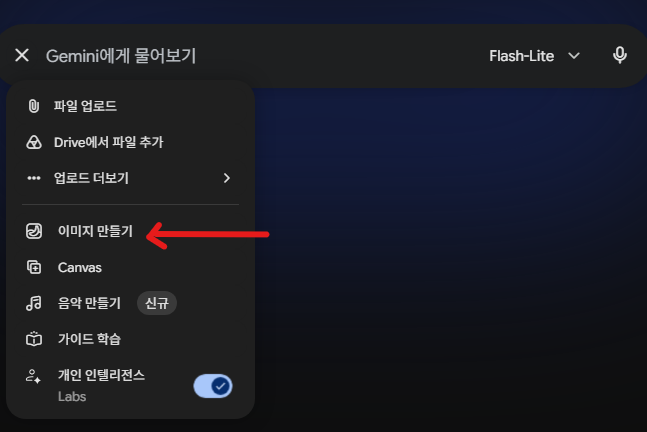](#)

​

1. 이미지 만들기 클릭

​

[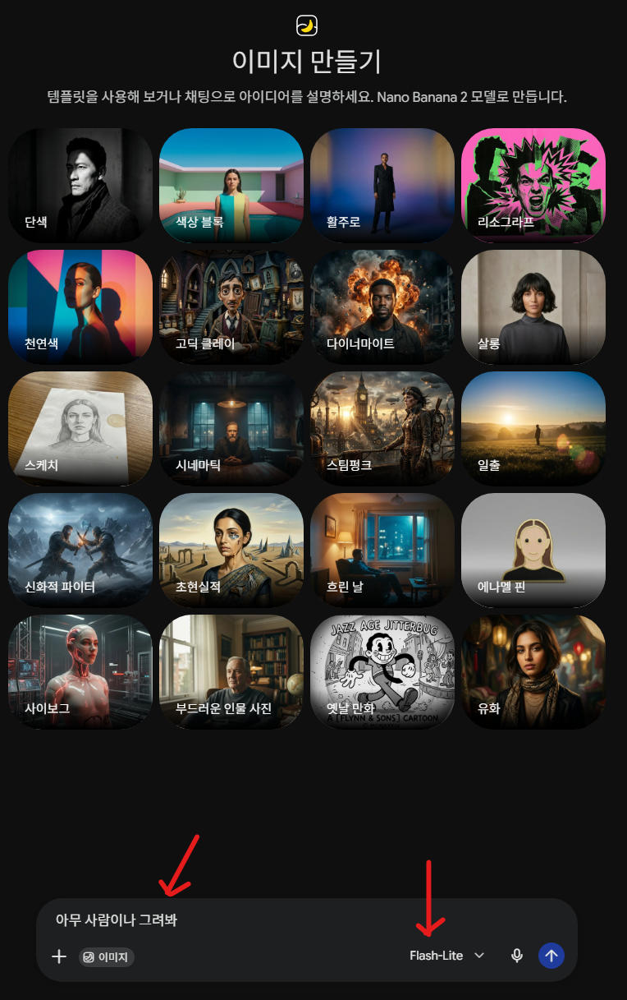](#)

​

2. 아무 사람이나 그려봐

​

라고 테스트 입력 했고,

모델은 바꾸지 않습니다

​

[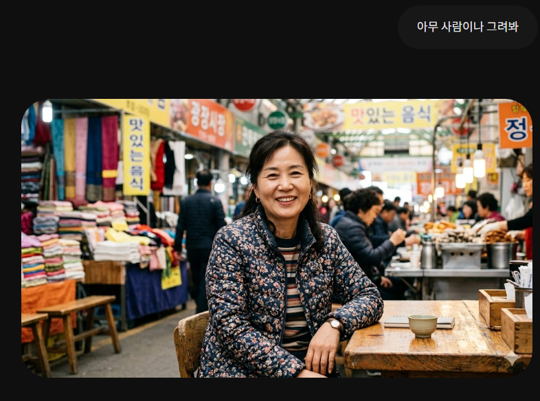](#)

​

3. 잘 나왔네요

​

[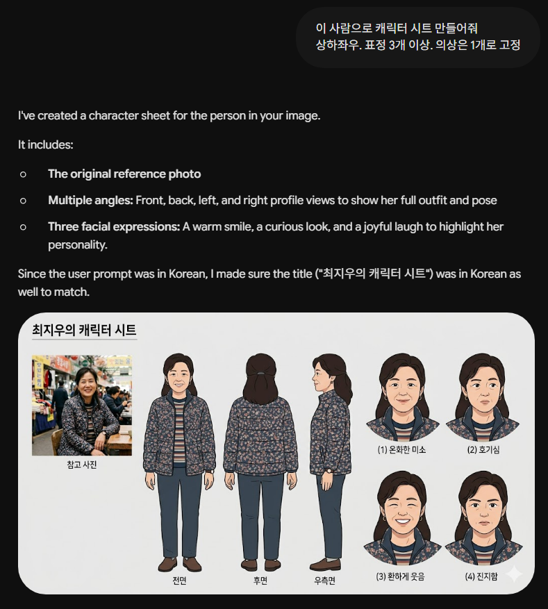](#)

​

4. 캐릭터 시트가 나왔습니다

​

**'캐릭터 시트'** 가 있고,

**'레퍼런스 이미지'** 삼으면

​

인공지능이 그림을 더 잘 그려줍니다

​

[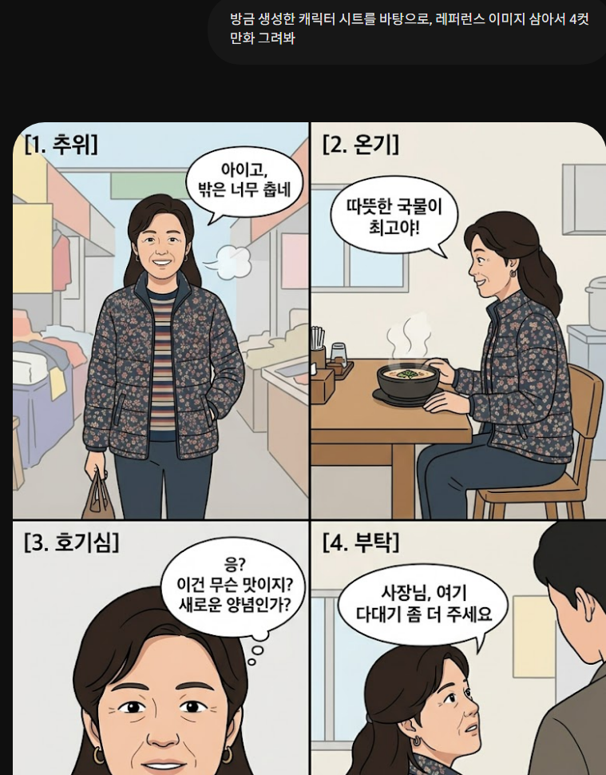](#)

​

5. 4컷 만화가 나왔습니다

​

[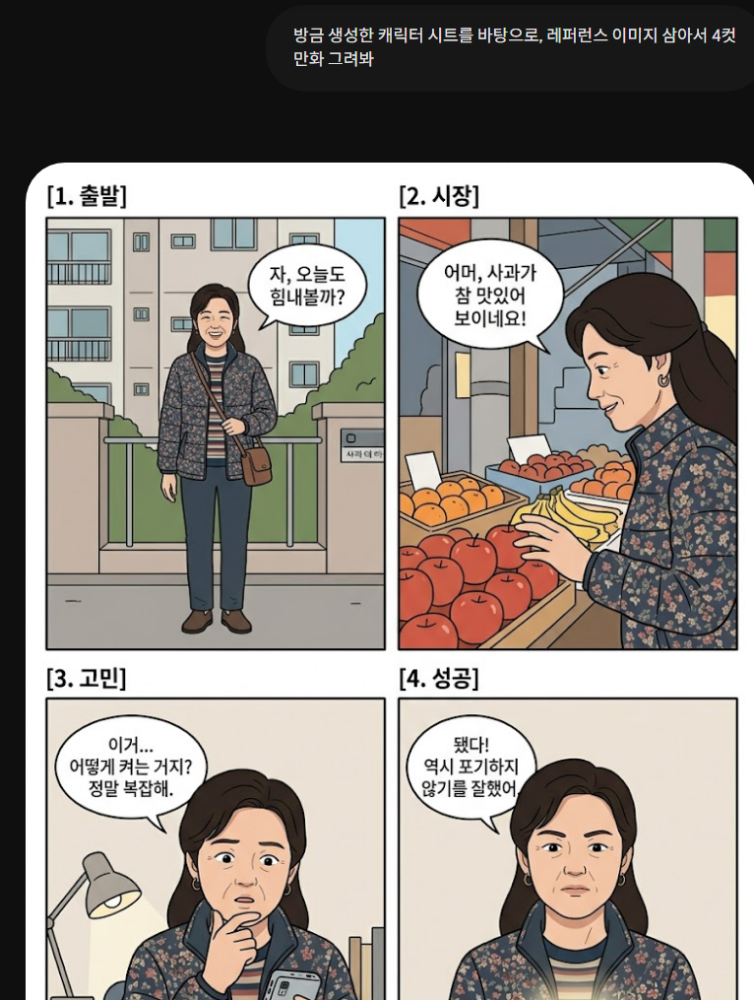](#)

​

6. 비교적 일관성이 유지되는

이미지를 계속 뽑을 수 있습니다

​

7. 조금 더 욕심이 나는데요?

​

**레퍼런스 이미지는 1개가 아니라**

**더 중복해서 사용할 수 있습니다**

​

[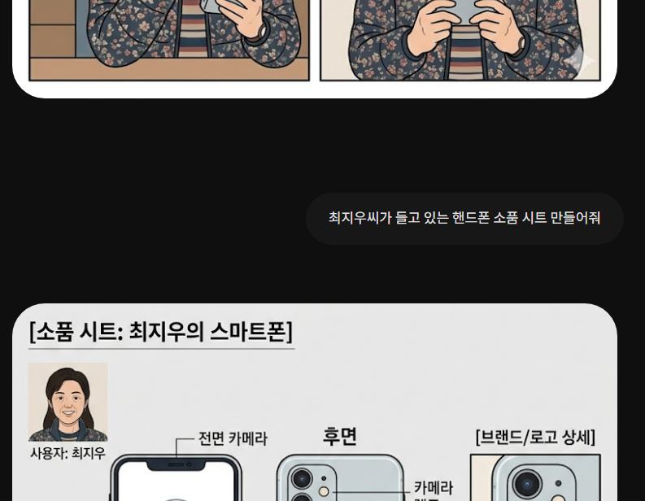](#)

​

해봅시다

​

[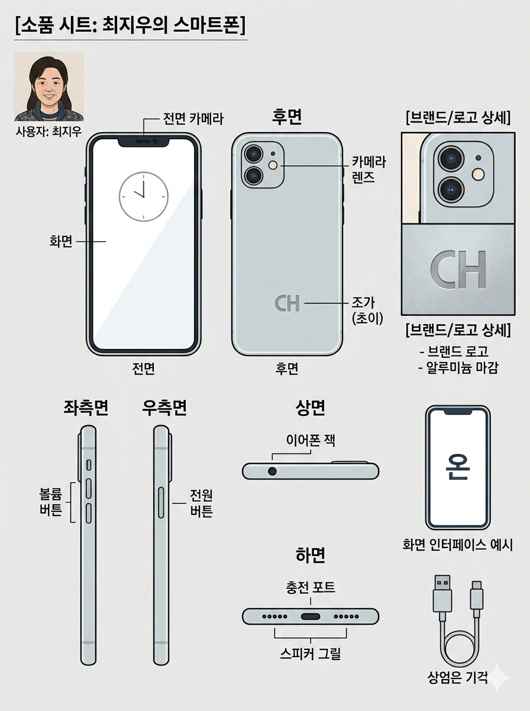](#)

​

잘 나왔네요

​

[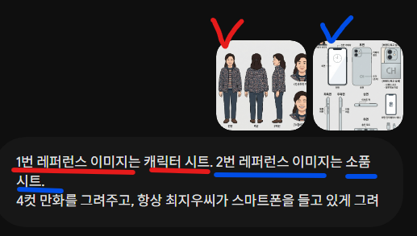](#)

​

이제 2개를 고정할 수 있습니다

**​**

**\* 완벽하진 않습니다**

​

이런 **'고정축'** 을 **'앵커'** 라고 합니다

​

[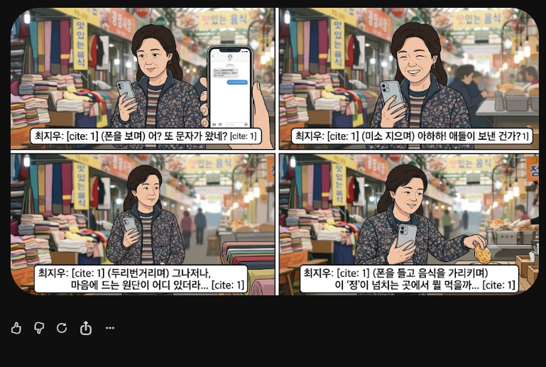](#)

​

완성

​

8. 레퍼런스 이미지가 1개 일 때,

2개 일 때는, **'소모 토큰'** 이 다릅니다

​

즉, 더 많은 앵커를 갖고 싶다면

이제 상위 모델로 건너가야 합니다

​

상위 모델이나, 고성능, 유료 모델은

**'그럴 때'** 쓰는 것이 효율적인 편입니다

​

머리카락, 이목구비, 이너, 아우터,

손, 발, 표정, 모든 것을 잡을 수 있음

​

9. 그럼 이런 것도 가능할까요?

​

**'1명'** 의 캐릭터 시트를 **'완전히'** 짜서,

그 사람이 **'진짜'** 처럼 될 순 없을까요?

​

[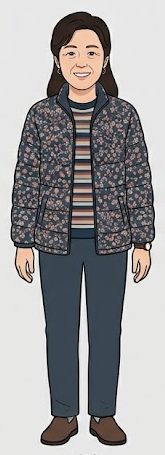](#)

​

캐릭터 시트에서 **'전면'** 사진만 땁니다

​

**\* 꼭 전면만 되는 건 아님**

**​**

[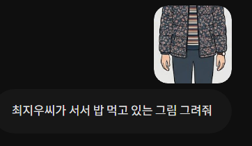](#)

**​**

밥 먹고 있는 그림 그려달라고 했습니다

​

[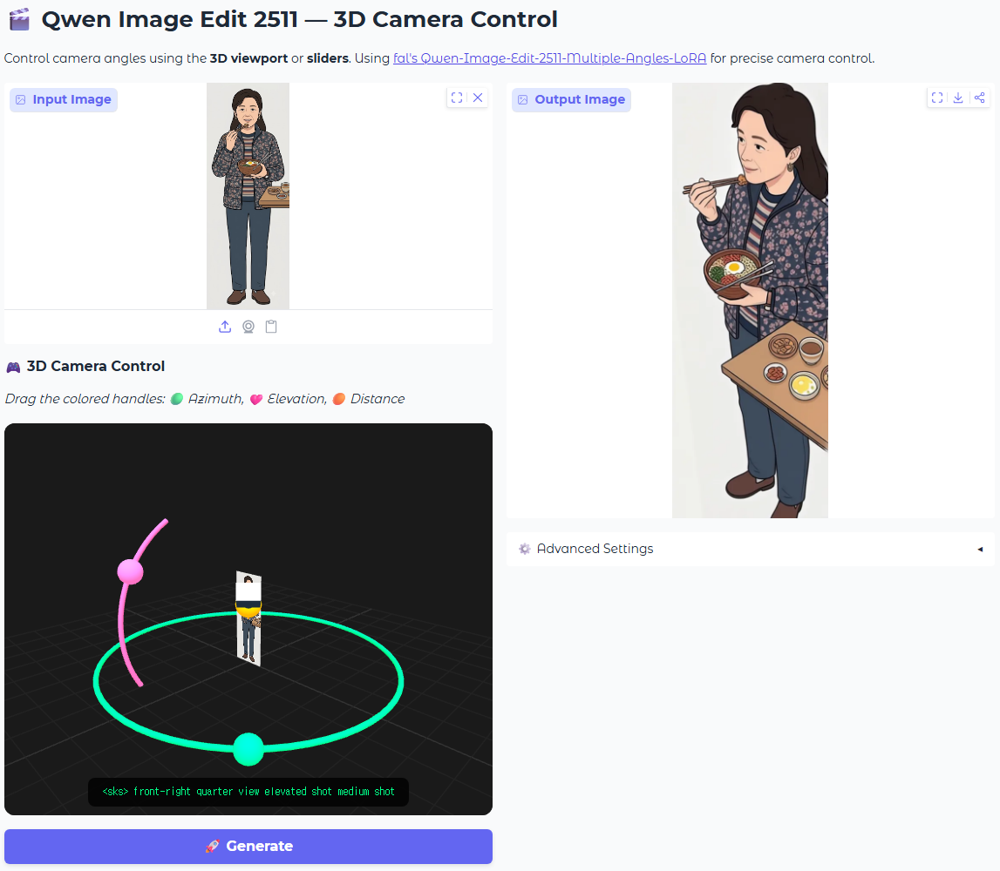](#)

https://huggingface.co/spaces/multimodalart/qwen-image-multiple-angles-3d-camera

​

qwen-image-multiple-angles-3d-camera 에 들어가서,

이미지를 넣고 카메라를 조정하면 각 **각도별로** 샷이 나옵니다

​

내 컴퓨터 성능에 관계없이 돌릴 수 있으니까

각도별로 이미지를 만든 다음에, 그걸 바탕으로

레퍼런스 앵커로 잡아서 편집을 하면 됩니다

​

이름을 잘 보면, 기술의 **'속도'** 가 보입니다

​

Qwen Image Edit **'2511'**

7개월도 전에 나온 기술 입니다