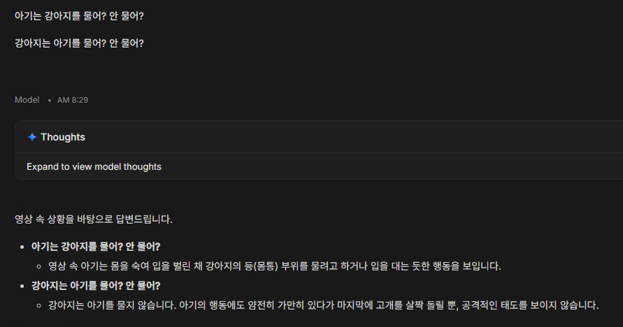
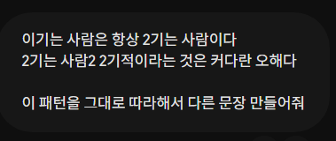
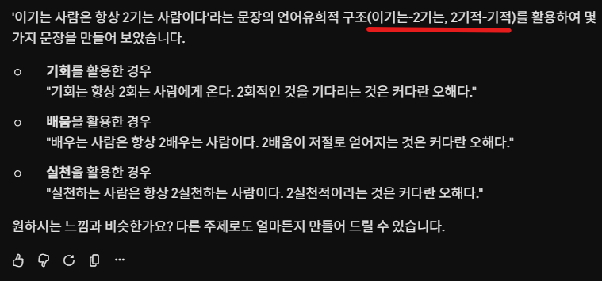
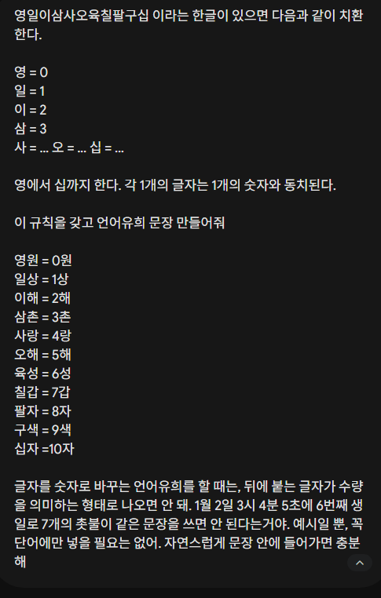
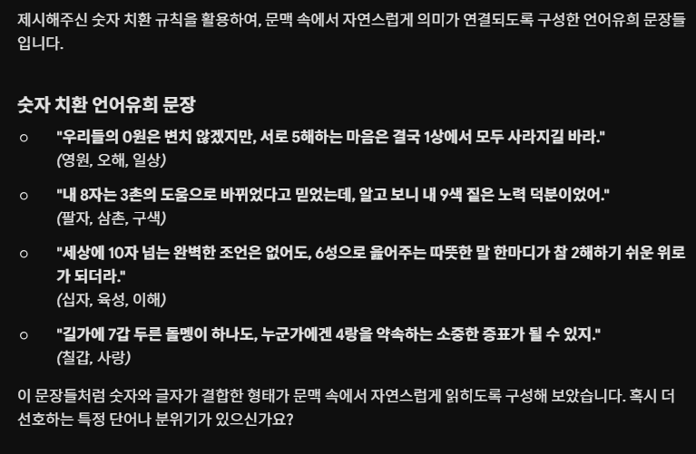
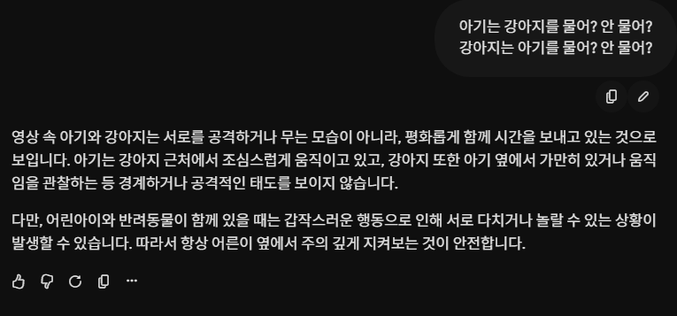

# AI 영상 해석 기술은 어디까지 신뢰할 수 있나요?
**Date:** 18시간 전
**Category:** AI 활용
**Original URL:** https://blog.naver.com/xpfkwh56/224312473789
---

​

**\* 어련히 잘 키우고 있읍니다**

​

​

1. 제미나이 답변

​

​

2. AI 스튜디오 답변

​

3. **'사람'** 의 해석과 조금 다르죠?

​

4. 이런 일이 생기는 이유

​

인공지능의 기본 원리 입니다

​

1) 학습한 패턴이 있으면

패턴을 그대로 따릅니다

​

​

**'사람'** 이라면 어떻게 할까요?

​

물론, 사람마다 다르겠지만

​

**'한글'** 을 **'숫자'** 로 바꿨다 라고

생각할 가능성이 높다고 봅니다

​

​

하지만 AI 의 경우,

​

**'표면적 형식'** 의 틀을

따르는 경우가 많습니다

​

이 → 2 니까,

이 라는 글자를 2 로 바꾸자

​

까지 할 수 있는 것이지,

​

이 → 2 니까,

​

오 → 5 해서

칠 → 7 해서

​

바꾸겠다 같은 것을 잘 안 함

​

이 문제를 해결하는 방법은,

**'명확한'** 예시를 주는 겁니다

​

​

그럼 이런 예시 라고 오해하기 쉬운데,

​

​

**'진짜'** 찍어낼 **'금형'** 이

너무 완전해서 갈아끼우는

수준 이어야 됩니다

​

2) 사용자가 어떤 입력을 할 때,

출력을 내는 것을 **'수렴'** 이라 합니다

​

**\* 엄밀한 정의는 아님**

**​**

수렴은 항상 **'안정값'** 을 따릅니다

​

즉 AI 는 **'봤던 것'** 을 말하려고 합니다

​

5. 인공지능의 3가지 본질은?

​

1) 데이터

2) 모델링

3) 도메인

​

그럼 띵낑을 해볼 수 있읍니다

​

상식적으로 아기가 개한테 물리는 영상을

**학습 데이터로 넣는 일** 은 나오기 어렵습니다

​

**\* 돌도 안 된 아기가 개한테 물리는 장면을**

**1만개, 10만개 갖고 있으면 또라이 입니다**

**​**

본 적이 없기 때문에,

​

​

자기들이 봤던,

​

​

가장 익숙한 답을 한겁니다

​

6. 로컬을 쓰든, 프론티어를 쓰든,

어떤 AI 를 앞으로 사용하든 상관없이

​

그 모델의 **'성능'** 과 **'출력 품질'** 은

비례하지 않는다, 를 기억하면 됩니다

​

간편하다고 AI 한테 긁어서 던져주고,

쉽사리 그 답변에 의탁을 하고 있다면?

​

위에 있는 8초 짜리 영상의 내용에 대해서

**AI 가 대답했던 수준의** 대답을 볼 수도 있음