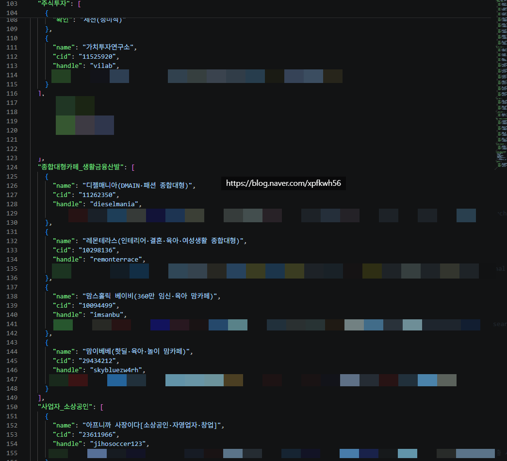
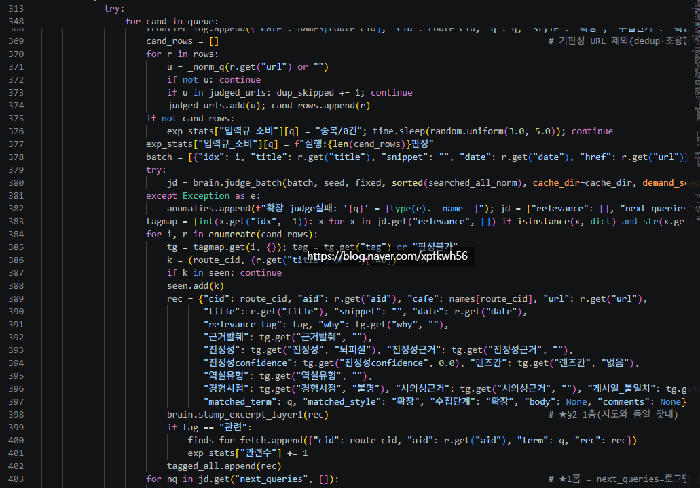
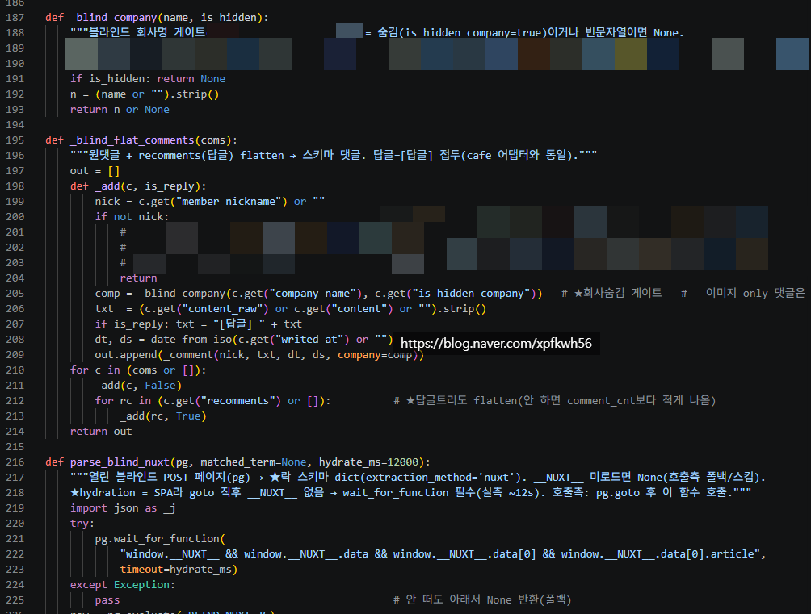

# 인공지능 활용을 어렵게 생각할 필요 없음
**Date:** 18시간 전
**Category:** 일기장
**Original URL:** https://blog.naver.com/xpfkwh56/224372668208
---

1. 어떤 작업을 하는데 들어가는 자원이 비싸다,

돈이 많이 들든지, 시간이 많이 들어간다

​

그럼 돈을 덜 쓰고, 시간을 덜 쓸 수 있는 것을

AI 라는 수단을 활용해서 해결하는 것이 시작 임

​

**2. 예를 들어보겠음**

​

저 역시 다른 엄마들이 그런 것처럼

대체 **'다른 가정'** 에선 다른 사람들이

어떻게 키우고 있고, 무엇이 관심사인지,

​

같은 것들이 궁금함

​

근데 내가 이걸 매일매일 하기가 **비쌈**

시간을 덜 쓰고, 돈을 덜 쓰고 해결하고 싶음

​

이걸 명세로 바꾸면,

​

**네이버 커뮤니티를 매일 누군가 나 대신에**

**모니터링해서 해당 커뮤니티에서 다루고 있는**

**주제를 정돈해 나한테 보고 해줬으면 좋겠다** 임

​

**\* 내가 볼 알고리즘을, 자급자족 하고 싶다**

**​**

3. 그걸 하려면 먼저 **'어떤 커뮤니티'** 를

**'어떤 기준'** 으로 지정해서, 수집할 것인가?

라는 문제를 풀어야 됨

​

​

1) 네이버 카페 중에서, 트래픽이 많고

유독 아지매 비율이 높은 곳들이 있음

​

그럼 각 카페 cid 를 딴 다음에,

로그인 정보를 바탕으로 접속 할 수 있음

​

2) [http://cafe.naver.com/f-e/cafes/{cid}/menus/0?ta=ARTICLE\_COMMENT&q={검색 쿼리}](http://cafe.naver.com/f-e/cafes/%7Bcid%7D/menus/0?ta=ARTICLE_COMMENT&q=%7B%EA%B2%80%EC%83%89%C2%A0%EC%BF%BC%EB%A6%AC%7D)

[**네이버 카페**

대한민국 모임의 시작, 네이버 카페

cafe.naver.com](http://cafe.naver.com/f-e/cafes/%7Bcid%7D/menus/0?ta=ARTICLE_COMMENT&q=%7B%EA%B2%80%EC%83%89%C2%A0%EC%BF%BC%EB%A6%AC%7D)

​

**\* …/menus/0?q={검색어}&ta={검색범위}&od={정렬}&size={개수}&viewType=L&from=YYYYMMDD&to=YYYYMMDD**

**​**

**od=LATEST 최신순 정렬**

**from/to 날짜 구간 필터**

**size 한 번에 받을 개수**

​

위 주소를 에이전트한테 읽게 하면 특정 cid 에 연동해서,

카페에 있는 게시물을 읽게 하거나, 검색하게 할 수 있음

​

​

들어온 데이터를 바탕으로, 파싱/정규화 를 함

​

필요 없는 정보는 지우고, 유의미한 정보만

태깅해서 내가 필요한 내용들로 선별하는 것임

​

조회수가 많다, 댓글이 활발하다,

인기글에 올라가있다, 좋아요가 많다

​

같은 것 등으로 판정을 하고,

세부적으로 근거가 있는지 없는지,

진정성 있는 의견인지 광고인지,

​

같은 것들을 알아서 체크할 수 있게 함

​

3) 그럼 1차적으로 크롤된

데이터들이 캐시화 됨

​

캐시 내용들을 비교해서, 특정 가중치에 따라서

LLM 이 **'내가 무엇을 선호할지'** 연산한 다음에,

​

그걸 뉴스레터 형식으로 컴퓨터에 띄워서 보여줌

​

이걸 매일 수동으로 하기 귀찮으니까,

​

자동 스케줄러로 연동한 다음에

컴퓨터 켜놓으면 지정한 시간에 맞게끔

​

알아서 긁어다가 정리도 하고,

CCTV 녹화하듯, 일정 기점까지는

보관하고 그 이후는 지울 수 있음

​

​

카페만 되는 것이 아니구, 특정 언론사,

특정 커뮤니티, 특정 블로그 **전부** 다 됨

​

**\* 일간/주간/월간/시간별로 나눌 수도 있음**

​

커뮤니티 하드 업로더들이 작업하는 것처럼,

​

어제 하루 동안 인터넷 사회에서

사람들이 무엇을 주요 화제로 삼았지?

​

같은 것들을 긁어서 자동화 할 수 있는 것임

​

**4. 응용**

​

1) 내가 모니터링 하는 블로그들이 있다면,

그 블로그에서 **'삼성전자'** 라는 키워드를

​

언급할 때마다 그 내용을 실시간으로 감시해서

키워드가 나오면 나한테 알려주게 할 수 있음

​

2) 내가 자주 보는 커뮤니티 링크들이 있으면

그 커뮤니티에서 어제 하루 동안 사람들이

주로 다룬 여론을 정리해서 보고서로 만들 수 있음

​

3) 내가 지정한 블로그 들이 있으면,

그 블로그에서 작성한 글 **그대로** 소재 따서,

​

**패스트 팔로잉** 할 수 있음

​

**\* 이 방식 쓰면 블로그 자동화 할 때,**

**글감 내가 직접 찾지 않아도 되고, 마찬가지로**

**쇼츠 같은 것에도 당연히 응용할 수 있음**

**​**

5. 남한테 시키기엔 인건비가 안 나오고,

​

내가 직접 하긴 귀찮은 작업인데

AI 를 사용해서 손쉽게 할 수 있는 사례 임

​

**6. 한계와 주의사항**

​

이 작업은, 결국 크롤링/가로채기

라는 걸 해야 할 수 있는 작업 임

​

근데 여기에 두 가지 문제가 있음

​

**1) 봇 수집에 대한 보안 문제**

​

웹 크롤봇이 마음대로 인터넷 사이트에

있는 자료를 긁어오는 것을 허락하지 않음

​

그래서 공식 API 채널이 아닌 이상에야,

​

내가 필요에 의해 선별적으로 긁어와도

서버에서 못 가져가게 막거나 할 수 있음

​

이걸 해결 하려면, VPN 으로 우회하거나

다중 IP 를 쓸 수 있거나, 그 외 피할 수 있는

다양한 잡기술들을 사용해서 해결해야 됨

​

**2) 법적인 문제**

​

특정 커뮤니티에 있는 **'데이터'** 들을

무단으로 가져다가 사용하는 것은 대체로

​

**'사람'** 이 하면 문제가 덜 되는 편인데,

이걸 **'기계'** 로 써서 **'상업화'** 하면 문제 됨

​

결론적으로 눈치껏 본인이 적당히 알아써서,

​

갖고 놀기에는 충분하지만 좀 크게 하려고 하면

복잡한 문제가 생긴다는 점을 주의해야 하고,

​

**'지금에야'** 문제가 없이 공짜로 할 수 있지만

아마? 다룰 수 있는 사람이 많아지면 많아질수록

​

**나중에는 이 모든 데이터들이**

**더 이상 공공재가 아니게 될 것이고**

**유료화 될 확률 높다고 생각함**

**​**

호스팅이나, 기업체 경유해서 보는 것은 Ok

근데 그걸 갖다가 쓰려고 하면 안 된다가 될 것