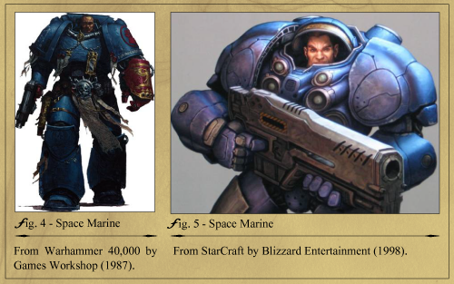

# 패스트 팔로잉의 민족
**Date:** 18시간 전
**Category:** 다이어리
**Original URL:** https://blog.naver.com/xpfkwh56/224262011977
---

1. 삼성 기업사에 나오는 비화에 따르면,

반도체 사업 의사결정을 함에 있어서

​

남조선이 젓가락 문화권이고,

청결을 중시하기 때문에

반도체 사업에 적합하다고 했다고 한다

​

정주영 자서전을 보면,

건설업에 뛰어든 이유가

​

오도바이 수리하면서 짤짤이 만지는데

​

건설업자들은 관공서 들락 거리면서

훨씬 큰 돈을 만지고 있는 것 을 보고,

​

쟤네는 뭘 하길래, 저리 큰 돈을 벌지?

에서 시작했다는 이야기도 나온다

​

나는 전자보다는 후자가 더

**'솔직한'** 대답을 했다고 본다

​

2. 동북아 3국이 유독 잘 하는 것은

옆에서 봤을 때, 괜찮다 싶은 것이 있으면

**귀신같이 그걸 잘 따라 한다는** 점이다

​

실제로 이게 **'2차 산업'** 레벨에서는

상당히 효율적인 경우가 많은데

​

때때로 영역에 따라 한층 더 깊게 보면

**'더'** 효율적이게 볼 수 있는 경우가 있음

​

3. 지금은 과거의 영광이 좀 바래졌지만,

​

한 때는 블리자드가 거의 세계 최고의

개발사 취급을 받고 있던 시절이 있었음

​

유능한 예술가는 모방하고,

위대한 예술가는 훔친다 했는데

​

블리자드가 이런 **'훔침'** 에 능했음

​

​

스타크래프트는 워해머 우라까이고,

Wow는 에버퀘스트를 우라까이 함

​

즉, **'스타크래프트'** 를 따라하고 싶으면

스타크래프트가 **'뭘'** 따라했는지 보는 것이

​

스타크래프트 자체를 모방하는 것보다

더 본질적인 시각을 갖는데 도움이 됨

​

표면적인 레이어를 따라서 하는 것은

얼핏 아주 효율적으로 가는 것 같지만,

​

실제론 **한계가 명확한** 방법이기 때문에

상위 레이어를 가져가는 것이 훨씬 나음

​

뭐가 상위 레이어인지 직접 찾아보는 것은

꽤 **'귀찮은'** 일이 맞지만, 실익값이 높음