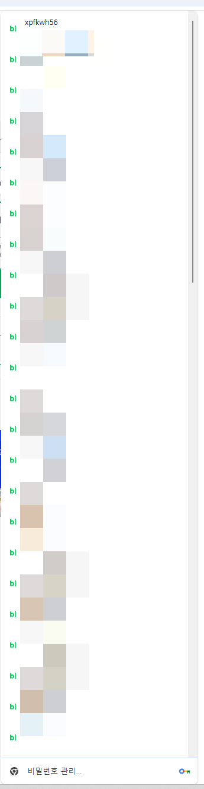

# 해설
**Date:** 18시간 전
**Category:** 일기장
**Original URL:** https://blog.naver.com/xpfkwh56/224331375096
---

1. 잉공지능 한다니까

​

블라그에 작성하는 글들도

AI 로 작성해서 오토로 굴림?

​

이라고 묻길래 아니라고 함

​

2. 잉공지능도 안 쓰는데 어떻게

블로그에서 이렇게 글을 쓰냐고

물어보길래 원래 많이 썼다고 함

​

그럼 ai 로 블로그 글 안 씀?

​

놉, **'상업용'** 그러니까

**'일'** 을 하는 블로그는 ai 로 하고

​

**'취미'** 로 하는 블로그는

제가 직접 재미로 한단 뜻임

​

**3. 메이트 업데이트**

​

금년 6월 초에 **네이버 메이트** 라는

새로운 시스템이 네이버에 생겨났음

​

예전에 쓴 적 있는데,

제일 쉽게 얘기하면

​

네이버 라는 거대한 IT 회사에서

AI 검색 서비스를 사용할 생각인데,

​

이거 우리가 직접 하려면 힘들거든요?

​

그러니까 님들이 AI 가 쓸 **'재료'** 좀

**많이 만들어주세요**, 라는 이야기 임

​

쇼핑 커넥터니 어쩌니 보셨죠?

​

30만원, 300만원, 천만원 드립니다

그리고 지금 저희가 이거 관심 많으니,

​

잘 따라오시면 좋은 일이 있을 수도?

라는 것이 26년 6월 기준 네이버 의견임

​

**4. 그럼 네이버는 왜 재료가 필요한가요?**

​

이건 말이 복잡해질 수밖에 없고,

​

마찬가지로 아주 간단하게 요약하면

기계가 쓰는 말과 사람이 쓰는 말이 다름

​

**'그냥'** 쓴다고 다 인용이 되는 것이 아님

​

AI, LLM 모델이 쓰는 언어가 따로 있음

​

**\* 마치 외국어 처럼, 그리고 배우려면**

**똑같이 결국 많이 써봐야만 알 수 있음**

**​**

그래서 기계가 이해할 수 있는 표현들로

자기들이 AI 한테 쓸 **먹이**를 잔뜩 만들면,

​

그걸 사용해서 토실토실하게 키우겠단 것임

​

공짜도 아니고 돈 드릴게요

​

라는데, **'단가'** 가 나올 법한 일이면

자기들이 고용해서 쓸 일이고, 당연히

그렇지 않으니 사람들한테 맡기고 있음

**​**

**5. 단가 안 나오는 일에 차력쇼 하면서**

**억지 생산성으로 결과 내는 것이 제 전공임**

​

제가 블로그에 글을 정말 많이 써봤는데,

​

사람이 아무리 열심히 빨리 쓴다고 해도

**죽었다 깨어나도** 기계 속도를 못 따라감

​

문제는?

​

기계가 쓰는 속도의 **'콸리티'** 로 쓰면

**그냥 본인이 봐도** 이건 좀 아닌 것 같고,

​

그렇게 올려봤자 별 의미가 없을 때 많음

​

근데 만약에 **'진짜'** 인간 퀄리티를

유지하면서 **'기계'** 처럼 계속 쓴다면?

​

그럼 네이버에서는, **네이버 메이트** 니

같은 시스템 자체를 쓸 필요가 없음

​

**왜 why?**

​

6. 연예인 기획사에서 오디션을 왜 함?

**​**

**1살 때부터 육성을 못 했으니까** 임

​

키우는 것이 안 되니까 구해오는 것이고,

네이버 메이트도 저는 그거랑 똑같다고 봄

​

만약 자기들이 **직접** 먹이를 먹일 수 있거나,

만들어 처리할 수 있으면 **그걸 시킬 일 없음**

​

다만, **여러 가지 이유로** 이게 안 되니까

결과적으로 그걸 외부에 던지게 되었다면,

​

그 기회를 잘 잡아서 사업화할 수 있는

**'기회'** 를 놓치면 안 되겠단 생각을 했음

​

​

제가 최근에 봐주고 있는

블로그 **'다계정'** 리스트임

​

**\* 전부 내 명의&친인척 계정들**

**​**

**일단 생각날 때마다 1개씩 쓰라고 함**

**그게 무엇이 되었든 일단 적어보라고**

**​**

계정 1개에서 트래픽이 조회수 100씩만

발생해도 10개면 1천, 100개면 1만 임

​

10만원씩만 벌어와도 10개면 100만,

100개면 1천만, 이라는 간단한 계산 나옴

​

**\* 이론상, 나 계정 3개, 엄마 계정 3개**

**해서 6개 만들어서 다 풀로 돌아간다면?**

**​**

**계정당 10씩 벌어도 월 60**

**신랑/아빠 넣으면 60 추가 120,**

**큰/작 오빠 넣으면 60 추가 180**

**​**

**스케일링이 된다는 것이 메리트 임**

**​**

**애 둘 있는 부부가, 부부+애들+시부모님하면**

**계정이 18개나옴 그게 다 돌아가면 벌써 180**

**​**

네이버는 최근 메이트 시스템을 만들면서,

**'체계가 덜 잡힌'** 상태로 운영되고 있기에

​

**'기회'** 가 다른 영역보다 더 쉬운 편이고

**'모두'** 다 처음 시작하고 있는 상태라서,

​

초보든, 고수든 **거의 비슷한** 지점에서 함

​

1개월 된 계정이, 5년, 10년 짜리 계정을

따라 잡는 것이 예전엔 거의 불가능 했는데

​

**'지금'** 은 전보다는 수월하게 할 수 있고,

​

3년 동안, 글 5천개 고민 없이 쓴 제 블로그의

퍼포먼스를 일주일 된 계정이 **그냥** 따라 잡음

​

AI 브리핑 기준, 일주일? 이면 **'10만'** 찍음

​

7. **'다들 몰라서 허우적 거리고 있을 때'**,

마침 운 좋게 먹는 파이는 **'의미'** 가 없음

​

이렇게 반짝, 기회 좋게 잡아서 좋게 누려도

결국 시간이 지나면 **'상향 평준화'** 되기 때문

​

그럼, **나는 왜 이거를 하고 있느냐?**

​

블로그로 1원 버는 사람이

구글을 하면 10원을 벌고,

​

**똑같은 구글도 한글로 쓰면 10원인데,**

**영어로 쓰면 100원을 버는 특징이 있음**

​

영어권 시장은 **'레벨'** 이 다름

​

근데 구글이 처음 시작할 시점 부터,

자리를 잡은 바닥에 초심자가 들어간다

​

이건 잣알 행위나 다름없기 때문에

​

**\* 그렇게 가면 배우는 것도 없음**

​

네이버만 갖고 있는 여러 특징들로

최대한 빠르게 시행착오 하고, 흡수해

​

이걸 바닥에 깔고 구글 넘어가려는 중임

​

**8. 되면? 좋고, 안 되면?**

​

식구들 가만히 있어도 따박따박

월에 담배값, 교통비, 통신비 정도는

벌어갈 수 있으면 그거도 유의미함

​

집에서 노나, 놔두나 컴퓨터 있고

할 줄 알던 기술 그대로 쓰는 거고,

​

어차피 큰 자원 드는 것이 아니니까