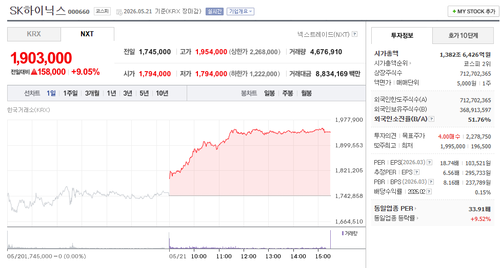
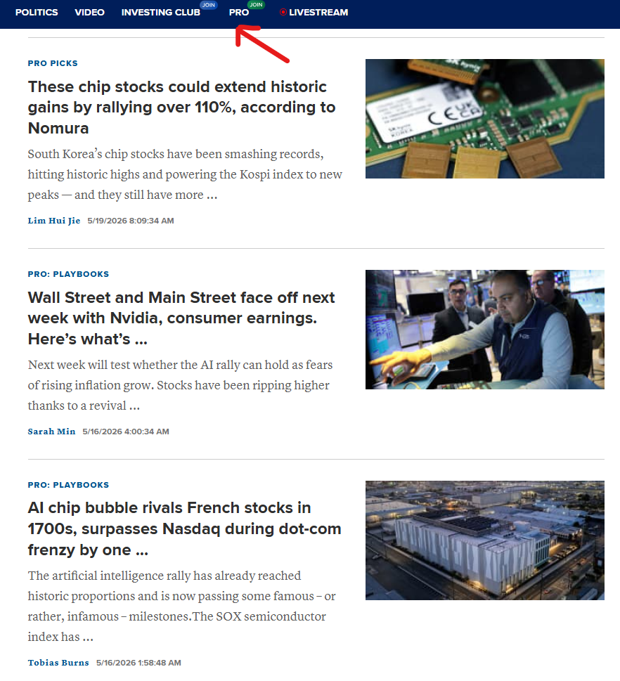
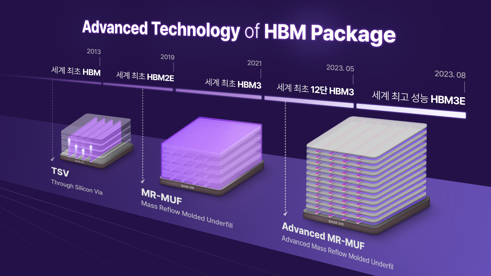
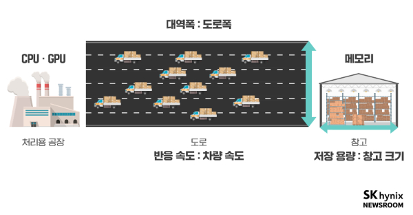
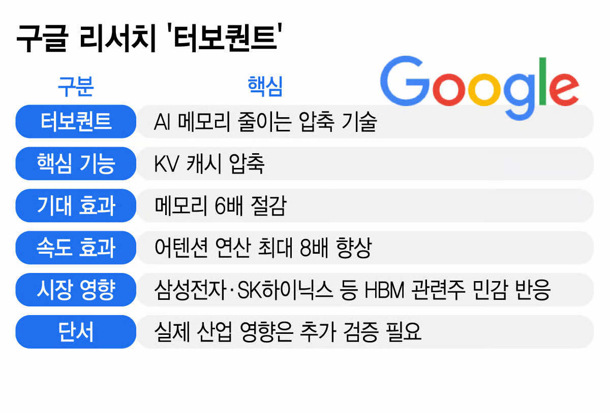
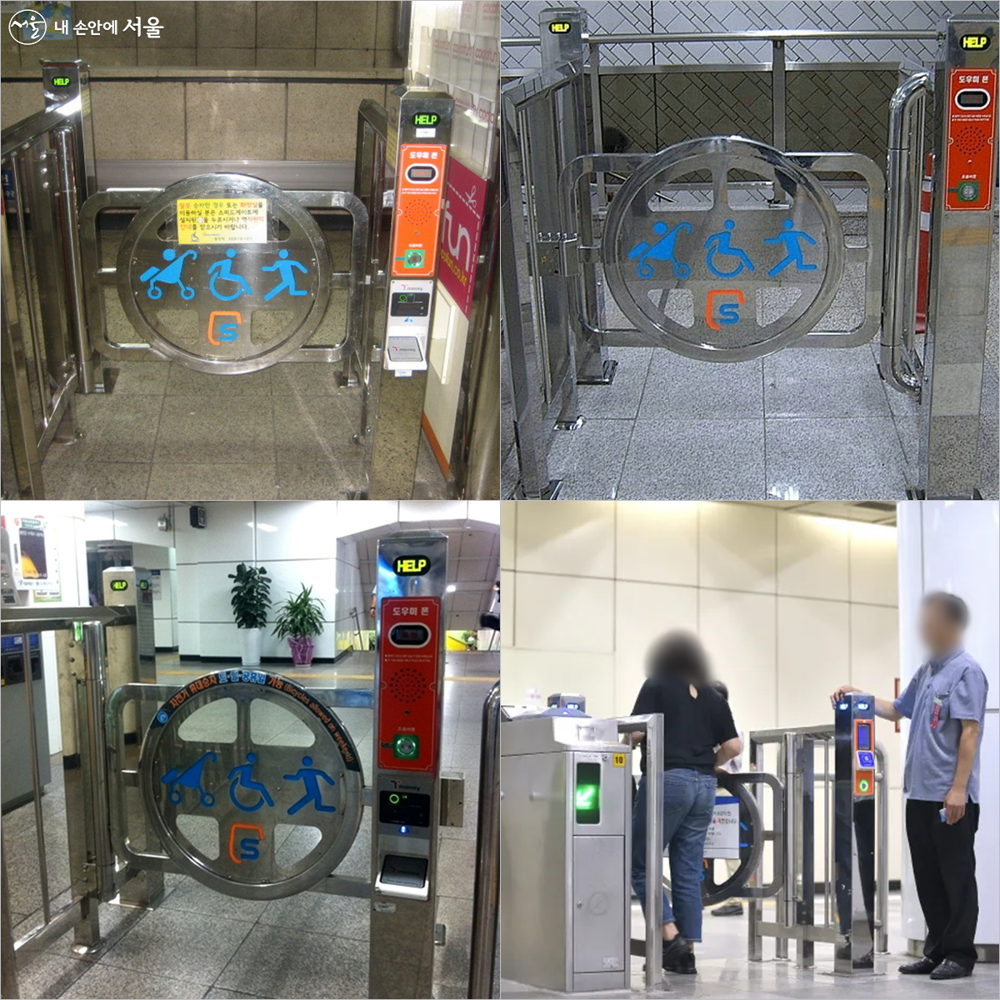

# SK하이닉스 목표가 400만원? 근거가 뭘까?
**Date:** 19시간 전
**Category:** 홈판고시
**Original URL:** https://blog.naver.com/xpfkwh56/224293052547
---

> 하이닉스 탑승, 지금이라도 늦지 않았을까?

노무라 증권 이라는 기관에서

국내 반도체 대장주 목표 주가를

굉장히 많이 올렸다는 이슈가 나옴

​

특히 삼성전자와 SK하이닉스 를

긍정적으로 본다는 발표가 있었음

​

하이닉스의 경우, 목표가가

무려 **'400만원'** 에 달하는데,

​

​

그 예측대로라면 지금보다

**'2배'** 가 더 올라간다는 뜻 임

> 투자 정보를 해석할 때, 기억할 두 가지

증시 소식을 볼 때,

항상 주의할 점이 있음

​

대표적으로 **표면적인** 정보와

**심층적인** 정보를 구분해야 하고,

​

**결과** 보다는 그 결과가 나오게 된

**과정** 에 대해서 관심을 가져야 됨

​

오늘 처음 들어보긴 했지만,

일본에 있는 유명한 증권사 에서

그렇다고 했으니까 그렇다던데?

​

같이 접근하면 **안 된다는 의미** 임

> 증권사들은 왜 목표주가를 제시할까?

먼저 증권사에서 **'왜'** 이런 목표가 개념이

언론을 통해 확산되는 것인지 부터 알아야 됨

​

​

영화 베테랑 에는 이런 대사가 나옴

​

> 난 어릴 때부터 매년 올해 감기가 제일 지독하고,
>
> 올해 경기가 제일 어렵다는 말을 한 해도 안 빼먹고 들었어요

​

iPhone 18 Pro 시리즈

GPT, 클로드 같은 인공지능 신모델

​

이런 것들의 공통점은, **'늘'**

사전 정보가 유출된단 것임

​

특정 종목이 언론에 **'이슈'** 가 되면,

​

그 이슈 자체로도 **'수급'** 이 붙게 되고

**'매수세'** 가 생기면, **'거래'** 가 발생함

​

​

마권 정보지를 보면, 경마를 하고 싶어지고

​

로또 당첨 명당 이라는 글자를 보면,

우리는 로또를 구입하고 싶어진단 것임

​

목표가 같은 추정치는, 일종의 **'닻'** 처럼

참가자들의 **가격 베이스 라인** 이 되고

​

동일한 이슈를 **'공유한 사람'** 의 숫자가

많으면 많을수록 더 강하게 작용하게 됨

​

풀어서 말하면 기관 발표 리포트는

시장 참여자들의 기대치를

어떤 방향이든 재설정 한다는 소리임

​

때문에, 그 **'숫자'** 자체는

숫자만으론 별 의미가 없음

​

삼성전자고, 하이닉스고 간에

목표가가 얼마 라던데? 같은 소식은

​

중간 과정을 전혀 모르면,

아무튼 사면 좋다던데?

​

그 이상의, 이하의

가치도 아니란 것 임

​

정리하면 뉴스가 주는

**'표면적 신호'** 는,

​

하이닉스가 2배 오를 겁니다 가 아니고,

**'너는 시장에 참여해야 됩니다'** 임

​

7번마, 슈팅스타가 배당이 40배 이고

백 년마다 한 번 오는 기회가 이번이다

​

로또 명당에서 대지의 기운이

합일되는 타이밍 좋은 길일이니까

사면 좋은 일이 있을 것이다 정도로,

​

해석하는 것이 아니라면 증권사 목표가는

이런 부분을 잘 기억해두고 해석하면 좋음

> 노무라 증권이 **'400만원'** 을 제시한 이유

그렇다면 아예 **'찌라시'** 레벨로,

모조리 다 무시해야 되는 정보냐?

​

다음으로는 그 **과정과 근거** 를 보면 됨

​

국내 언론사를 중심으로 하이닉스 400만원

이야기가 나온 시점은 5월 17일 전후고,

​

그 출처는 5월 15일, **CNBC Pro** 같은

유료 경제지 에서 나온 정보들을 기준 함

​

마치 기관 투자자, 애널리스트 들이

비밀스럽게 보는 정보 같은 **느낌** 이나,

​

​

**'외신'** 일뿐, 국내에 있는 경제지에서

나오는 것과 사실 별 차이가 있진 않음

​

**\* 매경, 한경, 삼프로 이런 것과 비슷**

**​**

영어로 써놨다는 **'권위'** 를 벗겨놓은 후,

그럼 어떤 근거로 판단 했는가를 보겠음

​

주요한 근거는 **메모리 수급 불균형** 임

​

​

하이닉스는 대체 뭘 팔길래,

저렇게 큰 돈을 버는 것일까?

​

**H**igh **B**andwidth **M**emory (HBM)

​

GPU 는 원래 게임이나 모델링,

그래픽 렌더링을 위해 개발된 것 임

​

근데 인류는 CPU 의 복잡한 논리 연산을

GPU 한테 맡기면 더 빠르단 것을 알게 됨

​

CPU로 355년 걸리는 연산이, 엔비디아

GPU H100 모델로는 **고작 34일** 걸림

​

H100 보다 H200 은 **2배** 더 빠르고,

H200 보다 B200 은 **7배** 더 빠름

​

​

지구에서 실상 제일 좋은 GPU 라는

B200 메모리 대역폭이 **8TB/s** 인데,

​

**\* HBM3E**

**​**

26년부터 나오는

Rubin R100 GPU 는

​

HBM4 메모리가 들어가고

메모리 대역폭이 **22TB/s** 임

​

**\* 양산 과정에서 20TB/s로 하향**

​

즉 엔비디아 GPU 에 들어가는

메모리가 하이닉스 꺼 라서,

​

**돈을 많이 버는 것** 임

​

그럼 반론을 제기해 볼 수 있음

​

**1) 엔비디아 GPU 안 쓰면 망하네?**

​

어지간하면, 다들 윈도우 쓰고 계실 건데

똑같이 GPU 가 기계만 있다고 끝이 아니고,

그걸 굴릴 수 있는 일종의 OS 가 필요함

​

엔비디아 GPU 는 CUDA 라고 하는

소프트웨어 환경과 같이 돌아가는데,

​

CUDA가 **윈도우급** 으로 압도적이라서

이 표준 때문에 엔비디아 입지가 견고함

​

**2) 엔비디아가 하이닉스꺼 안 쓰고,**

**다른 회사에서 구해다 쓰면 끝이네?**

​

아무 회사에서 비슷하게 만든다고

바로 갖다 쓸 수 있는 것이 아니고,

​

납품 기준이나, 컴플라이언스 등

여러 가지 요소를 고려해야 되는데,

​

그걸 **뚫은** 기업이 **하이닉스** 고,

​

설령 유사한 기술력이 있다고 해도

바꾸는 부담이 있어서 쉽지는 않음

​

이게 노무라 에서만 **'발표한'** 것이 아니고,

인공지능 관심 있는 사람들은 알던 얘기 임

​

그래서 앞으로 엔비디아도 **계속** 흥할 것이고,

지금 같은 기조가 유지된다는 뷰를 말한 것 임

​

점유율 노나 먹어봤자, 그 나물에 그 밥이고

​

공급망 다변화라고 한들, 이미 잘 하던 애들을

굳이 엔비디아가 버릴 이유가 없다는 주장 인데,

​

이렇게만 보면 **'당연히'** 아무 문제 없을 것 같음

> 그럼 문제가 뭐냐?
>
> AI 는 안 망해도, 너는 망할 수 있다

위에서 아주 가볍게 설명했지만,

​

**'AI 컴퓨팅 수요'** 가 앞으로도

지속된다는 보장이 하나도 없음

​

> ?그게 무슨 말 이냐
>
> 제 4차 산업혁명이다 뭐다
>
> ​
>
> 난리도 아닌데, 컴퓨팅 수요가
>
> 지속된다는 보장이 없다니?

​

자꾸 사람들이 **깡성능** 만 관심을 갖는데,

​

적어도 26년 기점으로 AI 메타 자체가

**'소프트웨어'** 로 크게 급변하고 있는 중임

​

​

그 대표적인 알고리즘 기술 중 하나가,

26년 3월에 구글에서 발표한 **터보퀀트** 임

​

터보퀀트가 뭐냐?

​

간단히 말하면, **100만원 짜리 컴퓨터** 도

**1천만원짜리 컴퓨터 처럼** 바꿔주는 기술 임

​

1천만원 쓰면, 원래 성능의 100% 가능

1백만원 쓰면, 원래 성능의 99% 가능하다

​

라고 하면, 온전한 정신을 갖고 있는

합리적인 소비자는 **'1%'** 성능 때문에

​

감성으로 10배 더 비싸게 살 이유가 적음

​

하물며, 이게 **'산업용'** 이라면 더욱 그런데

​

지금 AI 프론티어 사업자들의 경우, 매일

돈을 화산 구덩이에 태운다고 해도 될 정도로

​

손해를 보면서 장사를 하고 있기 때문에,

​

같은 돈을 써서, 더 좋은 효율이 나온다면

굳이 **'좋은 기계'** 를 비치할 유인이 떨어짐

​

스마트폰 처음 나왔을 때를 생각하시면 빠름

​

처음에야, 이거도 되고, 저거도 되네 하면서

온갖 신기한 기능 들어가면 다 좋아하셨지만

​

지금은, **'어지간한'** 스마트폰 이면

다 그게 그거 아니냐? 라는 마인드고,

​

적어도 예전처럼, 신제품 나올 때 마다

**'매번'** 바꾸는 소비자의 숫자는 많지 않음

​

스마트폰에서 **'대단한 혁신'** 이 나오기 어렵듯,

​

AI 하드웨어 시장도 여기에서 더 뭔가를

만들어내는 난이도가 **'크게'** 오르고 있음

> 폭증하는 컴퓨팅 자원 수요?
>
> 에이전트 열풍과 미래 컴퓨팅 수요

**사람들이 에이전트 어쩌고 하는데, 그건요?**

**추론 수요가 폭발적으로 늘어난다든데?**

​

문재인 정권 시절, 제가 실제로 봤던 것인데

지하철역에 할머니 하나 앉혀놓은 적 있었음

​

​

개찰구 착각해서 들어간 사람 있으면,

​

저런 버튼 근처에 앉아 계시면서

문제 겪는 사람 대신 버튼을 누르시는

그런 모습을 봤던 적이 있는데

​

지금 에이전트 컴퓨팅 수요가

급증하는 것이 그거랑 **비슷함**

​

에이전트를 써야 될 때 써야 되는데,

​

그냥 goal 이라고 지시만 찍어 놓으면

요술 방망이처럼 해줄 것이라고 시키니

​

훨씬 토큰 덜 쓰고도 할 수 있는 것을 굳이

비싸게 써서 하고, 심지어는 그렇게 토큰을

쓰고도 **제대로 완수 못 하는** 일이 더 흔함

​

시켜만 놓으면, 째깍째깍 에이전트가 알아서

창발적으로 모든 문제를 다 찾아서 해결하면

​

빅테크에서 B2B 엔지니어링 잡아줄 이유도,

​

**\* 대형 계약 업체는 알아서 최적화를 도와줌**

​

오픈소스 Saas 모델들 부지런히 찾아다가

자사 모델에 연결해서 붙여놓을 이유도 없음

> 과열된 시장에서 필요한 것은 **'상식'**
>
> 몰라서 망하는 것이 아니고, 안다는 확신이 문제

휘황찬란한 글로벌 기업들의 패권 다툼,

이라고 생각하지 말고 작게 보면 쉬운 얘기임

​

어떤 회사가 큰 회사에 어렵게 납품을 했고,

실제 좋은 기술을 갖고 있는 것도 맞지만,

​

기술력이 좋다는 단 하나 이유만으로

앞으로 기술력에 부합하는 보상이 꾸준히

**구조적으로 따라온다는 보장** 은 없으며,

​

심지어 이걸 하면 돈을 **'많이 벌고'**,

또 저 과정에 돈이 **'많이 든다'**, 라는 것을

​

이미 온 동네 사람들이 다 알고 있는 상태라

앞으로 어찌 될지 기약도 할 수 없는 상태임

​

​

탕후루 가게를 인수할 생각인데,

지금 월 500 정도를 번다고 가정함

​

그럼 1년에 세전 6천 정도 번다 치고,

앞으로 내가 50년 정도 운영할 것이고,

​

아무리 유행이 빠져도 20년은 갈 테니,

​

20년치 영업 권리금 12억 정도를

지불하고 사면 적절하다고 생각하는

사람이 창업판에 과연 몇 명이나 될까?

​

상식적으로 미래 가치는 **'불확실'** 하므로,

디스카운트를 해야 된다고 봐야 하지 않을까?

​

자신과 확신이 넘친다면, 매수 버튼 누르고

기업과 아름다운 동행을 해야 마땅하겠으나

​

한국에선 과거에도 그랬고, 물론 앞으로도

**'시클리컬'** 이 그 **'구조'** 를 바꿀 날은 없음