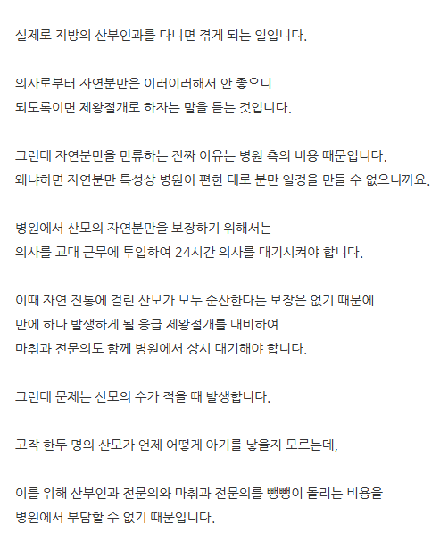
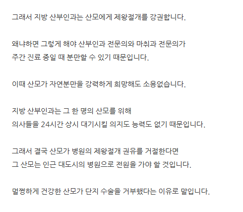
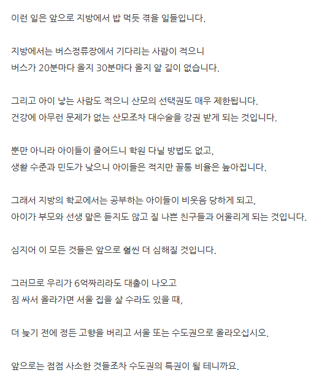

# 반박을 어디부터 해야 될지 감도 안옴
**Date:** 19시간 전
**Category:** 스냅
**Original URL:** https://blog.naver.com/xpfkwh56/224404382283
---

​

자연 분만으로 태어난 아이,

또는 산모가 더 **'좋다'** 라는

근거 자체가 얇다

​

일단 **'좋다'** 가 뭐임?

​

**'멀쩡하게 건강한 산모'** 라는 것은,

전문의 소견인지, 산모 개인의 판단인지

​

심지어 **'보호자의 고집'**

인지 구분할 필요도 있음

​

그리고 **'아마'** 화자가 남성분이시고,

출산 경험이 없으셔서 그럴 수 있는데

​

진통오면, 자분해주세요

제왕 해주세요 이 문제가 아니고

​

**살려주세요** 소리가 먼저 나옵니다

​

애 나오는 마당에 수술을 거부욬ㅋㅋ?

​

일제시대 만주가서 독립운동

하실 수 있는 멘탈이

되는 분들이나 그거 합니다 ㅋㅋㅋ

​

**\* 세팅만 된다고 자분이 되는 것도 아니고,**

**자분인지, 제왕인지는 내가 결정하는 게 아니고**

**나올 애 상태 + 천지신명이 결정하는 것임**

​

내 경우, 초산 4kg 거대아 역아 였는데

돌 때까지 존버 탔고 물론 자분 고집했지만,

​

그 과정에서 의료진한테 **견적** 계속 물어봤고,

​

내가 판단력 흐려질 수 있으니,

신랑한테도 대리해서

​

의료진이 **가능하다고 하면** **ㄱ** 아님

**바로 무조건 수술 ㄱ** 해달라고 했었음

​

**\* 그리고 의사가 안 된다고 하는 상황이면**

**그 와중에 그걸 고집할 분위기 자체도 아님**

**​**

제왕절개 비율이 많아진 건,

​

통계 관점에서 고령 산모가 많아지고

아닌 말로 신체활동 활발한 녀성분들이

그렇게 많이 있지는 않으니 그런 것이죸ㅋ

​

본인의 경우, 비서울에 살고 있는데

​

애기 이슈로 1회, 신랑으로 1회

119 불렀고 병원 이용 **알차게**

​

전혀 문제 없이 잘 했음