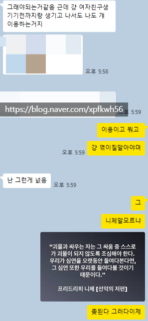
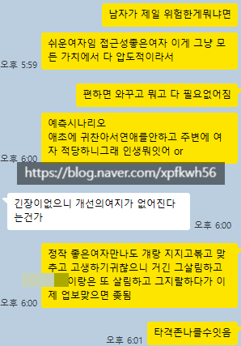

# 아들한테 해줄 법한 연애 조언
**Date:** 19시간 전
**Category:** 다이어리
**Original URL:** https://blog.naver.com/xpfkwh56/224239021818
---

**1. 결혼 빨리 해라**

​

남자가 인생에서 버리는

시간이 몇 개 있음

​

정말 소수의 일부를 제외하면

남자 인생은 **20대 후반** 시작인데,

​

**\* 대학 4년, 군대 2년, 공백 1년**

​

마침 운 좋게 잘 풀려서 **고점** 닿으면

난생 처음 **'출발선'** 에 서는 경험을 함

​

**출발선이 뭐임?**

​

남자들이 아예 상상도 못 하는 것 같은데,

​

여자는 **'여자'** 라는 이유로 모든 상황에서

항상 잠재적인 연애 대상으로 간주되곤 함

​

본인이 갖춘 외모 값에 관계없이,

​

나를 **'자원'** 으로 상대가 인지한다

라는 것을 경험하고 산다는 것임

​

그나마 와닿게 비유하려면,

이태원 게이바에 앉아있는 본인

​

그리고 주변에 이성애자인지, 동성애자인지

알 수 없지만 바글거리는 수많은 남자들을

보고 있는 상태가 여자들의 **기본** 프레임 셋임

​

1) 본인이 이성애자 남자다

그럼 그 상황 자체가 역겨울 것

​

**\* PC 를 떠나, 그냥 대체로**

​

2) 본인이 동성애자 남자다

​

흥미롭긴 하지만 남자라는 이유로

모든 남자들이 다 맘에 들진 않을 것

​

3) 그와 별개로, 섹슈얼과 상관없이

그냥 **'인간적'** 으로 호의적일 수도 있음

​

물론 본인이 이성애자 인 상황일 때,

​

상대가 돌변한다면 불쾌하거나 혹은

**'무서울'** 가능성이 극도로 높을 것임

​

이런 경험을, 내 생각에는

**'극소수의 남자'** 들만 하게 됨

​

여자한테는 남자의 호의라는 것이

1-10 레벨로 각자 나뉘게 되는 반면,

​

**\* 일상적이니까**

​

대체로 남자들은 0/1 이진법으로 감

​

**\* 나 좋아? 싫어? 끝**

​

남자가 이진법의 세계에서,

1-10 세계로 가는 **'출발점'** 이

​

빠르면 20대 후반이고,

늦으면 30대 중반 쯤임

​

저 이진 상태에서 시간을 **오래** 쓰면,

급속도로 남자의 정신에 **병**이 들게 됨

​

일부일처 메타는, 마치 조혼과 같이

연애가 주는 **비능률** 을 감소시키는데

​

**\* 인간 욕망의 8할은 치정과 금전**

​

빠르게 하나 잡아서 안정적인 연애로

넘어가면, 소모값이 **상당하게** 절약됨

​

일례로, 우리 큰 오라비의 경우

대출금 갚고 노후대비 하고 있는데

​

작은 오라비는 여전히 옷 값에 돈을 씀

​

나는 화장품 언제 샀는지

그닥 기억도 잘 안 남

**​**

**\* 얼마 전에 애 낳고 처음 미용실 감**

​

1명의 안정적인 파트너를 찾아내서,

​

그 사람을 반려자로 삼는다는 것은

인생 계획 측면에서는 물론이옵고

감정적인 측면에서도 도움이 꽤 됨

​

**2. 쉬운 사랑과 사랑을 구분해라**

​

국결론이나, 여혐 어쩌고 메타에서 보면

그들이 바라는 것은 증오에 가깝다기보단

**'처절한'** 사랑에 대한 갈망으로 읽혀졌음

​

근래 성형 서비스 관련해서 일을 하는데,

아주 독특한 시장이 있음을 확인한 바 있음

​

내가 본 최근 환자 몇 몇 은,

오래 사귀던 남친/여친한테

​

헤어지거나 바람을 맞은 사람들인데

그 사람들은 조금도 **'주저함'** 이 없었음

​

그들이 원하는 것은 **'아름다움'** 이 아니고,

미를 매개로 애정과 유대를 원했던 것 같음

​

내가 문득 들었던 생각은 이거임

​

**저 상태면, 누가 붙어서**

**계속 계속 헌신할 때**

**그냥 넘어가지 않을까**

​

눈이 높네, 낮네 라고 아무리 떠든들,

​

사람 하나가 붙어서 마치 부모처럼

자기한테 애정을 쏟고 있는 상태라면

​

**\* 그게 이기적이거나, 불쾌하지 않다면**

​

바람과 함께 사라지다에 나오는 여주처럼

그걸 **'즐길'** 가능성이 인간인 이상 높은데,

​

결국 상실에 앞서, 피중독 상태에서

벗어나기 어려울 것이란 판단이었음

​

**문제는**,

​

인간의 헌신 이라는 트레잇이

All or Nothing 경향이 있단 점임

​

적어도 내가 아는 배경 내에서 보면,

남자 라는 짐승의 설계 자체가

​

만날 수 없는 장원영, 카리나 보다

만날 수 있는 흔녀 정도를 더 선호함

​

근데 흔녀 정도의 상태만 찍어도,

​

**\* 굳이 좀 수치적으로 한다면**

**외모값 4점 이상의 외향적 여자**

**​**

부지런히 외향적으로 사회활동할 때,

어떤 남자든 하나 얻어걸리기 마련이고

​

남자 입장에서 적당한 여자 하나가

나 좋다고 계속 관심을 붓고 있으면

​

그 **'쉬운 사랑'** 에 헤어나기 어려움

​

​

구구절절 다 이야기하긴 어렵지만,

​

서사를 보면 여자가 **'악의'** 가 있었고

남자가 분명한 **'피해자'** 인 내용이었음

​

근데 시간이 지나고, 그 역할이 바뀌었고

이제 남자가 여자를 착취하는 그림인데

​

내 조언은 일관적으로 **'끊어라'** 였음

​

**\* 99% 확률로 엮일 것으로 봤기 때문**

**​**

여자가 자기가 **'여자'** 라는 것을

무기로 삼는 상태는 **정상이 아님**

​

하지만 그걸 구분할 수 있는 남자는

거의 없다는 것이 비극 중 하나 임