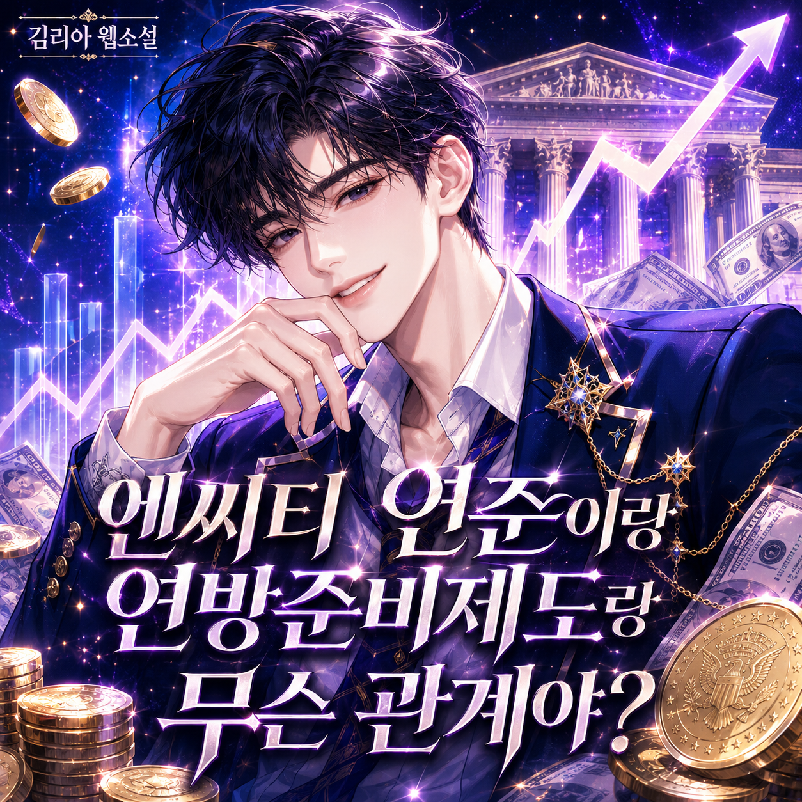

# 엔씨티 연준이랑 연방준비제도랑 무슨 관계야?
**Date:** 19시간 전
**Category:** 행운과 재능
**Original URL:** https://blog.naver.com/xpfkwh56/224311341171
---

​

제대로 된 국가라면 어느 나라든 중앙은행이라는 것이 있다.

​

우리나라엔 한국은행이, 미국엔 연방준비제도(Fed)가 있다.

​

평소엔 있는 줄도 모르고 산다. 그런데 이게 하는 일이 엄청 크다.

​

중앙은행은 은행들의 은행이다.

​

우리가 돈이 급하면 은행에 가서 빌리듯, 은행이 돈이 급하면 중앙은행에 가서 빌린다.

​

평화로운 시기에는 아무도 찾지 않지만 어느 날 사람들이 '세상 망함?' 하고 불안을 느끼기 시작하면, 중앙은행은 존재력이 막강해진다.

​

은행에는 현찰이 없다.

​

중세에는 금세공사들이 은행의 역할을 했다.

​

사람들이 금을 맡기면 감정도 해주고 보관도 해줬다.

​

감정료, 보관료를 받던 어떤 금세공사가 탁월한 아이디어를 떠올렸다.

​

사람들이 금을 일단 맡겨놓으면 신경을 안 쓰더라 이거다.

​

실제로 금을 얼마나 자주 빼가나 계산을 했더니 7%쯤이었다.

​

그래서 세공업자는 7%의 금만 제외하고 나머지 93%를 다른 고객들을 대상으로 빌려주고 추가 수익을 얻기 시작했다.

​

금세공사만 좋았던 것도 아니다.

​

93%의 금을 빌려줄 수 있다?

​

이 시점에 화폐는 상품이 된다. 이게 금융이다.

​

빌려준 돈으로 빌린 돈을 굴리게 되면서 금을 오래 맡기면 이자를 더 많이 주는 시스템이 생겼다.

​

바로 자본 가치가 생산된 것이다.

​

필연적으로 이런 시스템은 위험이 존재한다.

​

보유한 금의 비율이 낮기 때문에 사람들이 하루아침에 모든 돈을 빼간다고 하면 망한다.

​

인류는 많은 시행착오 끝에 또 답을 찾아냈다.

​

언제든지 금을 찾아가고 싶으면 찾을 수 있게 보관해야 되는 비율, 그걸 지급 준비율이라고 한다.

​

안전하고 이자도 많이 주면 서로 맡기려고 한다.

​

위험하고 이자도 별로 안 주면 맡길 이유가 없다.

​

위험은 곧 내가 넣은 원금이 손실된다는 것을 의미한다.

​

은행에 맡긴 돈이 없어진다면?

​

다들 한꺼번에 은행으로 달려가 예금을 빼기 시작한다. 이걸 뱅크런이라고 한다.

​

현재에도 은행은 사람들이 맡긴 돈을 금고에 고스란히 쌓아두는 게 아니라, 대부분 대출로 굴리고 있다.

​

그러니 아무리 멀쩡한 은행이라도, 모두가 한날한시에 돈을 빼겠다고 몰려오면 현금이 동나 무너진다.

​

한 은행이 무너지면 옆 은행도 불안해지고, 그럼 거기도 뱅크런이 나고.

​

이렇게 공포가 도미노처럼 번지면, 나라 경제 전체가 멈춰버린다.

​

바로 여기서, 중앙은행이 등장한다.

​

가게 두어라. 돈 필요한 은행엔 내가 무제한으로 빌려주겠다.

​

이 한마디면 사람들은 안심하고, 도미노는 멈춘다.

​

그래서 중앙은행을 최종 대부자라고 부른다.

​

최악의 상황에도 최종적으로 돈을 대주는 존재라는 뜻이다.

​

자, 그런데 이 당연한 제도가.

​

이 당연해 보이는 중앙은행이, 약 120년 전 세계 최강대국 미국엔 없었다.

​

은행이 줄줄이 무너져도, 정부가 나서서 막아줄 방법이 없었다.

​

그래서 그 시절 미국은 몇 년에 한 번씩 금융 공황을 겪었다.

​

20년 동안 예금을 넣었다. 은행이 망했다? 그럼 그냥 끝이다.

​

지준율이 없었기 때문에 돈이 필요한 사람이 있으면 양껏 빌려줬다.

​

그러다 뱅크런 터지면? 죽지 뭐, 였다.

​

죽지 뭐, 를 읊조리는 은행과 따갚되, 를 울부짖는 야수들이 만나면서 주기적으로 지옥이 펼쳐졌다.

​

1907년 가을, 여지없이 거대한 공황이 닥친다.

​

황당한 시작이었다.

​

어떤 형제가 구리 회사 주식으로 한탕 하려다가, 폭삭 망한 것이다.

​

그리고 이런 사소한 도박 실패가, 나라 전체를 집어삼키는 대형 산불로 번졌다.

​

형제들이 연루된 은행이 위험하다는 소문이 돌자, 사람들이 돈을 빼기 시작한 것이다.

​

특히 뉴욕의 거대한 신탁회사 니커보커가 예금 지급을 중단하고 문을 닫아걸자, 공포가 폭발했다.

​

신한은행, 국민은행, 우리은행, 하나은행에 넣은 예금은 내일부터 뺄 수 없다? 난리가 난다.

​

사람들은 새벽부터 은행 앞에 줄을 섰다.

​

멀쩡한 은행에서까지 돈이 썰물처럼 빠져나갔다.

​

신한, 국민, 우리, 하나도 못 믿는 마당에 누굴 믿어?

​

다우존스 시장은 정확히 반 토막이 났다.

​

나라 경제가 그대로 절단 나기 직전이었다.

​

이럴 때 필요한 것이 최종 대부자, 중앙은행이다.

​

문제라면 단 하나.

​

이런 일을 막아줄 중앙은행이 없었다.

​

정부도 손쓸 방법이 없었다.

​

그 시점에 위기를 극복할 수 있는 사람은 단 1명 밖에 없었다.

​

J.P. 모건.

​

지금도 세계 최대 은행 중 하나인 JP모건이, 바로 이 사람이 세운 회사다.

​

불공평하게도 태생이 다른 인간들이 있다.

​

모건은 정자부터 금수저였다.

​

가장 비싸고, 가장 좋은 것을 전부 가졌다.

​

원하면 다 살 수 있었다.

​

금융 자본주의라는 단어를 1명의 인간에게 집약한다면 그게 J.P 모건이었다.

​

공황이 터진 당시 그의 나이 일흔.

​

모건은 미국 금융계의 살아있는 전설이자, 누구도 함부로 하지 못하는 거물이었다.

​

사실 모건이 나라를 구한 건 이번이 처음도 아니었다.

​

10여 년 전에도 그는 바닥나버린 미국 정부의 금고를, 자기 돈과 신용을 동원해 메워준 적이 있었다.

​

그러니 은행들이 살려달라며 손을 내민 곳도, 정부가 아니라 이 노인이었다.

​

모건은 움직였다. 자기 서재를 사령부 삼아, 돈 있는 은행가와 부자들을 불러 모았다.

​

입금. 안 해? 곤란.

​

월가의 거물들을 서재에 몰아놓고 문을 잠갔다.

​

도장을 안 찍으면 나갈 수가 없었다.

​

한자리에 모아놓고 보니, 누구 하나 모건의 돈을 안 쓰는 놈이 없었다.

​

연쇄적인 뱅크런이 터져도 망하고, 모건의 눈 밖에 나가도 망한다.

​

그는 휘청거리는 회사들을 하나하나 살펴, 망할 회사는 망하게 두고 살릴 회사에는 수백만 달러를 폭포수처럼 쏟아붓기 시작했다.

​

시퍼런 올블루에서 주가가 오르니 팔고, 오르니 팔던 단타충들의 손이 멎었다.

​

기다리니까 계속 오르네? 가만히 있으니까 수수료가 안 나가네? 돈이 안 없어지네?

​

단타충을 할배 투자자로 만드는 것이 바로 이런 경험이다.

​

단 몇 시간 만에 금융 시장에는 평화가 찾아왔다.

​

모건의 서재에 놓인 거물들의 서명들과 함께, 1907년의 공황은 거짓말처럼 잡혔다.

​

한 사람이, 정확히는 한 사람의 의지와 신용이, 나라 경제를 통째로 구해낸 것이다.

​

진짜 이야기는 지금부터다.

​

공황이 가라앉자, 미국의 정치인들은 안도하는 대신 등골이 서늘해졌다.

​

**방금 무슨 일이 벌어진 거지?**

**​**

한 국가의 경제 전체가, 한 늙은 은행가 개인의 결단 하나에 매달려 있었다.

​

모건이 젊었을 때 있었던 일이다.

​

내일 주가가 어떻게 될까요? 라는 질문에 모건은 이렇게 답했다.

​

**오르거나 내리겠지, 내리다 오를 수도 있고.**

**​**

만약 그날 밤 모건이 마음을 다르게 먹었다면?

​

아니, 그가 그 자리에 없었다면? 이미 세상을 떠나고 없었다면?

​

살릴 수 있다는 것은 곧 죽일 수도 있다는 소리다.

​

이렇게 보니까, 걱정할 리스크는 대공황 따위가 아니었다.

​

그가 마음만 먹으면 어떤 회사는 살리고 어떤 회사는 죽일 수 있었다.

​

1907년에는 그 힘이 나라를 구하는 데 쓰였지만, 위험한 것은 그 힘 자체였다.

​

국가의 운명이 **'단 1명의 천재'** 에 달려 있다는 것.

​

그것이야말로 가장 무서운 일이었다.

​

정치인들은 생각했다.

​

이런 일은 한 번이면 충분하다.

​

다음번 공황 때 또 모건 같은 부자가 나타나 주기를 기도하고 있을 수는 없다.

​

나라가 위기를 스스로 감당할 **'시스템'** 이 필요하다.

​

그렇게 1907년의 공황은, 미국이 중앙은행을 만들기로 결심하는 결정적 계기가 됐다.

​

다음에도 그런 사람이 나타나리라는 보장이 없고, 애초에 그런 권력을 한 사람이 가져선 안 된다.

​

망해서 중앙은행을 만든 것이 아니고, 안 망해서 중앙은행을 만들게 된 것이다.

​

조사가 시작됐고, 비밀 회의가 열렸고, 긴 논쟁 끝에 1913년 마침내 법안이 통과됐다.

​

그렇게 태어난 것이, 이 글 첫머리에서 말한 바로 그 미국의 중앙은행.

​

연방준비제도다.

​

이제 미국엔 위기 때 은행에 무제한으로 돈을 대줄 **'최종 대부자'** 가 생겼다.

​

더 이상 모건 한 사람의 서재에, 나라의 운명을 맡기지 않아도 됐다.

​

망해가는 조국을 구하면 멍석말이를 당한다?

​

그런 일은 거북선 주인에게만 있던 일도 아니다.

​

한편 억울하기만 할 일도 아니었다.

​

선출되지도 않은 한 개인이, 국가 경제의 생사를 좌우한다니.

​

빅딜이 결정된 뒤 의회 조사에서, 모건을 비롯한 몇몇 금융가가 18개나 되는 주요 기업과 천문학적인 자금을 좌지우지하는 거대한 적폐 세력을 이루고 있다는 사실이 드러났다.

​

한줌단이 나라 경제를 손에 쥐고 있었던 것이 문제였다.

​

그를 청문회에 부른 것도 바로 그 우려 때문이었다.

​

연준이 만들어지기 직전, 의회는 청문회를 열어 모건을 불러 세웠다.

​

고작 단 1명의 인간이 나라 경제를 좌지우지할 만큼 거대한 부와 권력을 쥐는 게 과연 옳으냐는 추궁이었다.

​

나라를 두 번이나 구한 노인은, 이제 **'너무 막강해서 위험한 존재'** 로 심문대에 올랐다.

​

혓바닥이 날카롭기로 유명한 변호사, 언터마이어가 재판의 주연이었다.

​

언터마이어는 모건을 몰아붙였다.

​

자본주의의 화신, 탐욕의 악마로 모건을 표현해야 했다.

​

" 소비자 금융, 그러니까 대출에서 가장 중요한 것이 뭘까요? 신용일 겁니다. 그럼 신용은 뭘까요? 결국 돈이나 재산에 기반하는 것 아닙니까? "

​

누가 봐도 "그렇다" 는 답이 나올 질문이었다.

​

돈을 빌려줄 때 담보가 얼마나 있는지, 상환 여력은 어떤지 보는 게 당연하니까.

​

모건이 대답했다.

​

" 아닙니다. "

" 그럼요? "

​

그런데 모건의 대답은 뜻밖이었다.

​

**" 아닙니다. 첫째는 인간으로서의 품격, 즉 인격(character)입니다. "**

​

그게 돈이나 재산보다 먼저냐고 변호사가 되묻자, 그는 다시 똑똑히 답했다.

​

돈이나 그 무엇보다도 먼저라고.

​

그리고 이렇게 덧붙였다.

​

그건 돈으로 살 수 없는 것이며, 자기가 신뢰하지 않는 사람은 세상의 모든 채권을 담보로 내놔도 자기에게서 단 한 푼도 빌릴 수 없다고.

​

월가의 심장부에서 평생을 살아갔던 사람이, 신용의 진짜 바탕은 담보가 아니라 그 사람의 됨됨이라고 못 박은 것이다.

​

생각해 보면 깊은 통찰이다.

​

'신용(信用)'이라는 말 자체가 '믿고(信) 쓴다(用)'는 뜻이니 말이다.

​

돈을 빌려준다는 건, 결국 이 사람이 약속을 지킬 것이라고 믿는 행위다.

​

아무리 좋은 것도 믿을 수 없는 경로라면 수상스럽고, 설령 나쁜 것도 믿음직하면 내 한 번 속아본다가 된다.

​

결국 사람을 움직이는 건, 가진 것의 크기가 아니라 믿을 수 있는 사람인가에 있다.

​

그러므로 금융의 본질은 사실 숫자가 아니라 사람에 대한 믿음이라는 것이다.

​

모건이 평생 다룬 건 돈이었지만, 그 돈을 움직인 진짜 힘은 신뢰였다.

​

그리고 그 신뢰의 바탕은, 그가 말했듯 됨됨이였다.

​

이건 거대 금융의 세계에만 해당하는 얘기만도 아니다.

​

우리 삶의 모든 거래가 그렇다.

​

인격, 신뢰 같은 가치는 하루아침에 쌓이지 않고 모건의 말처럼 돈으로 살 수도 없다.

​

연봉이나 대우, 조건, 팔자야 내 의지로 바꾸는 한계가 있지만 됨됨이는 내가 하기 나름이다.

​

그리고 빛보다 빠른 속도로 업데이트가 된다. 매 순간.

​

1913년 봄, 모건은 로마의 한 호텔에서 조용히 눈을 감는다.

​

공교롭게도, 그가 세상을 떠난 바로 그해 말. 미국의 연방준비제도가 정식으로 출범했다.

​

혼자서 중앙은행 노릇을 하던 사람이 사라진 자리에, 마치 차례를 넘기듯이.

​

모건의 이야기는, 위대한 인간이 무엇인가? 라는점을 생각을 할 기회를 준다.

​

우리는 보통, 모든 걸 혼자 짊어지고 해결하는 사람을 영웅이라 부른다.

​

위기 때마다 나타나 다 정리해 버리는 사람.

​

없으면 안 되는 사람. 누구나 한 번쯤 그런 사람이 되고 싶어 한다.

​

실제로 그건 멋진 일이고, 모건은 분명 그런 영웅이었다.

​

그런데 모건이 남긴 진짜 교훈은, 정반대 지점에 있다.

​

한 명의 영웅에게 모든 게 달려 있는 구조는, 그 영웅이 아무리 위대해도 결국 위태롭다는 것이다.

​

영웅은 늙고, 지치고, 병들고, 언젠가는 사라진다.

​

그래서 진짜 위대한 유산은, 어쩌면 내가 직접 위기를 막아낸 무용담이 아닐지도 모른다.

​

오히려 **'나 같은 사람이 없어도, 위기를 막을 수 있는 시스템'** 을 남기는 것.

​

모건이 의도한 건 아니었지만, 그가 세상에 남긴 가장 큰 선물이 바로 그것이었다.

​

이건 한 세기 전 어느 금융가만의 이야기가 아니다.

​

회사에서, 팀에서, 가정에서. 우리는 종종 내가 아니면 안 되는 자리에 서곤 한다.

​

내가 없으면 일이 안 돌아가는 상황.

​

그 순간엔 내가 꼭 필요한 사람이 된 것 같아 뿌듯하다.

​

하지만 정말로 일을 잘하는 사람은, 자기가 없어도 굴러가게 만드는 사람이다.

​

자기 머릿속에만 있던 노하우를 정리해 남기고, 후배가 스스로 해내도록 길을 깔아주고, 자기 자리를 기꺼이 비울 줄 아는 사람.

​

나는 지금 내가 없으면 안 되는 사람이 되려고 애쓰고 있는가, 아니면 내가 없어도 되는 구조를 만들고 있는가?

​

그리고 그 질문의 바탕이 되는 '됨됨이'는 어떠한가?

​

혼자 모든 걸 떠받치는 영웅이 되는 것과, 나 없이도 돌아갈 무언가를 남기는 것.

​

은행가들을 서재에 가둬놓고 홀로 나라를 구했던 그 노인은, 어쩌면 죽어가면서 가장 위대한 과업을 이루어냈다.

​

자기 같은 영웅이 다시는 필요 없는 세상을, 인류에 남기고 떠난 것이다.

​

**원 모아 띵쓰**

​

다시 또 반복된 1929년 대공황의 끝에서 미국 정치인들은 무엇이 미국을 망가뜨렸는지 캐내기 시작했고, 1912년, 모건이 그랬던 것처럼 모건 주니어가 다시 한번 재판장에 서게 된다.

​

모건 주니어는 기출을 그대로 읊었다.

​

은행가와 자본가는 사회에 있어 위험이 아니라 자산이며, 그 힘은 돈이 아니라 사람들의 신뢰에서 나온다.

​

클래식은 있어도?

​

복고는 없다.

​

청문회의 칼잽이는 페르디난드 페코라, 그는 법률가이자 월가의 내밀한 곳까지 전부 알고 있는 내부자였기 때문에 도련님 향기 폴폴 나는 모건 주니어하고는 체급부터가 달랐다.

​

그렇게 미국 최고의 부자가 소득세를 한 푼도 내지 않고, 사회 지도층과의 정경 비리가 있다는 것이 청문회에서 밝혀진다.

​

청문회가 불러일으킨 분노가 즉각 개혁의 물결을 탔다.

​

루스벨트가 증권거래법에 서명하면서 증권거래위원회(SEC)의 탄생으로 이어졌고, 금방 의회는 상업은행과 투자은행을 분리한 글래스-스티걸법을 통과시키게 된다.

​

법은 SEC에 증권사, 이체대행사, 청산기관, 그리고 뉴욕증권거래소 같은 자율규제기구를 등록, 규제, 감독할 권한을 주었고, 징계 권한과 상장 기업의 정기 정보공시 의무화 권한까지 부여했다.

​

루즈벨트가 월가 고인물 페코라에게 물었다.

​

" 이제 내가 이 법안에 서명해서 법이 됐는데, 이게 어떤 법이 될 것 같소? "

" 대통령님, 법에는 좋은 법도 나쁜 법도 없습니다. 오직 그걸 운영하는 사람들에게 달려 있습니다. "

​

루즈벨트는 SEC 초대 위원장에 주가 조작으로 막대한 돈을 번 월스트리트 투기꾼을 앉혔다.

​

양 떼를 지키라고 늑대를 앉히는 것이 말이 되냐며 여론이 빗발쳤다.

​

당연히 가장 적격한 인물은 페코라였다.

​

그는 청문회에서 월가를 폭로했던 사람이고, 매우 적합한 감시자였다. 심지어 본인도 그 일을 무척 하고 싶어했다.

​

하지만 루스벨트의 논리는 냉정하고 정밀했다.

​

루즈벨트는 대중들에게 말했다.

​

우리는 시장이 **어떻게 작동해야 하는지**가 아니라, 시장이 **실제로 어떻게 작동하는지**를 아는 사람이 필요합니다.

​

도둑을 잡으려면 도둑을 써야 한다는 접근이었다.

​

SEC의 핵심 철학은 단순했다.

​

정부가 주식의 좋고 나쁨을 판정하지 않는다, 대신 발행자가 진실을 **전부** 공개하게 한다.

​

사느냐 마느냐는 투자자가 알아서 결정하되, 거짓말은 못 하게 한다.

​

공시(disclosure)에 의한 규제의 시작이었다.