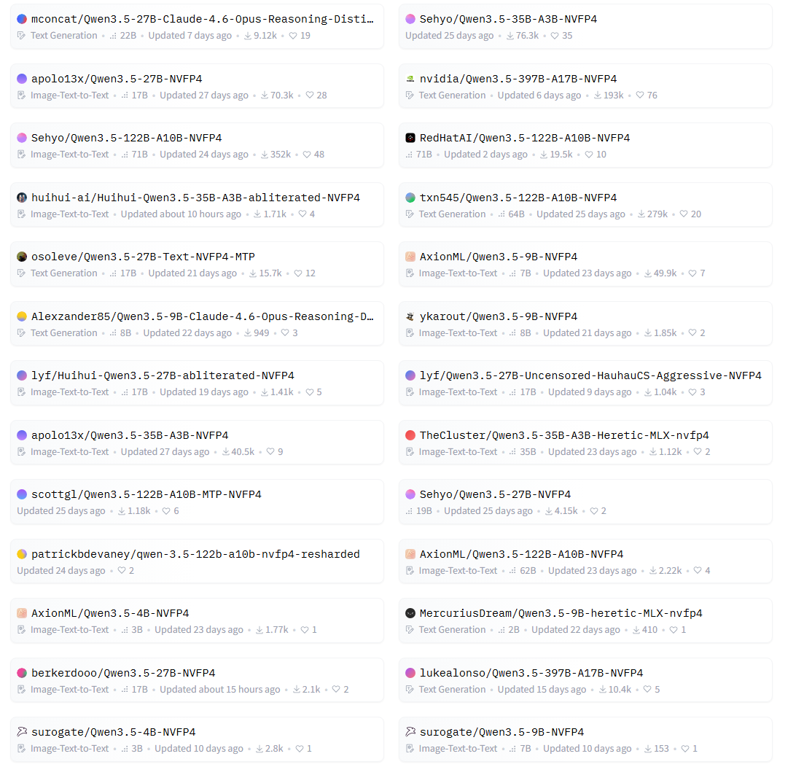
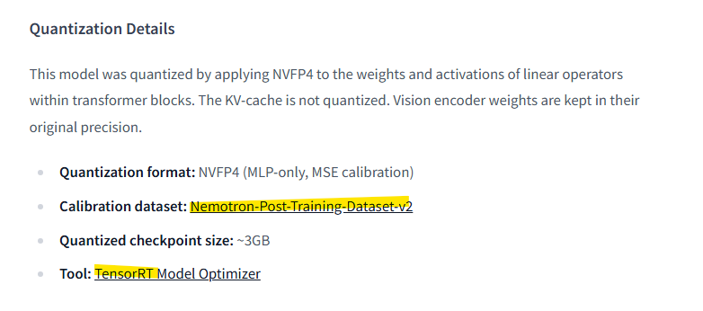
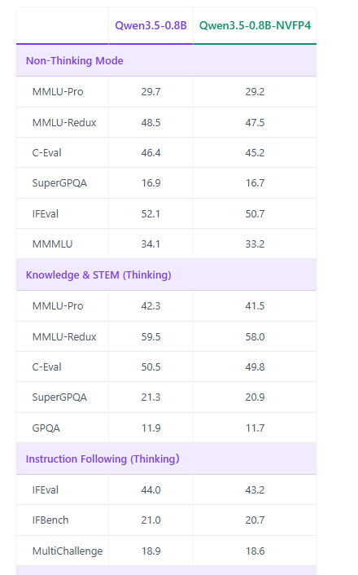

# 양자화
**Date:** 1분 전
**Category:** 다이어리
**Original URL:** https://blog.naver.com/xpfkwh56/224230902740
---

<https://blog.naver.com/ranto28/224230601948>

[**구글이 발표한 터보퀀트가 뭔데 시장을 흔드나?**

오늘 흥미로운 발표가 있어서 정리해 봅니다. 1. 디지털의 아버지라고 불리는 미국의 수학자 겸 컴퓨터 과...

blog.naver.com](https://blog.naver.com/ranto28/224230601948)

​

1. KV 캐시는 2개로 양자화할 수 있음

​

K 양자화 V 양자화인데,

​

4비트 양자화는 리스키하지만

8비트 양자화는 실용성 면에서

​

거의 차이가 없어서

엔터프라이즈도 그렇게 씀

​

KV 양자화 자체는

**'딸깍'** 으로도 됨

​

2. 양자화 기술만 있다고 되는 것은 아님

서빙 모델에서 레이어 지원을 해야 됨

​

양자화 방식이 다양함

int도 있고, gguf도 있고

​

llama 기반이냐, vLLM 이냐,

같은 것에도 차이가 있음

​

양자화 **'자체'** 만 하고,

읽지 못하면 쓸모가 없음

​

gguf 모델의 경우, 무난하지만

손실이 높다고 알려져 있고

​

양자화 과정에서 데이터 세트를

어떻게 입히느냐에 차이도 있음

​

똑같은 8bit 양자화를 해도,

뭐는 손실이 크고, 뭐는 작음

​

​

3. 허깅페이스에 있는

​

qwen3.5 9B 모델의

NVFP4 양자화 리스트임

​

1) qwen3.5

​

멀티모달 경량 모델 중에

손꼽히게 좋다고 알려졌음

​

2) NVFP4

​

엔비디아에서 개발한

양자화 기술로 4bit 로

감소시키는데, 성능 저하가

거의 없어서 **매우** 뛰어남

​

**\* a,w 방식도 있고 많지만**

**나는 NVFP 를 선호하는 편**

**​**

양자화 방식에 따라서는,

물론 워크로드마다 다르지만

​

용량이 줄었는데,

성능 자체는 **'향상'**

될 수도 있기도 함

​

<https://huggingface.co/AxionML/Qwen3.5-4B-NVFP4>

​

4. AxionML 모델은

TensorRT 로 양자화했고

​

칼리브레이션은

네모토론으로 함

​

텐서RT 가 뭐임?

​

엔비디아에서

지원하는 서빙 툴임

​

블랙웰 gpu 에서

가장 효율적이게 가동되지만

​

소비자용 모델 sm120의 경우,

아직 미호환 되는 모델이 많고

​

A, H 시리즈 같은 경우에는

리눅스 호환해서 쓰면 괜찮음

​

엔비디아 자체에서도

대형 모델들을 양자화해서

우리가 한 걸로 쓰라고 올림

​

**\* 단, 개인은 엄두도 못 냄**

​

​

4bit 양자화를 했다는 것은

전체 서빙 용량이 1/4 란 뜻임

​

**\* 겁나 많이 줄였다는 것**

​

제일 직관적으로 이해하면

가격이 1/4 되었다는 소리임

​

저기 있는 수치는 확률인데,

​

4비트 양자화를 안 쓰면

29.7% 확률로 답이 나오고

쓰면 29.2% 확률로 답이 나옴

​

가격은 1/4, 확률은 0.5% 차이

​

이러니 **'안 쓸 수가 없는 것'**

​

1) 문제는, AxionML 모델의

​

공식 서빙이 SGLang nightly고

뭐 어떻게 돌렸는지 모르겠지만

텐서값이 틀려서 서빙이 안 됨

​

2) 그리고 네모토론 칼리브레이션이라,

코딩에 집중된 상태고 나머진 모름

​

그래서 내 경우, NVFP4 로

네이티브 vLLM 양자화를 진행했고,

​

칼리브레이션은 qwen3.5 기반

동일 데이터로 돌려서 했었음

**​**

**5. 결론**

​

규모를 키우자, 라는 아이디어는

중국을 필두로 **'급속히'** 식고 있음

​

**\* 기술이 너무 좋아져서**

**​**

서구에서 뭐 진짜 새롭게 뽑지 않는 한,

있는 기술을 적절히 잘 뽑아서 쓰고,

​

경량화를 잘 시키는 것이 **주요 메타** 임