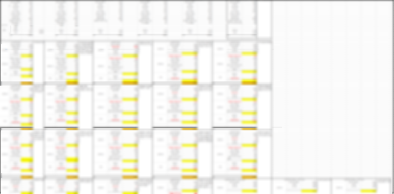
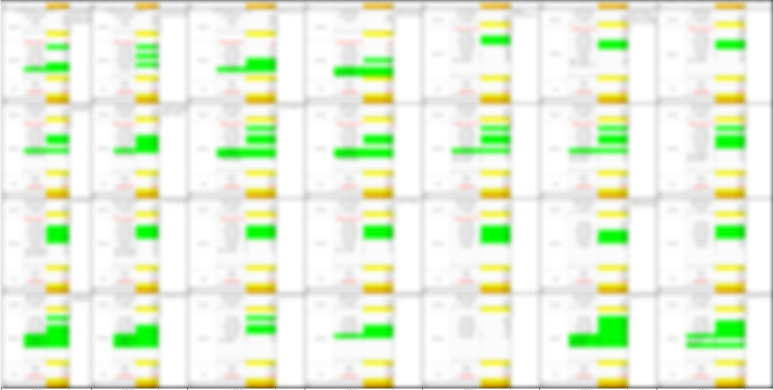
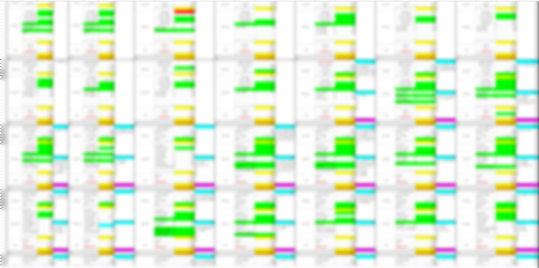
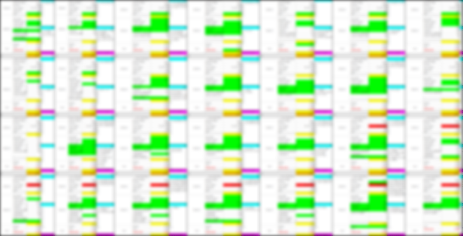
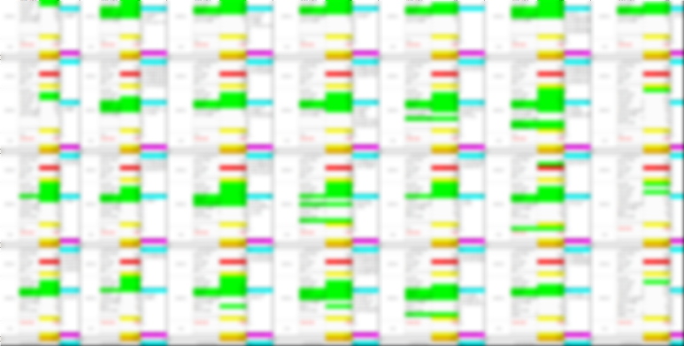
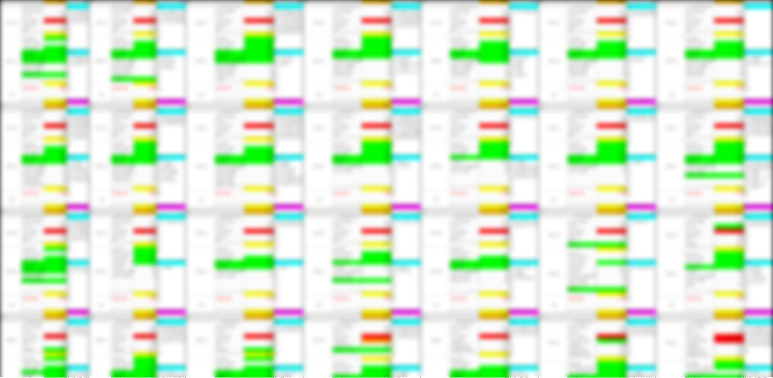
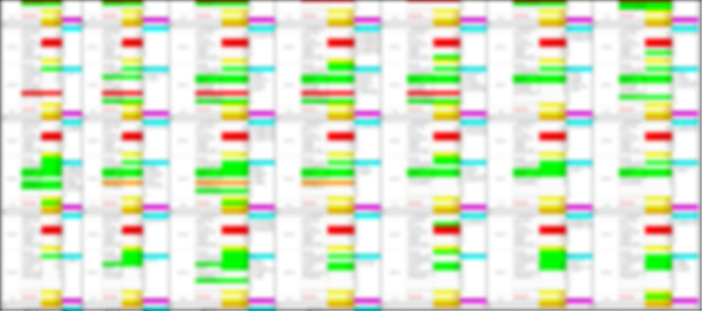
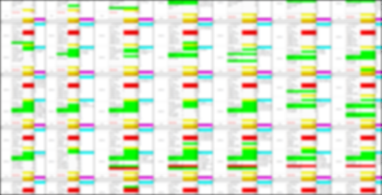
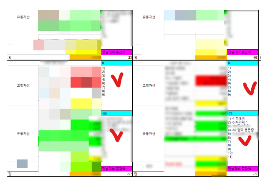

# 가계부
**Date:** 1시간 전
**Category:** 다이어리
**Original URL:** https://blog.naver.com/xpfkwh56/224284733418
---

1. 롱 타임 어고,

​

지금에야 조금 더 **'쿨'** 해졌지만,

​

더 어렸던 시절의 나는

자존감은 낮고 자존심은 쌘

사람에 더 가까웠던 것 같음

​

너가 뭐냐? 누구냐? 라고 하면,

당시에 나는 좀 **'비어 있었음'**

​

생각나는 것을 꼽자면 이런 것인데,

​

지금에야 많이 게을러졌지만

당시에 내 자랑은 **'성실'** 이었음

​

어른들한테 칭찬받는 일이 즐거웠고,

​

정해진, 반복된 일을 하는 것이

지금도 내 **'적성'** 이라서,

​

그걸로 내 자아를 비대하게 키웠었음

​

2. 아닌 말로, 당시 상황은 딱히

**'가릴 것'** 이 없는 형편이긴 했는데

​

사실 자체는 속이지 않되,

그렇다고 굳이 알리진 않았음

​

그래서 장학금을 신청하거나 할 때도,

내가 **'노출'** 되는 환경이면 **다** 안 했음

​

**왜 why?**

​

**그게 내 자존심 한계선이었기 때문** 임

​

부모님은 뭘 받아오면 기뻐하셨긴 한데,

받아보라고 제안하거나 그런 적은 없음

**​**

우리 아빠한테는 내가 **고흐, 피카소** 쯤 되는

거장급 화가 이기 때문에 내 그림만 보면

**'어마어마'** 할 정도로 과잉된 해석을 하심

​

**\* 당연히 그 정도는 아님**

​

if, 내가 만약 **이성적인** 아버지 포지션이라면

​

너 레코드랑 서사, 내러티브를 가져다가

크라우드 펀딩을 하든가 해서 학비를 받고,

​

그걸로 졸업을 하거나, 커리어를 키워라

라고 이야기를 해볼 수도 있을 법 하지만,

​

아마 아이디어가 있으셨어도

그렇게 하라고 안 하셨을 것 같음

​

저는 요걸 나이를 좀 먹고 이유를 알았음

부모가 된 마당에는 너무나 잘 알 것 같고

​

3. 학업이랑 생계를 병행하는 것은,

적어도 내 경험상 **'진짜 쉽지 않은데'**

​

그 시절에도 수업을 빼먹거나,

지각하거나, 과제를 놓친 적은 없음

​

**\* 그래서 만약 내가 학교에 지각하거나,**

**결석하면 세상 무너지는 줄 알던 시절에**

**이제 학교 안 다녀도 된다가 좀 울적 했음**

​

다만, 그건 내가 **'해봤던 것이니'** 그렇고

내가 안 해봤던 일에 있어선 취약 했는데,

​

특히, 돈을 관리하는 것에 있어서 그랬음

​

경제 교육이니, 금융 교육이니

요즘엔 학교에서도 가르친다는데

​

그리 옛날도 아니지만, 내 시절에는

어디 있지도 않은 이야기들 이었고,

​

몇 푼 있지도 않아 그랬다는 점도 있지만,

이상하게도 정신을 차려보면 돈이 없었음

​

그렇다고 대단한 사치를 하고 살았냐?

그것도 아님, 그냥 먹고 살고 숨만 쉬었음

​

내가 이걸 **알게 된** 기점은 조금 더 뒤인데,

​

1) 언젠가 내가 내 스스로 경제적으로

통제할 수 있는 인간이 아님을 알았고,

​

2) 어디에 얼마를 어떻게 썼는 것인지

매 순간 기억할 만큼 머리가 좋지도 않다

​

라는 것을 깨닫게 된 순간부터 **가계부** 를 씀

​

**4. 가계부에 내용을 어떻게 쓰냐?**

​

얼마 벌었다, 얼마 썼다 만 써도 됨

​

그럼 내가 얼마를 벌었구나,

얼마를 썼구나 를 **'기록'** 할 수 있음

​

그럼 최소한, 누가 훔쳐간 것 아닌가?

내가 돈 잃어버린 것 아닌가? 같은 일을

미연에 방지하는 것이 더 가능하게 됨

​

그리고 아주 자연스럽게 **확장하게** 됨

​

가계부 라는 것은 기본적으로

마땅한 형식이 정해진 것이 없음

​

다만, 그 **'존재 이유'** 가 있을 뿐 임

​

[](#)

​

**욕조에 물을 담는 모습** 을 가정하겠음

​

욕조 안에 있는 물은

**'정해진 특정 시점'** 의 내 경제 현황임

​

26년 5월 13일, 내 자산이 궁금하면

나는 매 시점의 **'자산'** 을 확인하면 됨

​

내가 얼마를 갖고 있는 상태인지 알면,

그걸 바탕으로 의사결정 단서를 얻게 됨

​

수도꼭지로 들어오는 물과

배수구로 빠지는 물의 양은

​

**'매 순간마다'** 오고 가는 경제 현황임

​

수도꼭지에서 나오는 물이 **수입** 이고,

욕조에 모인 물이 **재산** 이며,

배수구로 빠져나가는 돈이 **지출** 임

​

결국 수입과 지출에 따른,

​

재산의 **'증감량'** 만 알 수 있다면

뭐든 기록되어도 상관 없을 것임

​

**'복잡하지 않은 환경'** 일 때는,

이 자체만으로도 충분할 수 있음

​

5. 그러나, 장사를 하면 이런 일이 생김

​

욕조에 있는 물이 수도꼭지 에서만

나오는 것이 아니라 바가지 퍼다가

잠깐 빌려오는 경우가 있을 수도 있고,

​

**'지금'** 수도꼭지 에서 나온 건 알겠고,

그래서 **'앞으로'** 나올 것이 궁금할 수 있음

​

또 지출이라고 다 똑같은 지출이 아님,

​

내가 흥청망청 쓴 돈이 있을 수도 있고,

꼭 필요해서 쓴 돈이 있을 수 있는데,

​

그 둘을 **동일한 라벨** 로 잡아버린다면

나중에 내가 그걸 활용하기 **'어려워'** 짐

​

**\* 모든 돈에 같은 라벨을 붙일 수도 없음**

**​**

이걸 똑똑한 분들이, 이미 정립해뒀는데

​

내 수익성이 궁금하다면

**손익 계산서** 를,

​

내 재무 구조와 경제적 안정성이

궁금하다면 **재무상태표** 를,

​

유동성과 현금 창출력이 궁금하다면

**현금흐름표** 라고 해서,

​

각 목적에 맞게, 남들은 이렇게 쓴다

라고 모범적인 예시를 만들어두셨음

​

6. 내일부터 재무회계, 부기 배워서

그거 그대로 내 가계부에 넣으란거죠?

​

**아님**

​

직원 월급 주는 날이 매달 1일 인데,

내가 결제 받는 날이 25일 이라면

​

**'누가 안 가르쳐줘도'**

​

현금 흐름표와 손익 계산서를

알아서 구분하게 된다는 것 임

​

7. 일단 가계부 써서 열심히 막 적으면

그게 알아서 나를 부자로 만든단 것이죠?

​

**아님**

​

가계부는 내 판단의 단서이자, 재료일 뿐

​

**'놓치는 정보가 없는 것'** 이 궁극적 목적이지

저거만 갖고는 아무 것도 대신 해주지 않음

​

나가는 돈이 얼만지 알아야, 줄일 것을 줄이고

쓸 돈과 쓰면 안 되는 돈을 구분할 수 있으며,

​

버는 돈이 얼만지 알아야, 그걸 바탕으로

1개월 뒤, 1년 뒤 내 미래를 **'추측'** 할 수 있음

​

8. 나 혼자 보는 용도면, 내가 편하면 끝 임

​

**\* 나만 알아보면 되니까**

​

그래서 내가 알아볼 정도만 정확하고,

간명한 객관성을 갖추면 그만이지만

​

이해 관계자가 2명이 되면 **복잡하게** 됨

​

전체 우리집 자산 구성 내에서,

누가 더 공헌도가 높지? 라고 예를 들겠음

​

**\* 편의상, 예시에 불과합니다**

​

그럼 구성하고 있는 자본 요소들 속에서,

변화하고 기준하는 것들을 논해야만 함

​

가족은 장기 협력 관계라

단년도 회계로 평가할 수 없고,

​

가사/육아의 가치를 어떻게 잡느냐?

​

외부에서 벌어오는 돈의 가치와

절약과 같은 비금전 기여도 가치를

어떻게 평가할 것이냐? 같은 것들을

​

**'서로가 용인하는 방식'** 으로

기재해서 규칙으로 적어야 됨

​

아내가 핸들을 잡고 있었는데,

​

어느 날 불의의 사고로 만약에

신랑이 그걸 인수해야 된다면

​

암묵적으로 통용되던 관행 역시도

서로 공유할 수 있는 형태로 남겨져야

내용이 영속성을 갖고 지속될 수 있음

​

그럼 그런 것들을 따로 기재하는 것임

​

9. 이상의 내용들을 상세하게 정리하면

​

**'우리집 최적화'**

​

손익계산서, 재무상태표, 현금흐름표,

자본변동표, 주석 이라는 5 요소 나옴

​

경우에 따라 불필요할 수도 있고,

​

**\* 일반적으로 가정에서는 발생주의와**

**현금주의를 나눌 이유가 크게 없는 편에,**

**​**

**주석이나 자본 변동표 같은 경우에도**

**대부분은 작성하는 실익이 적을 수 있음**

​

내용이 단순하다면 3개를 합쳐서,

내가 편하기 좋게 하나로 써도 됨

​

​

이게 제가 초기에 썼던 레이아웃이고,

​

**\* 그 전에는 실물 종이에 쓰다가,**

**사업 하면서 스프레드 시트로 관리**

**​**

​

그 다음에는 색깔로 자주 보는 것,

중요한 것을 구분하기 시작했었고

​

**\* 그게 더 편하니까**

​

​

이런 식으로 관리를 해서 썼었음

​

​

당시 고정자산과 유동자산을 구분했고,

전날 대비 증감액으로 변화량을 추적

​

수익이 발생한 항목 중에서

주석은 위, 아래 칸에 나눠서 씀

​

당시에야 미련하게 했었지만,

요즘은 잉공지능이 잘 된 상태니

​

얼마든 더 세련된 형태로

직접 만들어 쓸 수 있을 것임

​

10. 저는 **'좋은 판단력'**

같은 것은 없다고 생각함

​

인간이면 다 같은 인간이고, 거기서 거기지

돌리는 OS 차이는 있어봤자 미미할 것 임

​

의사결정의 질을 가르는 것은,

**'어떤 재료'** 를 갖고 있느냐 에 있음

​

내가 더 정확한 정보를 갖고 있고,

내가 그런 정보들을 기록하고 있다면

​

**'나에 대한 데이터'** 를 기반으로

**'나'** 를 분석 하는 것이 가능해짐

​

고객이 가장 많이 돈을 쓰는 곳을

사람들은 **'큰 시장'** 이라고 부름

​

그렇다면 내가 가장 많이 돈을 쓰는 곳이

**'내 근원적인 욕구'** 라고 볼 수 있을 것 임

​

한 발, 떨어진 위치에서 그걸 볼 수 있을 때

​

비로소 내가 내 자산을 어떻게 다루어야

좋은 것인지 지각할 수 있게 될 확률이 높고,

​

경솔한 판단을 덜 하게 되고, 현명함 을

스스로 유지할 수 있는데 도움이 될 것임

​

가계부는 부자가 되게 해주는 도구가 아님,

​

경제 **'관념'** 이라는 추상적인 가치를

선물 해줄 수 있는 도구는 더더욱 아님

​

그보다는, 내가 갖고 있는 것들에 대해서

더 사려깊게 바라볼 수 있는 렌즈에 가깝고

​

내가 가진 욕망과 절제에 관하여 스스로가

객관적으로 보게 해주는 데이터에 가까움