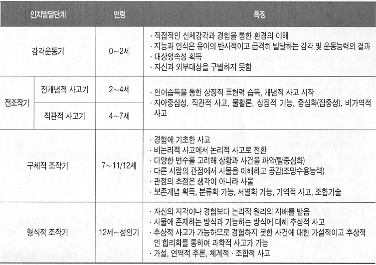
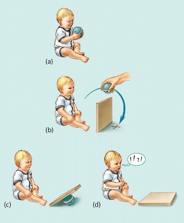

# 가끔 맘카페 보면 드는 생각
**Date:** 1시간 전
**Category:** 다이어리
**Original URL:** https://blog.naver.com/xpfkwh56/224281123547
---

1. **피아제** 라는 사람이 있음

​

발달을 논하기 앞서, 저 사람을 제외하면

​

글자 하나도 쓰기 어려울 정도로

장르에 큰 영향을 미친 사람인데,

​

​

피아제가 위 표처럼 시기를 구분했음

​

2. 아기는 특정 발달 단계에 도달해야,

**'인간'** 과 **'풍경'** 을 구분할 수 있어짐

​

​

**대상 영속성** 이라는 개념도 있음,

​

자기가 갖고 놀고 있던 공을

저렇게 판자로 가려버리면

​

대상 영속성이 없는 아기는

판자 뒤에 있다는 생각 자체를

아예 구조적으로 할 수가 없음

​

3. 새가 막대기를 보고, 엄마새의 부리인지

막대기인지 구분할 수 없는 것과 마찬가지로,

​

아기는 **인지적 한계** 가 있는 상태에서는,

​

겉으로야 사람의 형상을 하고 있지만

실상 사람 보다는 동물에 더 가깝기 때문에

두 가지 개념을 분리해서 대해야 **합리적** 임

​

아기가 운다는 것은, 엄마의 자존감을 터트려

망가뜨리기 위함이 아니고 **그냥** 우는 것이고,

​

대부분은 1차원적인 원시적 불쾌감에 따라

**'반사적'** 으로 하는 행동에 불과하다는 것 임

​

그러나, 거기에 의미를 부여하기 시작하면

이제 육아가 아주 피곤해질 가능성이 올라감

​

4. 내 경우, 1호기가 운다

​

1) 배고픈가?

2) 졸린가?

3) 그 외 어떤 불쾌감이 있나?

​

정도로, 케이스를 분류한 다음

경험적 통계에 따라 우선도를 잡고,

​

솔루션을 제안한다는 식으로 접근함

​

신랑한테 우리 아기는 아주 특수하고,

개별적이고, 특별한, 유일성 있는 존재야

​

고로, **'그에 맞게 대응해야 돼'** 라고 하면

너무나도 당연히 **그럼 너가 해** 하지 않을까

​

**\* 프로토콜이 정립되지 않았으니**

​

입장 바꿔, 내가 남자라고 해도

​

이 여자랑 **'합리적인 대화가 안 통한다'**

라는 생각이 들면 침묵을 먼저 할 듯함

​

**\* 어떠한 문제를 지적한다**

**→ 개인적 공격으로 간주한다**

**→ 말이 안 통한다고 느낀다**

**→ 문제해결 편익 대비, 커뮤니케이션 비용 ↑**

**→ 그래 어련히 너가 하겠지 하고 손 뗌**

**​**

5. 물론 상황에 따라 다를 것이고,

당연 안 해보셨을 리야 없겠지만서도

​

이유식을 먹이는데 애가 자꾸 흘린다,

**치우는 시간이 많이 걸린다** 라고 하면

​

내용 봤을 때 제일 먼저 내가 드는 생각은,

**'입 크기에 비해서, 많이 주는 것 아닐까'** 임

​

아무튼 빨리 먹이고, 내 할 일 하기 바쁘면

사람인 이상 숟가락에 음식물이 커지기 마련이고

​

내 마음과 관계없이 아기 입 크기는 여전하니,

​

먹이는 것 반, 흘리는 것 반 이 될 것이고

결과적으로 일이 더 늘어나는 형태가 될 건데,

​

**아마 진짜 몰라서는 아닐 것이고**,

​

애기 입에 들어가는 음식물 보다

먹인다 자체가 급해, 여유가 없으면

그런 상황이 있을 수도 있을 것 같음

​

**\* 방법의 문제가 아닌, 자원의 문제**

**​**

결국 뭐든 쉽게 갈 수 있는 사람은

쉽게 갈 상황이 되니까 더 쉽게 가고,

​

어렵게 가는 사람은 어렵게 가버릇 해서

더 어렵게 가게 되는 일이 자주 나오는 듯

​

6. 저런 내용을 쭉 보고 나면 솔직한 말루,

​

여자들이 결혼할 때 오밀조밀

조건 따지는 것도 이해가 간다

​

**\* 자원 부족 → 여유 없음 →**

**비합리적 대응 → 갈등/비효율**

**​**

불리한 판에서 내가 얼마나 약해질 것인지 아니까

어떻게든 유리한 고지에서 가고 싶어하는 그 마음