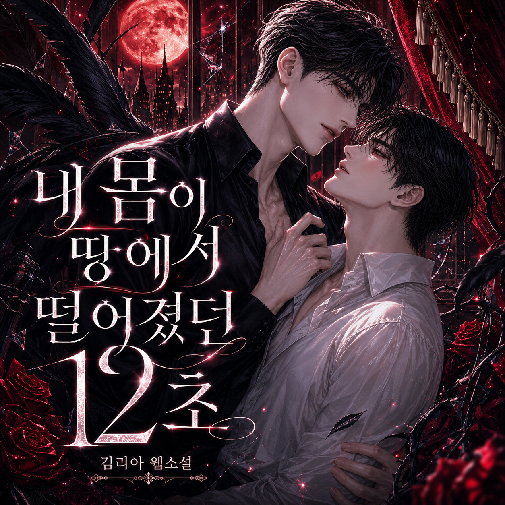

# 내 몸이 땅에서 떨어졌던 12초
**Date:** 1시간 전
**Category:** 행운과 재능
**Original URL:** https://blog.naver.com/xpfkwh56/224312313956
---

​

20세기가 막 열리던 무렵, '하늘을 나는 기계' 는 당대 인류가 꿀 수 있던 마지막 꿈이이었다.

​

그 꿈은 기꺼이 목숨까지 걸고서 도전하던 영역이었다.

​

그리고 그 꿈을 향하는 선두에는 오직 두 팀의 경쟁자만이 존재헀다.

​

그 둘의 출발선의 조건은 너무나 달랐다.

​

한쪽은 새뮤얼 랭글리. 저명한 천문학자이자 물리학자로, 학계의 존경을 한몸에 받는 같은 인물. 미국 최고 권위의 항공 학술기관인 스미소니언 협회의 소장이었다.

​

그가 비행기를 만들겠다고 하자, 미국 정부는 기다렸다는 듯이 5만 달러라는 거액의 지원금을 댔고, 협회 모금까지 더해 무려 7만 달러가 넘는 돈이 그의 손에 쥐어졌다. 시작부터 30억의 캐시가 있었다.

​

어디 내놔도 빠질 수 없는 당대 최고의 두뇌, 정부의 전폭적 지원, 막대한 자금. 누가 봐도 인류 최초로 하늘을 날 사람은 이 사람이다 싶었다.

​

다른 한쪽은 윌버와 오빌.

​

오하이오의 작은 소도시에서 자전거를 고치고 만들어 파는 가게 주인들이었다.

​

둘 다 대학 문턱도 밟지 못한 고졸 학력. 항공 공학을, 유체 역학을 정식으로 배운 적도, 누가 가르쳐 준 적도 없었다.

​

그들이 가진 거라곤 자전거 가게에서 푼푼이 번 돈과, 비행에 대한 열망 밖에 없었다.

​

두 형제가 비행기 제작에 쓴 돈은, 통틀어 1,000달러가 채 안 됐다. 그조차도 개발비가 부족해, 온 가족들이 부업을 해서 십시일반 모아서 지원했다. 그 돈은 랭글리가 쓴 돈의 70분의 1 이었다.

​

7만 달러 대 1,000달러. 박사 대 고졸. 정부 지원 대 자전거 가게 살림. 이 승부의 결과를, 당시 사람들은 의심하지 않았다.

​

그러나 결과는 예상을 정확히 배신했다.

​

윌버와 오빌과 새뮤얼 랭글리의 차이는 보이는 것만 있는 것이 아니었다.

​

두 형제는 '무엇이 진짜 문제인가' 를 다르게 봤다. 당시 대부분의 도전자들은 어떻게 하면 더 강한 힘으로 기계를 띄울까, 즉 엔진과 동력에만 매달렸다.

​

랭글리도 그랬다. 하지만 형제는 자전거를 만들며 깨달은 비밀이 있었다. 자전거가 빠르게 달리는 것보다 중요한 건, 넘어지지 않고 '균형을 잡고 조종하는' 것이라는 사실.

​

그들은 하늘도 똑같다고 봤다. 띄우는 것보다 어려운 건, 일단 뜬 기계를 사람이 마음대로 '조종하는' 것이라고.

​

그래서 그들은 엔진이 아니라 조종 문제부터 풀기로 했다. 모두가 엔진에 몰두하고 있을 때, 형제는 균형을 연구했다. 이 관점의 차이가 모든 것을 바꿨다.

​

그들은 권위를 의심하고 직접 확인했다. 형제는 학자들이 남긴 비행 데이터를 어떻게든 구해서 그대로 따라 만들었는데, 기대와 달리 결과는 어긋나기만 했다.

​

보통 사람이라면 '내가 뭘 잘못했겠지' 하며 권위의 그림자를 믿었을 것이다. 그러나 형제는 의심했다. 어쩌면 그 대단한 학자들의 데이터도, 연구도 틀렸을 수 있는 것 아닐까?

​

그래서 그들은 자전거 가게 안에 직접 작은 풍동을 만들어, 수백 개의 날개 모형을 일일이 넣고 데이터를 처음부터 다시 측정했다.

​

권위자의 답을 외우는 대신, 자기 손으로 진실을 확인한 것이다.

​

그들은 작게, 안전하게, 매우 많이 반복했다. 랭글리는 막대한 돈을 믿고 처음부터 사람이 탈 거대한 엔진 비행기를 만들어 강 위에서 시험했다.

​

실패하면? 곧장 추락이었다.

​

반면 형제는 엔진을 달기 전에, 먼저 동력 없는 글라이더로 바람 부는 모래언덕에서 1,000번이 넘게 활공 연습을 했다.

​

넘어져도 크게 다치지 않는 작은 실패를 수없이 쌓으며, 몸으로 비행을 익혔다.

​

그렇게 충분히 조종을 익힌 뒤에야, 비로소 엔진을 얹었다. 목숨은 하나니까. 결핍은 검약의 어머니다.

​

1903년 12월 초, 랭글리의 비행기가 마침내 오랜 연구 끝에 시험에 나섰다. 7만 달러와 당대 최고의 과학 기술이 집약된 그 기계는, 발사와 동시에 맥도 없이 포토맥강에 처박혔다.

​

그것도 두 번이나.

​

인간이 하늘을 나는 것은 불가능하다.

​

언론은 뉴스를 쏟아냈다. 야유와 조롱이 흘러넘쳤다. 그럼 그렇지, 그럴 줄 알았어, 했제충이 쏟아졌다. 막대한 돈과 명예가, 강물 속으로 무겁게 가라앉았다.

​

그리고 정확히 9일 뒤인 1903년 12월 17일.

​

노스캐롤라이나 키티호크의 황량한 모래언덕에서, 자전거 가게 형제의 '플라이어' 호가 땅을 박차고 떠올랐다.

​

인류 최초의 동력 비행이었다. 그날 형제는 최대 59초 동안 약 260미터를 날았다. 7만 달러가 강물에 빠진 지 9일 만에, 1,000달러가 하늘로 비상했다.

​

그 광경을 그 자리에서 볼 수 있었던 것은 오직 두 사람. 이 시작과 끝의 여정에 단 한 순간도 빠진 적 없던 둘 밖에 없었다.

​

취재의 열기가 넘치는 언론사도, 속보의 현장을 담으려는 기자도 없었다.

​

형제가 이 역사적 소식을 지역 신문에 알렸을 때, 제보를 들었던 기자의 반응은 시큰둥했다.

​

12초.

​

" 12초요? 겨우 그것밖에 못 날았다고요? "

​

12초.

​

그 짧은 12초가, 지금 인류의 모든 비행이 시작된 순간임을, 세상은 한참 뒤에나 알 수 있었다.

​

윌버 라이트, 오빌 라이트. 이 날이 라이트 형제가 인류 최초로 동력 비행에 성공한 날이다.

​

우리는 흔히 성공의 조건을 '가진 것' 에서 찾는다. 돈, 학벌, 인맥, 배경. 그래서 일이 안 풀리면 '내가 가진 게 부족해서' 라고 말한다.

​

자원만 충분하면 무엇이든 해낼 수 있을 것 같다. 그러나 라이트 형제는 가능성을 증명했다. 있으면 좋다, 아니 있으면 '더' 좋다. 단지 그 뿐이다.

​

7만 달러와 박사 학위와 정부 지원을 가진 사람은 강물 속에 처박혔고, 1,000달러와 고졸 학력과 자전거 가게의 형제가 하늘을 날았다.

​

차이를 만든 본질은 자원이 아니었다.

​

남들이 보라고 한대로만 보지 않고 진짜 문제를 다시 자신의 눈으로 정의한 시선, 권위자의 답조차 직접 확인한 뒤에야 따랐던 집요함, 작은 실패를 수없이 쌓아 올린 끈기.

​

이것들은 살 수 없고, 얻을 수 없으며, 누가 대신 해줄 수도 없다.

​

가진 것이 사람을 만드는 게 아니라, 가진 것을 대하는 차이가 사람을 만든다는 것.

​

어쩌면 우리가 스스로를 부족하다고 여기는 그 지점은, 실제 우리에게 필요한 것이 아닐지도 모른다.

​

라이트 형제가, 가진 것이 없었기 때문에 날 수 있었던 것도 아니다.

​

체스판 앞줄에 있는 작은 말을 폰이라고 부른다. 가장 나약하고 흔한 그 폰이 체스판의 끝에 도달하면, 폰은 다른 그 어떠한 기물도 할 수 없는 변화라는 유일한 특권을 누리게 된다.

​

벼슬을 하면 재상, 전쟁에 나가면 장군. 그 차이를 만드는 것은 한낱 껍질이 아니다.