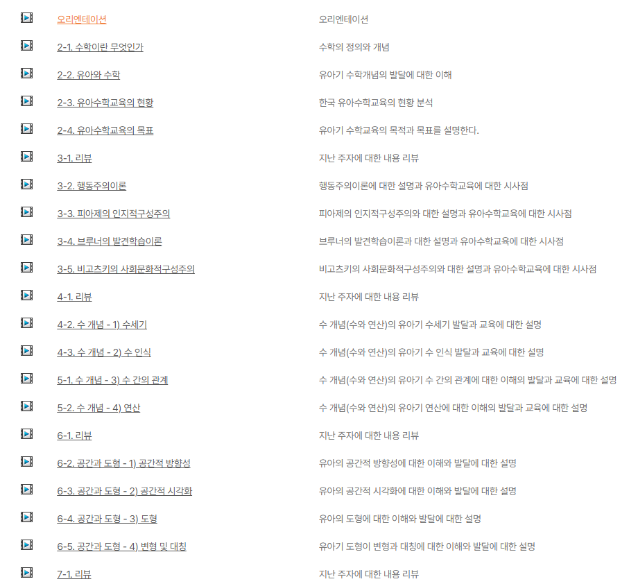
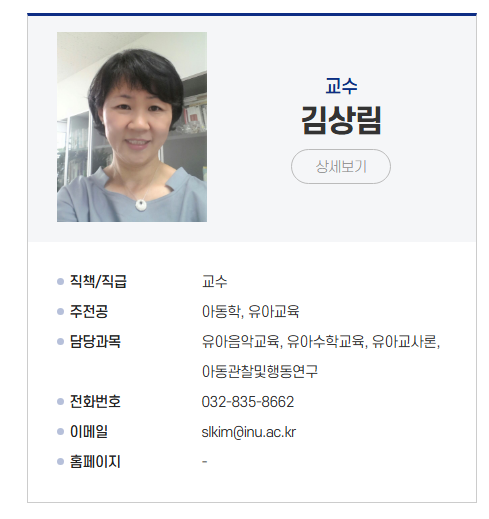
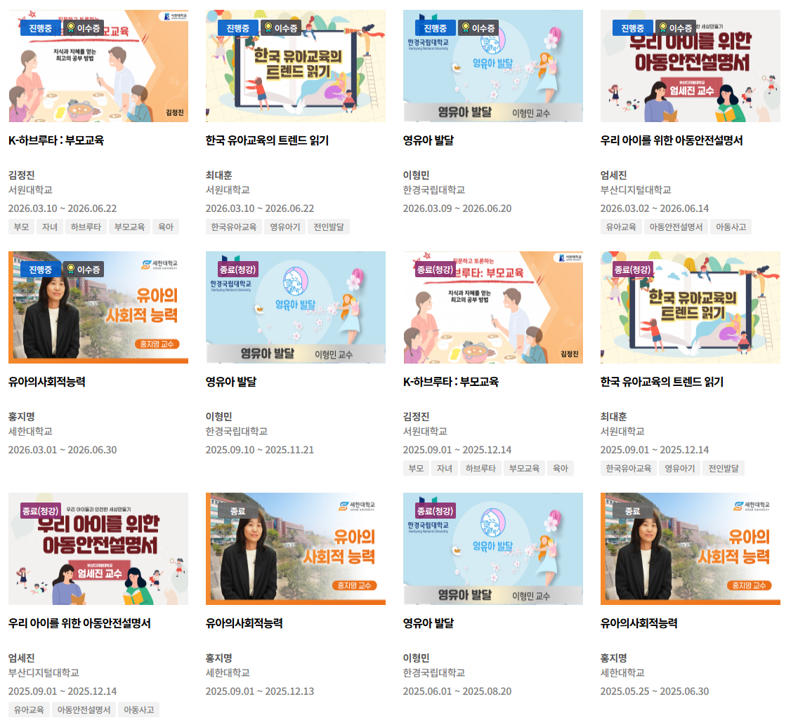
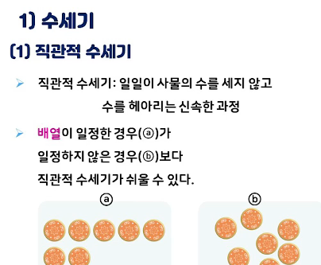
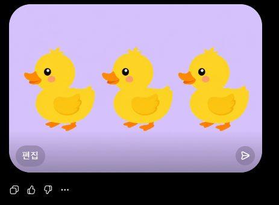
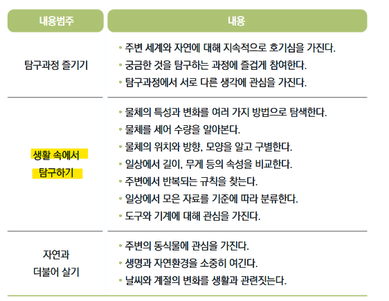
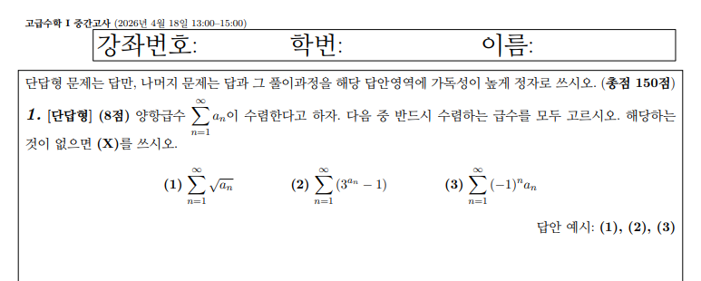

# 수포자 전업 엄마가 돈 안 쓰고 아이 가르치는 법
**Date:** 1시간 전
**Category:** 다이어리
**Original URL:** https://blog.naver.com/xpfkwh56/224295431366
---

http://www.kocw.net/home/search/kemView.do?kemId=1432707

​

1. Kocw 라고 무료로 제공하는

고등교육 플랫폼 들어가면

​

​

인천대학교 김상림 교수님이 올린

유아수학교육 강의(3학점) 가 있음

​

https://www.kmooc.kr/view/course

​

수업 듣다가 중간에 귀찮으면 관둬도 되고,

​

무료니까 이거저거 다 신청해서 넣어놨다가

맘대로 중간에 끊어도 아무런 불이익 없음

​

나라에서 하는 작업이기 때문에,

​

가르치는 사람 **'신원'** 확실하고,

약력 이랑 연구 논문도 볼 수 있음

​

2. 여기서 **'더'** 디벨롭 하는 접근

​

​

유아는 수 세기 과정에 있어서,

**'직관적 수 세기'** 라는 것을 함

​

그래서 아이들한테 수를 가르치는

교구나, 학습지 같은 것을 봤을 때,

​

정배열이나, 오배열, 다양한 배열,

섞인 것들 안에서 다른 것 찾기 등으로

확장해 경험하고, 학습하게 하는 것임

​

**그럼 여기서 무엇을 할 수 있냐?**

​

​

**GPT 한테 그려달라고** 하면 됨

​

본인 얼굴로 해도 되고, 집 안에 있는

사진을 찍어서, 그 사진 풍경 내에서

​

배열을 바꾸거나, 사물을 추가하게 되면

**체험형 메타버스 최적화 교구** 가 탄생함

​

오리를 누르면 오리가 오른쪽으로

고개를 돌릴 수도 있고,

​

클로드로 간단히 프로그래밍 해서,

​

위에 숫자가 10 부터 0 까지

카운트다운으로 내려가게 한 후,

​

10초 동안 오리들이 계속 돌아다니다가

0 되면 배열이 멈추게 구현할 수도 있음

​

**\* 배열이 깨졌을 때, 아이의 직산 능력이**

**여전히 보존되는가? 흔들리는가? 관찰**

**​**

공룡을 좋아하면 공룡으로 해도 되고,

꽃을 좋아하면 꽃으로 해도 되는 것 임

​

누리 과정

​

오리들이 0초가 되면 **'반복해서'**

중앙으로 모이는 것을 보여줄 수도,

​

아이가 **'게임'** 에 익숙해지면

​

중간에 한 마리가 화면 밖으로

숨었다가 다시 나타날 수도 있고

​

무엇이 더 긴가? 어디가 눈인가?

같은 것을 **'태핑'** 하게 할 수도 있음

​

아이와 함께 했던 과정이 있으면

기록으로 남겨서, 옵시디언에 기록하고

​

그 기록 과정에서, 혼자 쓰기 버거우면

AI 활용해서 템플릿 만들고 입력하면 됨

​

이렇게 하면, 엄마가 그 자체로

**'우리 아이 전속 교사'** 로 **기능** 함

​

3. 이런 접근은 두 가지 장점이 **기대** 됨

​

1) **'객관적이고 구체적인 언어로**

**양육자의 고민을 해결해낼 수 있음'**

​

우리 아이는 수학이 약해요

​

미적분을 못한다는 것인지,

**'수학'** 이라고 풀어서 질문하면

​

그래서 애가 뭘 못한다는 것인지

대답하는 사람은 알 수가 없음

​

실수가 많다, 산만하다,

문제를 꼼꼼하게 못 본다,

응용이 안 된다,

​

이런 **'진단'** 으로 끝나버리면

​

다음에는 열심히 해봅시다 정도의

결론 밖에는 얻을 수 없게 될 것 임

​

2) **'양육 기술'** 이 훈련 됨

​

유아 발달에서 지대한 영향을 미친

피아제는 자신의 딸들로 이론을 씀

​

딸들이 성장하는 과정을 세밀하게

관찰하고 기록하여 아동의

지능 발달 단계를 체계화 했고,

​

**\* 물론 선은 잘 지켜야겠지만**

​

첫째 딸 루시엔느가

좋아하는 시계줄을

​

성냥갑 안에 숨겼을 때,

그걸 찾으려는 행동하는 방식을 관찰해

**대상 영속성** 의 존재를 도출함

​

디테일한 노하우가 많이 나오면,

그걸 갖고 자기가 어찌 쓰든 **자유** 임

​

아동 발달 관련 사업을 해볼 수도 있고,

교육 사업을 해볼 수도 있으며,

​

그게 아니더라도,

**'기술'** 은 안 사라짐

​

4. 무엇보다 이 과정에서,

**'교육비를 덜 쓰게 됨'**

​

​

위 문제는 26년 4월,

​

서울대 수리과학부

고급수학 1 중간고사 문제임

​

서울대는 **'국립'** 대학교 이기 때문에,

​

공공성을 강조하는 과정에서

​

커리큘럼이나 학제, 교육 자료들을

외부에 개방적으로 제공하는 편인데,

​

일단, **'나는'** 이런 커리큘럼과

공개된 시험 문제를 기반으로

​

역공학 해서 내가 내 아이한테

무엇을 가르칠 수 있고, 그게 1호기한테

​

어떤 의미를 갖는지, 어떤 **'역량'** 을

키워줄 수 있는 것인지 고민하는 일이

저렴하고 목적에 부합한다고 보는 편임

​

양항급수가 뭔데요? 를 아는 것은 **'쉬움'**

​

양항급수 라는 글자 자체를

아예 **'본 적 없을 때'** 가 문제지

​

자본주의 교육, 미래 교육, 창업 교육,

경제적 사고, 같은 말이 먼 말이 아님

​

**'오늘'** 그렇게 살고 있으면 됨