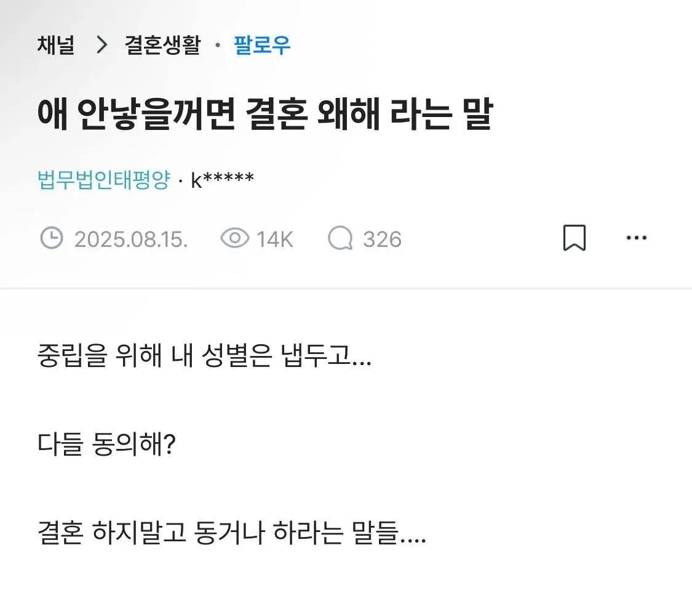
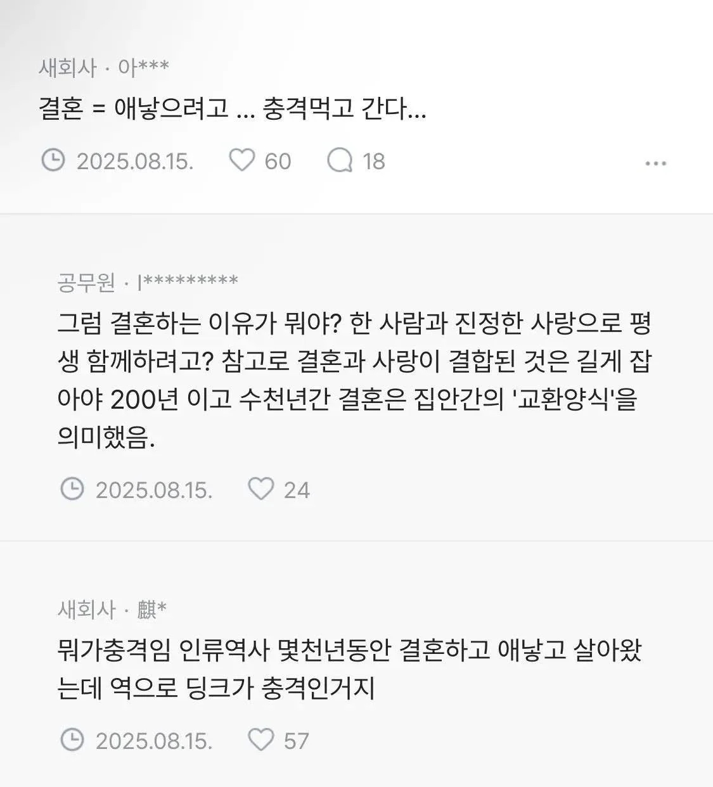
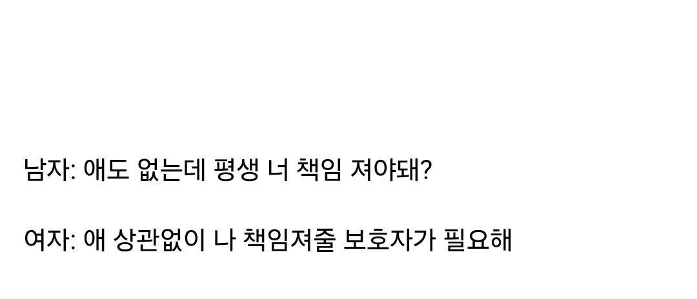

# 애 안 낳을꺼면 결혼 왜 해? 에 대하여
**Date:** 1시간 전
**Category:** 다이어리
**Original URL:** https://blog.naver.com/xpfkwh56/224268590188
---

​

결혼 왜 함?

​

**'너랑'** 가정을 꾸리고 싶어서

​

아이 왜 갖고 싶음?

​

1) **'우리'** 닮은 아이가 있었음 해서

2) **'너랑'**, **'같이'** 키우고 싶어서

​

돈 드는 일도 아닐 뿐더러 대개

**세 단어** 만 잘 써도 쉽게 감니다

​

오, 그게 여심을 낚는 마법의 멘트? (x)

내 감정을 확신하게 만들어주는 말 (o)

​

**\* 아주 중요한 개념 임니다**

​

애도 없는데 평생 너 책임져야 돼?

나 평생 책임져줄 보호자가 필요해

​

이런 말은 해봤자 본전도 못 찾아요