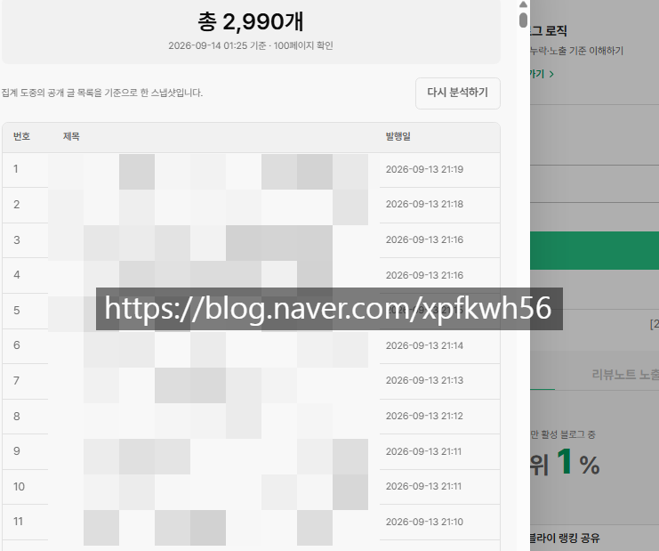

# 욕심 버리구 차근차근 하세욘
**Date:** 1시간 전
**Category:** 스냅
**Original URL:** https://blog.naver.com/xpfkwh56/224410647261
---

​

자동화 업자들 이런 블로그를

열댓개씩 굴리는데 어케이김ㅋ

​

**\* 네이버에서 열심히 잡으면**

**저 레코드가 안 나오겠쥬?,,**

**​**

**물론 길어야 3개월 봅니다만**

**​**

저는 담이 짝아서 저렇게는 안 하고

살금살금 돌리는데, 초보면 큰 욕심 없이

​

그냥 취미블로 알아서 네이버가

알고리즘 잡아줄 때까지 하는 것이 답

​

인터넷 뒤적거려봐야 쿠세만 생기지

걍 본인 소신껏 하는 것이 차라리 나음

​

그리고 이 바닥은

기술이 돈이 아니구,

​

**정보가 돈** 임

​

문제는 내가 직접 해보기 전까진

절대 절대 정보의 가치를 알 수 없음

​

1) 정 빨리 벌어야 되면 급여를 받자

2) 시간적 여유가 되면 영업을 하자

​

**\* 온라인 마케팅 = 온라인 영업**

​

3) 채널 키워서 수익 먹고 싶으면

벌든, 못 벌든 6개월 1년은 봐야 됨

​

그 사이에 들어오는 돈은 의미도 없음 ,,

​

인생 바꿀 돈 버는 것도 아니고,

그게 유지된단 보장도 없어서