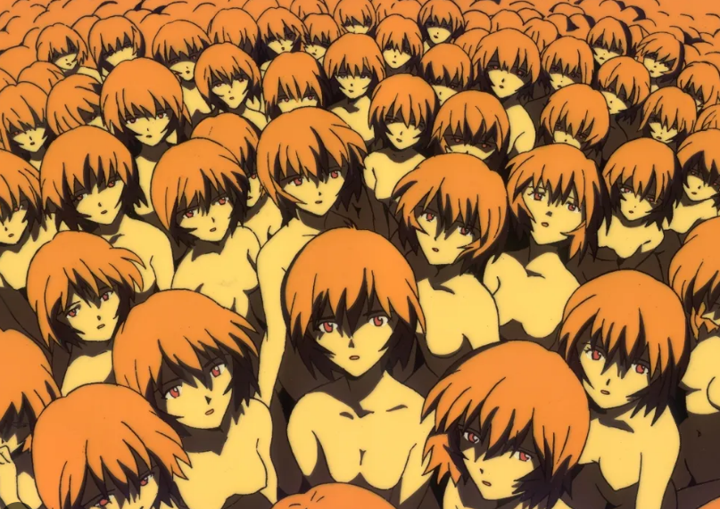
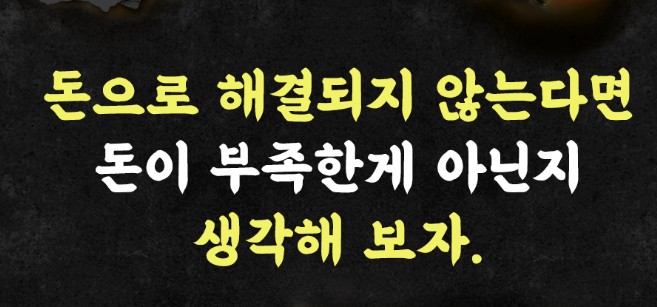
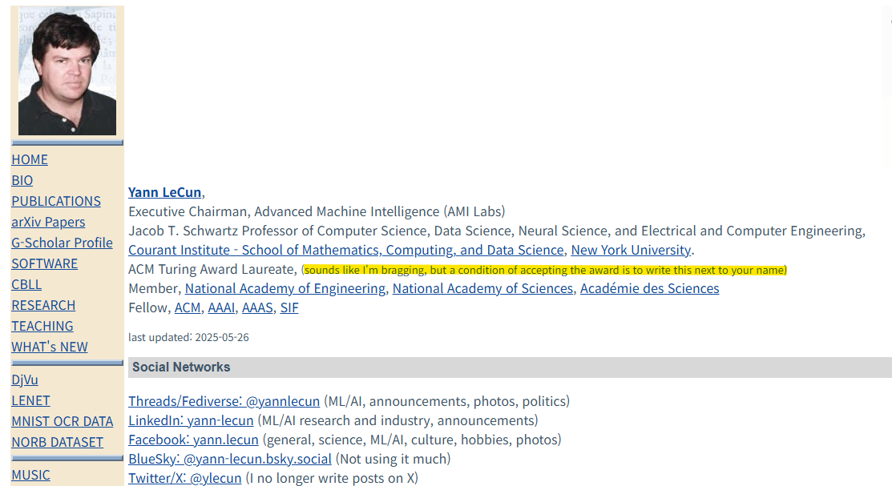
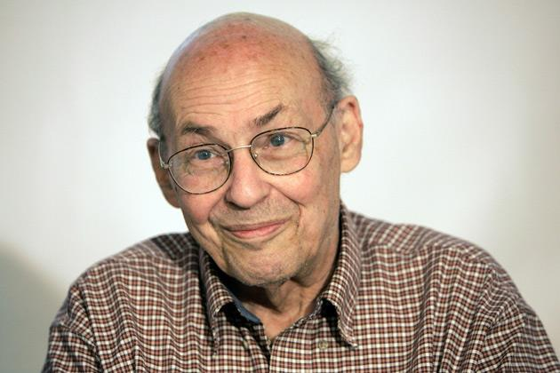
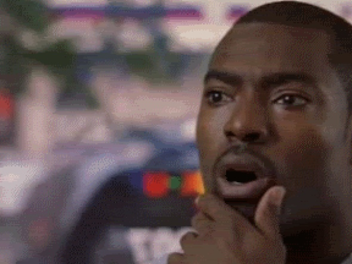

# 인공지능은 어디서 어디로 가는가?
**Date:** 1시간 전
**Category:** 다이어리
**Original URL:** https://blog.naver.com/xpfkwh56/224189987534
---

1. 인공지능이 뜨거움

​

또 우리가 좋아하는 것이 최정점,

​

그래서 제일 **핵심 중에 핵심**

대개 이런 것 아니겠읍니까

​

그럼 이 뜨거운 장르에서,

**에센스** 는 어디에 있을까요

​

사람마다 그게 뭐냐, 하면 다양하겠지만

제가 생각할 때 제일 큰 문제는 따로 있음

​

2. 바로 **'재현성'** 임

​

모든 인공지능은 다음에 나올 토큰을

특정 확률로 가중해서 뱉는 **자판기** 임

​

쟤는 뭔 생각을 하는 것도 아니고,

​

대단한 판단을 하는 것도 아니고

그냥 그 확률이 높으면 그렇게 함

​

그래서 인공지능에 데이터, 모델링,

도메인이 최고로 중요한 것임

​

들어간 데이터가 쓰레기다?

그럼 100% 쓰레기가 나옴

​

모델링이 쓰레기다? 마찬가지고,

도메인이 쓰레기다? 마찬가지임

​

마치 원판 불변의 법칙 같은 것임

​

**\* 내가 뒤통수에 파지 않는 한,**

**장원영 얼굴이 나올 수 없듯이**

**​**

3. 이 재현성 문제라는 것은,

우리를 오히려 **'착각'** 하게 함

​

어떤 사람이 있는데 A 도 할 줄 알고,

B 도 할 줄 알면 우린 당연하게도

C, D 도 능숙할 것이라고 가정을 함

​

근데 알고보니 A 밖에 못 한다면?

심지어 그게 **끝** 이었다면?

​

유망하다는 말에 비해서,

원리는 다소 터무니 없는데

​

**'정확히'** 인류는 인공지능이

어떤 원리로 이게 되는지 모름

​

과장이 섞인 설명일 수도 있지만

​

**어? 엄청 크고 많은 GPU 를**

**엄청나게 많이 연결 하니까**

**추론도 하고, 똑똑 해지더라**

**​**

솔찌 이 정도 수준으로만 알고 있음

​

컴퓨터 1개로 했을 땐, 이랬는데

2개 넣고, 3개 넣고 4개 넣으니까

​

더 똑똑해졌어, 왜 그런 줄은 몰라

근데 100개, 1000개 넣으니까

더 똑똑해, 1만개 넣으면? 10만개?

**​**

**그건 몰라! 근데 더 커지지 않을까?**

**​**

하다가 나온 것이 **지금 상태** 임

​

4. 제가 로컬로 가야 된다고

항상 자신있게 떠드는 이유도

​

이게 원리를 알면 구조적으로

**틀릴 수가 없는 말이라서** 임

​

컨텍스트 윈도우 하드캡을 상용 채널은

소비자에게 일정 한도 이상 줄 수 없는데,

​

조금 더 쉽게 말하면, 지피티를 하시든

제미나이를 하시든, 무슨 서비스를 받든

​

그 대화의 컨텍스트가 연결되는 것은

**무슨 대단한 기술이 있어서** 가 아니고,

​

**'전체 대화를 통으로 계속**

**어딘가로 호출하고 있어서'** 임

​

즉, 사용자와 인공지능이 대화를 하면

​

당연히 사용자는 인공지능이

**'연속체'** 라고 느끼잖아요?

​

아야나미 레이가 1명이 아니었다?

​

근데 실체는 대화 할 때마다

계속 바뀌는 인스턴스 에요

​

기업에서 제공하는 사용자 한도는

정해져 있으니, 이걸 남길 수 없음

​

근데 로칼로 넘어가면?

​

대화 전체는 물론 모든 기록들을

전체 히스토리로 남기고,

​

계속 그걸 연결해서 남겨낸다면,

​

**'연속된 기억'** 이 있는 인스턴스처럼

더 정교하게 스티칭 해서 쓸 수 있음

​

그럼 완결된 기록이 있는 생물처럼

**느껴지게** 만들어 내는 것이 가능해짐

​

슬슬, 느낌이 오시나요?

​

제가 대부분의 상용 인공지능 서비스가

가격이 비싸질 것이라 **확신하는** 이유는

​

이걸 당연히 **'돈'** 으로 밖에

해결할 수 없어서 입니다

​

사실 원리는 아주 간단한 문제에요,

소비자에게 하드캡을 더 주면 됩니다

​

지불 여력이 있는 사람은 쓰고,

없는 사람은 못 쓰게 되겠지요

​

홍두깨살 사다가 집에서 건조대에

육포 넣으면 싸면 싯가 1/10

못 먹어도 1/5 에 산더미로 먹음

​

지금도 렘값 오르니까 가내 수공업으로

​

집에서 만들어서 찍어 쓰는 마당에,

나중에 어떻게 될 것인지야 뻔하죠

​

이건 예측이 아님,

​

당신은 500년 안에 죽는다

라는 말이 예측이 아닌 것처럼

​

5. ?아니 이해가 안 갑니다

​

10조, 100조씩 덜컥덜컥

박히는 저 초대형 시장에서,

​

**그 간단한 문제도 못 푼다구요?**

​

간단한 문제가 아니라,

​

인간한테는 당연한 성찰이나,

메타인지, 일반화 같은 것들을

​

컴퓨터가 **'흉내'** 내는 것 자체가

신비롭기 그지 없는 일입니다

​

아닌 말로 **'동등'** 하드웨어를 가진

인간들 사이에도 저게 흔한 건 아님

​

**\* 하고 싶다고 다 되는 것도 아니고**

**되는 사람이라고 맨날 되는 것도 X**

**​**

**믿기 어렵지만, 인간들 사이에서는**

**간혹 서로에게 메타인지 를 하라든가**

**자기 객관화 를 하라고 떠들기도 함**

​

6. 이런 저런 시도가 이루어지는데,

그냥 제 기준으로 구분하면 크게 둘임

​

**1) 스케일링파**

​

데이터센터 왕창 짓고, GPU 막 넣으니

원리 그런 건 모르겠는데 일단 똑똑해졌다

​

GPU 10만개 넣을 때보다 100만개 넣으니

10배 똑똑하진 않지만, **'뭔가'** 더 똑똑해짐

​

스케일링을 하면 좋아진다 → 팩트

하면 할수록 수확체감이 커진다 → 팩트

​

돈과 GPU를 퍼부어라, 그러면 신(AGI)이 나올 것이다

​

근데 수확체감이 커지면, 그에 맞는

더 많은 돈을 넣으면 되는 것 아닐까?

​

**이거에 그렇게 해서 되겠냐?**

라고 반박하던 사람도 많았는데,

​

**\* 방법이 너무 무식하잖음**

​

정말 더 많이 넣으니 더 나아져서,

회의적인 사람들도 다 입을 닫았음

​

젠황이 **운이 기가 막힌 사람인 이유**도,

​

본인이 만든 게임용 글카가

인공지능에 이렇게 쓰일 줄은

본인도 만들 땐 몰랐을 것임

​

**\* 원래 용산 와서 글카**

**프로모션 하고 그러셨음**

​

자본은 거짓말을 안 한다고,

몰리는 이유가 있지 않을까요?

​

**합디다, 그것도 꽤 자주요**

​

자율주행, 메타버스,

양자컴퓨팅, 블록체인, Web3

​

전부 **수백조** 들어간 산업 입니다

​

자본은 **'가능성'** 에 움직일 뿐

정답지를 제시하는 존재 아님

​

**내일 갑자기, 어? 멈췄다!**

**이제 더 안 똑똑해진다!**

​

하는 순간, 빅테크 주가는 **터짐**

​

> 설마 그럴리가요?

​

지난 역사상, 인공지능 버블은 2회 있었음

​

그리고 지금 우리가 겪고 있는 것이 **3차** 고,

이게 버블인지, 아닌지는 끝나봐야 알게 됨

​

결과가 어떻게 나오든, 세상은 바뀜

​

꽤, 크게

​

**2) 월드모델**

​

<http://yann.lecun.com/>

​

저게 뭔가요?

​

**얀르쿤** 이라는 아저씨 블로그인데

​

저 사람이 이름값만 갖고

약 7천억 가량 투자 받았고

​

현재 **5조 벨류** 기업 대장임

​

> 스캠임?

​

흠 ,,

​

인공지능 혐오론자의 대부

​

때는 1960년대 말,

​

당시 MIT 의 AI 대가 마빈 민스키는

신경망의 수학적 한계를 증명함,

​

단층 신경망은 고작 간단한 문제 하나도

풀 수 없다는 것을 **명백히** 증명해낸 것임

​

이 증명은 사실 굳이 굳이 따지자면

단층 신경망에만 해당된 것이긴 했는데,

​

당시 신경망 전체가 불가능하다는

해석으로 확장된 경향이 있었고,

​

극단적으로 표현하면 저 책 한 권 때문에

미국 정부가 신경망 연구를 싹 끊고,

AI 펀딩이 전부 전멸하면서 1차 겨울이 옴

​

오죽하면 1/2차 겨울 시기에는,

AI 라는 표현 자체가 **금기** 였음

​

성공팔이, 스캠 서사가 하도 많으니

사람들이 기출화 했던 것과 유사한 느낌

​

얀르쿤이 CNN을 만든 것이 89년,

정확히 이 2차 겨울의 **한복판** 임

​

모든 사람들이 다 안된다고 했고,

이미 불가능하다고 다들 말했었는데

​

**89년** 에 **CNN** 을 만들어냈음

​

CNN 이 뭔가요? 이미지에서

특징을 자동으로 뽑아내는 신경망 구조

​

이 픽셀 패턴이 눈이다, 코다, 원래

사람이 전부 규칙을 다 짜야 했는데

​

CNN 은 이미지를 넣으면

특징을 **알아서** 학습함

​

**\* 이, 알아서 라는 것이 엄청난 것**

**​**

원리 역시 신박하기 그지 없는데,

​

커널이 이미지 위를 슬라이딩 하면서 훑고,

레이어 단위로 층층히 네트워크를 쌓아서

층층히 거기에서 정보를 쌓아올리는 것임

​

**\* 말은 쉽지만 ,,**

**​**

모든 이미지 생성 모델은 **U-NET** 과

**VAE** 라는 개념이 없으면 성립 안 되는데

​

그걸 이루고 있는 원리가

저 사람이 만들어낸 것임

​

그걸 언제? **89년에 만든 인간** 임

​

AT&T Bell Labs 에서 일하고 있었는데,

사람들이 자꾸 개발새발로 글씨를 쓰니까

​

좀 알아서 교정해줄 수 있는 것 없을까?

하나씩 교정하는 필터 찾기 너무 어렵다

​

하다가 나온 기술이,

​

오늘날 사람 눈/코/입 에서

의류의 디테일 텍스쳐는 물론

​

일상적으로 사람들도 편하게 썼던

지브리 필터까지 도달하게 된 것임

​

얀르쿤이 만든 기술은 미국에 있는

수표 **'10%'** 를 읽었다고 알려져있고,

​

메타 AI 수석 과학자 출신으로 일했음

​

**\* 기술만 갖고,**

**탑티어 빅테크 에서**

**부사장 먹은 사람**

**​**

블로그 들어가보면 이름 쭉 있는데,

​

아래에 있는 **'모든'** 이름들이

AI 업계에 있는 **'올스타'** 들임

​

**\* 국가권력급 천재란 소리임**

​

이 사람이 보는 미래는 뭐냐?

​

LLM 을 아무리 키워도, 니들이 생각하는

그런 초지능 인공지능(AGI)?

​

때려 죽어도 안 나온다

백날 해봐라

​

답은 **'JEPA'** 다

​

LLM 은 다음 토큰을 예측해서, 뽑아내는 것인데

JEPA 는 추상적 표현 공간에서 예측하는 아키텍처임

​

무슨 차이가 있냐?

​

아기가 물건이 떨어지는 것을 보고,

자유롭게 이것저것 손으로 치면서,

중력을 직관적으로 이해하는 것처럼

​

물리 세계에 있는 규칙을 관찰로 배우는

근본적인 구조로 모델을 생성해야 된단 것임

​

그게 **'진짜'** 인간의 지성을 구현할 수 있는

신이 빚어낸 공식이라고 주장하고 있음

​

우리는 팔이 몇 각도로 굽었다,

중력 가속도가 어떻다 다 모름,

​

근데 굽었다는 것은 알음,

그게 상하좌우, 어딘지도 앎

​

중력 가속도 모름, **근데 알음**

​

대단한 미학 이론을 알지 않더라도

​

예쁜 것은 예쁘다고 알고,

추한 것은 추하다고 알고 있음

​

이런 생득적이고, 선험적인 것들을

컴퓨팅 하는 것이 본질이라고 주장함

​

**\* 100% 정확한 설명은 아닙니다**

**​**

​

구글 딥마인드 팀의

Genie3 도 비슷한 방향임

​

아니, 신이 답안지를 줬는데

**왜 대체 안 보고 하냐?** 이거임

​

그래서 뭐 나오긴 나왔나요?

​

<https://labs.google/projectgenie>

[**LABS.GOOGLE**

Stay up to date with the latest Google AI experiments, innovative tools, and technology. Explore the future of AI responsibly with Google Labs.

labs.google](https://labs.google/projectgenie)

​

뭐가 일단 나오긴 나왔는데,

뭘 보든 **음, 그렇구나 레벨** 임

​

**\* 약 1개월 전에 나온 기술**

​

물리법칙이 돌아가긴 돌아가는데,

​

단순해서 그냥 엔진이랑 무슨 차인지

사실 잘 실감하기는 어려운 정도고,

​

**\* 레데리가 더 나은 것 같은 느낌?**

​

앞으로 뭐가 될 줄은 아무도 모르지만

**갈 길이 멀구나**, 라는 느낌은 확실함

​

7. 내 생각

​

내 솔직한 생각은 ,, **필요 한가?** 임

​

아니 걍 지금 나온 것만 다 잘 써먹어도

이게 말이 안 되는 것이 한 둘이 아닌데,

​

1/2차 겨울시기처럼 냉각기가 온다든가

버블이 터져서 아예 뭐 싹 사라진다 든가

​

그런 것이 별로 와닿는 이야기는 아님

​

**'지구'** 를 시뮬레이션 하는 것은

아마 높은 확률로 불가능 하겠지만

​

**\* 우주는 말할 것도 없고**

​

작게는 동네 하나, 더 좁게는

우리 집 하나 쯤은 **걍** 된단 말임

​

그럼 한낱 소시민인 내 입장에서는

알빠노로 뭐가 되든 상관은 없지만,

​

빅테크도 결과 안 나오면 뒤가 없음 ,, 뭐가 나와야 됨

​

적어도 스케일링 한계에 직면했다는

자체는 부정하기 힘든 **정배** 같고,

​

신기술 보다는 **따거식 최적화** 쪽으로

흐름이 간다는 쪽이 타당하게 느껴짐

​

**\* 선강퉁 후강퉁 중국 주식**

**여유 되면 예습들 해두세욬ㅋ**

**​**

**국장 AI 관심 있으시면 돈 보다는**

**애국한단 마음으로 지르시구욬ㅋㅋ**

**​**

따거식 최적화는 뭔가요?

​

그거슨 기회가 되면

다음에 다루어 보겠음

​

여기도 괴물들이 한 둘이 아님

​

서구권 인공지능의 역사가,

**'셰프'** 이야기라면

​

**\* 어느 집 냉장고에나 있는**

**라 본네트 감자를 꺼내세요**

**없다구요? 농담이죠?**

​

따거 인공지능의 역사는,

**백종원 스타일 프차 느낌** 임

​

**\* 집에 뭐가 없어유? 괜찮아유~**