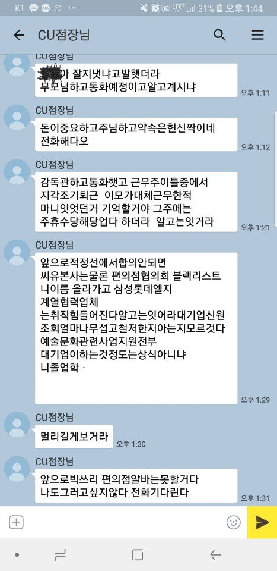
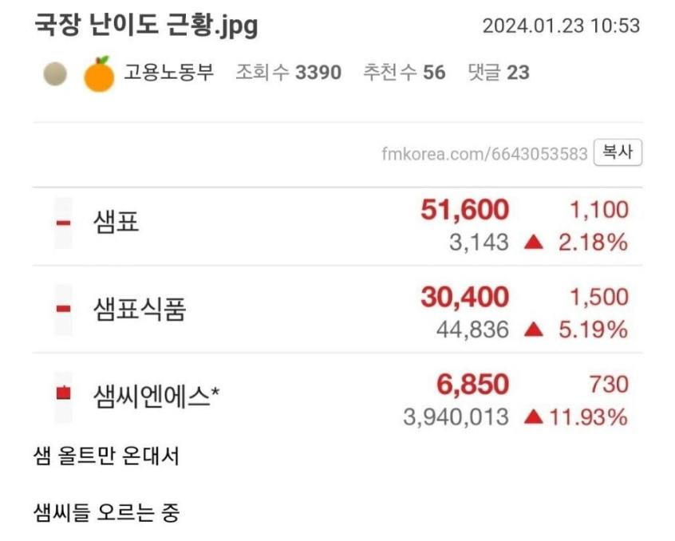

# 질문 답변
**Date:** 1시간 전
**Category:** 다이어리
**Original URL:** https://blog.naver.com/xpfkwh56/224267352466
---

**1. 회사에서 좋은 평가를 받고 있어요**

**포상을 받았습니다, 여윳돈 생겼어요**

**어디에 투자를 하면 좋을까요?**

​

예전에 루프탑 라운지에서

알바를 했던 적이 있음

​

일을 하다 보면 어느 날에는

누가 선물도 주고, 그러다 보면

​

금전적 가치로 바꿀 수 있는

실질적인 보상도 있을 때가 생김

​

요즘은 모르겠는데, 제가 한참

알바를 하고 다녔을 시절에서는

​

**홀/주방** 이 두 파벌로 갈렸음

​

대개 고인물들은 주방에 들어갔고

신입들이 홀에 있는 경우가 흔함

**​**

**왜 why?**

​

홀은 고객들을 계속 접하기 때문에

직원들끼리 수다도 떨 수 없고,

​

어디 앉아있는다 이런 것도 불가능

​

서로 편의를 봐준다고 해봐야,

너 불렀는데 내가 갈게 정도 임

​

반면에 주방은 일단 독립 공간이라

두런두런 호흡에 맞게 일할 수 있고,

​

비교적 **'예측 가능한'** 사정 안에서

근무를 할 수 있는 경우들이 있었음

​

그게 뭐라고, 고 판에 들어가 있으면

​

누가 꿀을 더 빠네, 더 고생을 하네

따지는 상황이 있을 수가 있기도 함

​

호호, 어차피 검증도 불가능한 얘기지만

​

저는 좋게 보면 꽤나 이쁘장한 편이고

자체 검증으로는 그냥 평범하게 생겼음

​

그래서 남자 2테이블, 4테이블 손님 오면

장난을 빌미 삼아 빤히 찝쩍거릴 때도 있고,

​

**\* 그 나이대 남자들은 대체로**

**여자라면 다 좋아하기도 하니까**

​

바빠 디지겠으면 귀찮으니 걍 번호주고

차단하는 것이 빠른 그런 때도 있는데,

​

요러면 기프티콘이나, 상품권 같은 것을

따로 보내주는 경우들도 종종 있곤 했음

​

그럼 이럴 때, **'어떻게'** 대응하면 좋을까?

​

그저 제가 하고 싶다고

늘 되는 것은 아니겠지만

​

지향하는 사회생활

기본 철칙 중 하나는,

​

내 생업 바닥에 있는 사람과

**괜히** 척 지거나 적 만들지 않는다 임

​

사람의 성과나 역량은 막상 보면

그렇게 큰 차이가 있지도 않음

​

하물며, 제가 종사했던 영역들의 경우

​

험하게 말하면 개든 소든 누구든지

그냥 와서 할 수 있는 일이기 때문에

​

잘한다 보다 **못하지 않는다** 가 더 낫고,

​

20대 초반이 붐비고 있는 업종의 경우

​

남자든, 여자든 할 것 없이

모든 말에는 다리가 달려서

​

정신 차리고 보면 등신이 되거나,

더 이상 근무를 지속할 수 없는

그런 상황이 나타날 위협도 있음

​

자체 진단으로 저는 아싸 기질이 있고

​

퇴근 후, 또는 주말에 사람들끼리

목질을 하는 것도 어려웠기 때문에

구설에 올라가면 위험하다 판단함

​

그래서 뭐 하나라도 어떻게 내가

원래 응당 가져도 될 것이 아니면

​

**\* 쉽게 말해, 먹을 견적이 안 나오면**

​

전부 그걸 **'우리의 공'** 으로 돌렸음

​

일을 하는데 먹으라고 베스킨라빈스

케이크를 줬다, 그럼 고대로 주방에

놔두고 받았으니 같이 먹자고 했음

​

기프티콘을 보내주면, 같이

나눠먹을 수 있게 처리 했음

​

케이크 같은 사례로 들면,

이건 **'내가'** 받은 것이니까

​

주방에 모셨다가 집에 가져갈 때

그냥 가져가도 문제가 될 건 없음

​

근데 그렇게 하면 **'더'** 손해 임

​

이후에, 회사에 취업을 했을 때도

늘 더 일찍 가고 더 늦게 퇴근했지만

​

**'쟤는 저렇게 열심히 하는데,**

**너는 뭐 하니?'** 라는 아웃풋이

나오지 않도록 매우 노력했음

​

사람 하나 올려놓는 것은 어려워도,

**발목 잡고 내리긴 아주 쉽기 때문** 임

​

이런 얘기 하는 사람 만나면 그냥 차단 박으시고요

​

상황이 다를 순 있지만,

제가 만약 질문자 분이라면

​

회사에서 받은 포상으로

저축을 하든, 주식을 사든,

요긴하게 쓰는 것도 좋지만

​

거기 **'좀 오래'** 계실 것 같으면

​

**사수한테 가르쳐 줘서 고맙다**

**동료한테 많이 도와줘서 고맙다**

**그 외 덕분에 잘 해나가고 있다**

​

라는 식으로 일단 푸시는 것이 좋을 듯

​

세상에는 1원을 써서,

10원을 버는 거래들이

​

생각보다 많은데,

​

무슨 주식을 살 생각이신진 몰라도

저거로 얻을 것이 그보단 손익비 좋음

​

**\* 기댓값이 높은 선택을 먼저 하고,**

**그걸 다 하고 난 다음에 낮은 것을**

**​**

해보면 별것도 아닌데,

​

잘못은 내 탓으로 돌리구

공은 공동으로 돌리면

​

적은 줄어들고 편은 많아지고

​

불필요하게 에너지를 쏟을 일이

많이 감소할 기회가 생기기도 함

​

투자는 뭐 샀다 팔았다 해서

이익 보는 것에만 적용되지 않으니

​

내가 하는 업무, 가족, 나

이렇게 3개 부터 보시고

​

그 다음에 찬찬히 보셔도 안 늦을 듯

​

이미 내가 **'받았다는 것'** 을

공공연하게 알고 있고, 하물며

​

**'못 받은 사람'** 들이 빤히 있고

걔네를 맨날 봐야 되는 상황이다

​

원래 내 손에 있다고 다 내 돈은 아니니,

잘 고민 해보시고 커피라도 돌려보세요

​

엄마가 세뱃돈 봤는 것을 보았다면

어떤 형태로든 그게 미래에 반영됩니다

​

**2. 큰 욕심은 없고, 원금 보장 선에서**

**무리하지 않고 재테크 해보고 싶다**

​

주식 계좌 파셨을 때, 가물가물

하시겠지만 본인 성향 쓸 란이 있음

​

원금이 보장되는 금융 상품은

지극히 제한적이기 때문에,

​

1) 예적금 같은 것들

2) 채권 정도 보시면 됩니다

​

주식을 하면서, 원금 보장 원한다

이거는 첫 단추 부터 틀린 것임

​

**다 잃어도 되는데, 10배 만들어줘**

**같은 사람들이 주식을 해야 되고,**

​

안전한 주식이니, 경기 방어주니,

우량주니 다 못 믿을 이야기니까

​

**\* etf 무한 매수법 어쩌고 저쩌고도**

**사람들이 멍청해서 인내심이 없어서**

**​**

**그걸 못 하는 것이 아니고 그거를 해서**

**안 죽은 애들 얘기만 보셔서 그런 것임**

​

생각 있으시면 이자 많이 주고,

파산 리스크 없는 은행권 보시고

​

거기서 여의치 않으면,

채권 파트를 보심이 낫습니다

​

내 주식이 어디까지 올라갈까?

앞으로 바닥은 어디에서 형성될까?

​

**채권은 이 고민을 덜 할 수 있어요**

​

예금, 채권, 주식 구분이 아직

직관적으로 딱딱 안 떠오르면,

​

주식 공부 하신다고 해봤자

여기저기 돌아다니면서

​

잡지식 + 가십 + 뉴스 뜯기

이 정도 하게 될 확률이 높아요

​

**\* 며칠 전에 봤던 뉴스랑 연결해서**

**휴리스틱으로 피터린치 코스프레**

**​**

네러티브/인사이트 투자로 흥하는

사람의 숫자도 물론 없지는 않은데

​

그건 원래 그 사람이 갖고 있던

감각이 잘 발현된 사례에 가깝지

​

뭐를 배워서 했다고 보기는 어려움

​

하물며, 국내 재테크 판에 교묘히 깔린

반지성주의 문화도 있긴 있기 때문에

​

**\* 그거 안다고 돈 땀?**

**그래서 돈 땀? 얼마 땄음?**

​

할 생각이 있으면 **'혼자'** 하시고,

차분하고 길게 오래 보세요

​

내가 지금 들고 넣으려는 자릿수에서

0 하나, 둘 더 붙인 상태에서라도

​

​

나는 똑같은 의사 결정을 할 것이다

남의 돈이라도 나는 이렇게 한다

​

라는 생각 정도는 들고 해야 좋을 듯요

​

**그래서 뭐 사냐고요**

**​**

제 경우, 지금 기준으로는

도저히 하나도 모르겠어서

**​**

**\* 국장이 6천?? 7천???**

**나스닥이 내일 모레 2.5만???**

**​**

한참 사지도 팔지도 않고 가만히 놔두고

애 키우고 AI 하면서 보내고 있습니다

​

좋게 보는 것도 없지는 않은데,

카피 매매해서 서로 좋을 것이 없고

​

투자 자체가 벌기는 다들 많이 벌어요

​

**\* 적어도 생각하시는 것보다**

**그리 무지무지 어렵지도 않음**

**​**

그거 출금해서 **'진짜 돈'** 으로

꺼내는 사람이 많이 없을 뿐