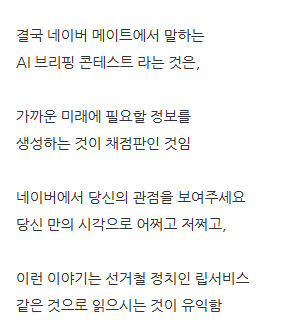

# 훠훠 제가 말씀드렸잖음니까
**Date:** 1시간 전
**Category:** 다이어리
**Original URL:** https://blog.naver.com/xpfkwh56/224307379335
---

https://blog.naver.com/xpfkwh56/224305572252

​

1. 계정 무조건 2개로 나누시고요,

​

내가 따로 쓰는 계정은 계정대로 두고

​

네이버 플랫폼에 **'가치'** 를

만들어 줄 수 있는 것을 나누세요

​

2. 블로그 아이덴티티 이런 것이 아니구,

​

네이버 AI 가 학습하기 좋은 데이터를

많이 뽑아주는 사람한테 돈 준다는 말입니다

​

남조선에서 낯설게 느껴지는 것이지,

미국/중국에서는 **이미 있는 장사** 에요

​

**3. 블로그가 모다?**

​

미래사회에 있을 인형 눈 붙이기,

폐지줍기를 미리 체험하는 것이다

**​**

**네이버 공무원을 하십시오 ,,**

**블로그를 오래 하려거든 특히 더욱 ,,**

​

4. 그리고 많은 분들이 착오하는 부분인데,

​

세상이 좋아져서 gpu 없어도 빌려 쓸 수 있고

심지어 ram이나 cpu로도 돌릴 수 있습니다

​

우리가 지금 투표고 어쩌고

그런 소리 하고 있을 때가 아님