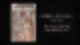
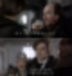
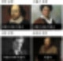
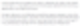
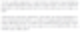
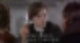
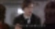

# [공지]블라그 사용법 공시
**Date:** 2023. 2. 1. 21:02
**Category:** 안내방송
**Original URL:** https://blog.naver.com/xpfkwh56/223002272410
---

세계는 한 권의 책이 되기 위해 존재한다.

​

1. 애덤 스미스 선생님은 돌아가시기 전,

미출간 유고(遺稿)를 불태우라 하셧읍니다.

​

**잘 보관해두었다면 소더비 같은 곳에서**

**비싸게 쳐줬을 테니 후손들을 위한**

**연금으로 쏠쏠했을 텐데 왜 태웠을까요?**

​

선생님이 좀 더 오래 살아계셨다면

우리가 볼 수 있었을, 불태워진 완성작은

'애덤 스미스의 법학'이라는 책입니다.

​

철학은 인간의 삶과 세상에 있는

모든 것에 관한 문답입니다.

​

나는 왜 존재하는가?

존재를 어떻게 증명할 것인가?

존재론, 형이상학입니다.

​

아름답다는 것은 무엇일까?

상대적일까? 절대적일까?

미학입니다.

​

옳은가? 타당한가? 그른가?

무엇이 어떻게 옳고 그른가?

논리학입니다.

​

옳은 것은 반드시 선한가?

사람은 어떻게 살아야 하는가?

윤리학입니다.

​

물질의 근원과 우주의 원리는

무엇이고 어떻게 알 수 있는가?

과학입니다.

​

선생님은 인간 마음속에 존재하는

도덕성의 성질에 대해 탐구하셨고

​

후일, 「도덕감정론」 이라는 제목으로

책 한 권을 세상에 선보이신 바 있읍니다.

​

「도덕감정론」 에서 우리 인류가

정의롭게 번영하기 위한 법칙은 무엇이며

어떤 규칙과 생각으로 살아야 좋을지

생각하다 나온 것이 「국부론」 이고

​

개인의 단위를 넘어 사회와 국가 단위에서

「국부론」 에서 품어진 사고의 논리를

법과 정책으로 구체화시킨 것이

미출간 유고, 「법학」 인 것입니다.

​

​

2. 저탄소 녹색성장을 물고 빠는 유엔에서

기겁할 만한 일이 과거에 또 있엇읍니다.

​

19살의 문학 천재, 랭보

자신의 원고를 모두 불에 태워버리고

다신 글을 쓰지 않겠다 절필하다.

​

대체 왜 시를 태우는 거야?

누이가 묻자 랭보는 답했읍니다.

​

**신과 나 밖에 읽지 않을 시가**

**세상에 있어서 무슨 의미가 있겠어?**

​

랭보하면 견자(Seer)가 중요한데요.

​

랭보가 평생 염원했던 견자란

기성 세계에 살고 있는 사람들이

바라볼 수 없는 가치를

볼 수 있는 사람을 말합니다.

​

유동성의 파티 속에서

인디언 기우제를 지내며

금융위기를 예측한

빅 쇼트의 마이클 버리,

​

자본주의의 모순을 지적하고

영원한 빨갱이 아이돌로 등극한

마르크스가 견자입니다.

​

지구가 중심이 아니라

태양이 중심이다.

​

인간은 창조된 것이 아니라

진화한 것이다.

​

우리는 의식적으로 살기보다

무의식적으로 살고 있다.

​

모두 견자의 사례들입니다.

​

그들은 보이지 않는 것으로부터

보이는 것을 보았기 때문입니다.

​

​

거의 평생을 도박 중독자로 살았고

천부적 재능을 보란 듯 펑펑 낭비하며

​

글자 수만큼 원고료를 준다고 하자

자낳괴식 장황한 작법으로 죄와 벌과

카라마조프의 형제들이라는 역작을 남긴

​

도스토옙스키도 인간의 본질과 내면을

깊게 탐구한 견자라고 할 수 있습니다.

​

<https://n.news.naver.com/mnews/article/001/0001394604?sid=104>

​

도스토옙스키는 노름꾼을 쓰고 받은

인세로 또 도박을 하러 갔다고 합니다.

​

답십리 차무식, 마늘밭의 파수꾼,

남바완 예능 트레이너 박호두,

그는 혹시 러시아 대문호의 환생 일지도?

​

​

손에 물 한 방울 묻히지 않던

꽃돌이 랭보도 어른이 되어선

생존을 위해 노동해야 했습니다.

​

태양이 매섭게 내리쬐던 어느 날,

랭보의 온몸이 땀으로 뒤덮인 순간

​

타인을 위해 가치를 만드는 행위가

단순히 입으로 떠드는 이상보다

얼마나 더 대단한 일인지 깨닫게 되고

​

세계에서 가장 뜨거운 태양이 빛나는

아프리카 각지를 떠돌며 워홀러로 살다가

랭보는 격정적인 시인의 삶을 마치게 됩니다.

​

3. 세계는 한 권의 책이 되기 위해 존재합니다.

​

제가 여럿 블라그들을 보면서 아숩던 것이

좋은 글인데 찾자면 너무 어려웠읍니다.

다시 읽고 싶은데 찾자면 진이 다 빠졌어요.

​

셰익스피어 4대 비극도 동강동강 나있으면

읽을 엄두가 나지만 양장합본으로 붙어있으면

서재에 뒀을 때 멋은 있어도 읽긴 힘듭니다.

​

공단기 여름특강 500분,

세계사 입문 완성 강의시간 980시간,

이런 것은 들으라고 만든 강의가 아니죠.

​

그래서 제 블라그에는 게시판 하나가

한 권의 책처럼 적용되는 구조로

블라그를 운영해보려 합니다.

​

인간은 한 권의 책이 되기 위해 존재합니다.

​

니 책의 장르는 모냐구요?

​

저는 아직 완성되지 않은 책의 장르를

미리 규정하고 시작하진 않으려고 합니다.

​

적어도 제가 저의 고용주인 동안은요.

​

잘 부탁드리겠읍니다.