# 40대에 3억이 없으면 망한 인생이다?
**Date:** 2023. 6. 1. 15:14
**Category:** 인기글 모음
**Original URL:** https://blog.naver.com/xpfkwh56/223117557228
---

> 반박 시 내 말이 옳음

진짜 망한 인생은, 어른이 되고서도

타인의 가치를 특정 인간이 소유한

경제적인 재화로밖에 볼 수 없는

그런 인생이 망한 인생 아닌가욬ㅋ?

​

그런 것에서 **안목 수준**이 나오는 것

​

인생을 살아감에 있어서

남한테 해를 끼치지 않았고,

​

당사자가 인생에 떳떳할 수 있다면

그 어떤 세상의 누구라 할지라도

타인의 인생에 손가락질할 수 없음

​

**한 치 앞도 모르는 것이 인생인데,**

​

정작 본인이 그러고 살다가

재수 없게 돈 날리면 어칼라구요?

​

​

설마?

​

보통 목걸이 두툼하게

장만하시는 양반들 보면,

​

인생이 꺾였다기보다

자기 마음이 꺾인 분들이

보통 그러시더라고욬ㅋ

​

이게 사람 사는 것이 맞나

뭐 그런 생각을 하는 것인데요,

​

늘 하는 이야기가 있죸ㅋㅋ?

​

인생길고, 애먼 곳에

자기 정체성 투영하지말라곸ㅋ

​

몸도 마음도 잘 가꿔서

편안히 **무병장수** 합시닼ㅋㅋ

> 나이

[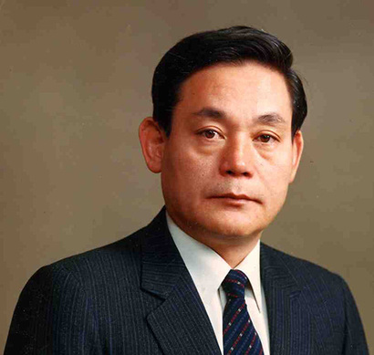](#)

​

**1살, 이건희**

**​**

태어나 보니

아빠가 이병철

​

​

**2살, 사도세자**

​

천자문을 배워 60자를 쓰다

​

[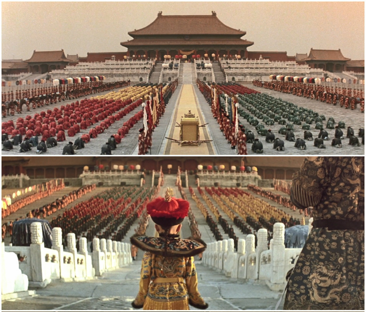](#)

​

**3살, 푸이**

​

청의 마지막 황제로 즉위

​

[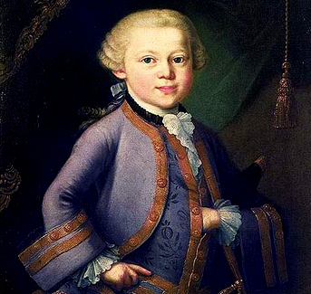](#)

​

**4살, 모차르트**

​

미뉴에트 G장조 작곡

​

[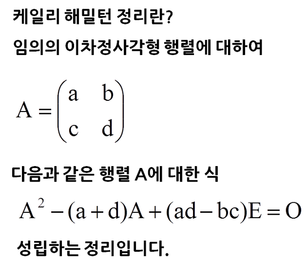](#)

​

**5살, 윌리엄 해밀턴**

​

당대 3대 학술 언어였던

그리스어, 라틴어, 히브리어

번역 저술가로 활동하였음

​

[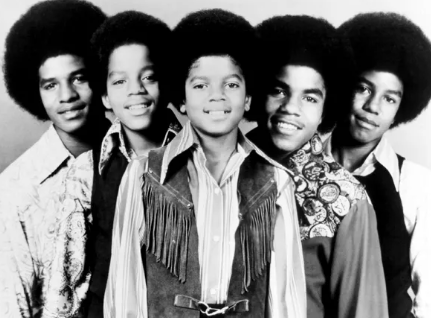](#)

​

**6살, 마이클 잭슨**

**​**

잭슨 파이브의

리드보컬로 데뷔

​

[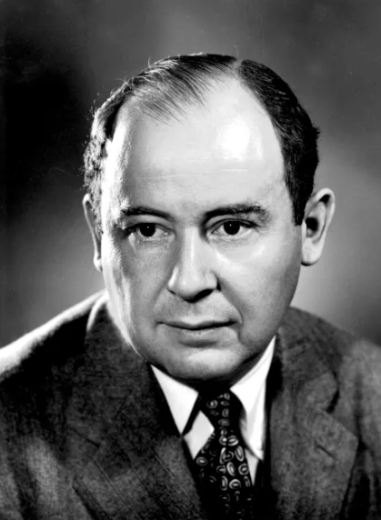](#)

​

**7살, 폰 노이만**

**​**

천재, 최고등 교육기관

김나지움에 입학하다

​

[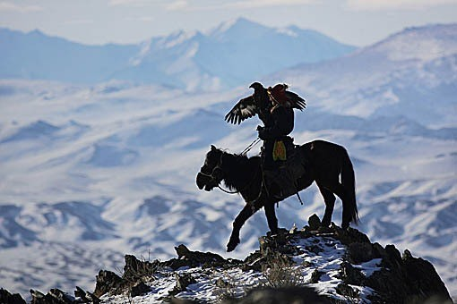](#)

​

**8살, 칭기즈칸**

​

부족장이던 아버지가

적대 세력에게 독살당해,

떠돌이 방랑자가 되다

​

[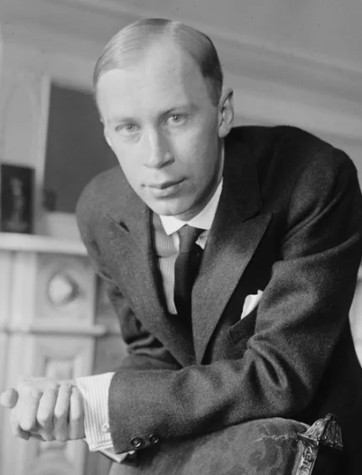](#)

​

**9살,** **프로코피예프**

​

오페라 거인을 완성하다

​

​

**10살, 맥컬리 컬킨**

**​**

나홀로 집에 라는

영화 시리즈 주연을 맡다

​

​

**11살, 스티븐 스필버그**

​

생애 첫 단편영화 제작

​

[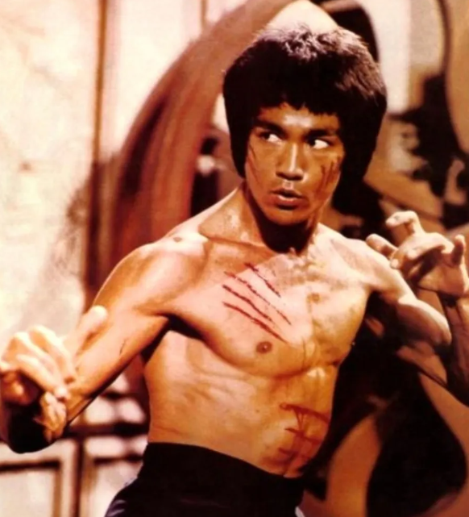](#)

​

**12살, 이소룡**

**​**

무술에 입문하다

​

[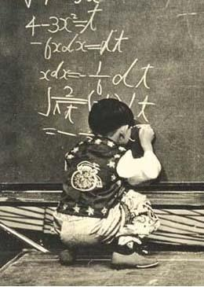](#)

​

**13살, 김웅용**

​

나사 선임 연구원이 되다

​

[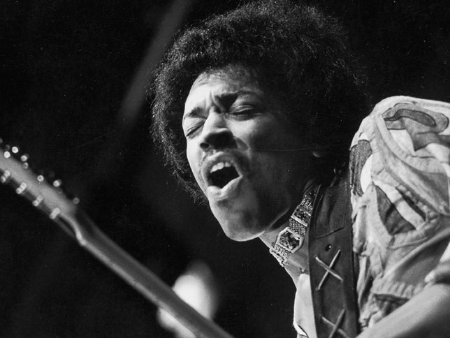](#)

​

**14살, 지미 헨드릭스**

**​**

기타를 입문하다

​

[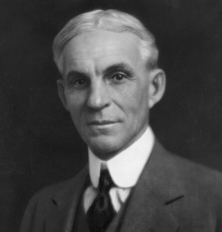](#)

**​**

**15살, 헨리 포드**

**​**

집을 나와 기계공이 되다

​

[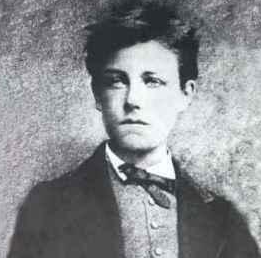](#)

​

**16살, 랭보**

​

견자의 편지를 쓰다

​

[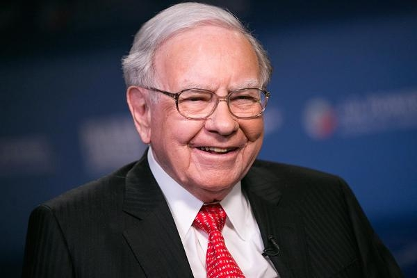](#)

​

**17살, 워런 버핏**

**​**

핀볼 게임기 사업을 시작

​

​

**18살, 스티브 잡스**

**​**

칼리지 자퇴 후,

생계를 위해 취준

​

​

**19살, 빌 게이츠**

**​**

하버드를 자퇴하고

마이크로소프트 창업

​

[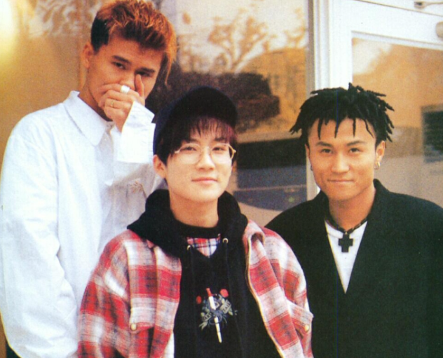](#)

​

**20살, 서태지**

​

난 알아요 데뷔

​

[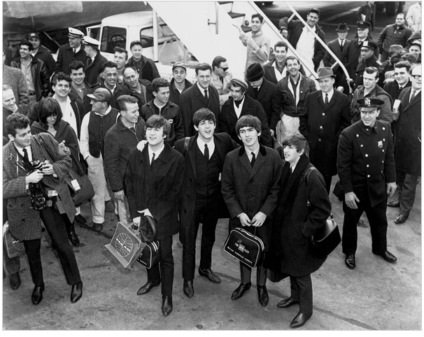](#)

​

**21세, 존 레넌**

​

폴 매카트니와 비틀즈 결성

​

[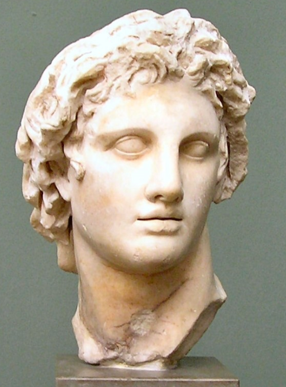](#)

​

**22세, 알렉산더 대왕**

​

마케도니아 왕국의 실권을 잡고,

자신이 신의 아들이라고 선포

​

[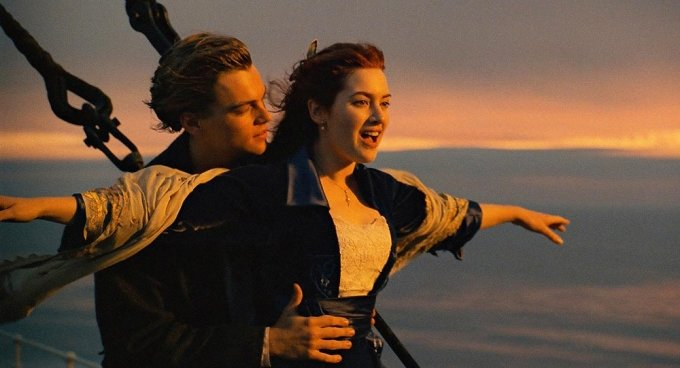](#)

​

**23세, 디카프리오**

​

타이타닉에 출연

​

​

**24세, 제임스 딘**

​

자동차 사고로 운명

​

[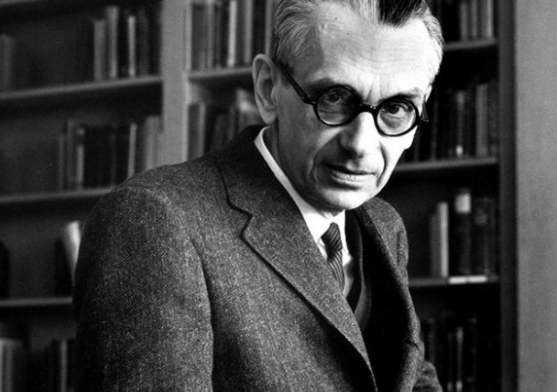](#)

​

**25세, 괴델**

​

불완전성 정리 발표

​

[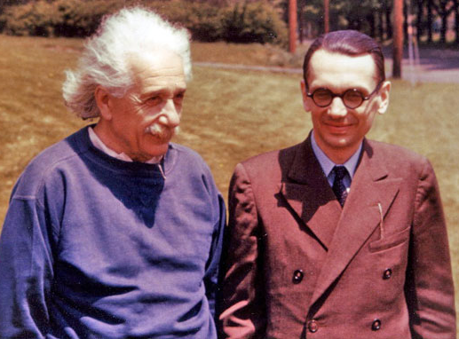](#)

​

**26세, 아인슈타인**

​

특수상대성이론 발표

​

[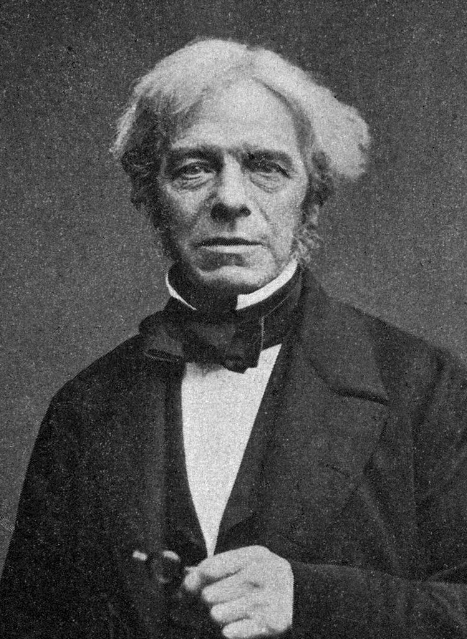](#)

​

**27세, 마이클 패러데이**

​

전기와 자기의 관계를 규명

​

[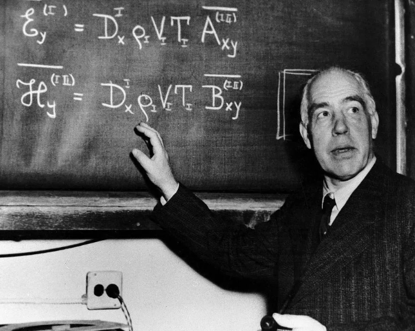](#)

​

**28세, 닐스 보어**

​

원자의 구조를 규명

​

[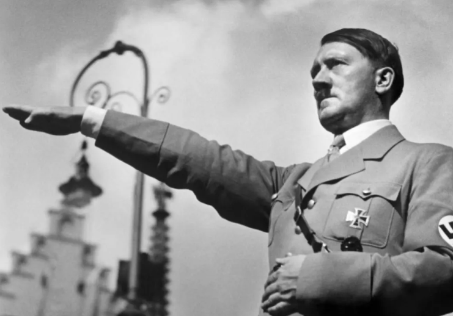](#)

​

**29세, 히틀러**

​

나치당에 입당하다

​

​

**30세, 예수 그리스도**

​

세례를 받고 설파를 시작

​

[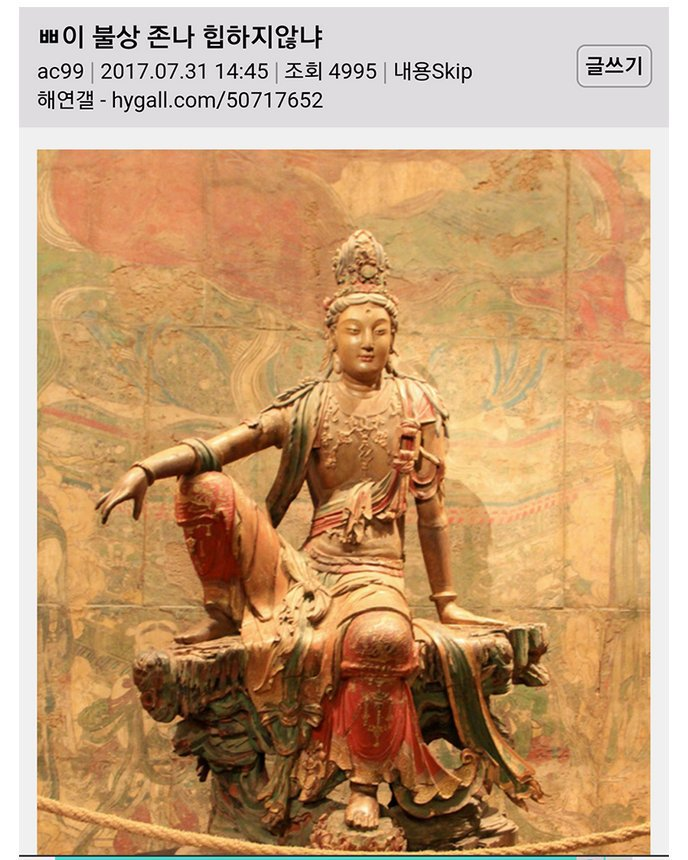](#)

[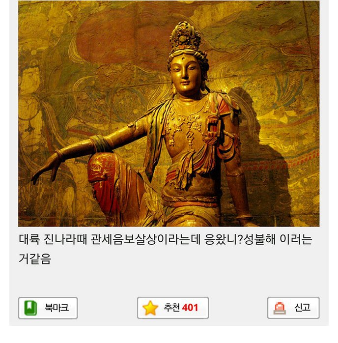](#)

​

**31세, 석가모니**

​

불교 창시

​

[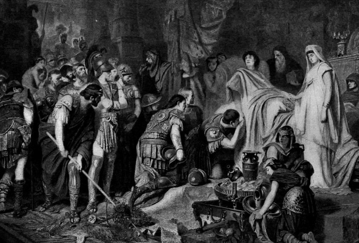](#)

**​**

**32세, 알렉산더 대왕**

​

제국을 이루고 사망

​

[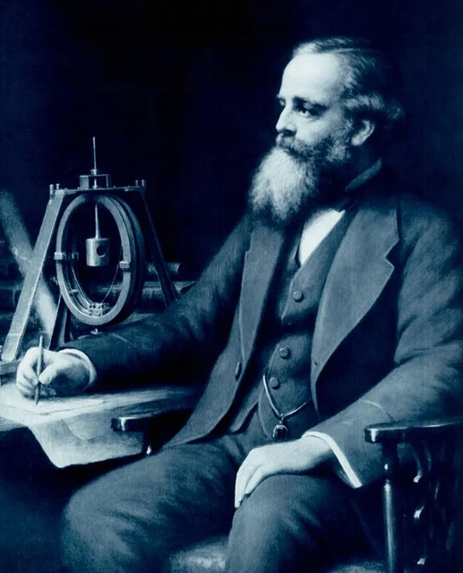](#)

​

**33세, 맥스웰**

**​**

맥스웰 방정식 발표

​

[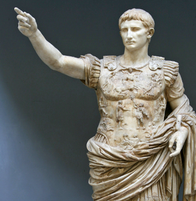](#)

​

**34세, 아우구스투스**

​

숙적 폼페이우스를 꺾고

로마 최고의 실권자로 등극

​

[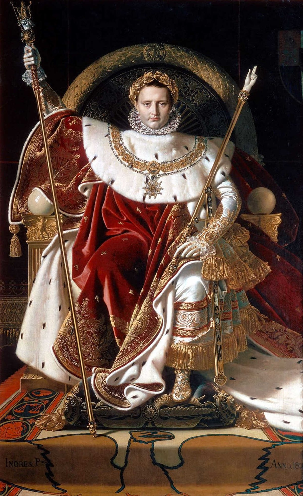](#)

​

**35세, 나폴레옹**

​

시골 촌놈,

프랑스 황제가 되다

​

[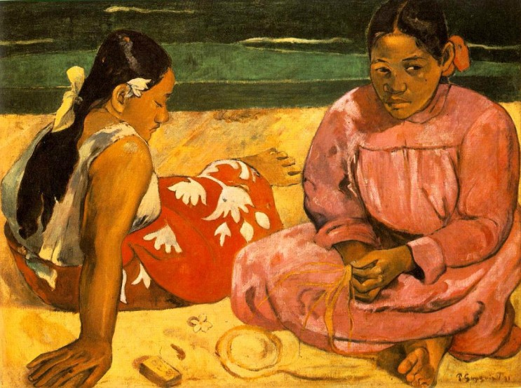](#)

​

**36세, 고갱**

**​**

증권 브로커를

관두고 화가가 되다

​

[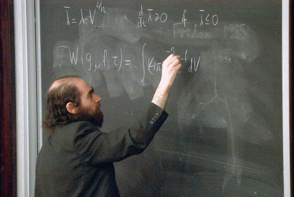](#)

​

**37세, 페렐만**

​

푸앵카레 추측을 풀다

​

[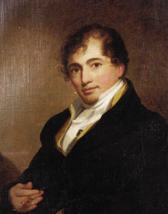](#)

​

**38세, 로버트 풀턴**

​

세계 최초로 잠수함을 발명한 이후,

나폴레옹에게 무기 사업을 제안한다

​

나폴레옹은 잠수함의 가치를 몰랐고

지속적으로 영국 해군에게 시달리다

​

대륙봉쇄령 → 러시아 원정 이라는

나비효과로 쇠퇴하고 몰락하게 된다

​

폴턴은 미국으로 돌아가

증기선 사업에 투신하고,

​

초기 미국 자본주의의 황제,

선박왕 밴더빌트를 잉태시킨다

​

​

**39세, 헨리 포드**

​

포드사 창업

​

​

**40세, 베라 왕**

**​**

기자로 활동하다,

갑자기 패션 업자가 되다

​

[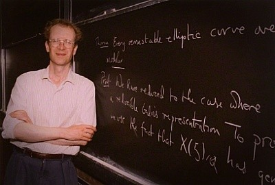](#)

​

**41세, 앤드루 와일즈**

​

페르마의 정리를 해결

​

[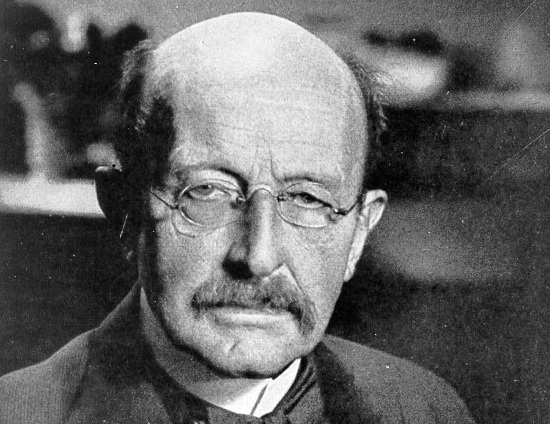](#)

​

**42세, 막스 플랑크**

​

양자론 창시

​

[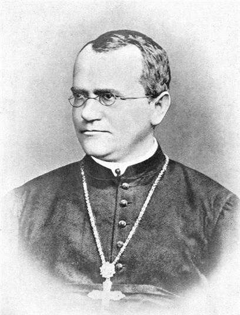](#)

​

**43세, 멘델**

​

유전법칙 발표

​

[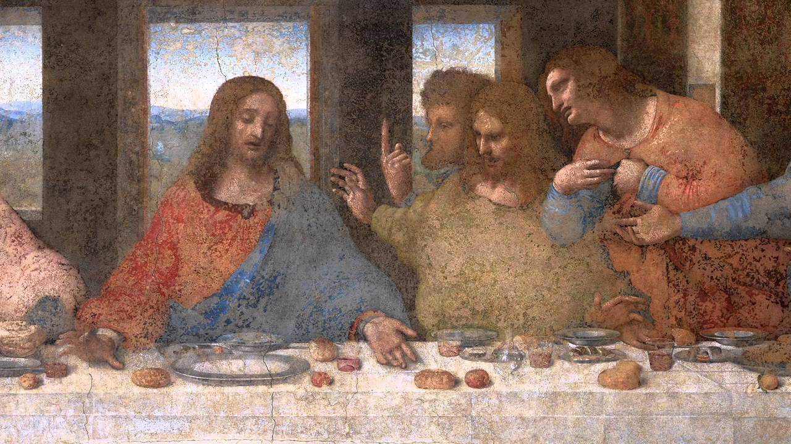](#)

​

**44세, 다빈치**

**​**

최후의 만찬 완성

​

[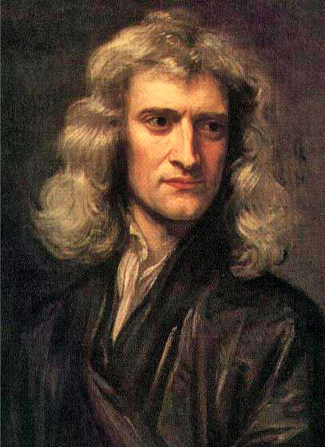](#)

​

**45세, 뉴턴**

​

프린키피아 발표

​

[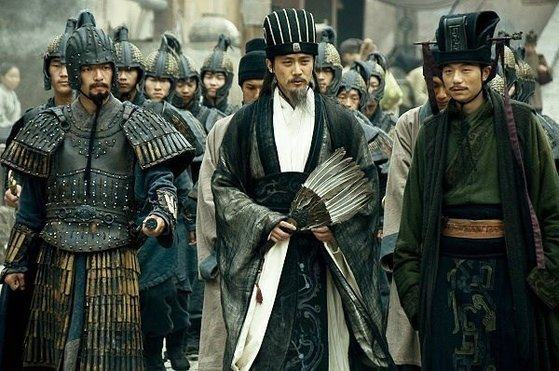](#)

​

**46세, 제갈량**

**​**

출사표를 쓰다

​

[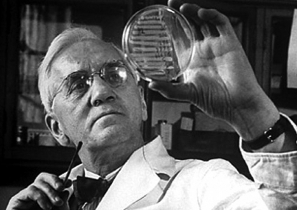](#)

​

**47세, 플레밍**

**​**

**우.연.히** 인류 최초로

항생제 개발에 성공하다

​

​

**48세, 짐 시네갈**

​

알바로 시작했던 커리어,

코스트코 창업주가 되다

​

[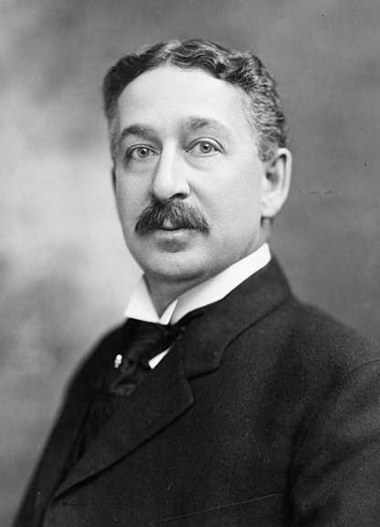](#)

​

**49세, 질레트**

​

질레트 면도기 창업

​

[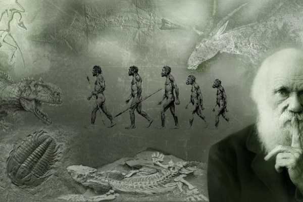](#)

​

**50세, 찰스 다윈**

​

종의 기원 완성

​

[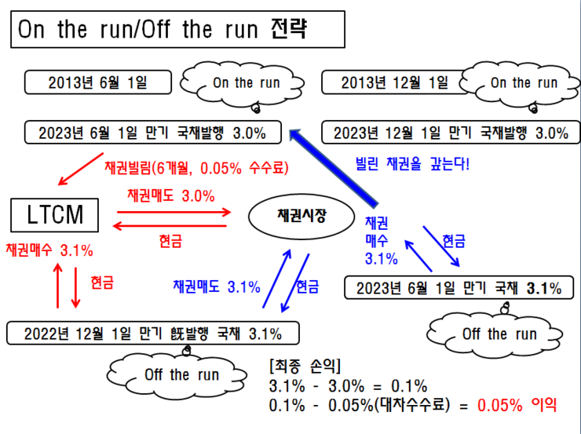](#)

​

**51세, 존 메리웨더**

​

블랙-숄츠 방정식을 만든 천재들과

드림팀을 꾸려서 만든 LTCM이 파산

​

[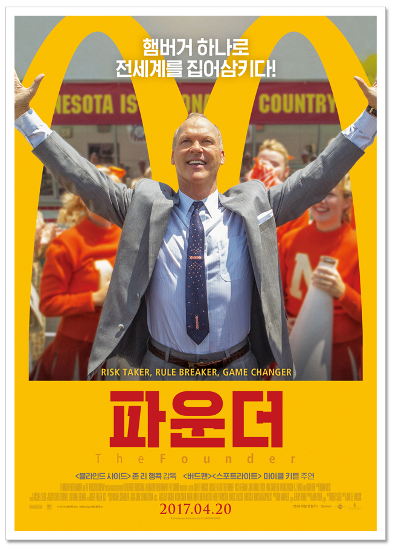](#)

​

**52세, 레이 크록**

​

맥도날드 1호점 개장

​

[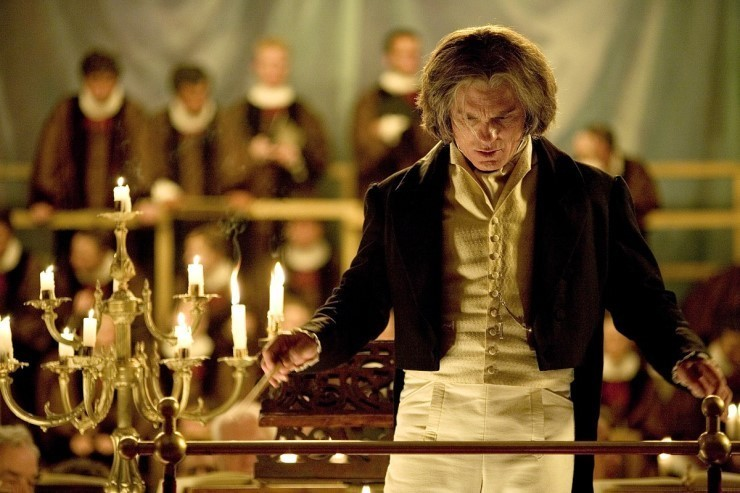](#)

​

**53세, 베토벤**

​

청각을 완전히 잃은 상태에서

합창 교향곡을 결국 완성 해낸다

​

[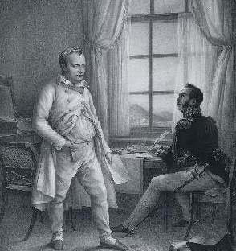](#)

​

**54세, 나폴레옹**

**​**

유배된 상태로 워털루 전투를

후회하면서 최후를 맞이한다

​

[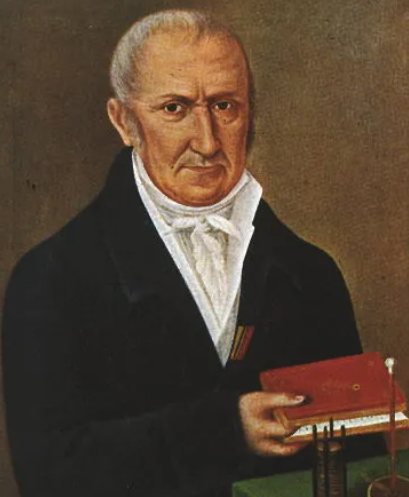](#)

​

**55세, 볼타**

**​**

세계 최초 전지 발명

​

[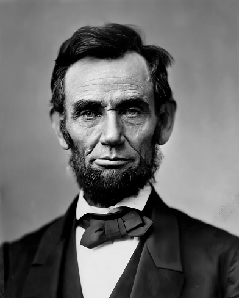](#)

​

**56세, 링컨**

**​**

암살 당하다

​

9살에 어머니를 잃고,

19살에 누이를 잃고,

26살에 약혼녀를 잃고,

41살에는 차남을 잃고,

53살에는 삼남을 잃고,

​

2번의 사업 실패

10번 중 7번의 낙선 끝에,

미국의 대통령이 된 지 4년째 일이다

​

**\* 근데 이 정도면 거의 뭐 코난 아님?**

​

[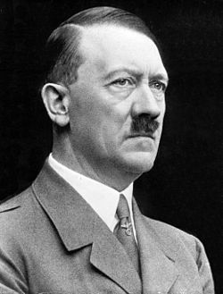](#)

​

**57세, 히틀러**

​

벙커에서 권총을 사용해

발할라로 긴 여행을 가다

​

[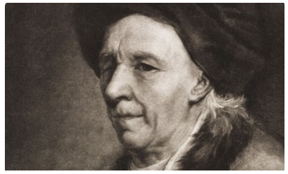](#)

​

**58세, 오일러**

​

양 눈의 시력을 잃은 채로

행성의 운동을 계산하다

​

[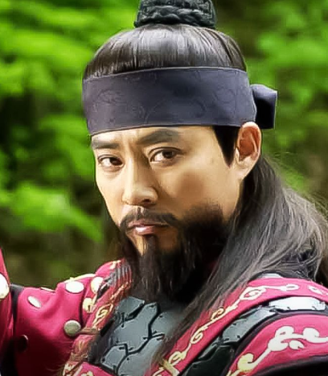](#)

​

**59세, 왕건**

​

후삼국을 통일하다

​

[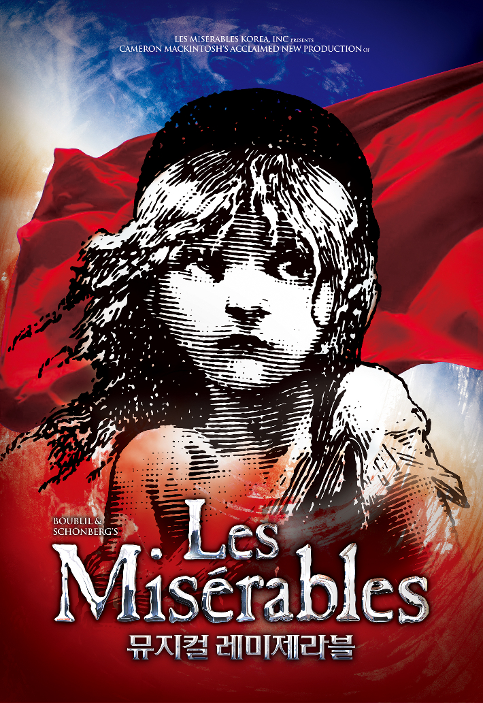](#)

​

**60세, 빅토르 위고**

​

레미제라블을 쓰다

​

[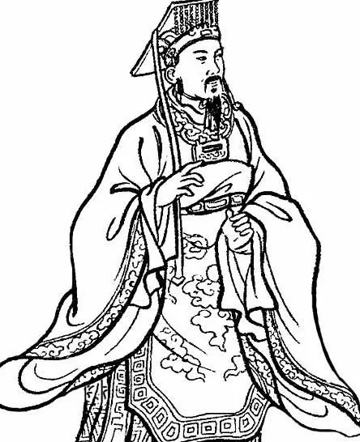](#)

​

**61세, 진 문공**

​

긴 유랑을 끝내고,

진나라의 왕이 되다

​

[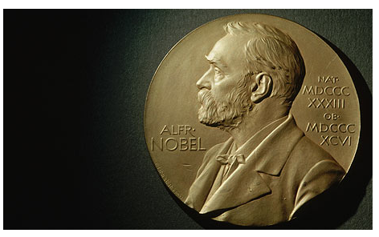](#)

​

**62세, 알프레드 노벨**

​

노벨상 시스템을 만들다

​

[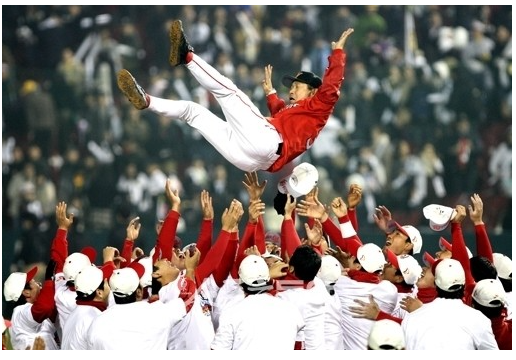](#)

​

**63세, 김성근**

​

감독 생활 23년 만에

프로 야구에서 첫 우승

​

[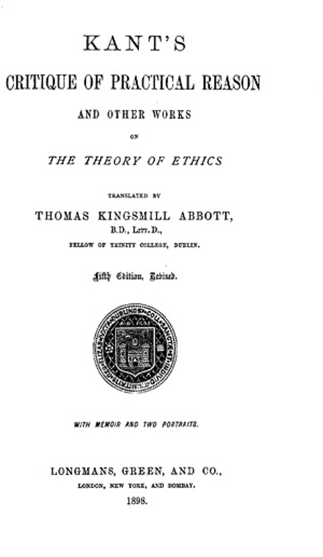](#)

​

**64세, 임마누엘 칸트**

​

실천이성비판 완성

​

[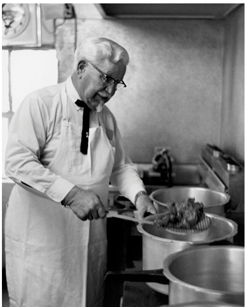](#)

​

**65세, 커넬 샌더스**

**​**

화재로 전 재산을 날리고

불굴의 의지로 KFC 창업

​

**\* 창업 1년 만에 상장한다**

**​**

[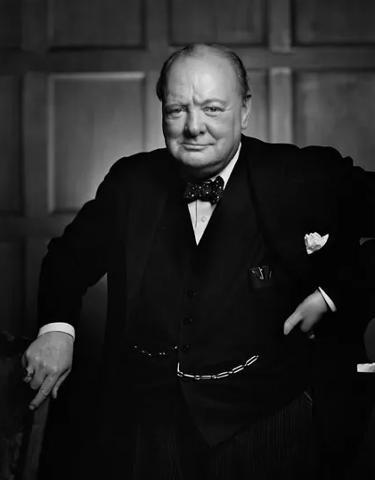](#)

**​**

**66세, 윈스턴 처칠**

**​**

아싸 언더독, 총리가 되다

​

​

**67세, 세잔**

​

40년 동안 사과를 그렸고

67세의 나이로 죽었다

​

[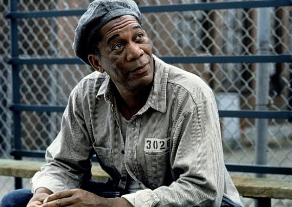](#)

​

**68세, 모건 프리먼**

**​**

데뷔 34년 만에

아카데미상 수상

​

**\* 레오나르도 디카프리오가**

**약 25년 만에 오스카를 받음**

​

[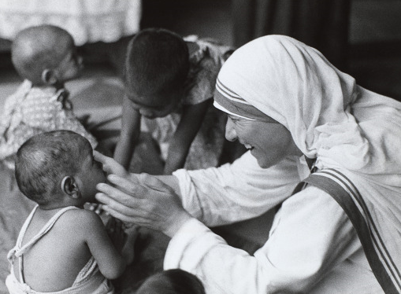](#)

​

**69세, 테레사 수녀**

​

노벨 평화상 수상

​

[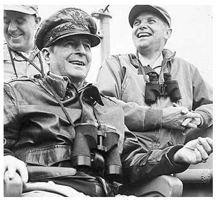](#)

​

**70세, 맥아더**

**​**

인천상륙작전 성공

​

​

**71세, 차사순**

**​**

950번 만에 운전면허 합격

​

응시료만 약 3천만 원,

합격 소식에 자동차도 협찬!

​

[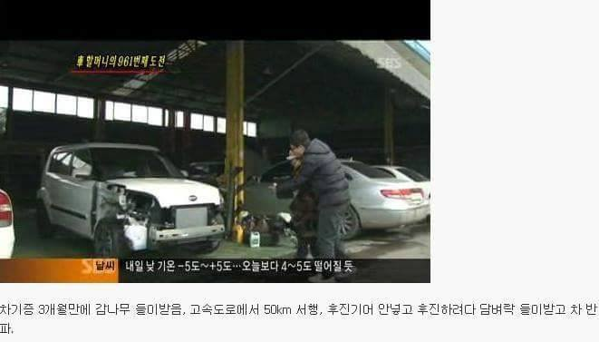](#)

​

지금은 안 하신답니다

​

[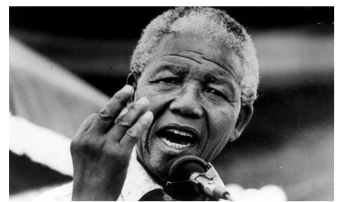](#)

**​**

**72세, 넬슨 만델라**

​

수감 27년 만에 석방

​

[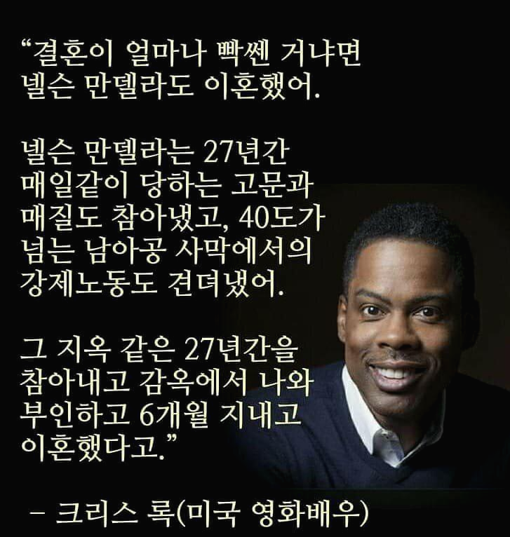](#)

​

6개월 이후, 이혼

​

[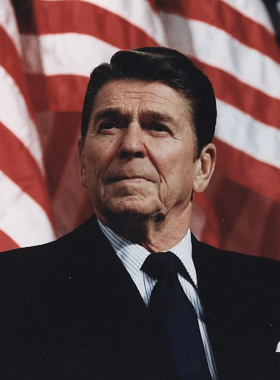](#)

​

**73세, 레이건**

**​**

미국 대통령에 재선

​

[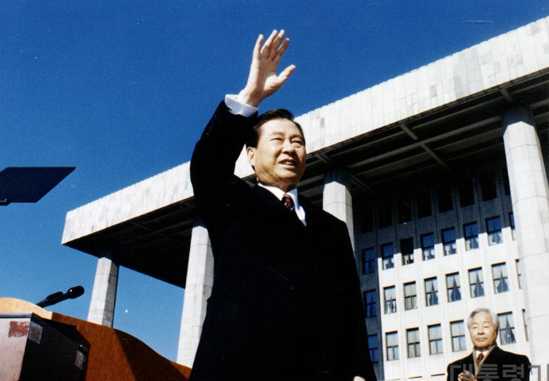](#)

​

**74세, 김대중**

**​**

한국 대통령에 당선

​

**\* 김영삼 대통령은**

**20대에 국회의원을 했다**

**​**

[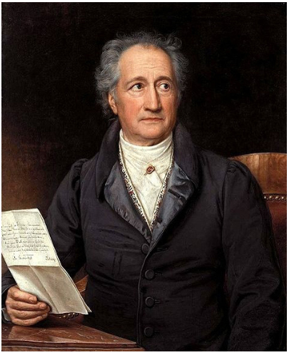](#)

**​**

**75세, 괴테**

**​**

나의 인생, 시와 진실

이라는 자서전을 출판

​

[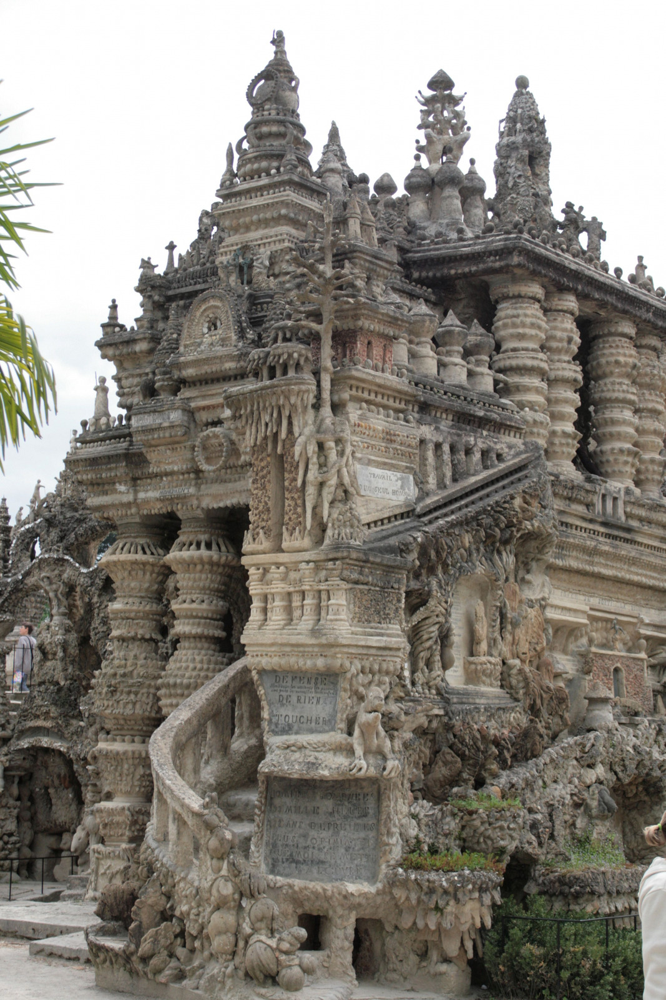](#)

​

**76세, 페드리낭 슈발**

​

프랑스 우체부,

무려 33년 만에

꿈의 궁전을 완성

​

​

**77세, 넬슨 만델라**

**​**

이혼의 아픔을 딛고,

남아공 대통령에 당선

**​**

**​**

**78세, 그랜마 모제스**

​

나이 78세에 그림을 시작해

이후, 미국의 국민 화가가 되다

​

**79세, 벤저민 프랭클린**

​

이중초점 안경 발명

​

**80세, 윈스턴 처칠**

​

노벨 문학상 수상

​

**81세, 벤저민 프랭클린**

​

미합중국 헌법 초안을 쓰다

​

**82세, 괴테**

​

파우스트 출간

​

[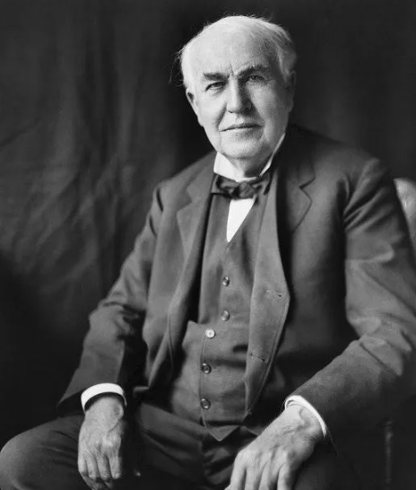](#)

​

**83세, 에디슨**

​

1093번째 특허 출원

​

[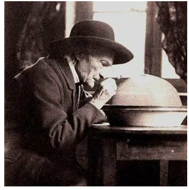](#)

​

**84세, 파브르**

​

파브르 곤충기 완성

​

[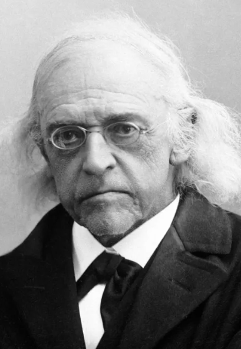](#)

​

**85세, 테오도어 몸젠**

​

역사학자 최초로

노벨문학상 수상

**​**

[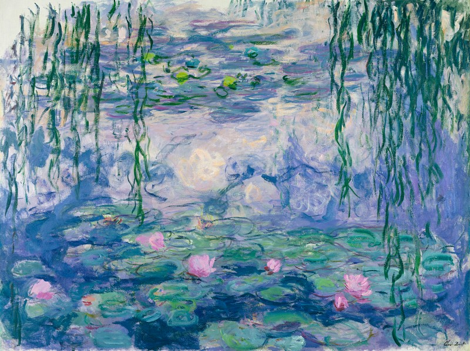](#)

**​**

**86세, 모네**

**​**

43년 동안 연못을 그렸고

86세의 나이로 죽었다

​

[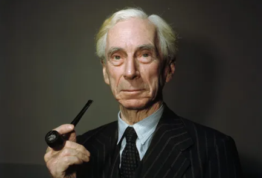](#)

​

**87세, 버트런드 러셀**

​

핵무기 금지 시위를 주도하다

​

[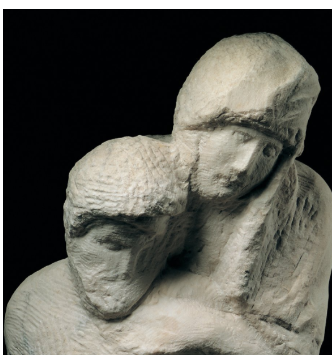](#)

​

**88세, 미켈란 젤로**

​

죽기 전까지 지속적으로

뭔가 만들다가 소천함

​

[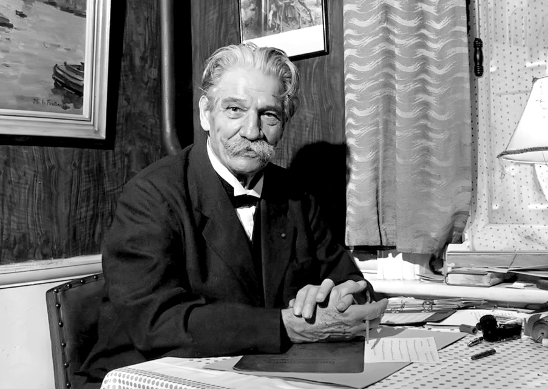](#)

​

**89세, 슈바이처**

​

더 많은 환자를 치료하려고

리모델링 공사를 진행하다 사망

​

[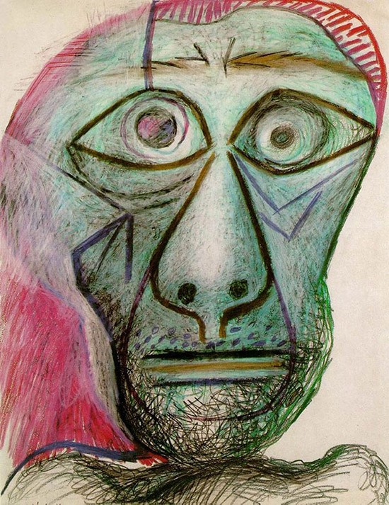](#)

​

**90세, 피카소**

​

죽는 날까지 작업하다 사망

​

피카소가 살면서 만든 작품은

대략적으로 약 5만점으로 추산

​

[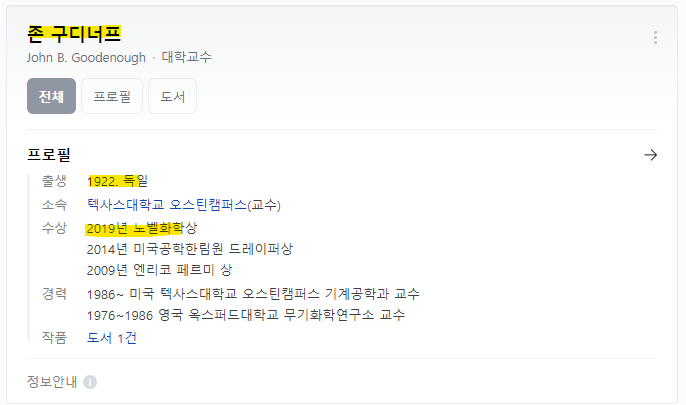](#)

​

**97세, 구디너프**

​

노벨 화학상 수상

> 인생 길죠?

​

관뚜껑 닫아봐야 아는 겁니다맠ㅋ

쟤가 앞으로 뭘 할지 어떻게 아나욬?

​

​

한편, 피차 흘러가는 세월

​

​

어거지로 잡을 것도 없고

​

​

조급하든, 느긋하든

​

​

시계는 속절없이

​

[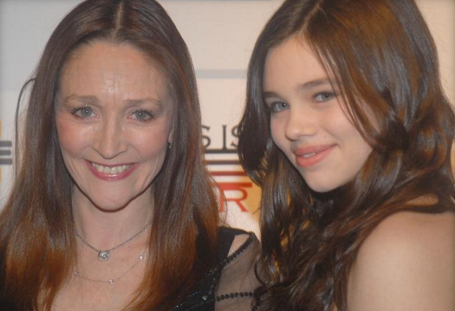](#)

​

째깍째깍 흘러갑니다

​

[](#)

​

다들 그렇게 언제나 누구나

오직 지금, **바로 이 순간**을

살아가고 있는 것 아니겠읍니깤ㅋ?

​

다신 돌아오지 않는 시간이니

후회 없이 펀섹쿨하게 보내세욬ㅋㅋ