# 20대 초반 시절
**Date:** 2024. 9. 20. 4:01
**Category:** 다이어리
**Original URL:** https://blog.naver.com/xpfkwh56/223589427723
---

[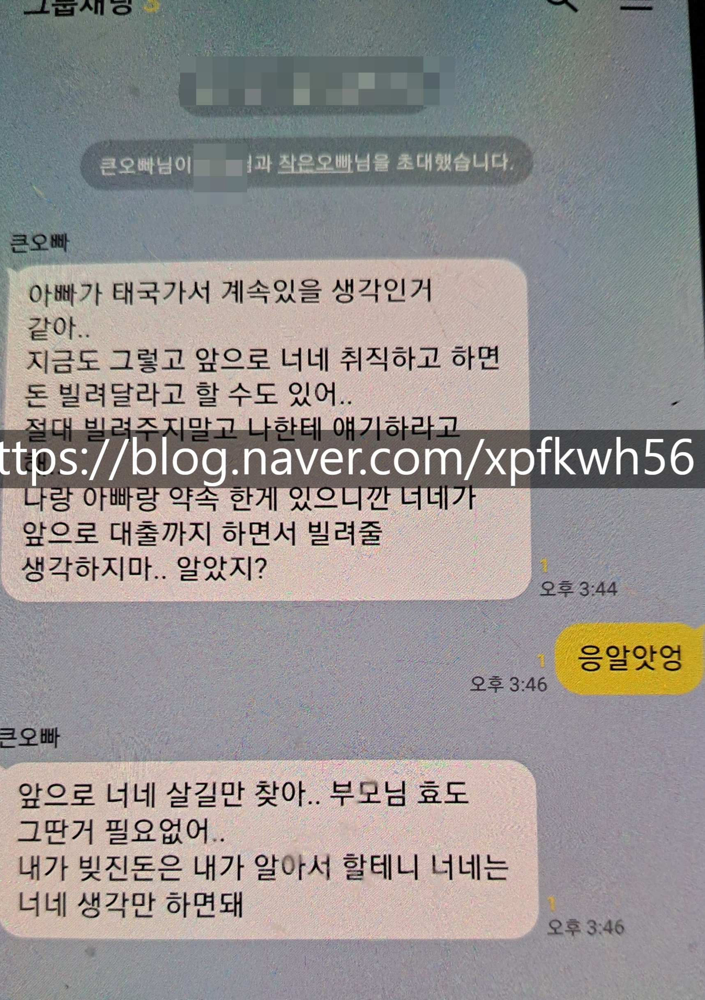](#)

​

집안 꼬라지는 뒤집어졌고,

​

[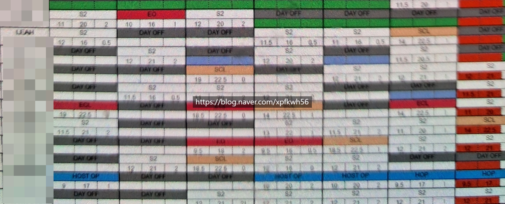](#)

Leah

​

생계는 진짜 힘들어 죽겠고,

​

​

내 딴에는 정말 잘해보려고 하는데,

​

자꾸만 어딜가도 맨날 혼나기만 하고

사방에서 나한테 너무 많이 요구하고,

​

난 오늘 하루가 그저 버거워 죽겠는데

​

[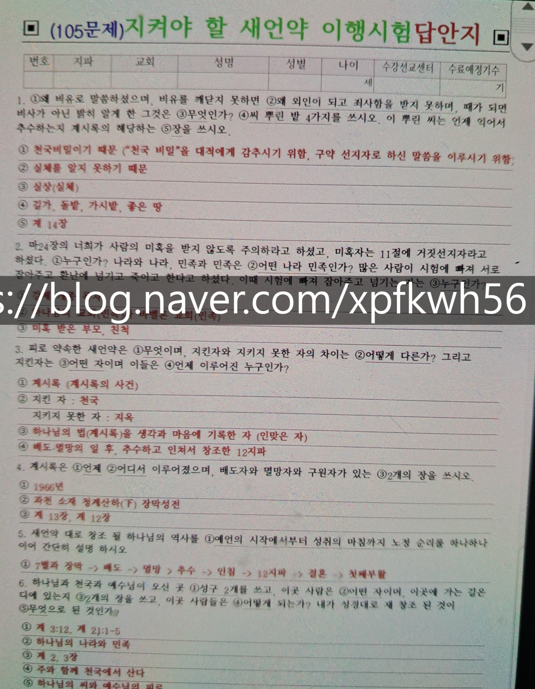](#)

내신 스타일이라 암기에 강함

​

요거만 외우면 심플!

​

[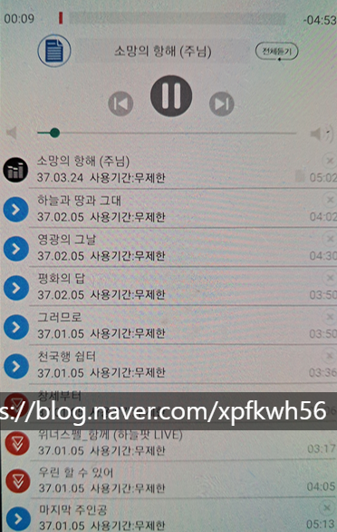](#)

​

이런 거 듣고 있으면 위로받는 것 같고,

​

**\* 더 정확히는 잠시 잊게 됨**

**​**

[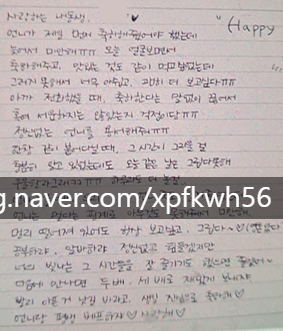](#)

​

나를 응원하는 좋은 사람들도 많고,

​

[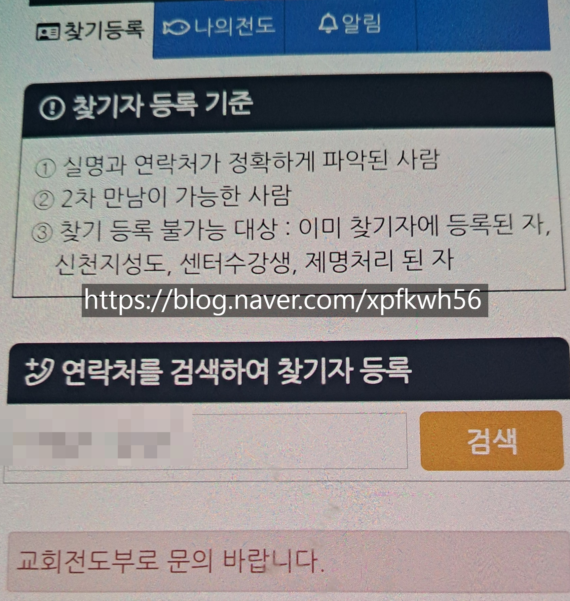](#)

4차였나? 5차였나? 안에 센터 넣는 걸로 기억

[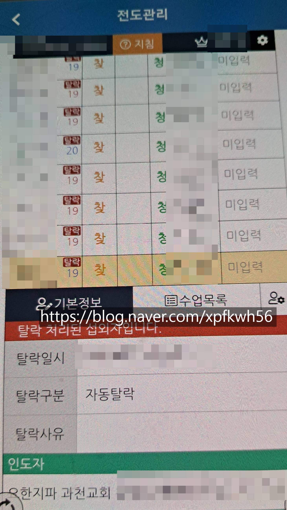](#)

섭외 망했던 것이 호재인지, 악재인지

​

내가 100개 못하고, 1개만 잘 해도

잘한다고 주변에서 칭찬이 쏟아지고

​

[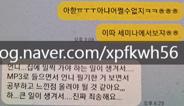](#)

[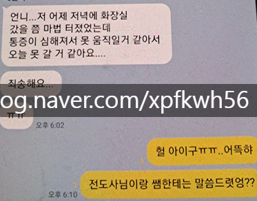](#)

[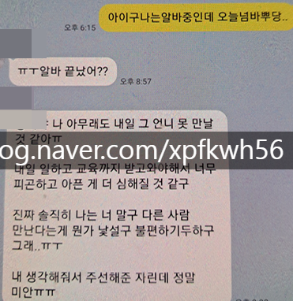](#)

​

지금 보면, 어린애들 평판 팔아서

사람 땡겨오는 것인데 그게 안 보임

​

**\* 사회 초년생 대상, 보험팔이랑 비슷**

**​**

인맥 다 갈리면 이제 **모략 테크**로 감

​

**\* 정도에 차이는 있지만**

**블랙 기업, 영업 교육과 유사**

**​**

[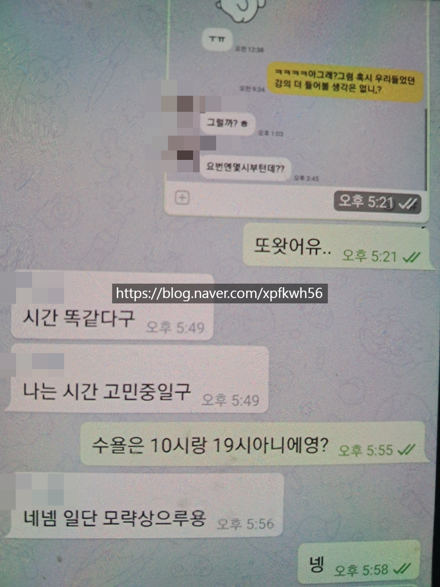](#)

​

오픈 카톡이나, 뭐 온갖 각종 소모임 있는데

​

노방이라고 밖에 나가서 사람 헌팅? 해와라

이거에 거부감 있는 사람들이 워낙 많으니까

​

**\* 해도 초기에나 하지, 어지간하면 잘 안 할 걸요**

**​**

1차 DB 가져오면, 2차로 가공하란 소리랑 비슷

​

**\* 또 내가 볼 사람이면 모르겠는데,**

**무관한 사람이면 기계적으로 하게 됨**

**​**

가물가물한데 매뉴얼도 있음

​

1) 뭐 귀신이나, 사주,

영성 이런 것 믿는 사람이냐

​

2) 가족 관계 어떻냐, 지금 어떤 상태냐

하고 싶은 것은 뭐고, 뭐에 좌절을 했냐

​

그럼 카톡 하는 거 스샷 찍어서 보내주고,

그거 그대로 이렇게 말해요 하면 전달함

​

뭐 예를 들어, 누가 영화에 관심이 있다

그러면 시나리오 작가라든지, 촬영이라든지

꽤 근사한 권위를 가진 곳에서 상영회 한다

​

이러면 궁금해서라도 그냥 후킹이 걸리는데,

​

**\* 멘토, 멘토링도 있고 무궁무진**

​

거기 있는 사람들 다 걍 아무 관계없음

​

그냥 데려와서 트루먼쇼처럼 그 사람 하나에

최적화 시켜서, 다 공감해 주고, 전부 맞춰줌

​

**\* ㄹㅇ 무슨 운명인 것처럼**

**​**

옆에서 누가 쟤 대단한 사람이다~

이러면 처음 보는 사람이니까 **아 그래?** 되고,

​

카톡에서 보이듯, 거진 멀쩡하게 사는 사람은

영화 얘길 하는데 어딘지 모르게 종교적이다?

​

갑자기 뜬금없는 소리가 나온다? 에서

쌔함 느끼고 발 빼는 것이 거의 보통이고,

​

내 경험상, 약간 멘탈 너덜너덜하고

자존감 털린 사람들이 들어오곤 했음

​

**\* 내 기억에는 딱히 강요는 없었음,**

**어차피 저긴 할 일이 넘치기 때문에**

**​**

​

**근데, 왜 저렇게까지 하면서 꼬셔올까?**

​

이게 내 마지막 기억에 의하면,

​

그래도 신도가 얼추 10만은 넘었는데

삼성전자 임직원 숫자가 10만 정도임

​

보통 나이대가 어린 애들이라

딱 10명만 모여도 말 나오고,

​

이건 아니지 않아? 하면 맞워맞워 뜨는데,

아무리 사이비로 돌아도 생각은 할 것 아님

​

**\* 회전문 신자들도 엄청 많음**

​

[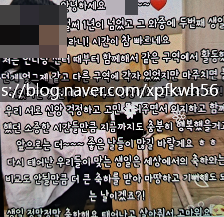](#)

​

평소에 사진 찍어 줬다가

생일이면 영상 편지 만들어줘,

​

[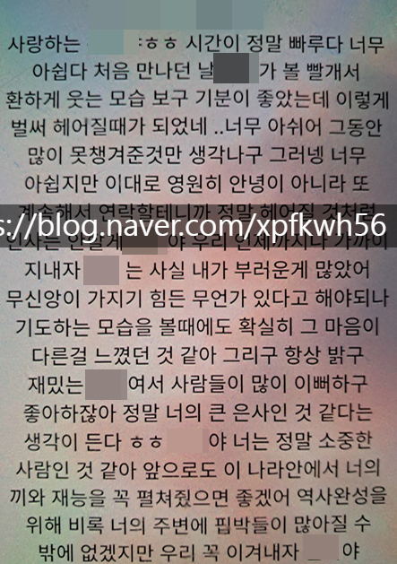](#)

​

뭐 일 있다고 하면 롤링 페이퍼 해줘,

​

종교 콘텐츠는 실상 걍 하릴없으면

애들 잡생각하니 주는 숙제 느낌이지,

​

서로 멘탈 케어해주고, 사회 복지 차원의

그거로 다니는 애들도 많았을 것이라고 봄

​

**\* 이게 굳이 뭐 신천지가 아니더라도,**

**독거노인은 종교 정말 나쁘지 않다고 봄**

**​**

**정신적으로도 당연하고, 실리도 많이 얻음**

**애들이 와서 자기 챙겨주고, 관심 가져주고**

**이거에 긍정적 영향 받은 분들도 많이 봤고**

**​**

정말로다가, 월 소득의 50%를 저축하고

한양에 등기를 치면 천국을 갈 수 있나요?

​

저도 열심히 노력하면 디지털 노마드로서,

사업가로 자아실현에 성공할 수 있을까요?

​

이거랑 **솔직히** ,, 별로 차이가 없음 ,,

​

모 유료 단톡방의 경우, 블로그 이웃 많으면

공짜로 넣어주고, **'마케팅'**에 쓰기도 하는데

​

모르는 사람 입장에선 별나라 얘기지요

​

그리고 거기 앉아서 가만히 듣고 있어도,

뭐 딱히 그리 아닌 얘기는 아닌 것 같거든

**​**

거기에 애들 심심할까봐, 노인들 도우러 가

장애인, 사회적 약자들 돕고, 교육 봉사에다가

좋은 일 한다고 삼삼오오 모아 농활도 보내줘

​

**\* 기성 교회도, 일부는 보육원 역할을 함**

**크리스마스 혼자 집에서 보내면 적적하잖음**

​

이럼, **여기 좋은데?** 가 되는 것도 당연함

​

**\* 내 사회적 역할이 생기는 것이 제일 큼**

​

그러다, 문득 이런 생각이 드는 것이지요

​

누가 뭐 장사한다길래 내가 좋은 마음으로

발품 팔아가면서 간판도 찾아주고, 걔 대신

걔가 원래 했어야 되는 것을 한참 하다보니까

​

이 사람들이 지금 날 **이용**하는 것 아닌가?

라는 생각이 스믈스믈 들기 시작하는 것임

​

내 선의가 사역이라는 이름으로,

무상노동 착취로 인지가 되기도 하고

​

나야 뭐 내 사익 1도 누리지 않고,

나처럼 고생하고 어려웠던 애들 있으면

​

우둥부둥 서로 잘 살아보자 하고,

좋은 마음으로 했던 일이긴 한데

​

**\* 여자들은 또 그, 여자 특유의**

**서로 멘탈 충전해 주는 그거 확실함**

**​**

이게 과거, 운동권에서 헤매면서 살던

​

노동자, 대학생들 앞세우고 쓰다가

자기들은 제도권으로 넘어가는 것과

​

**어떤 면에서 도대체 뭐가 다르지?** 싶은 것

​

[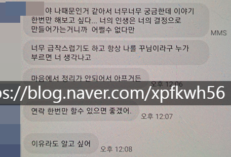](#)

​

그리고 이게 **'사람'**으로 엮이거든요?

​

온라인 게임이 게임이 재밌어서도 있는데,

쭉- 하다 보면 게임은 뒷전이고 거기에 있는

사람들하고 정 들어서 못 나오는 경우 많음

​

**\* 감금 괴담도 당연히 흔한 얘기지만,**

**가정 폭력 평생 시달리던 애가 도피처로**

**넘어와서 집 안 간다는 경우도 꽤 봤지요**

**​**

[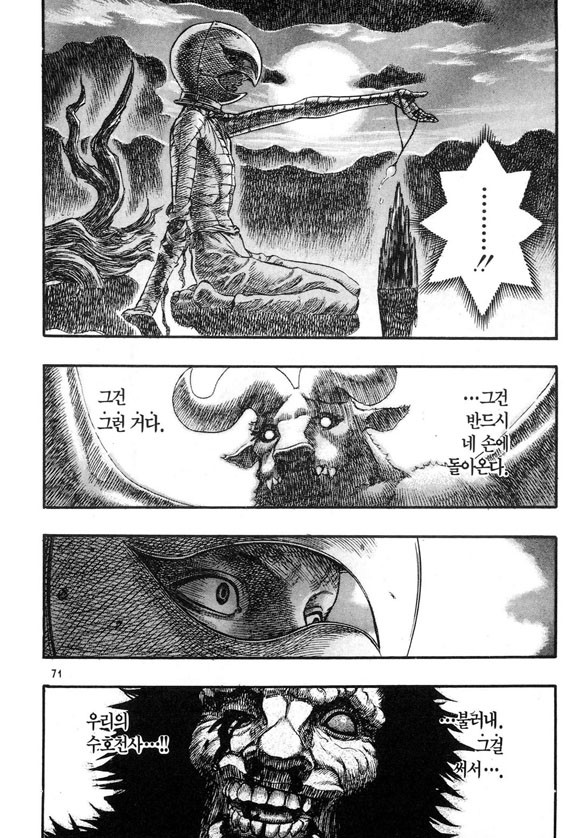](#)

베르세르크

​

마찬가지로 그 추억을 다 버려야 되는데,

약-간은 **저런 느낌**도 없잖아 들 수가 있음

​

흠, 그리고 사실 론 울프? 쉽지도 않고

**내가 나로 온전히 혼자 일어난다는 것**이

​

솔직한 말로, 인간이 평생을

걸고 하는 업적 작업이기도 함

​

저도 뭐 정확히 신이 어떠한

실존적 존재인지는 모르겠지만,

​

거의 근래?까진 아무튼 있긴 있고

그런 대단한 존재가 내 편이고,

나를 돕는다 이런 생각 종종 했었음

​

**\* 신천지 나와서도**

​

근래 들어서는, 그냥 그런 것 없고

​

내 양심의 소리가 신의 목소리다

뭐 이런 수준의 인식까지 왔는데

​

**\* 먹고살기 바쁜데 뭔 귀신이여,**

**그냥 내 인생이나 살피면서 살자**

**​**

솔찌 이런 사고방식이 과거에 비해

내 정서적 안정에 더 도움 되진 않긴 함

​

**\* 이제 돌아가기엔 너무 멀리 와버렸고**

​

그럼에도 불구하고 무언가에 대한

의존이 없어지니 많이 자유로워졌음

​

내 선택, 내 결정에 대해 책임지는 것

이 게임의 키가 나에게 있음을 실감하는 것

​

내가 살고자 하는 형태로 내 인생을

드라이빙 할 수 있는 그런 것들에서

오는 행복이 있다는 것도 알게 된 듯함

​

[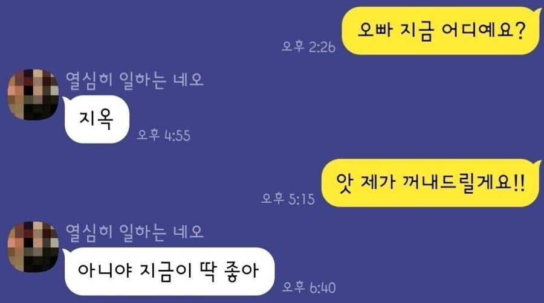](#)

​

이건 천국보단 지옥에 가깝고,

꽃밭보단, 가시밭길에 가깝지만

​

당사자 입장에선 꽤 나쁘지 않음