# 좋은 화장품 고르는 방법
**Date:** 2024. 10. 2. 10:13
**Category:** 다이어리
**Original URL:** https://blog.naver.com/xpfkwh56/223603994189
---

[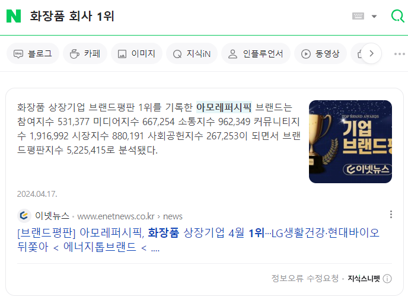](#)

​

직관적이죠?

​

아모레퍼시픽 나오네요

​

[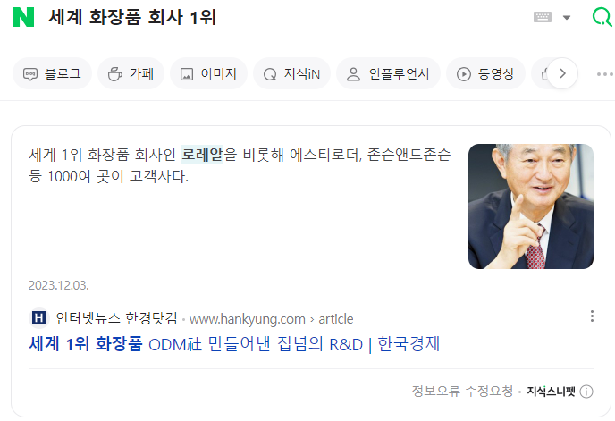](#)

​

세계 1등은 로레알

아모레퍼시픽 vs 로레알?

​

둘 중 누가 1등이지?

그보다, 1위라는 기준은 뭐지?

​

브랜드 가치 1위랑,

매출 1위로 구분되는데

​

브랜드 보다는

매출이 정량적이죠?

​

[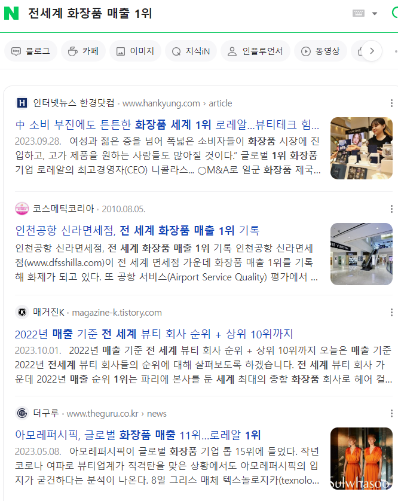](#)

​

로레알이 1위인 것 같습니다

​

그럼 누가 그걸 정할까요?

​

[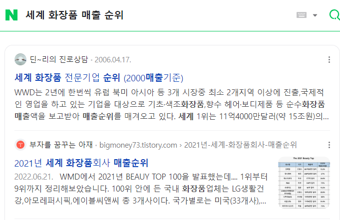](#)

​

WWD, WMD 라는 글자가 보입니다

​

[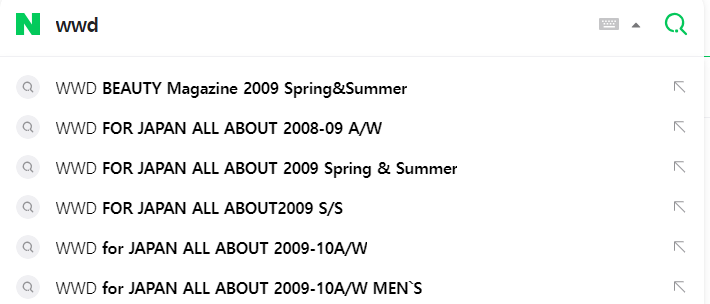](#)

​

벌써 답이 슬슬 나오네요

​

[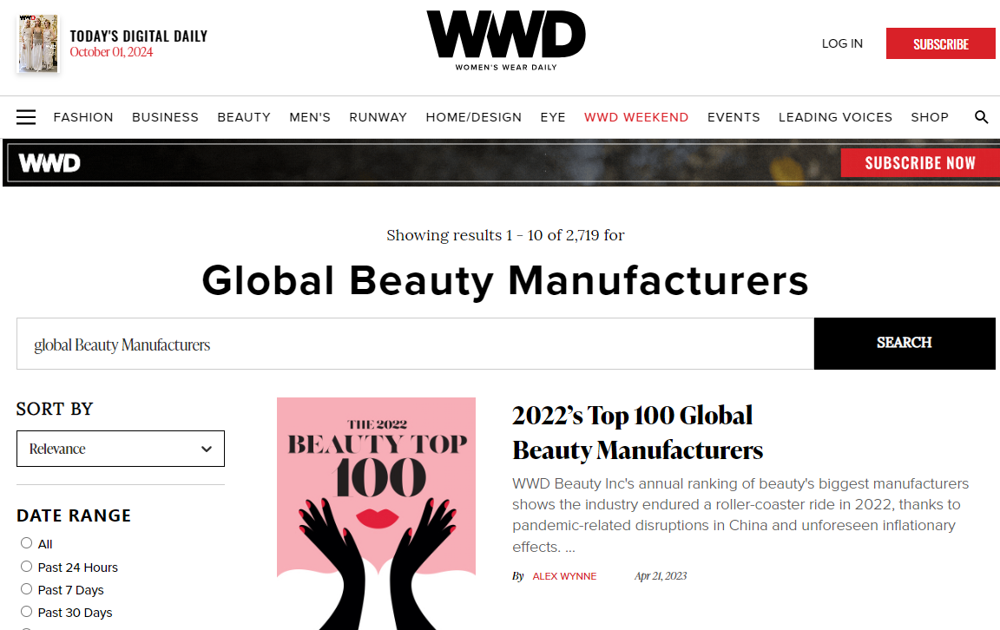](#)

https://wwd.com/beauty-industry-news/beauty-features/2022-top-100-global-beauty-manufacturers-1235621361/

​

WWD 라는 매거진에서 발표하고 있네요

​

Beauty Companies,

Report 등으로 검색하면

​

[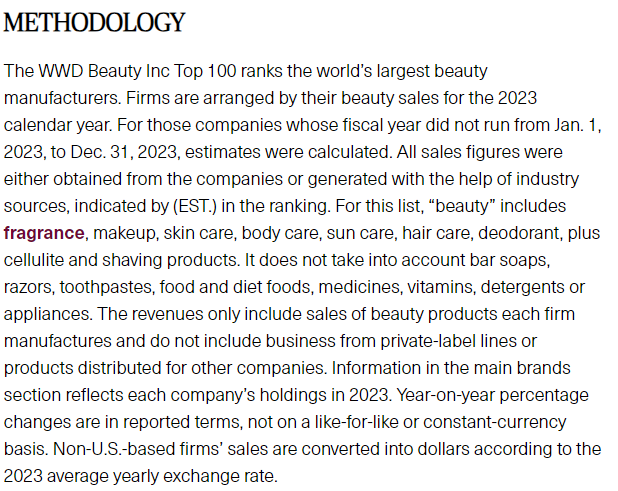](#)

https://wwd.com/lists/top-cosmetic-companies-2023-1236299225/loreal/

​

23년 기준으로, 뷰티 제품 한정

1등부터 100등까지 회사 뜹니다

​

이제 여기서 **띵킹**이 필요합니다

​

**'좋은 화장품'**, 일단 **'팔아도 되는'**

화장품은 어디에서 감독을 할까요?

​

[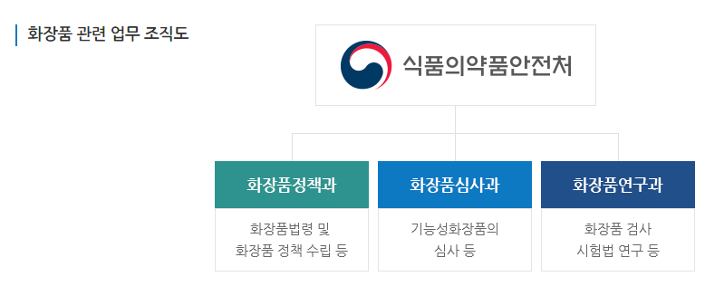](#)

https://www.mfds.go.kr/wpge/m\_639/de050601l001.do

​

식약처에서 하고 있다고 합니다

​

[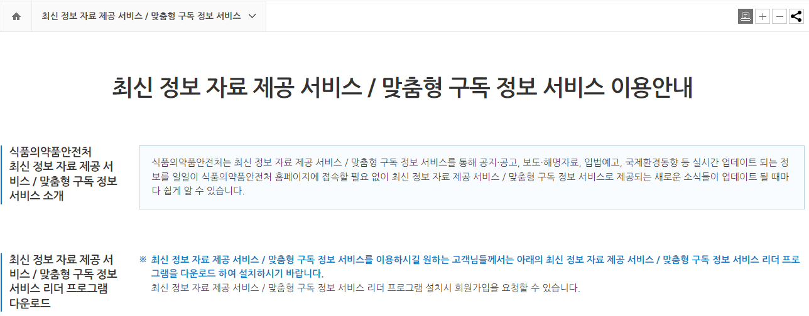](#)

https://www.mfds.go.kr/www/rss/list.do

​

둘러보면 또 **말도 안 되는 짓** 하고 있죠?

​

**\* 홍보가 안 될 뿐**

**​**

**첨부파일**

기능성화장품+심사+질의응답집+(민원인+안내서).pdf

[파일 다운로드](https://download.blog.naver.com/open/28bd348790c5cc103dddb389b3522253f0a05eba49/EFsQabZKxL3O9d5RLuoSggWaFwbSq_x2cV8UKD1m_gMvG422UHQv7v22D4kO5C1G3Drwbkf77qSu6P2z5rptnmGgKGZSSvo/%EA%B8%B0%EB%8A%A5%EC%84%B1%ED%99%94%EC%9E%A5%ED%92%88%2B%EC%8B%AC%EC%82%AC%2B%EC%A7%88%EC%9D%98%EC%9D%91%EB%8B%B5%EC%A7%91%2B%28%EB%AF%BC%EC%9B%90%EC%9D%B8%2B%EC%95%88%EB%82%B4%EC%84%9C%29.pdf)

**첨부파일**

6.+기능성화장품+심사의+이해.pdf

[파일 다운로드](https://download.blog.naver.com/open/1a8f06b5a0fdfe220fef81bb81601061c2926c88f5/EFsQabZKxL3O9d1ZLuoSggWaFwbSq_x2cV8UKD1m_gMvG422UHQv7ve4CIEO-ER3qU_xbkf77oaLlPhlL0Q1d8d95jyTyOU/6.%2B%EA%B8%B0%EB%8A%A5%EC%84%B1%ED%99%94%EC%9E%A5%ED%92%88%2B%EC%8B%AC%EC%82%AC%EC%9D%98%2B%EC%9D%B4%ED%95%B4.pdf)

**첨부파일**

7.+화장품+표시+광고+지침+및+위반사례+등+안내.pdf

[파일 다운로드](https://download.blog.naver.com/open/78ed64d4c59b9c406d8de3d9e3027203a0f00eea71/EFsQabZKxL3O8Nw2E-QRigSVEg-Y_PRgfEMLdT4PkAUqHoK8W3Ql6vq4A-889y5gq0-dQVP5sRfw6XevTpfF05kRNiWaFg/7.%2B%ED%99%94%EC%9E%A5%ED%92%88%2B%ED%91%9C%EC%8B%9C%2B%EA%B4%91%EA%B3%A0%2B%EC%A7%80%EC%B9%A8%2B%EB%B0%8F%2B%EC%9C%84%EB%B0%98%EC%82%AC%EB%A1%80%2B%EB%93%B1%2B%EC%95%88%EB%82%B4.pdf)

​

기출 자료를 찾은 다음에,

​

[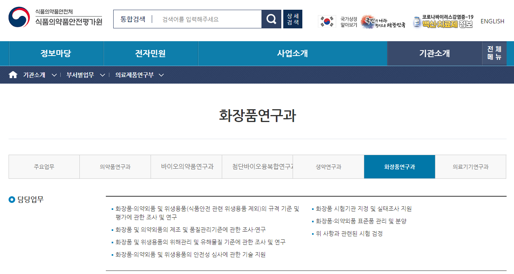](#)

https://www.nifds.go.kr/org/m\_417/deptInfo.do

​

**탑다운** 방식으로 찾아갑니다

​

이 과정이 복잡하면, 국민 신문고에다가

내가 이런 것들이 궁금한데 어디서 찾냐?

​

하면 됩니다

​

[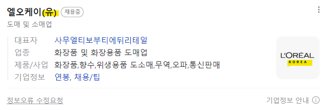](#)

외국계 기업이 '유한회사' 하는 것은 과학

​

제가 궁금했던 것은 이겁니다

​

물론 인수합병이 있긴 하겠지만,

​

로레알은 불란서 회사인데,

​

전 세계인들한테 다 똑같은

화장품을 제공해서 판매한다?

​

맥도날드 햄버거를 미국인이 먹나,

한국인이 먹나 효과야 똑같겠지만

​

걔네한테 팔리고, 우리한테 팔리는

제품의 로컬라이징 레벨이 다른데

​

화장품이라고 같은 **기능**을 하는가?

​

[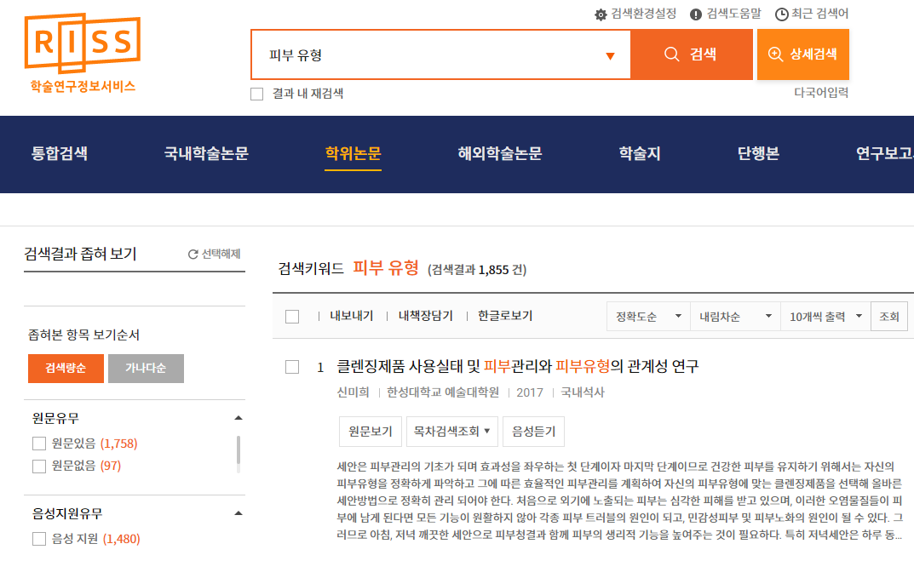](#)

https://www.riss.kr/index.do

​

똑똑한 분들이 연구한 내용을 보면,

일부 차이가 있다는 것도 확인이 되고

​

[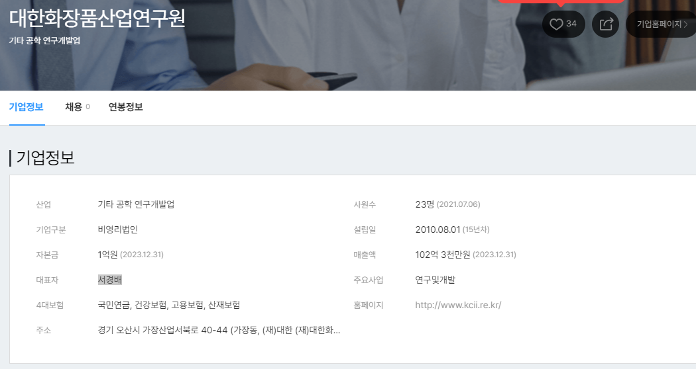](#)

서경배?

​

민간에 있는 큰 연구원인데,

​

[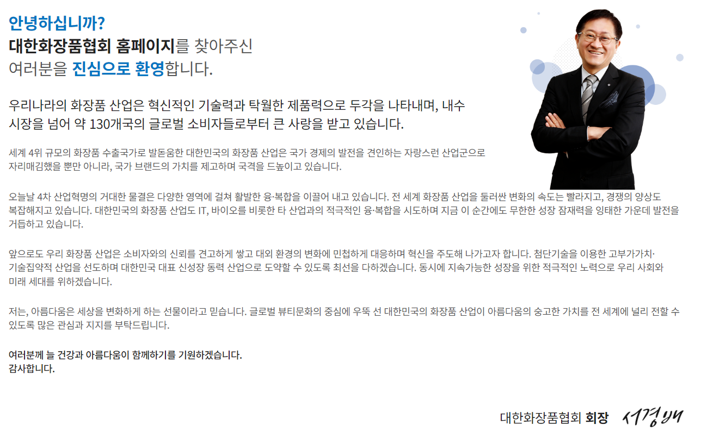](#)

관치는 사이언스

​

개인마다도 차이가 있는데

**당연히** 차이가 있을 수 있다

​

라는 결론에 도달하게 되었습니다

​

[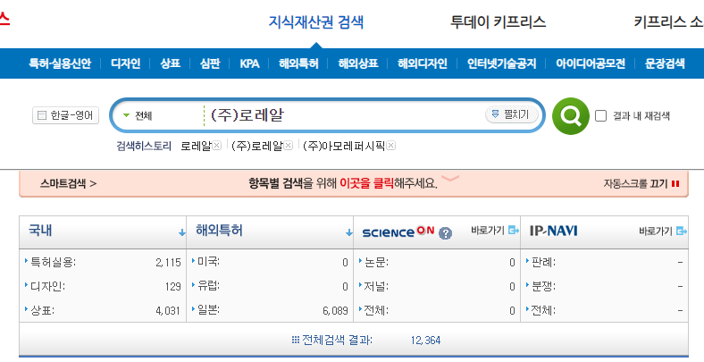](#)

http://www.kipris.or.kr/khome/main.jsp

​

제가 궁금한 것은 **기능성**이므로,

​

1) 매출 규모가 높아, 사업 와꾸가 큰 회사

2) 기술력을 과학적으로 증명한 상품

​

2개의 키워드를 얻었고, 그걸 찾으면 됩니다

​

먼저, 규모가 큰 회사는 **'감시'**에 더 잘 걸립니다

**​**

동네 식당에서 밥 먹다가 쥐가 나오든,

개가 나오든, 배탈이 나든 **알빠노** 인데요

​

백종원 프차에서 식중독 나오면,

높은 확률로 바로 국감이 뜰 겁니다

​

**\* 특허 만료된 기술로, 똑같이 만든다고 해도**

**좋소에서 살 바에는 차라리 대기업 사는 이유**

​

2번은 내가 잘 모를 수 있잖아요?

​

그러니까 정부, 학계, 기업, 셋에서

도움을 받아야 되는데 제 기준에서는

나라를 제일 믿기 때문에 여길 봅니다

​

**\* 불이익을 줄 수 있는 권력을 보유**

**​**

그럼 저 많은 허가 받은 제품들 중에서,

​

식약처에 허락받았을 때 어떤 근거로

어떤 효과를 기대할 수 있는 정도로다가

​

판매까지 이루어졌는 것인지 확인이 되고,

내 요구에 맞는 상품을 사는 것이 가능합니다

​

**기능성 말고, 체감에 따라 다른 것들은요?**

​

그렇게 가면 정성 요소로 바뀌기 때문에

샘플 받아서 내가 써보기 전까진 모릅니다