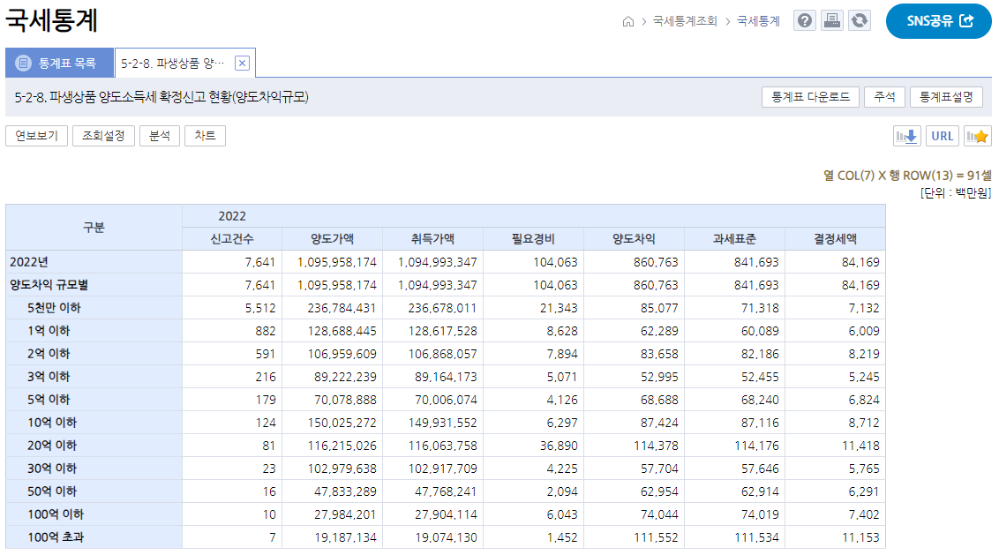

# 상위 1% 파생 트레이더
**Date:** 2024. 10. 3. 15:26
**Category:** 갓생추구
**Original URL:** https://blog.naver.com/xpfkwh56/223605512647
---

https://tasis.nts.go.kr/websquare/websquare.html?w2xPath=/cm/index.xml

​

전체가 몇 명이 하는 줄은 모르겠구요

국세 통계 기준, 무조건 **1%** 안에 듭니다

​

**\* 어떻게 기준 잡아도 상위 1%**

**라는 표현이 오만은 아닐 겁니다**

**​**

​

겸손을 잠깐 빼고 말하면요

제발 비빌 사람한테 비비세요

​

누가 누구한테 매매를 논합니까?

​

2만원이고, 공짜고

그걸 제가 왜 들어요?

​

**\* 누구 말 인용하자면,**

**오히려 저야말로다가ㅋㅋ**

**제 시급이 대체 얼만데?**

**​**

혹시나 하는 마음에 남기면,

이거 보고 따라 하진 마시구요

​

**\* 팔자 망가집니다**

**파생은 정말 위험합니다**

**​**

현물도 남들보다 못해서

얘기 안 하는 것 아닙니다

​

<https://blog.naver.com/xpfkwh56/222971645383>

[**주린이 6500만원 입금!**

23년 목표 수익률은 12%(780만원) 입니다!

blog.naver.com](https://blog.naver.com/xpfkwh56/222971645383)

​

저는 현물 트레이딩도

​

<https://blog.naver.com/xpfkwh56/222989056625>

[**주린이 승리의 매도하엿읍니다!**

우수리 띠니 1천만원 나왓읍니다 돈 빼려고 하니까 3일이 걸린다고 하더군여,, 환전 속도가 불건전하네요,,...

blog.naver.com](https://blog.naver.com/xpfkwh56/222989056625)

​

시작하자마자 벌었구요,

​

<https://blog.naver.com/xpfkwh56/223022318667>

[**해외선물 3주차 아반떼 폐차했읍니다**

인간미 없는 장이엿읍니다

blog.naver.com](https://blog.naver.com/xpfkwh56/223022318667)

​

파생도 수도 없이,

​

<https://blog.naver.com/xpfkwh56/223043309560>

[**집 나간 제 아반떼가 돌아왔읍니다**

나스닥, 너의 패인은 내게 차트를 너무 오래 보여준 것이다. 『길』을 막지 마라, 이 녀석!

blog.naver.com](https://blog.naver.com/xpfkwh56/223043309560)

​

**내 돈 넣고, 이기고, 지고** 반복했구요

​

<https://blog.naver.com/xpfkwh56/223092990600>

[**해외선물로 1억 벌었습니다!**

학력은? 고졸 푸하하하하핳!! 직업은? 상위 1% 해외선물 트레이더 히이이이익!!

blog.naver.com](https://blog.naver.com/xpfkwh56/223092990600)

​

어디 가서 사발 불 정도는 됩니다

​

괜히 어그로 끌려서, 사람들한테

헛바람 줄까봐 얘기 안 하는 거죠

​

**\* 나 자신이 행운과 재능의**

**수혜자란 것은 확실하기 때문**

​

<https://blog.naver.com/xpfkwh56/223120595647>

[**파생해서 수익 나는 비율은 얼마나 될까?**

기준값 250만 이상 수익을 낸 사람들, 즉 1부 리그 기준으로 하면 저렇고 18년 1분기 기준, 해선 참여자가 ...

blog.naver.com](https://blog.naver.com/xpfkwh56/223120595647)

​

스스로를 등불 삼고, 주인이 되세요

​

본인 돈으로 하실 것이니까,

남의 의견은 재미로 보시구요