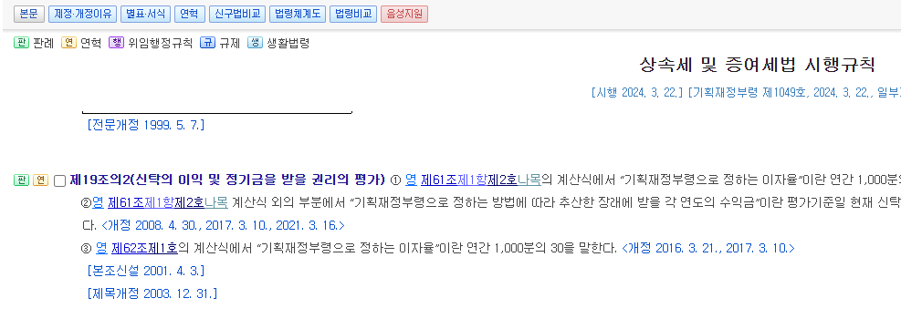
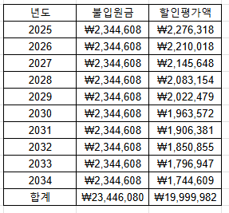
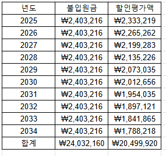
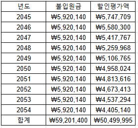
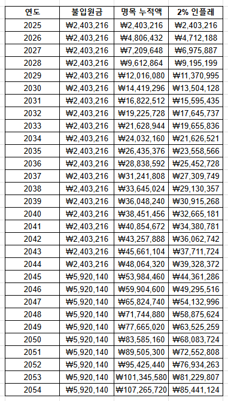
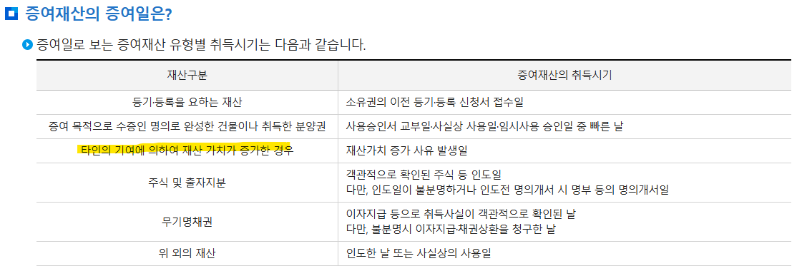

# 재미로 보는 자녀 증여 관련한 이야기
**Date:** 2025. 1. 12. 14:35
**Category:** 빈집의 모험
**Original URL:** https://blog.naver.com/xpfkwh56/223723353795
---

**1. 미성년자일 때, 2천만원까지**

**비과세 찬스 받아서 증여 가능함**

​

**아, 아무튼 2천 증여하면 되는군? (x)**

​

여기에 잡기술을 적용할 수 있는데,

​

https://www.law.go.kr/LSW/lsInfoP.do?lsiSeq=104141#0000

​

상속세 및 증여세법 시행규칙 제19조2

(신탁의 이익 및 정기금을 받을 권리의 평가)

내용에 따르면, **3% 할인율** 규칙이 발동함

​

**아, 아무튼 2천만원의 3%가 60만이니까**

**2060만원 해서 60 더 증여할 수 있군? (x)**

​

매년 3%의 할인율을 적용하기 때문에

금융적으로 **복리 할인 효과** 가 발생함

​

각 연도에 받을 할인금액을 계산해서

**'미래금액/ (1+3%)^n'** 결과에 맞추면,

​

​

위와 같이 했을 때, **딱 2천**이 나옴

​

미성년자한테 원래 2344만원을

과세 요건으로 증여를 해주려면,

​

10% 해서 약 30만원 내야 되는데

그 부분에 대해서 안 주고 줄 수 있음

​

https://www.law.go.kr/%EB%B2%95%EB%A0%B9/%EC%83%81%EC%86%8D%EC%84%B8%EB%B0%8F%EC%A6%9D%EC%97%AC%EC%84%B8%EB%B2%95

​

근데 상속세 및 증여세법 55조를 보면,

**과표가 50만원 미만일 땐**, 부과를 안 함

​

​

그래서 **총 2400만원**을 줄 수 있음

​

이 두 규칙은 항상 적용되기 때문에,

**​**

**증여할 때마다** 50만원 미만씩 맞추면

원래 줘야 되는 것보다 더 줄 수가 있음

​

https://www.nts.go.kr/nts/cm/cntnts/cntntsView.do?mi=2338&cntntsId=7726

​

흔히 상/증세라고 묶어서 말하곤 하지만,

증여세는 **'타인'** 에게 받는 재산이기도 함

​

상속세 및 증여세법 65조 1항에 따르면,

​

현금의 경우는 **유기정기금**에 해당하고,

​

최대 20년까지만 과세대상에 포함하므로

할인율 잡기술은 20년 단위로 쓸 수 있음

​

증여세법 제53조에 있는 공제 조항은

10년마다 나눠서 증여하는 방식이므로

​

태어나자마자 2천만원 증여하고,

11살이 된 10년 뒤에 2천만원 증여하고,

​

21살이 된 시점에 5천만원 증여하면

세금을 낼 필요가 없어진다는 이야긴데,

​

**\* 성년은 5천씩 가능**

**​**

​

위 방식을 사용하게 된다면

태어나자마자 증여 시작할 때,

​

10년 공제 2바퀴 돌아가면,

원래 9천만원 받았어야 되지만

​

107,265,720원으로

19.2% 정도 더 받을 수 있음

​

**\* 17,265,720원**

**​**

이제, 문제는 **인플레이션** 임

​

**\* 인플레 기준은 한은 목표치로 함**

​

​

위에 있는 표는, 쌔삥으로 1년 마다

인플레가 반영된 금액만큼을 불입하고

이미 넣은 돈은 겸허히 2% 맞았을 때임

​

결과적으로 약 25.5% 손해를 보게 됨

​

번 돈이 아니라, 이미 쥔 현찰이라고 하면

​

20년 후 33.2% 감소하게 되고,

만약 3%씩 감소하면 60% 감소함

​

**\* 아마 장기적으론 3% 언더일 것**

​

그럼 **최소 1년에 3% 이상**은 보전해야 됨

​

여러 가지 방식이 있겠지만,

​

가장 무난한 3대장이

**ISA, IRP, 연금저축** 임

​

어떻게 어떻게 잘 찾으면

방법이 없는 것은 아닌데,

​

**연금저축** 말고는 많이 애매함

​

과세이연, 비과세, 특례 붙어있고

1년에 얼마 이상 못 넣게 해놨으면

대부분은 대놓고 쓸모가 있단 것임

​

https://www.nts.go.kr/nts/cm/cntnts/cntntsView.do?mi=2338&cntntsId=7726

​

국세청 홈페이지 들어가면,

흥미로운 멘트가 눈에 보임

**​**

**'타인의 기여에 의하여**

**재산 가치가 증가한 경우'**

​

사실 부모님이 짤짤이로 애 계좌 굴려서

얼마 벌었다고 문제 될 가능성은 낮겠지만,

​

포괄주의가 **깡패**란 점은 알아둘 필요 있음

​

**\* 시댁에서 쌈짓돈 현찰 용돈 줘도**

**아님 말고, 걸리면 그냥 걸리는 것임**

**​**

2. 자산가들이 활용한다는 비밀스러운 무엇,

남들은 모르지만 어딘가에는 필시 있는 빈틈

​

없진 않은데, 내 눈에 먼저 보인 경우가 아니면

세무/회계 관련 전문가가 Ok 딱지 낸 것 아니면

​

보통은 **가십**으로 소비하셔도 충분한 내용임

​

위 내용도 얼핏 신기한 이야기한 것 같지만,

**아무 세무사나 붙들고 물어봐도** 아는 내용임

​

25년 기점으로, 알음알음 꿀을 빨던 것 중 하나가

같은 1주택이라도 **단독**이 아파트보다는 유리해서,

​

**'아직은'** 나름대로 해먹을 수 있는 구석이 있었는데

​

그나마도 아닌 말로 몰라서 안 잡던 것도 아니고

다른 애들 바삐 잡는다고 안 건드린 것이기 때문에

​

절세 관심 있으면, **'가능한'** 미리

​

**\* 당장 닥쳤을 때 알아보면,**

**반공 주의자 될 가능성이 높음**

​

세무사, 회계사 찾아다니면서

자문도 받고 알아보는 쪽이 나음

​

**한편, 메이저하고, 오피셜한**

**자산은 도망 못 간다고 봐야 됨**

​

**\* 이미 온갖 사람들이 머리를 잔뜩 굴려놔가지고**

​

MZ들이 자주 말하는 아파트 기준으로,

그냥 **무난하게** 증여 관련 뚜드려 맞는다면

​

30억 아파트 기준 = 10억 정도

40억 아파트 기준 = 15억 정도

​

**\* 물론 공제가 있지만, 보유 비용은 셀프**

**​**

낸다고 얼추 알아놓고 있으면 됨미다

​

인터넷 보면, 와이프한테 공동명의 어쩌고 하죠?

막상 그 입장이 된다면 며느리한테 증여도 합니다