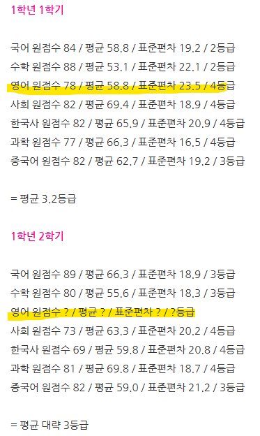
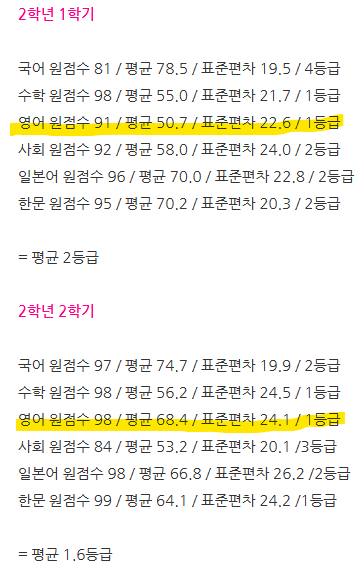
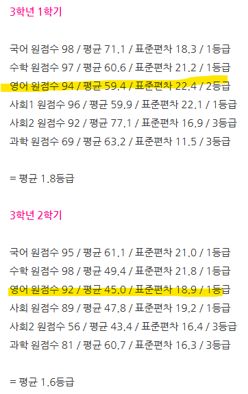
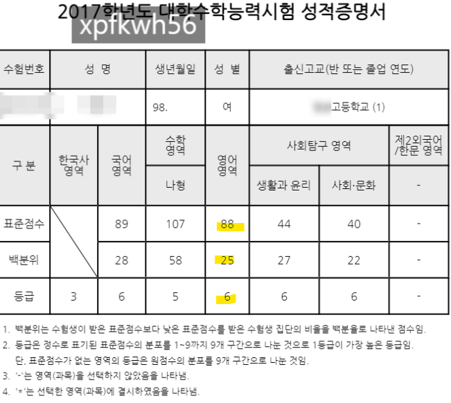

# 토플 104점
**Date:** 2025. 4. 8. 15:53
**Category:** 갓생추구
**Original URL:** https://blog.naver.com/xpfkwh56/223826286629
---

​

1. 애가 나오면, 일반적인 중고딩 단계 까진

엄마 레벨선에서 커버가 가능하지 않을까 싶음

​

물론 학업이야 본인이 해서 거둘 문제지만,

애가 물어볼 때, 내가 대답을 할 수 있길 원함

​

**\* 안 물어보면 그거야 본인 팔자인 것이구욬ㅋ**

**​**

토익은 2년 전? 쯤에 공부하다가,

내 목적이랑은 좀 다른 것 같아서 관둠

**​**

리딩, 리스닝 = 독학

스피킹, 라이팅 = 과외 받음

​

**\* 영어를 듣거나, 읽을 일은 쫌 있는데**

**쓰고 말할 일은 거의 없어서 불가피 했음**

​

취미 토플이라 시간 제약도 없었고,

딱히 어디 제출할 필요도 없었기 때문에

​

부담없이 했지만, 필요에 의해 한다면

제가 했던 방식이 효율적이진 않을 것임

​

**2. 고등학교 생활 기록부**

​

<https://blog.naver.com/xpfkwh56/223569787101>

​

**3.** **수능 성적표**

**​**

<https://blog.naver.com/xpfkwh56/222970684214>