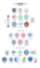

# [공지]자기소개
**Date:** 2025. 5. 18. 5:29
**Category:** 안내방송
**Original URL:** https://blog.naver.com/xpfkwh56/223869200189
---

**1. 98년생 유부녀**

​

내가 확인할 순 없었지만 아빠피셜,

​

충청도에서 벽돌공장 하던

할아버지 밑에서 일하다가

공장이 문을 닫으면서 귀농하고

농사꾼 테크 탄 **아빠**

​

지금 같은 티어는 아니고,

지방에서 교직원으로 직장 다니던

**엄마** 밑에서 2남 1녀의 막내딸로

​

**\* 엄마도 일 때려치고, 농사 같이 함**

**두 분은 여전히 계속 농업 종사중이고**

**​**

**큰 오빠 개발자 출신 사업가**

**작은 오빠 직장인 개발자**

**​**

충청도 청양에서 출생

깡시골에서 초등학교 다니다가

​

도내로 유학 가서 나름

충실한 학창 시절을 보냄

​

**\* 중/고등학교 전교권, 특별 장학생**

**​**

2. 흙수저에 가깝지만

크게 부족함 없이 성장

​

적성 vs 성적 맞춰 대학 가기

진학 고민하다가 예체능 결정

​

**\* 지금 블로그 하듯,**

**그림 그리고 살았어서**

**실기도 꽤 자신 있었음**

**​**

**​**

중앙대 미대

1학년 입학과 동시에

​

아빠가 사기당해서

집안이 제대로 망함

​

알바 병행하면서 공부하다가

​

**\* 1학년 학점 평균 4.03**

​

대학교 자퇴

직업 전문학교 입학

​

핑계 댈 거리 많지만, **쨌든**

성적 미달로 장학금 못 받음

​

직업 전문학교 자퇴

​

**\* 대강 요 시기에, 태어나서 처음**

**연리 20%짜리 생활비 대출받아서**

**급한 불 끄고 어찌저찌 갚아봤음**

**​**

신천지 1-2년 다니다 관둠

​

나와서 노동부

직업 교육받고 취직

​

취직한 회사에서 **귀인 찬스** 걸림,

여자 대표님이 일 잘 한다고 밀어줌

​

**\* 미친년처럼 열심히 살았음**

**​**

이 시점에 **행운과 재능** 터지면서

본격적으로 내 팔자가 바뀌게 됨

​

3. 21년? 쯤,

귀인 찬스로 사업 시작

​

**\* 실질적 창업**

**​**

22년 형식적 창업

사장 노릇하면서 살게 됨

​

22 하반기 = 매출 약 5억

23 상반기 = 매출 약 9억

23 하반기 = 매출 약 40억

​

23년 국세 약 7천만원 납부,

지방세 약 700만원 납부

​

**\* 청년 창업 감면 50% 대상**

**​**

24년 5월 해외선물

양도세 약 8천만원 납부

​

**\* 약 10억 수익**

**​**

24-25년 비즈니스 엑싯

순자산 20억 이상 확보

​

**\* 남편이 들고 온 돈 빼고**

**오로지 내 재산만 따졌을 때**

**20억 이상 들고 시집 갔음**

**​**

경제적 자립한 시점부터,

​

취미 삼아서 7급 공시라던가

여러 자격증 공부하면서 지냄

**​**

4. 외모, 집안, 능지, 인성, 능력,

그 외 여러 가지 두루두루 따진 후,

​

약 2년 정도 관찰+썸 타던

맘에 드는 사업하는 남자랑

​

23년 x월 실질적 결혼

24년 y월 형식적 결혼

24년 z월 임신

25년 a월 출산 예정

​

임출육에 욕심이 많았어서,

원래 전업 주부 하려고 했었구

​

결혼 후, 아동학/가정학/교육학 테마로

전문 학사에 준하는 학점까지는 땄고

​

나중에 아이들 낳고,

숙제 봐줄 정도까지는

인강 들으면서 독학함

**​**

**\* 국, 영, 수, 사, 과 가능**

**대학교 1-2학년 전공까지는**

**자녀 학업 런닝 메이트 가능**

​

현재는 신랑 뒷바라지 + 살림

양육자 포지션에 전념 중임

​

**\* 물론 커리어 조온-나 아깝지만,**

**모든 것을 가질 순 없다고 생각했음**

**​**

**5. 특기**

​

1) 남조선 **시스템 이해도** 높다고 자부

​

2) 정책이나, 정세에 맞게

요구되는 전략적 설계 잘 함

​

3) 오퍼레이팅 잘 함

​

적은 자원으로 고효율 내기 잘 함

귀찮은 일 인내심, 성실하게 잘 함

​

**4) 리스크 컨트롤 매우 자신 있음**

​

좋소형 특화 인재에 가까워,

고생하면서 갈리는 것 잘 함

​

여자로서도, 사회인으로서도

난 가성비 좋은 편이라고 생각

​

**6. 스펙**

​

키 164cm 몸무게 50 초중반

하얗고 서글서글하게 생김

​

**\* 미혼 시절, 공부 열심히 했던**

**남자들한테 인기 많은 편이었음**

​

18개월 언더로 애 많이 낳을 생각이라

현재는 +18kg 벌크업 상태

​

**\* 연년생 낳으면 여자 건강에 별로 안 좋아서**

**쿨타임 짧게 가져갈 것이면 건강 챙긴 후에,**

**필시 의사랑 상담하고 자녀 계획해야지 좋음**

**​**

7. 사주

​

<https://blog.naver.com/xpfkwh56/223566565797>

[**사주**

저야 뭐 사주는 1도 모르지만 무서운 글자가 너무 많은데요? ,, 요런 콘텐츠는 좋은 얘기 나오면 기분 좋게...

blog.naver.com](https://blog.naver.com/xpfkwh56/223566565797)

​

mbti 인팁

​

본문에서 제시한 내용에 대한 증빙은

​

갓생추구 카테고리를 포함하여

여러 포스팅을 통해 확인할 수 있음