# 엄마표에 있어서, 생각함직한 포인트
**Date:** 2025. 6. 4. 14:46
**Category:** 다이어리
**Original URL:** https://blog.naver.com/xpfkwh56/223888324982
---

1. **무엇이 더 좋으냐** 가 아니고,

**내 강점을 파악**하는 것이 우선 같다

​

바로 예를 들어보자,

​

**육아에서 제일 어려운 점이 뭘까?**

내 생각에는, **조별 과제**라는 것이다

​

학창 시절, 아직 학생인 분들은 헷갈리겠지만

조별 과제의 목적은 **'의외로'** 성적이 아니다

​

좋은 결과를 성취하는 것은, **'함께'** 갖추면

더 좋은 것이지 생판 모르는 다른 남과 같이,

​

공동 프로젝트를 수행한다는 것에 의의가 있다

​

학교만 졸업하면, 인생도 졸업이라면

이 문제는 아주 쉽게 풀 수 있는 문제지만,

​

**사회에서 겪는 조별과제**는 매우 난감하다

​

하물며, 보통 남편이 하게 되는

**육아 파트너와의 공동 작업**은 더 그렇다

​

일반적인 남자들은, **'말이 통하기 전'** 까지

**아이를 짐승으로 간주하는 경향성**이 강하다

​

**\* 대략적으로 만 5세 이후가 지난 시점에,**

**스님들 선 문답하듯, 한 두 마디 틱 던져서**

**깨달음만 던져주면 애가 될 것이란 기대를 함**

**​**

물론 애착 이론을 비롯해, 아동과 교육에 관한

다양한 고등 지식을 갖추고 있다면 노상관인데

​

대개, 바쁜 남자가 시시콜콜 그걸 볼 리가 없다

​

**유인물**을 쌓아다놓고, 일일 과제를 갖다 바친들

학업에는 생각도 없는 아들램, 딸램을 닦달하면서

​

**'너가 이걸 해야 대학 같은 대학을 간다니까?'**

라고 혼자 발만 동동 구르는 엄마가 될 것이다

​

나는 급하고, 정보의 격차는 있는 상황

따라올 수 없는 팀원이 있다면 **화**가 난다

​

[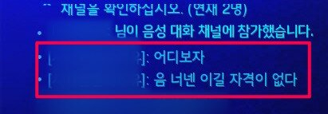](#)

​

그렇다, **기출화** 되는 것이다

​

나는 과거, 직장에서 조직 관리를 할 때

그 부분에 대한 경험적인 깨달음을 얻었다

​

신중하게 채용한 이후에는,

**'절대'** 바로 업무를 주지 않았다

​

대신 다른 사람들이 하고 있는 업무를

**관찰**하고, **정리**하고, **분석**하라고 했다

​

어떻게 관찰하고, 어떻게 정리하고,

어떻게 분석하냐는 질문이 따라온다면?

​

어떻게 관찰하는 것이 좋을 것인지,

어떻게 정리하는 것인 좋을 것인지,

어떻게 분석하는 것이 좋을 것인지,

​

그 **'틀'** 을 만드는 것이 **님 업무** 라고 했다

​

**\* 다음에 고용될 직원을 위해 만들라고**

​

잘 모르겠으면? 괜찮으니까,

​

회사에 있는 동안

할 수 있는 만큼 해보고

​

도저히 모르겠으면

물어보면서 하라고 했다

​

**\* 뭔가를 증명하려고 애쓰지 말라고**

**​**

내가 겪은 좋소 오나질 경험에 의하면,

딱 **'물어보는 만큼'** 만 알려줘야 되는데

​

그 이유는 그 이상의 정보를 제공해봐야

**'들을 준비'**가 되지 않았을 확률이 커서다

​

이게 다른 집도 똑같은 줄은 모르겠는데,

내가 보는 유튜브는 동거인한테도 뜨나보다

​

신랑은, 어느 날이던가 3-4세가 된 이후에도

말을 할 수 없는 아이들에 대해 관심을 보였다

​

딱히 큰 문제가 없는데도 불구하고,

환경적인 요인으로 생길 수 있다는

​

**'문제 의식'**이 생겼던 것이 내겐 기회였다

​

[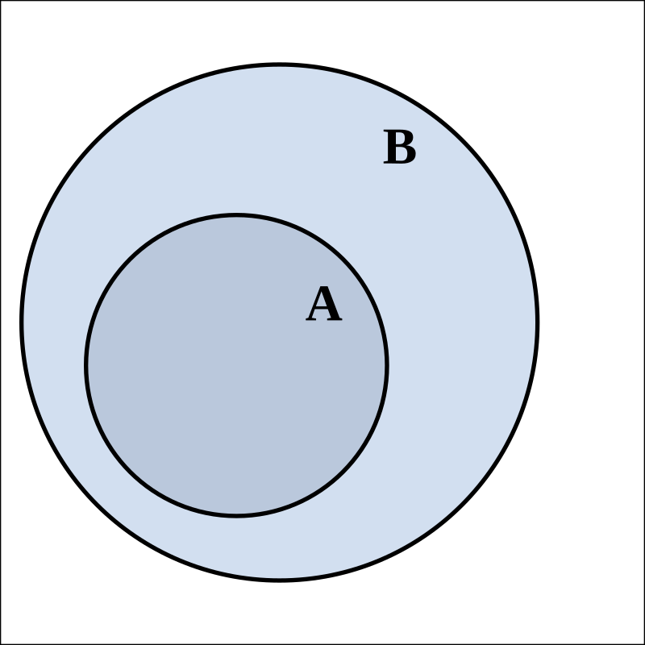](#)

​

나는 **신랑보다 더 많은 정보**를 갖고 있었고,

그가 어떤 것을 필요로 할 것임을 알고 있었다

​

1) 수용 언어의 누적값이 표현 언어로 표출된다

2) 수용 언어의 누적값은 정량화될 수 있다

​

라는 아이디어가 공유된 시점에서, 제안했다

​

만 0세에서, max 만 3세가 될 때까지

아이의 화용 어휘를 자극할 수 있는 표현을

제공하되, **책정할 수 있는 도구** 를 두자고

​

마침, 우리 집에는 놀고 있는 공기계가 많았고

휴대폰에 있는 녹음기 어플이 있었다

​

아직 언어 능력을 갖추지 않은 아이에게,

**어떤 상호작용에 근거한 대화**를 할 때마다

​

녹음기 버튼을 눌러서, 어떤 어휘를 사용하고

어떤 문장을 제공하고 있는지 **기록**하자고 했다

​

[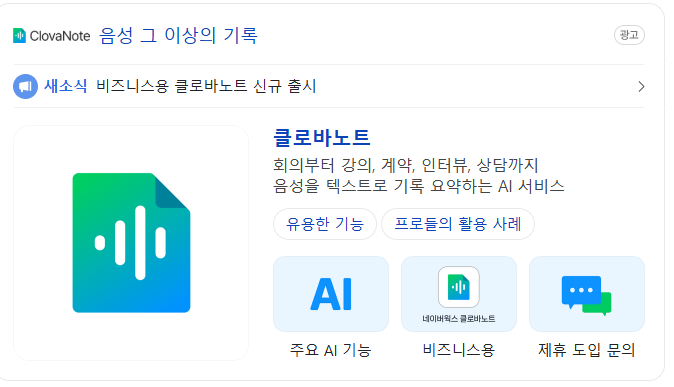](#)

​

일부 소형 기업들에서 사용하는 툴 중,

회의록을 텍스트로 변환하는 서비스가 있다

​

**클로바노트** 를 사용해서, 발화량을 기록한 후

​

어휘의 양태를 확인하면

추후 그 내용들을 기반으로

​

더 면밀한 차원의 판단을 내릴 수 있을 것이다

라는 가설에 관하여 **서로가 공유**할 수 있었고

​

**첨부파일**

한국어+학습용+어휘+목록.pdf

[파일 다운로드](https://download.blog.naver.com/open/78ed64d4c59b9c406d8de9dfe2057306a5f10fe484/EFsQaLdMxLvO8dk2E-QRigSVEg-Y_PRgfEMLdT4PkAUsEIq_UXgm6v2_De9j31Z0w0KdQVP5Aozay6bTNcr6fEVeOLMZtA/%ED%95%9C%EA%B5%AD%EC%96%B4%2B%ED%95%99%EC%8A%B5%EC%9A%A9%2B%EC%96%B4%ED%9C%98%2B%EB%AA%A9%EB%A1%9D.pdf)

​

국립언어원 (공공기관) 에서 발간한

현대국어 사용빈도 조사의 빈도 순위로 결정된,

​

빈출 어휘 목록을 기반으로 인형 놀이하듯이

활용성 높은 **'우선순위 어휘'** 를 확보할 수 있었다

​

[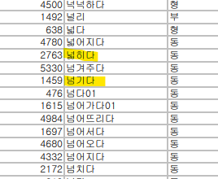](#)

​

넘기다, 라고 예를 들면

​

손가락으로 넘기는 **'제스쳐'** 를 통해

​

특별한 도구 없이 **'존재 자체가'**

교재가 될 수 있는 모습이 상상 갔다

​

넓히다도 마찬가지다,

​

**'넘기다'** 와 **'넓히다'** 라는 표현은

최소한 남조선에서 애를 키울 정도의

​

모국어 능력이 되는 부모님이라면

특별한 도구 없이 두 손만 있어도

누구나 표현할 수 있는 행위가 된다

​

이게 언어 학습 발달에 있어서,

얼마나 큰 효용을 주느냐는 둘째다

​

기대해 볼 수 있는 **진짜 효과**는,

신랑이 재미를 붙이고 애 앞에서

​

엄지와 검지를 붙였다 떨어뜨리면서

**'커졌다'**, **'넓어졌다'**, **'늘어났다'** 라고

설명하는 것에 **'재미'**를 붙이면 끝이다

​

**\* 엄지와 검지를 가위 모양으로 만들고,**

**둘이 붙었다 떨어지는 장면을 보여주고**

**​**

**이게 길어진다 라고 설명을 한 다음에**

**엄지와 중지로 똑같은 행위를 하면**

**​**

**아이는 어떻게 대답할 것인가? 같은 걸로**

**인지 수준이나, 발달 바로미터로 활용가능**

**​**

**역량은 숫자, 채점으로 쉽게 알기 어려움**

**지속적인 관심과 관찰, 전문성이 요구됨**

**​**

하나를 할 수 있다는 것은?

끝이 아니라, **새로운 시작**과 같다

​

**언어는 인간의 사고 밖을 벗어날 수 없다**

​

파도가 해안가를 부딪힐 때,

하얗게 거품이 이는 것을

​

**'포말'** 이라고 한다

​

바다에 햇살이 비추면서,

물 위로 빛나는 그늘을

​

**'윤슬'** 이라고 말하는데,

​

포말과 윤슬 이라는 **단어**를

앎이 중요한 것은 아닐 것이다

​

웅덩이, 내, 강, 개울, 바다 처럼

물을 표현할 수 있는 어휘는 다양하고

​

이 **'확장성'** 이 부모의 영역이라고 봤다

​

**\* 표면적 포인팅과 인지적 포인팅의 차이**

**​**

**바람과 나뭇잎의 마찰음을**

**표현하는 어휘는 뭐가 있을까?**

**라는 것이 더 본질적인 학습임**

**​**

**관찰이 선행되지 않으면**

**죽을 때까지 알 수 없으므로**

**​**

**공동의 문제의식**을 통해, **싱크**를 올리고

**관찰**에 기반해, **해상도를 향상**시키는 것이,

​

오픈 소스 기반, **공적 정보**를 기반으로

**목적에 맞는 의사 결정**에 활용하는 것이,

​

내가 지금까지 살아오면서 겪은

내 삶의 체험을 통한 교훈이고,

​

방법론적 측면에서 볼 수 있는

단편적인 사례일 뿐만 아니라,

​

대부분 **'삶에서 녹아나는'** 것들이라고 봤다

​

나는 나의 존재 자체로, 이와 같은

**'태도'**를 보여주는 것이 가능한 것이다

​

2. 보통 다들 그렇게 하니까, 라는 이유로

시작하는 방법도 물론 맞으면 상관이 없다

​

**\* 내가 무얼 하는 줄 알고 하는 것**

​

[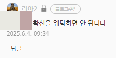](#)

​

그러나 막연하기 때문에, 하는 결정은

높은 확률로 **나와 안 맞는 옷**이 될 수 있다

​

**엄마표**로 가르칠 수 있는 것은,

수학도, 영어도, 다른 무엇도 아닌

​

**에티튜드** 라고 생각을 한다

​

아이의 관점에서 부모와 가정은

​

태어나, 가장 처음 관계를 맺는 인간

그리고 가장 최초로 속하게 되는 집단,

​

일 확률이 높은데, 이건 당연한 소리임

​

그 **'당연함'** 에서 시작을 하면,

**내가 무엇을 해야 될 것인가** 보이게 됨

​

**3. 제가 가졌던 질문 중, 하나**

​

1) 상증을 받는다는 것은 좋은 일

2) 그러나, 상증을 바란다는 것은 나쁜 일

​

**\* 집이 좀 괜찮게 산다고 해서,**

**인생 조진 사람 한 둘 본 것도 아님**

​

3) 가장 좋은 것은, 받지 않아도

스스로 개척해서 1인분 되는 것

​

4) 그럼 야생형 교육의 철학을 볼 때,

​

내가 만약 **'신생아'** 입장에서 태어나면

어떤 과제를 가장 먼저 수행해야 좋을까

​

5) 내 노력으로 얻어내는 것이 있어야 됨

​

6) 고작 **'태어났다는 이유'** 만으로

갖게 되는 것들은 어떤 것들이 있을까

​

7) **국적** 이다

​

[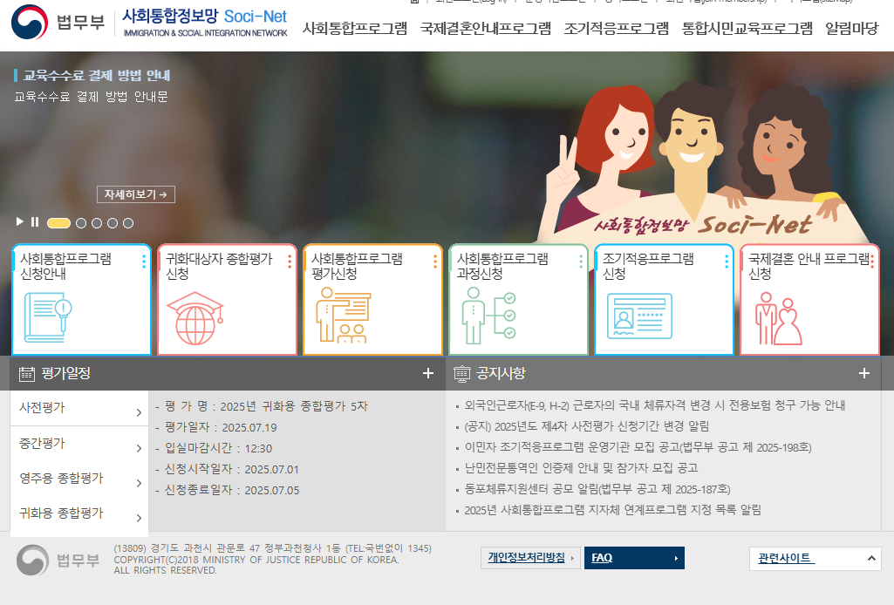](#)

​

남조선에는 **사회통합프로그램** 이라고 하는,

이민자를 대상으로 하는 **튜토리얼** 과정이 있음

​

[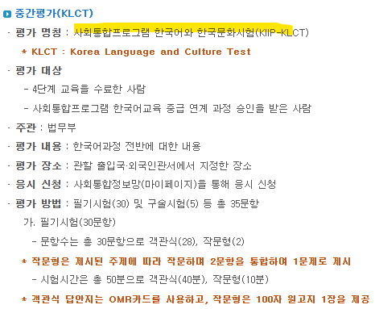](#)

​

최소한, 우리나라에서 살고 싶으면

이거는 알아야 된다 라는 과정인 건데

​

[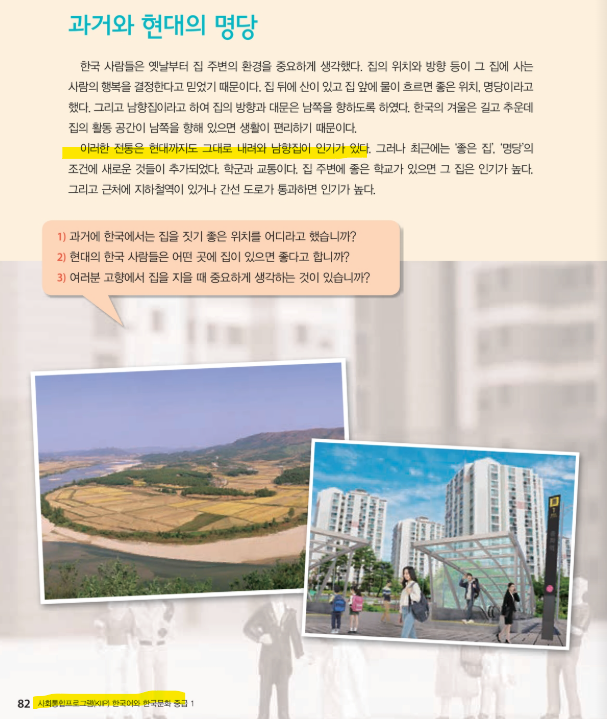](#)

​

일단 무엇보다 **교재도 공짜**고,

​

**20년 넘게 살아본 한국인 입장**에서,

​

[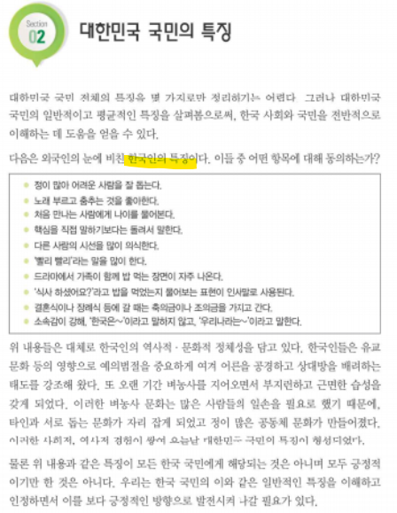](#)

[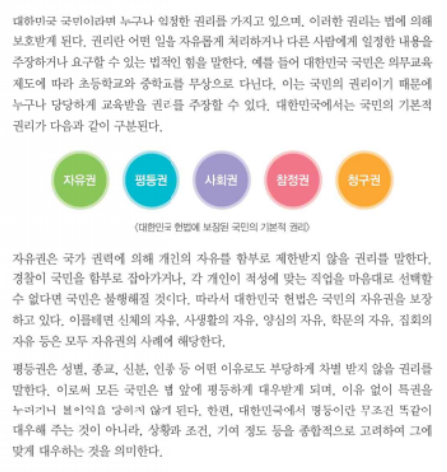](#)

[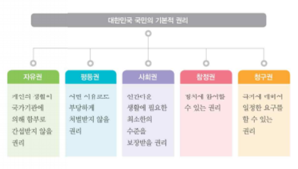](#)

[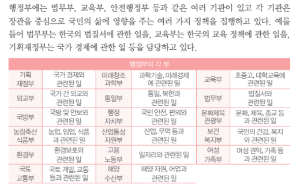](#)

​

다루고 있는 내용이

나쁘지도 않아보였어서

​

미취학-초등 시점에서 지도할 때,

참고 자료로 괜찮다고 생각을 했음

​

사자소학, 동몽선습이

뭐 별거 있겠냐는 것임