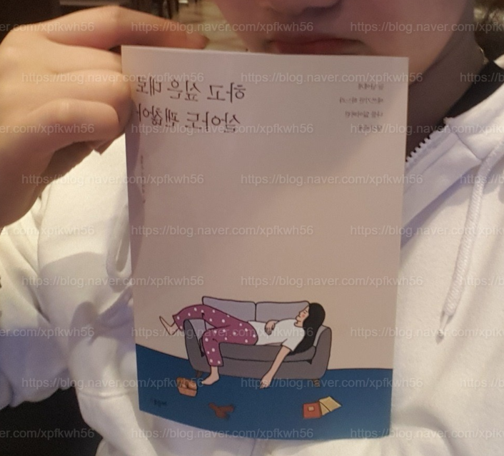
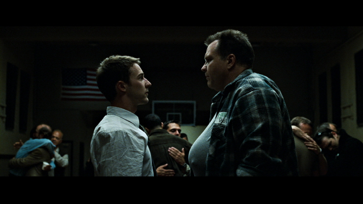
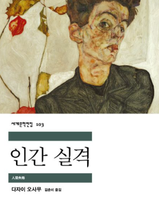

# 나는 재미로 노름을 하는 사람이 아니야
**Date:** 2025. 6. 30. 17:54
**Category:** 인기글 모음
**Original URL:** https://blog.naver.com/xpfkwh56/223916870162
---

​

1. 소녀들에게는

여러 패시브 스킬이 있다

​

공연히 알려진 것 중 하나는

​

1) **'착한 아이 콤플렉스'** 와

2) **'인생 성공하고 싶어 병'** 이다

​

2. 김리아가 다니던 대학교에는

비슷한 시기에 학교생활을 했다면

​

누구나 아는 **유명한 인사**가 몇 있었다

​

편의상, 그 사람을 A 라고 부른다면

A 는 남들이 끽해야 취직 정도 고민할 때

​

이미 사업적으로 **'꽤'** 성공을 이루었으며,

직원 n명 정도를 두고 자차를 몰고 다녔다

​

갓 스물에게는 메이쟈 슈퍼카가 아니더라도,

현기만 들고 돌아도 **'보통'** 은 아닌 취급이다

​

3. 김리아가 아는 것이 전부는 아니겠지만,

​

**'미대 출신'** 으로 밥을 먹고 산다는 것은

명백히 아주 높은 난이도를 갖는 일이다

​

집이 잘 살아서, **'취미'** 삼아 하는 것이 아니면

허울은 좋아도 실속은 없는 일이 **부지기수** 다

​

그러나 와중에도, 수완이 좋은 일부 학생들은

창업으로 방향을 틀어 벌이를 하고는 했었는데

​

**'분명'** 똑같은 20살로 시작했고,

당시를 기억하면 **더 솔직한 말루다가**

​

SKY도 아니고, 나랑 입학 성적도 똑같은데

자기 등록금을 벌어서 학교를 **'가볍게'** 다니는

​

그 친구들이 김리아를 포함, 많은 주변인에게

선망받는 존재로 취급되던 것을 경험한 바 있다

​

**\* 내 기억이 맞다면, 우리 학번에**

**자퇴생이 많았던 걸로 아는데 아마도**

**그 영향이 없지는 않았을 것이라 본다**

​

관심이 없어서 그렇구나, 하고 말았지만

개인적인 투자로 큰돈을 번 친구도 있었고

​

이런 친구들은 **'교수'** 보다 권위가 있었다

​

**\* 업무 때문에 결석했데, 라는 말이 스웩 넘쳤음**

**​**

김리아 역시 먼발치에서 그들을 선망했었고,

막연히 나도 성공하고 싶다는 생각을 가졌다

​

물론 그와 별개로, 지금 돌아본다고 해도

**'경제적 성공'** 은 배울 수 있는 것이 아니다

​

당대 김리아는 그걸 알 노릇이 없었으므로,

**'다른 이들처럼'** 똑같은 방식을 고수하곤 했다

​

성공한 사람들의 일대기를 보거나,

동기부여 빰쁘질을 누리고 살았는데

​

**잠깐 현실을 잊는 용도**로는 아주 좋았지만

실제 내 인생의 변화에는 영향이 별로 없었다

​

그럼에도 김리아는 귀속지위를 누리는 이들보다

성취지위를 누리는 이들이 더 **'가깝게'** 느껴졌는데

​

이는, **김리아의 사회계급적 특성**에 기인할 것이다

​

금수저? 좋지, 근데 그건 조금 시시해

**저 포도는 실거야** 도 없진 않았을 것이다

​

실질적인 **'힘'** 을 원한 것도 사실이다

​

4. 동시에 김리아에게는 **'착/컴'** 이 있었다

​

**참으로 오지게 눈치를 보고 살았던 소녀**라서,

아무도 나에게 관심이 없는데 좀 **병리적**이었다

​

쌩얼로 밖에 나가면, 뱀파이어처럼

마치 볕빛에 타 죽는 것처럼 굴었다

​

파란색을 입냐, 노란색을 입냐, 향수는 뭐냐

어떤 것이 **'내 아이덴티티'** 를 대변하는가?

​

아무도 해석하지 않는데, 혼자 그러고 살았다

경험자들은 이런 인생이 얼마나 **피곤**한 줄 안다

​

근데 안다고 인생에 **변화**가 따르는 것은 아니라,

어디 가서 말은 할 수 없고, 꽁냥꽁냥 **위로**만 받았다

​

책을 읽고 저자의 **'강한 자아'** 에 매료되어,

나 역시 그래도 괜찮다는 위안을 받은 후에는

​

**인생을 실전이야 좋만아** 라는 표현 그대로,

현실은 다르구나 라는 것을 무한히 체험했다

​

그럼에도 없는 형편에 책값을 탕진했던 것은

그 외에 김리아에게 **'대안'** 이 없었기 때문이다

​

자취방에서 많아야 1-2번 정도 읽었던

**밑줄 가득한 책들**을 가져다 버릴 때에는

​

김리아는 동사무소에서 끊었던 폐기물 비용

몇 천원이 그렇게 **아쉽고 아쉬웠던 걸로 안다**

​

그 외에도 방법이야 얼마든 있었지만,

김리아는 그럴 정서적 **여유**가 없었다

​

5. 신천지에는 딱 고만고만한 김리아 같은

사람들이 많이 모여있던 것으로 기억을 한다

​

모아서 서로 하등 객관적 전문성도 없지만

우둥부둥 심리 분석을 해주거나 정신 상담으로

**내일을 기약할 수 없는 이**들이 살아가고 있었다

​

​

영화 파이트 클럽에서, 애드워드 노튼은

**고환암 환우 모임**에서 마음의 위안을 얻는다

​

노튼은 고환암도 아니고,

불쌍한 환자도 아니다

​

그저 마음이 불안정한 사람일 뿐이다

​

김리아는 신천지를 떠난 뒤, 어느 날

파이트 클럽이라는 영화를 보며

**극심한 불편**을 느꼈던 적이 있기도 했다

​

어느 날인가, 신도 중 하나가

김리아에게 상담을 구했던 적 있다

​

그 사람은 **'남이 자신을 싫어한다는 사실,**

**또는 그 가능성'** 을 견딜 수 없다고 호소했다

​

김리아는 자신은 그런 경험이 없던 것처럼

객관적으로 응대하려 했으나 혼란스러웠다

​

이내, 평소 같은 대화를 끝으로 대화를 마친 뒤

​

**\* 변명하자면, 나 자신을 지키기 위해서**

​

평소 신천지 프로세스가 그런 것처럼,

상위 간부에게 상담 내용을 전부 보고하고

​

혹시 누군가 나를 싫어할 수 있단 **확률**만으로

슬픔을 느껴본 적이 있었냐고 물어 보았는데,

​

그 사람은 그랬던 적은 있는 것 같지만,

**이제 더 이상 기억이 나지 않는다고** 했다

​

거기에 모든 이들은 **인민의 아편 복용자** 였다

​

6. 부모님이 큰 병에 걸려 앓았다고 가정하자,

자녀는 어떤 대응이 가장 이성적인 판단일까?

​

1) 병 수발을 하면서, 어떻게든 효도를 한다

2) 내 할 일 똑바로 하면서 치료 비용을 댄다

​

그 **'윤리'** 는 사람마다 다를 것이다

​

문제는 복잡하고, 해답은 간명하다

​

해답을 풀기 위해서는 복잡한 문제를

마주할 수 있는 진실한 용기가 필요하지만,

​

**모두에게 그런 용기의 자격이 있진 않다**

​

그래서 간단한 **'한 방'** 을 원한다

​

**모든 문제를 일거에 쓸어버릴 수 있는**

**간단하고 명확하고 쉬운 최선의 해결책**

​

종교는 바로 그 지점을 신도들에게 제공한다

​

간헐적인 치매를 앓고 있던 김리아의

외할머니조차 찾아가 본 적 없었지만,

​

김리아는 비가 많이 오던 어느 날,

양로원에서 중증 노인 복지 활동을 끝내고

​

**\* 어린 여자가 하기 ,, 정말 ,, 쉽지 않다**

​

우울감을 호소하던 B 에게 영상편지를 했다

​

물론 김리아만 그런 것은 아니고,

당시 **'모임'** 에 있던 모든 이들이 해줬다

​

​

제가 아는 ~님은 마음이

진짜 따뜻한 분이십니다

​

음- 그래서 같이 있는 사람들까지도

~님의 영향을 받아서 마음이

참 쉽게 따뜻해지는 것 같아요

​

**김리아는 당시 많이 지쳐있었는데,**

**일단 그게 별로 중요한 것은 아니었다**

​

7. 사실 이런 활동은

일종의 정서적 **'계모임'** 이었다

​

정신적인 여유가 1 이라도 더 나은 사람이

순번에 따라서, 아쉬운 사람에게 전달한 뒤에

​

편지나, 대화 상대, 영상편지, 작은 선물 등으로

​

나도 세상에서 존중받을 수 있는 사람이라는

인지를 받아 어느 정도 **에너지**가 생기게 된다면

​

추후에, 마치 **보험** 같은 느낌으로 하는 것이었다

​

**에너지** 라는 말은 참으로 묘한 의미인데,

​

**죽을 힘도 없는 사람에게 죽을 힘이 생기면**

**어떤 결과가 현실에 일어나는 줄도 본 적 있다**

​

뭐든 다 이루고 싶다던 사람이,

**​**

**진짜 이루게 되었다는 것**은 당시에

김리아에게도 **상당한 충격** 이었다

​

짬짬으로 2만원, 3만원씩 모아 빌려서는

갑자기 잠적하는 사람도 있었고 다양했다

​

8. 솔직한 말로는, 선의로 시작했던 일조차

**'업무'** 가 되니까 타성에 젖어 좀 **시니컬** 해졌다

​

김리아에게는 **'인간'** 에 대한 관심을 갖는

어설픈 재능이 있긴 있던 것으로 추측하는데

​

인간은 쉽게 **수단화**가 될 수 있다는 점 또한

김리아가 체험하고 겪었던 현실이기도 했다

​

김리아는 상업적 가치로 가늠하자면

**'나름대로'** 외적 가치가 없는 것은 아니다

​

단순히 그냥 태생이 **'찐'** 이라서

특별하게 사회성이 없었을 뿐이나,

​

소녀의 세계 시절, 김리아는

수줍고 얌전하다는 평을 받았고

​

나쁜 의미로는 일부러

**'젠 체'** 한다는 평도 겪었다

​

김리아 같은 분위기와 외형을 가진 기집이

​

가만히 그저 입 꾹 닫 하고 가만히 있으면

주변에서 **오해**를 받는다는 것도 이미 알았고,

​

**\* 일부러라도 좀 털털한 척을 해야, 살기 편함**

**살기 편하다기보다는 여자 적이 생기지 않는다**

**​**

피곤하지만 T.P.O 에 따라서는

별로 관심없는 신변잡기에 응하여,

​

서로 어울려야 **'생존한다는 것'** 도 알았다

​

​

그런데 일부러 덜 떨어지는

**척**을 가장하며 살긴 싫었어서,

​

적당히 내 **'브랜드'** 와 **'이미지'** 를

남이 사용하는 것에는 모르는 양 넘어갔다

​

**내가 악용하는 것이 아니니, 상관 없다고 여겼다**

​

9. 복무 중인 일부 사람들에게 편지를 써주거나,

담백하다 해도 고 나이 또래 녀자애가 말 걸어주면

​

오해가 없을 가능성이야 **'아예'** 없진 않겠지만,

**내가 당당하면 나는 상관없다고** 여기기도 했었다

​

**\* 죽어도 난 그들에게 호감이 없었고,**

**딱히 오해를 살 법한 처신도 안 했으니까**

​

또한, 불필요한 감정이 섞인다는 느낌이 들면

바로바로 커트해주는 부분에서 **신뢰**도 있었다

​

마음을 열어보지야 않았으니 모를 얘기지만,

​

신앙이 아니라 유사 연애 감정으로 다니던 사람도

하나도 없었다고 한다면, **'아마'** 그건 아닐 것이다

​

회고하면, 내 자기 윤리가 **'얇았다'**

​

선을 더 **확실하게** 그었어야 했고,

애초에 **어떤 여지도 없게 했어야** 했다

​

10. 여자는 약하나, 어머니는 강하고

어머니보다 강한 것이 **'무리 지은 여자'** 다

​

김리아의 기억이 정확하다면,

​

당대 신앙 활동을 하면서 썼던

편지와 수필이 수백 편, 수천 편,

​

받았던 편지와 온갖 정성 어린 것들이

한 박스에 가득 보관할 수 있을 정도였고

​

김리아는 공무원들이 한직에서 고생하면

차후에 승진에 도움을 주듯, **과천**에서 시작해

​

**\* 비유하자면 서울지검 같은 곳**

​

**상대적으로 인기가 떨어지고 어려운 곳들**로

다니면서 많은 활동을 했었던 **커리어**가 있어,

​

**\* 인구 별로 없는 시골 소도시 같은 느낌**

**​**

헤아릴 수 없는 많은 사람들과 추억을 공유하고,

그들과 나 자신을 서로 보살폈던 기억이 가득했다

​

김리아의 평온은 **'함께'** 라는 점에서 기인했다

​

서울도 서울인데, 지방 한적한 곳으로 갈수록

또는 서울이라도 서울대로 그 나름이 있듯이,

​

아무래도 고달프게 사는 사람들이 많기는 하다

​

**\* 똑같은 사소한 관심에도 더 민감하게 느끼고**

**​**

11. 그러나, **배도자로 변절한 김리아** 에게

더 이상 그 어떤 것도 가치 있는 것이 아니었다

​

사이비로 2년 정도 대가리 박고 살던 녀자에게

**'배도'** 라는 것은 생각보다는 큰 결심을 요구했다

​

공사장 공터로 나가, 박스에 있는 **모든 것**을 태웠다

​

그리고 신천지에서 활동하면서 수집한 모든 자료들과

부정한 정황 등을 수집하여, 행정/수사 기관에 고발했다

​

마음을 먹고 약 n개월의 조사를 하면서 김리아는,

​

내부 정보에 관한 꽤 높은 권한이 있었고

S 앱 외에 **'다른'** 간부용 앱 권한도 있었다

​

이제 이 세상에 김리아의 편은 아무도 없었다

​

다시 혼자가 된다는 것이 두려울 줄 알았는데,

**'혼자'** 라는 것에 김리아는 **후련한** 느낌을 받았다

​

그건 **자유**이자, **해방**이었다

​

12. 이제 김리아의 인생에는 **영광의 그 날**도 없다

​

무간지옥에서 고통을 받을 미래만 **결정** 돼있었고,

미래의 심판이 오기 전까지 삶을 **'살아내야만 했다'**

​

아무도 김리아를 도울 수 없었기 때문에,

복지 활동을 하면서 보았던 제도를 **활용**했다

​

직업 훈련을 받고, 취직을 하고, 일을 해야 했고

**'쓸모'** 가 있는 업무를 하는 것은 자신이 있었다

​

**모르는 것은 배우면 된다**

**아는 것은 갈고 닦으면 된다**

​

얌전히 믿기만 하면 천국을 보내준다는

그런 말에 더 이상은 다시는 속지 않겠다

​

**내게 주어진 불확실한 미래를**

**내가 스스로 만들어 살아가겠다**

​

그 누구에게도 의지 않고,

나 혼자 내 인생을 **책임**지겠다

​

그런 다짐을 하고 있던 20대의 밤이었다