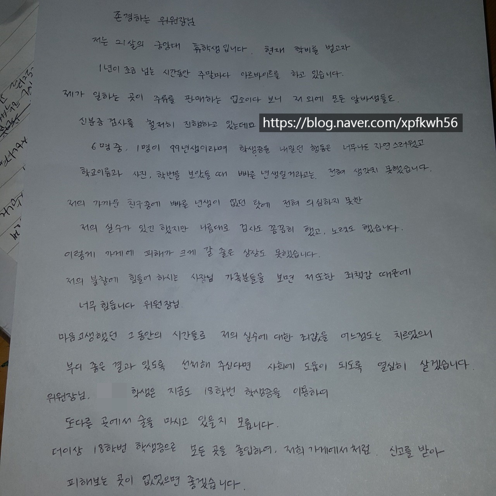

# 야생이 키운 아수라
**Date:** 2025. 6. 30. 0:29
**Category:** 인기글 모음
**Original URL:** https://blog.naver.com/xpfkwh56/223916003659
---

1. 때는 지금으로부터 어언 약 10년 전,

​

김리아는 갑작스럽게 가세가 나락 가며

콧대라면 보통이 아닌 미대생들을 보았고

​

**'상대적 박탈감'** 을 크게 느끼고 있었다

​

사실 그게 왜 필요했는 줄은 모르겠지만,

​

여유로운 가정에서 자란 아이들

특유의 **'노구김살'** 이라던가,

​

세상에서 **'때'** 를 타본 적 없는 듯한

**그 어떤 악의 없는 순수**를 **상처**로 느꼈다

​

**\* 아! 이 사람들은 나랑 다르다!**

**​**

2. 누구는 장학금을 못 받으면

ㄹㅇ로 학교를 관둬야 되는 상황이라

​

목숨 걸고 교수님 입에서 나오는 글자 글자를

천금처럼 받아 적으며 뇌에 새기면서 살았는데

​

대학 왔으니 날먹해도 된다는 아해들이나,

​

최저임금 받아 가며 생활비 채우고 있던 차에

선물로 샤넬 빽을 받았다느니, 저런 것도 있었나

​

싶은 온갖 부유한 브랜드를 즐기며 사는 것도,

​

무려 **'장래 커리어에 대한 준비와 별개로'**

해외로 나간다던가 여가에 쓸 수 있다는 것이

​

프롤레타리안이던 김리아는 **심히** 부러웠다

​

3. 나는 왜 이렇게 살지? 라는

**마음을 가질 여유**도 없었다

​

그런 궁상을 떨고 살던 김리아는 비로소

전문학교를 통한 취직도 알아보게 되었고,

**​**

갖고 있는 재주도 없고, 나름 또 겁은 많아서

어디 가서 최저임금이나 받고 사는 일이 족했다

​

정확하진 않지만 그 무렵의 전후쯤,

등록금과 생활비를 벌기 위한 목적으로

​

김리아가 하고 있던 알바는 대전에 위치한

루프탑이 있는 요리주점이었는데

​

**\* 학교든, 학원이든 상당한 거리가 있는**

**​**

**'향락적인 느낌'** 은 단연코 없었고,

그저 둔산동에 널리고 널린 자영업소였다

​

김리아는 **'찐'** 에 가까운 사람이다

​

**'진짜'** 라는 것이 아니고, **'아싸 기질이 심하고'**

사람들과 잘 어울리는 것이 어색하다는 의미다

​

**\* 주눅 들었던 줄 알았는데, 태생인 것 같다**

**​**

여자들이면, 누구나 한 번 정도는 겪어봤을

얼토당토않은 모함도 당연히 누려보았으며,

​

여느 소녀들이 그렇듯, **'단단할 수 없었다'**

​

4. 당시 김리아와 친분이 없던 무리는

김리아가 대강 **'눈치껏'** 어울리지 않고,

​

아득바득 제 살길을 찾으려고 하는 것이나

특별히 대화에 참여하지 않는 것을 싫어했다

​

김리아 역시 소녀의 세계 논리를 잘 알았고

10대 시절 그에 충분히 누리는 법도 알았으나,

​

적어도 **'지금'** 그걸 할 때가 아니었다

​

경제적인 압박감도 심히 버거웠지만,

​

술집에서 알바한데 →

술집 다닌데 → 매춘한데

​

라는 식으로 풍문이 돌았고,

​

그 소식을 알게 된 김리아는

인간에 **정**이 뚝 떨어지고 만다

​

김리아는 소녀의 세계를 잘 안다

​

여기에는 그 어떤 가해자도 없다,

​

간접적이고 암시적이며 은연중에 도는

사소한 풍문이 살을 붙이고

​

최종적으로는 누구도 가해한 적 없지만

피해자만 남는 그런 것이 소녀의 세계다

​

누구를 원망하겠나, 누구든 겪는 일이다

원래 소녀의 세계는 가해자가 없다

​

5. 그와 별개로, 김리아는

**'빡대가리 짓'** 을 하고 살았다

​

학업과 생계를 병행하는 일은 어려웠지만,

**​**

**꾸역꾸역** 처음 알바를 했을 때부터

주말마다 케이티엑스를 타고 대전으로 갔다

​

주말에 얼추 한나절 정도를 일하기 위해서,

기차를 타고 출퇴근하는 것은 멍청한 짓이다

​

그러나 당시 김리아가 다니던 아웃백과 달리,

​

**\* 아웃백이 문제가 아니고, 제가 폐급이었음**

**​**

대전의 알바에서 만났던 사람들은

**'내 존재를 그저 인정해 주었다'**

​

가물하지만, **'숨통'** 이 틔었던 걸로 기억한다

​

김리아에게도 가족이 있긴 했지만

​

모두가 누군가를 열심히 위로하거나

서로 의지할 수 있을 만큼의 여유가 없었고,

​

고립된 모두는 각자 **도생**하여야 했다

​

솔직한 말로 스카이급이냐면 그건 아니지만,

​

나름대로 충실한 10대 시절을 보냈던 김리아는

약속된 보상의 부재로 세상에 **배신감**도 느꼈다

​

김리아는 생계만을 **위해서**,

장래를 결정하지 않겠다고 선택한 것이지

​

생계를 **'포기하면서'**,

결단한 것이 아니기 때문이다

​

6. 학교도, 학원도 김리아의

고삐를 쥐고 있지 않았으므로

​

김리아는 문득 알바로 돈을 모으면서,

**막연히** 그냥 모아야겠다고만 생각했다

​

일은 일대로 하는데, 지출 통제가 안 되니

​

실로 대단한 사치를 하는 것도 아닌데

살림이 매일매일 밑 빠진 독이었다

​

일이 힘들다는 핑계로 커피나 사먹고,

휘적휘적 돌아다니면서 군것질만 했는데

​

급여일 전후 무렵만 되면

누가 돈을 훔쳐간 것 같았다

​

불가피한 변수로, 월급이 며칠 밀리면

김리아는 그야말로 **피**가 말랐다

​

**\* 최고 밀리면 한 달 정도? 밀렸던 걸로 기억**

**​**

한편, 요즘이야 **'대경'** 할 일이지만

​

당시에도 최저임금을 안 맞춰주는 일은

의외로 현실에서 자주 볼 수 있던 일이고

​

적어도 김리아는 자영업 매장에서 일을 하며,

주휴/야간 같은 수당을 받아본 적은 없었다

​

당시 김리아는 **'칭찬'** 을 좋아했다

자존감이 박살 나 있었기 때문이렸다

​

별 것 아닌 말들에도 김리아는 고양되었고,

​

그런 김리아를 기특하게 보았던 사장님은

본인이 하고 있는 다른 사업에도 근무를 주었다

​

스크린 골프장, 편의점, 카페처럼

대전 구석구석에 있는 곳으로 원정을 갔다

​

**\* 비 오거나 한산해서 조기 퇴근해야 되면,**

**다른 업장에 쇼당을 봐서 원정을 가는 구조**

**​**

**ㅋㅋ시발 그게 말이 돼요? 싶을 수 있는데**

**요즘이야 모르겠지만 당시만 해도 가능했다**

​

온종일 일을 서서 하니까,

다리가 아파서 택시를 타고 다니고

​

많이 벌고 싶으니까 A 장소에서도 하고

B 장소에서도 하고, 동선이 개판이라서

​

매우 **비효율적으로** 일을 하고 살았었다

​

어디서 얼핏 어디서 듣기로야

노동법 위반이니 듣긴 들었지만,

​

맨날 얼굴 보는 사람이 안 준다는 것도 아니고,

​

조금 사정이 생겨서 밀렸다고 말을 하거나

어렵다고 말하면 기다리는 것 말고는 **어렵다**

​

글로 쓰니, 뭐 지옥처럼 살았던 것 같지만

힘들긴 힘들고 많이 어려웠어도 살만은 했다

​

**\* 드문드문 좋은 기억도 많이 있었고**

**​**

7. 그러던 중, 김리아는 **'대형사고'** 를 친다

​

**여기는 술을 파는 곳임에도**

**미성년자를 받아버린 것이다**

​

김리아가 신분증 검사를 하지 않은 것은 아니다

​

다만 손님의 **대학교 학생증**을 보았고,

빠른 년생일 것이라곤 생각이 안 닿았다

​

**영업정지**를 받을 수도 있다는 말에

김리아는 그만 얼굴이 하얗게 질렸다

​

**\* 2개월인가, 3개월인가라고 들었음**

**​**

25년의 김리아야, 영업정지를 당한다면

**1년 치 영업정지를 당해도** 물어줄 수 있지만

​

당시에는 돈이 주는 무게감이 **많이** 달랐다

또한 **행정적인 제도**나 **조치**도 알 리가 없었다

​

사회에 도움이 되도록 열심히 살겠습니다

​

죄책감에 정신을 못 차리고 있던 시점이라,

할 수 있는 것은 없으니 **반성문**만 죽어라 썼다

​

당시 사장님은 김리아가 벌인 사건으로

도합 **2천만 정도의 벌금**을 내셨다 했고,

​

세상 물정을 모르던 김리아는 믿을 따름이었다

​

**\* 지금 생각하면, 아마 2천은 아니실 것임**

**​**

**너 책임이니까 갚으라고** 말을 할까 무서웠는데,

어떻게든 잘 해결된 것이 천만다행이라고 여겼다

​

**\* 법률적으로는 사용인 책임이라,**

**내가 갚을 필요는 없지만 그걸 알 리도 없고**

**무슨 수로 저 돈을 메울 수 있을까 고민했음**

**소송이라도 걸면 어떻게 하나 하는 마음도**

**​**

그 외에도 팔자가 어찌나 사나왔는지,

무엇 하나 **평탄하게** 흘러가는 법이 없었다

​

당시에도 **'꽤'** 열심히 살긴 살았는데 말이다

​

8. 김리아가 다니던 가게에는

여느 좋소처럼 임원이 참 많았고

​

사장님이 몇 분 계셨는데,

**'사모님'** 이라 부르는 분이 있었다

​

나이가 많은 어머님이셨는데,

​

물론 이후에 **'전말'** 을 알았지만

이 분과 **'묘-한'** 이벤트가 많았다

​

결과적으로는 **교회 한 번 다녀볼래?**

라고 해서 신앙 장르를 시작하게 되었고,

​

**악명**이야 그 시기에도 알았으며

​

모르고 간 것도 아니니, 봐서 아니다 싶으면

나오면 그만이지 싶은 생각도 없진 않았다

​

9. **'일단'** 내 기억에 다정한 사람들이 많았다

​

김리아는 당시 사회의 테두리에 살던 사람으로,

딱히 사회적인 조력을 받거나 그럴 수 없었는데

​

**\* 내일 당장 행불 찍어도, 찾으려면 1년은 걸릴**

​

도란도란 말도 걸어주고, 친절하게 잘 대해주었다

​

무엇보다 **'잘난'** 인간들이 유독 많았다

​

서울대, 연고대, 해외 대학 출신은 물론이옵고

직업도 번듯한 사람들이 있으니 솔직한 말루다가

**'어울리는'** 재미가 없었다면 그짓말일 것이다

​

이렇게 똑똑하고, 많이 배운 사람들이

허무맹랑한 거짓말에 당할 리가 없을 것이라,

​

**'사회적 증거'** 에 관한 믿음도 제법 있었다

​

10. **신천지 튜토리얼 코스**를 밟고 있던 어느 날,

처음 총회장의 연설을 듣는다고 과천을 갔었는데

​

**사진에 날개가 달린 것**을 보고, **현타**가 찐하게 왔다

​

**\* 진짜 누가 했는 줄 모르겠지만 저건 아님**

**​**

정말 솔직한 말로, 지파장 정도 클라스가 되면

객관적으로 누가 들어도 **'말을 잘 한다'** 내지,

​

**\* 말 나온 김에, 내 경험에 의하면 총회장은 바지다**

**​**

**'이빨에 아우라가 있다'** 느낌이 드는 것은 맞는데

​

딜리버리도 나쁘고, 사실 크게 와닿는 말은 없어서

당시 김리아의 지능으로도 **이게 찐인가?** 헷갈렸다

​

**\* 중진급 정도 되면, 밖에 나가서 영업하고 다녀도**

**벌이는 크게 문제 되지 않을 정도로 말을 잘 하는 편**

**​**

복음방에서 김리아는 명문대 출신 전문직이었던,

그 시점 기준으로는 상당히 이성적이며, 합리적이고

똑똑한 사람이라고 여겼던 사람에게 질문을 했다

​

편의상, 이 사람을 K 라고 부른다면

K 는 처음부터 신천지에 빠진 사람이 아니고,

​

30대에 결혼을 하면서, **와이프 따라 나온** 사람인데

​

총회장 나이를 감안하면 밑져야 본전이다

내일모레 하면서 아니면 마는 것이고

​

만약 **'진짜'** 라면 안 믿을 때 손해니까

자기는 그래서 믿고 있는 것이라 말했다

​

김리아는 최소한 지금보다

당시에는 **'수동적인'** 사람 이라,

​

신천지를 접을 때, 한창 스스로 알아보면서

**아, 그게 파스칼의 변증법 이었구나** 를 알았고

​

그에 대한 **몇 가지 반론**에 대해서도 공부했지만

그 말을 들었을 때는 **반박불가** 라고만 여겼다

​

11. 신천지에서는 **요한 계시록**을 인용하는데,

그게 일종의 **미래 예언서** 란 입장을 취하는 편이다

​

그래서 아주 엄밀히 따지면,

**​**

**'총회장, 즉 이만희가 영생하는 것이 아니고**

**요한계시록에서 말하는 그날이 올 때,**

**이긴 자가 나타난다는 것이 핵심적인 교리'** 인데,

​

차 떼고, 포 떼면 **이긴 자 = 이만희** 이므로

그게 그거인 부분은 있긴 있지만 차이는 있다

​

**그럼 대체 저기서 왜 그걸 듣고, 설득 당하고 있을까**

​

성경에 관심이 없는 사람들은 잘 모르겠지만,

요한계시록은 무척 난해하고 비유가 난잡하다

​

아무튼 마지막에는 환상 속에 있는 요한이

**예언**을 이루며 끝난다는 뭐 그런 스토리인데

​

그 앞단에 있는 모든 스토리가 **'계시'** 라는 것이다

​

12. 이거를 조금 더 쉽게 풀어 말하자면,

​

2천 년 전에 특정 자산의 차트가 A 모양이었고

그다음에는 B-C-D 모양을 그리고 있었으며,

​

당시 이런저런 뉴스가 있었고, 배경적으로

경제 상황은 이런 상황에 놓였다는 증거가 있는데

​

지금 어떤 자산의 차트가 A-B-... 모양을 그리고,

그 시절과 **아주 똑같은 정황**으로 흘러가고 있다면

​

나중에는 2천 년 전 과거 그 차트와,

앞으로의 차트가 같지 않을 것이냔 것이

​

신천지에서 말하는 **'핵심'** 주장이다

​

**비판적 사고**를 **ON** 한 상태에서 읽어나가면,

1년 전도 아니고 2천 년 전부터 다 뒤져가지고

​

**있는 것 없는 것, 죄 다 갖다 붙이면**

**세상에 그렇게 못 갖다 붙일 것이 있냐?**

​

라고 생각할 수 있는 여지도 **없는 것은 아니나**,

​

거기에 오는 사람들은

**'의심하러 온 사람이 아니고'**

​

어떻게든 믿고 싶어서 온 사람들이라서,

**'적당한 빌미'** 가 있으면 믿으려고들 한다

​

돈은 벌고 싶어 죽겠어,

마땅히 내 주변에 답은 없어

​

그럼?

​

그게 다소 허무맹랑하게 보일 순 있어도

**'그거'** 말고는 답이 없으면 믿어야 된다

​

13. 또한, 처음에야 뭐 흰무리에 들어가느니

이런 소리로 시작을 하는 경우도 많이 있겠지만

​

막상 들어가면 **'사람'** 한테 **'정'** 을 느끼기 때문에

교리고, 뭐고를 떠나서 **'친목질'** 에 흥미를 느낀다

​

내 주변에 온 지인이 다 여기에 묶여있는 마당에

나오면 이제 또 나는 **'혼자'** 살아가야 되는데,

​

고립된 혼자가 무서워서 거기 들어갔던 사람들이

제 발로 나온다는 것은 **'상당한'** 결단을 요구한다

​

**\* 신을 믿어서 있는 것이 아니라,**

**사람을 잃기 싫어서 못 나오게 됨**

​

14. 김리아는 신천지에서 **'재능'**이 터졌는데,

​

자신에게 **행정 사무 전반에 대한 관리 능력**과

**기획력, 문서를 읽고 해독하며, 작성하는 능력**

​

기업에서 사무 관리직에게 요구하는 전반적인

능력이 자신에게 있다는 것을 실감하게 되었고,

​

10대 시절, 앉은 자리에서 남의 말을 그저

앵무새처럼 외우고 받아 적는 **내신력**이 있어서

​

**\* 엉덩이야 원래 무겁고, 성실한 편이긴 했음**

**​**

열매, 잎사귀로 대표되는 **'영업력'** 이 없어도

일체의 페널티 없이 쉽게 직급을 얻을 수 있었다

​

뿐만 아니라, 신천지에서 **'간부'** 라는 것은

특정 레벨까지는 조별 과제 조장 같은 느낌이라

​

남들이 하기 싫은 **잡무**를 다 떠맡아가면서 하면

감투 몇 개 쓰는 것은 사실 일도 아닌 일이었는데,

​

**그걸 누가 해?** 라는 **귀찮은 일을 하는 것** 역시

김리아가 갖고 있던 어떤 재능이라면 재능이었다

​

이후, 김리아가 마침 **'창업'** 의 아다리가 왔을 때

남조선에 전례 없는 **유동성 파티**가 있었던 것처럼

**​**

**\* 행운**

​

김리아가 신천지에 들어간 직후 무렵에,

교세가 **급격하게** 확장하고 있었기 때문에

​

김리아는 수십, 수백, n천 명 정도를

산하에 관리하는 데이터 베이스를 꾸리고,

​

어떤 사람들이 쉽게 들어오고, 쉽게 나가며,

​

홀딩 되는 사람들의 특성은 무엇이고,

무엇이 그들을 더 오래 묶어둘 수 있는가

​

늘어나는 사람들을 교육하고 설득할 수 있는

콘텐츠를 만들고 행사를 집행하는 일 또한 했다

​

개빡쌘 영리성 사회복지 스타트업의

HR 파트에서 인턴십을 씨게 겪었던 셈이다

​

15. 또 그로부터 많은 일이 있었고,

​

어느 날인가 문득, **내 이런 희생과 노고**가

결국 약자를 홀려서 강자에게 가져다 바치는,

​

**\* 내 헌신이 내 의도와 달리**

**​**

내가 **그릇된 일의 조력하고 있다는**

생각이 닿게 된 **사건**을 겪게 되었다

​

예를 들어, 내가 누군가를 강하게 추천하고

소개한다면 다른 사람은 그 사람을 믿지 않고

**'나'** 를 믿고 보증된 신뢰를 가질 것이다

​

**\* 나를 믿는 만큼**

**​**

**근데 내가 별 생각 없이 소개를 한 것 뿐이면?**

교묘하게, 타인이 남에게 이용 당할 수도 있다

​

솔직히 그냥 흐린 눈으로 볼 수도 있었는데

이건 아닌 것 같아서 **많은 고민 끝에** 질렀고,

​

김리아는 자신을 묶던 모든 것들을 등지고

앞으로 **'혼자'** 인생을 살아가기로 결단한다