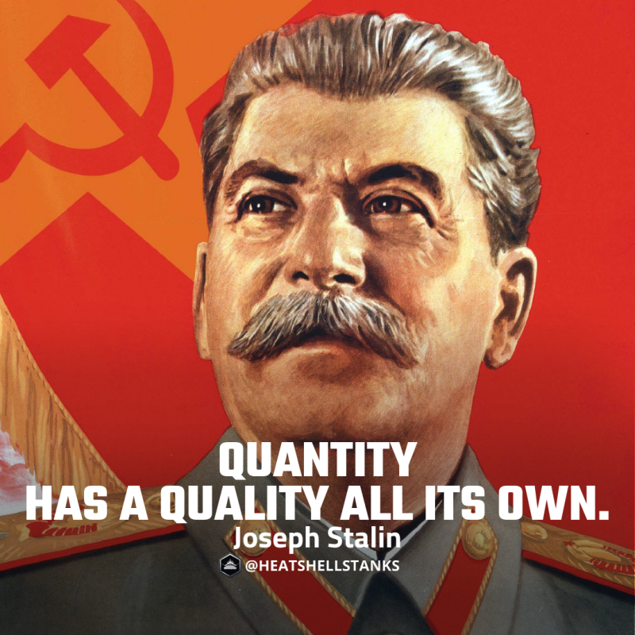

# 행운
**Date:** 2025. 6. 30. 19:03
**Category:** 인기글 모음
**Original URL:** https://blog.naver.com/xpfkwh56/223916943173
---

1. 김리아가 **자신** 있어 하던 것은

주어진 과제를 성실히 하는 것이다

​

다른 주입식 교육의 경험자들처럼

김리아 역시 엉덩이가 꽤 무거웠다

​

무엇을 해야 될 것인지, 그게 왜 필요한 것인지

​

이런 복잡한 생각은 해본 적도 없었고

따로 훈련한 적도 없었기 때문에 어렵지만

​

정확히 교과서가 주어지고,

범위 안에서 풀어야 되는 문제라면

​

이는 김리아에게 **'비빌만 했다'**

​

2. 더욱이 김리아의 집안은

기본적으로 **'기술자'** 집안이다

​

유전자라고 하기에는 거창한 일이나,

딱히 전문직 종사자나 경영자는 없어도

​

**\* 농사꾼은 실상 공무원이다**

​

뭐든 하나 **기술을 들고** 먹고사는 사람들이

어릴 적부터 많이 있는 환경에서 자랐었고,

​

김리아는 두 오라비들과 함께,

​

농기계를 만지거나 비닐하우스를

수리하는 것 등에서 흥미를 느꼈다

​

**\* 어릴 적, 김리아는 새카만 얼굴인데**

**하얘진 것을 보면 이런 경우도 있긴 있다**

**​**

이케아 같은 곳에서 설명서만 달랑 와도

**뚝딱** 조립하는 것도 그런 영향일 것이다

​

김리아는 현관 전구 교체를

과거 남편에게 요청했으나,

​

신랑은 감전의 위협이 있다며 경비실에

도움을 청하여 해결하자고 제안한 바 있다

​

" 오빠, 우리가 그걸 언제 기다리고 있오?

어이 김씨, 일로 와서 사다리나 잡아 "

​

임산부 김리아는 두꺼비집을 찾아 내리고,

사다리에 올라가 무사히 갈았던 사람이다

​

**\* 함부로 따라하지는 마세요**

**​**

**김리아는 데모도 경력과 지방 주택의**

**전기 부설 작업에 참여한 경험이 있음**

​

신랑은 사다리를 붙들고 있으며,

​

애 떨어지는 것은 아닌가

한참 마음을 졸였다고 한다

​

3. 그와 별개로, **'여자'** 에게 기대되는

일이라는 것이 사회적으로 있기 마련이다

​

김리아가 좋아했던 것은 설계도나,

실용 기술에 기인한 테크닉에 가까웠지만

​

부모님은 **'뺀질뺀질한 아들과 달리'**,

시키면 **곧잘 아웃풋이 나오는 딸**에 대해

​

기대치가 제법 있었던 것으로 기억한다

​

무수리 팔자 김리아의 **가성비** 는

응당 그 시절에도 여전했기 때문에

​

부모님께서는 **'저티어 직종'** 이 아닌

**'고티어 업계'** 에 김리아를 두고 싶었다

​

쉽게 말해, 누구나 금방 재주만 익히면

다 할 수 있는 **간단한 기술** 같은 것 말고

​

설계나, 엔지니어링, 컨설팅 같은 느낌의

조금 더 화이트 컬러틱한 일을 하길 원했고,

​

**'가능하다면'**, 어디서 그림이나 하나 그려서

​

몇 억, 몇 십억에 팔아먹으며 세계를 휘젓는

예술가 같은 인생도 살기를 바라신 것 같았다

​

딸래미가 인사동, 평창동 회랑에 그림을 걸고

우아한 아지매들과 티-타임을 벌이는 것이라면

​

부모님 입장에서도 마다할 이유가 없었을 것이다

​

부모님은 김리아가 오타쿠

같은 설계도를 그리는 것보다,

​

**\* 기계공학 페티시 있는 애들이 질겁할 듯한**

​

라파엘로의 그림을 모사하는 것을 더 선호했다

​

4. 문제는 김리아에게 **'그런 재능'** 이 없었다

​

패러다임을 전환하거나, 새로운 방향을 잡고

창의적으로 무언가를 발상하는 그런 쪽보다는

​

**'쉽고, 빠르고, 당장 팔아먹을 수 있는 수준의'**

경제적이고 효율적인 디자인 센스가 있었으나

​

**\* 김리아는 빠른 세부 묘사에 강점이 있다**

**시간만 무한정하다면 하이퍼 리얼 쪽도 가능**

​

이게 **부모님이 기대하던 재능**과는 거리가 있었다

​

회고하면, 김리아는 실상 특성화고에 진학해서

빨리 직업 훈련을 받고 취직을 하면 **딱** 이었는데

​

김리아의 **중학교 성적**을 본 부모님이 있다면

**어지간하면** 그런 결정에 매력을 느끼기 어려웠다

​

어설픈 학업 성취가 재능을 은폐했던 것 같다

​

5. 김리아의 **은폐된 재능**은 학원에서부터 개화한다

​

김리아는 자신의 특정한 행동을 갖고,

세상에 **'변화'**가 발생한다는 것이 좋았다

​

물론 **간절함의 차이**도 없지는 않았겠지만,

​

실업급여, 구직급여를 목적으로 하는 사람들이나

딱히 할 것은 없고 취직을 목적으로 하는 이들보다

​

**'기술자'** 가 되고 싶다는 김리아는 더 열심히 했고,

​

이런 기술이 **'나를 책임질 무기'** 라는 것을 알았기에

​

수업 시간보다 수업 외의 시간에

더 많은 노오-력을 했다

​

이 수업에 참여한 n0여명의 인원 중,

그리고 이 수업 밖에서의 인원을 포함하여

​

결국 현업에**'기술자'** 로 인정받는 사람은

한정적이며, 모두 동일한 자격을 가졌다면

​

필시, **'진짜 기술자'** 를 원할 것이다

​

대개 **기업에서 원하는 인물은 정해져** 있으며,

​

결국 내가 경제적으로 효용 가치가 있음이 보이면

**그들은 나를 채택하지 않을 수 없다는 가설**이었다

​

6. 마침, **선생**을 만난 것 역시 운이 매우 좋았다

​

의욕 없는 학생들 무리에서 반짝반짝 거리는

김리아를 노동부 교사는 **매우** 인상 깊게 보았고,

​

전혀 그럴 필요가 없었음에도, 줌 수업이라던가

새로운 포트폴리오 자료를 제공해 주기도 했었다

​

자신이 마지막으로 업계에 있었을 당시,

그리고 주변의 네트워크로 아는 바에 의하면

​

**'지금 엣지'** 는 무엇이고, **'어떤 능력'** 을 요구한다

라는 것을 코칭해주었고, 김리아는 도움을 얻었다

​

피차 김리아가 가진 **싸이즈**에

**대기업이나 상장사는 서류 컷**이고,

​

**좋소**나 **잘 풀려야 중견 정도** 노릴 것인데,

​

대기업에서 원하는 기술과 현실적인 기술의

차이가 있으니, **'기본기'** 에 충실하라 조언하고,

**'숙달'** 에 대한 중요성을 강조하여 가르쳤다

​

김리아로서는 글자 그대로 **'존나'** 재밌었다

​

할 수 없던 것을 할 수 있게 되었고,

이 기술이 **'팔린다는 것'** 이 경이로웠다

​

7. 처음부터 내가 감을 잡을 수는 없었지만,

**'기술에 대한 가치'** 를 인지하면 인지할수록

​

김리아가 갖고 있는 **활용 가치**에 대한

**환경**을 **검토할 수 있는 시야**가 열리게 된다

​

만약 작년 대비 매출액이 증가한 기업이고,

그에 맞게 순이익이 늘었는데 인건비는 고정

​

이렇게 되면, **'한정된 인적 자본은'**

더 높은 업무 부담을 가질 것이 자명하다

​

물론 단지 이런 이유로

기업은 **'고용'** 하지 않을 것이다

​

**업황은 지속적으로 변화하기 때문이다**

​

그러나, 인적 자본이 제공하는 산출물이

그 업무 부담으로 퀄리티가 떨어지게 되면

​

기업에서는 **'신규 고용'** 에 대한 니즈를 느끼고,

​

혹여 그 대상이 **'필요한 기술'** 을 갖고 있다면

거기에는 더 큰 유인이 따라올 것은 자명했다

​

8. 김리아는 기술을 갈고닦음과 동시에,

어떤 기업이 나를 필요로 할 수 있나 찾았다

​

그리고, **'그 기업에서 어찌 돈을 버나'** 관심 가졌다

​

피차 모든 회사에서 원하는 **올마이티 제너럴?**

​

그런 것은 내가 할 수 있는 일이 아닐 뿐 아니라,

내가 가질 수 있는 역량도 아니라고 판단을 했다

​

가만히 있어도, 노동부 상담관이 진로를 잡아주고

서로 대화를 통하여 적성과 조건을 알려주긴 하지만

​

이제 **'나는'**, **'나를'** 책임지고 싶었다

더 이상의 여생을 흐르듯이 살고 싶지 않았다

​

9. 마침 김리아의 능동적 진로 탐색과 더불어,

​

좋은 노동부 공무원과 좋은 강사의 도움을 얻어

**삼박자가 다 맞는 직장**에 취직을 할 수 있게 된다

​

**\* 셋 모두 교집합으로 보고 있던 곳**

​

초봉이 그렇게 높은 편이라곤 할 수 없었지만,

**'부가적으로 실속이 상당한 직장'** 이었고

​

김리아는 면접에서 **상당한** 신임을 얻으며

마치 내정자에 가까운 것처럼 출근을 했다

​

**그리고 김리아는 믿기 어려운 경험을 한다**

​

**'노동 용역'** 을 제공하지 않았는데도 불구하고,

첫 출근에 **이미 1개월치 월급을 지급받은 것**이다

​

김리아의 **상식**에서는 있을 수 없는 일이었다

​

알바는 통상 45일의 기점을 두고 지급하며,

그나마도 제 시간에 맞춰 받는 일이 **흔치는** 않다

​

**무엇보다 대체 내가 누군줄 알고 준단 말인가?**

**내일 당장 회사를 때려치우면, 회수는 어쩌게?**

​

무엇보다 무릇 장사를 하는 사람이라면,

몇 푼 현찰이라도 쥐는 것이 핵심 아닌가?

​

10. 김리아는 여러 측면으로 확인하다,

큰 오라비에게 이 상황에 대해 보고했는데

​

4대 보험 되고, 나라에서 소개한 직장에다가,

다른 그 어떤 수상한 업무를 하는 곳도 아닌데

​

월급을 **'그냥'** 선불로 지급한 것 뿐이라면

그거에 대해서 무언가 문제가 생기진 않는다

​

그러나, 혹시 모르니 전부 사용하고 그러진 말고

**나중에라도 다시 돌려달라고 하면 줄 수 있게 써라**

​

라는 조언을 듣고, 태어나서

처음으로 **'목돈'** 을 운영해봤다

​

김리아라고 100만원도 못 만져본 것은 아니다

​

그러나, 1개월의 생활비를 신용 결제로 사용하고

차후 급여를 **'공제'** 한 다음에 쓰는 경험만 해봤지

​

**쨌거나, 규모가 있는 돈을 관리하긴 처음이다**

​

무엇보다 아주 강한 **'확신'** 이 들었는데

내가 여기서 일을 하면서 급여가 떼인다던가

​

쭈뼛쭈뼛 일을 정당하게 열심히 잘 하고도,

추후에 월급을 독촉하는 지저분한 꼴 정도는

​

**절대** 볼 일이 없을 것 같다는 것이 그랬다

​

11. 김리아는 이런 조건에도

**'퇴사자'** 가 있다는 것이

그저 신기할 따름이었다

​

**죽어도 여기에서 나가고 싶지 않았다**

​

일이 많긴 많았지만, 오히려 다행스러웠다

일이 없으면 당연히 인원을 감축할 것 아닌가

**​**

**\* 김리아는 손님이 없는 매장에 있다가**

**조기 퇴근을 당하거나 원정을 가본 적 있다**

**비가 온다는 말을 들으면 사뭇 불안도 했다**

​

만약 이 회사가 망하지만 않고 꾸준히만 간다면

최소 1년? 아니, 4년 정도의 인생도 **'불안이 없다'**

​

더욱이 파트를 맡아, 근무를 하던 과장님의 경우

장기근속으로 대표님의 추천을 받아 창업 준비를

하고 계셨기 때문에 좋은 말씀도 많이 듣게 되었다

​

근무를 열심히 한 사람이, 추후 독립해서 창업하면

자기 나름의 영업과 홍보로 손님을 잡는 것은 땡큐고

​

그게 아니면 매출의 일부를 소개 커미션으로 지급해,

**독립한 직원과 대표가 커넥션을 갖는 BM 구조**였는데

​

김리아는 이 과정이 **'상당히'** 합리적이게 보였다

​

야부리만 터는 것이 아니라, **실제** 그런 사람이 있고

**업무가 그렇게 진행된다는 것**에 더 큰 **믿음**을 느꼈다

​

**\* 오다가 들어오면, 마치 하청을 주는 구조**

**​**

**업무 퀄리티는 대표의 직원이었기 때문에**

**그걸 기준으로 잡아서 배분하는 것 같았다**

​

**12. 김리아의 장기는 95점, 100점이 아니다**

**70-80점 정도 되는 것을, 빨리 뽑아내는 것이다**

​

**\* 균질성, 신속성**

**​**

**​**

그렇게 70-80점 짜리가 쏟아져 나오면,

나머지는 **'정성적으로 개별 판단에 맡긴다'**

​

고객은 100점짜리 라고 만족하지 않고,

**'다른 카드'** 도 보고 싶어하는 속성이 있는데

​

70-80점 짜리가 5개 정도 깔려있는 상황이면

나머지 점수는 **스스로 채우는 경향**이 있었다

​

또한, 여러 사회복지 경험에 비추어 볼 때

**'사소한 진상'** 은 별로 스트레스도 되지 않았다

​

김리아는 소녀의 세계와 신천지 경험에서,

**'섣부른 진급'** 이 주는 위험을 체험한 바 있다

​

조직에서 누군가 **'상'** 을 받는다는 것은

어느 다른 누군가에게 **'벌'** 을 준단 것과 같다

​

김리아는 **'고의적으로라도'**,

자신의 성과를 **'공유했다'**

​

세상의 일이라는 것이 나 혼자 잘났다고

**원맨으로 갈 수 없단 것**은 진즉 경험한 바다

​

물론, 실제로 도움을 안 받은 것도 아니었다

​

당시 대표님은 원래 하던 업종뿐만 아니라

**전략적으로 다른 업종**을 계획하고 계셨는데,

​

김리아에게 **'해본 적 없는 일'** 을

준비해 줄 수 있는 여유가 있냐 물었고,

​

김리아는 **본업은 본업대로** 하고,

딱히 보상이 있는 것은 아니었지만

​

그 업무에 대한 기획을 준비하며 집행했다

​

13. 대표님이 갖고 있는 네트워크 안에서,

그 **'일'** 을 할 수 있는 적임자는 나 밖에 없었다

​

**\* 대표님이 인간적으로도 많이 아껴주셨음**

**​**

사업을 더 뛰어나게 할 수 있는 사람은 많았지만,

가장 많은 단서와 증거, 논리를 가진 것은 **나** 였다

​

김리아는 근속 1년이 채 되지 않아,

대표의 **'투자'** 를 받아 창업을 하게 되었고

**​**

**'경영자'** 로 태어나 처음

**'사장'** 커리어를 밟게 된다

​

초기 억 단위로 준비했던 일은,

김리아의 만류로 많이 축소되었고

​

수천 만원에 달하는 돈을 전부 날려도,

김리아에게는 그 어떤 책임도 없었지만

​

김리아는 **반드시** 이 사업을 성공시켜야 했다

​

인생에 다신 없을 수도 있는 이 기회를,

행운을 김리아는 절대 놓치고 싶지 않았다