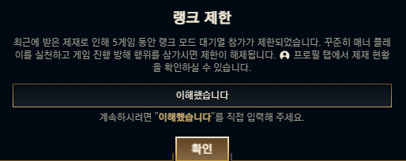

# 반골은 인생을 살기 불편해
**Date:** 2025. 7. 11. 6:26
**Category:** 다이어리
**Original URL:** https://blog.naver.com/xpfkwh56/223929443062
---

**1. 롱 타임 어고**

​

생계 활동으로 여념이 없던 김리아는

**아웃백** 이라는 으마으마한 대기업을 간다

​

김리아가 아웃백을 알바로 고른 이유는

그저 단순히 **'있어 보이기'** 때문이었는데

​

이름을 서로 **영어**로 부르거나

**외국계 기업**이라는 도회적 느낌,

​

당시 김리아의 상식 수준을 따랐을 때

**호텔리어** 내지, **스튜어디스** 같은 느낌이

들었으므로 **상당히** 긍정적으로 여겼었다

​

머슴일을 한다 해도 대감집이면 좋다던가,

​

앞으로 꽃길만 걸을 줄 알았던 김리아는

생각보다 빡쌘 아웃백에서 고통을 겪는다

​

물론, 김리아가 **폐급**스러운 부분도 있었지만

지난 일이니 **변명하자면** 이런 것들이 있었다

​

**2. 지겨운 계급제**

​

김리아의 블로그를 보는 분들이라면,

​

대체 이 년은 왜 이렇게 **계급**이라고 하면

**학을 떼나?** 라는 생각을 가질 수도 있다

​

김리아의 계급에 대한 양가성은 차치하고,

​

**당연히** 모든 아웃백이 그렇지는 않을 것이며

김리아의 피해 망상이 다분히 반영되었겠지만

​

당시 매니저/알바 체제로

굴러가던 우리 매장의 경우,

​

**일하는 사람 따로 있고,**

**시키는 사람 따로 있었다**

​

이제 참 인간적인 **현타**를 자주 느끼게 하는데,

​

내 경험에 의하면 손님으로 얻는 스트레스보다

직원들끼리의 **좋목**에 지치는 경우들이 많았었다

​

그런 것이 있나요? 싶으면,

행복하게 살고 계신 것이다

​

당시 김리아는 아웃백과 동시에,

**​**

**롯데리아** 라는 곳에서도

아주 잠깐 알바를 했는데

​

내 기억이 정확하다면,

​

메이트 → 리더 → 바이스 (부사관 느낌)

매니저 → 점장 (장교 느낌)

​

이런 식의 계급 체계로 돌아가는 곳이었는데

​

동갑이라도, 메이트/리더 격차가 있으면

존댓말을 해야 했고 실상 **'부하'** 스러웠다

​

**\* 상호 존중 분위기 자체가 아니었음**

**​**

남자는 조금 **'노예'** 같은 취급을 받고 지냈고

여자는 **'꽃병풍'** 같은 역할을 하고는 했는데

​

지금보다 더 김리아가 사회성이 없던 시절이라,

도저히 **맨 정신으로** 저기엔 있기 어렵다 여겼다

​

**\* 3일 정도 나갔었나**

**​**

누굴 탓하겠나? **사회성**이 덜 발달된 것이 문제다

​

**3. 무수리 팔자**

​

김리아의 알바 경험에 의하자면,

참으로 이상한 것을 체험한 바가 있다

​

20대 초반 녀성이 **'무리'** 를 지어하는 일은

실상 노동이 아니라 **'토킹바'** 스럽다는 점이다

​

**\* 여직원을 통조림 여친으로 간주하는 경우 많음**

**바보가 아닌 이상, 그 음험한 의도를 모를 리 없고**

**​**

김리아는 20대 초반 시절,

​

자신이 꽤 반반한 녀성이구나

라는 것을 실감할 기회가 있었는데

​

**직장임에도 사람들이**

**일을 시킬 생각이 없었다**

​

그저, 개인적인 경험이니 들어보시라

​

1) 보통 무엇이라도 **감투**를 쓴 남자가 있다

​

2) 감투를 쓴 남자와 일벌 가까운 남자가 있고

일벌 남자는 실상 그 직장의 일을 전담해서 한다

​

3) 여자는 **여왕벌**과 **시녀**로 이루어지며,

​

여왕벌은 감투남들과 소통하면서

노동의 자유를 경험하고 편의를 누린다

​

시녀의 경우 **'일반적으로'**, 여왕벌보다 외모가

그렇게 화려하지는 않은 경우에 속하는 편이나,

​

여왕벌의 의지를 담고, **적극** 정치질을 하곤 한다

​

4) 예쁘니까, 말을 잘 받아주니까, 싹싹하니까,

분위기가 명랑해지고, 좋으니까, 라는 명분으로

​

여왕벌과 시녀는 업무에서 배제되거나,

아주 편한 파트로 배정되는 것이 보통이고

​

**무수리**와 **일벌들**이 실상 노동의 주체가 된다

​

**\* 일벌은 여혐러가 되기 쉽고,**

**무수리들은 곧 인간 혐오에 빠짐**

​

여기서 일벌들이 일을 **'더 많이 하는 것'** 은

그 어떤 특별한 일도 아닌 것으로 치부되지만

​

무수리가 일을 열심히 한다는 것은

**'경계심'** 을 부를 수 있는 행위로 간주된다

​

**\* 여성의 권익을 침해하는 배신자이기 때문**

**​**

5) 일련의 과정이 지속되면,

직장에서 **'성취 기준'** 자체가 바뀐다

​

주어진 업무를 잘 하는 것이 능력이 아니고,

사람들과 잘 **어울리기만 하면** 충분한 것이다

​

**\* 그러다 결국 가게가 망하면**

**있던 애들은 뿔뿔히 흩어지고,**

**또 다른 곳에서 같은 일을 반복**

​

같은 돈을 받거나, 때때로 여자들이 **더** 받는데

이게 가만 생각하면 정말 많이 **이상한 일** 이다

​

**\* 진짜 솔직히 화류계 여자랑 뭐가 다름?**

​

4. 편하게 돈을 번다는 것은 큰 유인이라서,

20대 초반 녀성이 여기에 취하면 끝이 없다

​

주화입마에 빠지면, 외모지상주의로 흘러가거나

**'독특한 버릇'**을 내면화 할 가능성이 매우 높은데

​

주변에서 내 비위를 싹싹하게 맞춰주고 있는 상황,

​

여자라는 존재 자체로, 외모로 **'권력'** 을 누리는 것은

제법 달콤한 일이기 때문에 벗어나기도 쉽지가 않다

​

특히 어려운 것은 **'반골들'** 이다

​

**\* 주로 무수리나, 일벌 그룹에서 나옴**

​

​

**옳은 말을 한 죄**로 불이익을 겪기 시작하면,

어느 시점부터는 필시 **침묵**을 배우게 될 것이다

​

그러나 그 침묵의 가치를 알기까지는,

반골로 태어난 이상 수업료를 내게 되고

​

지불할 가격이 **결코 저렴하지는 않기 때문에**

반골들은 인생을 살기가 쉽지 않은 경향이 있다

​

김리아가 **실력제** 를 좋아하는 이유도 그렇다

​

**사회성이 발달하지 않은 도태된 사람**이므로,

​

**사회성이 없어도 괜찮은**

**권력구조를 선호하는 것이다**

**​**

**\* 대척점에 있는 사람이 그런 것처럼**

​

앓는 소리로만 가득한 창업가 시절이었지만

장사를 하면서 좋았던 유일한 것을 꼽자면,

​

**'내 방식'** 대로 일을 해도 된다는 점이었다