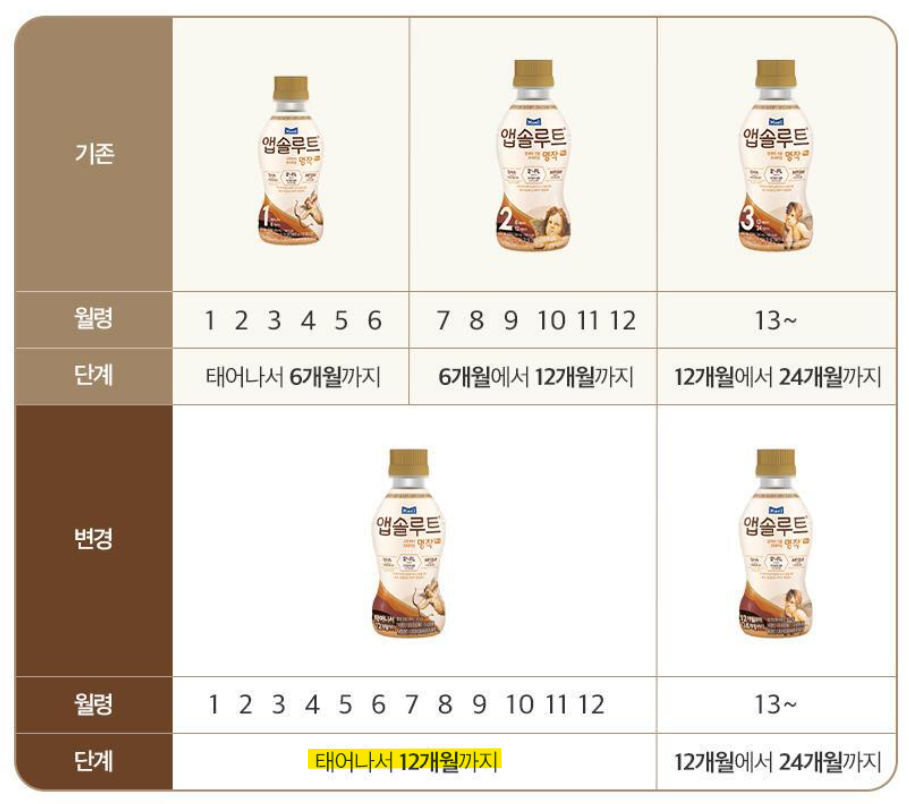

# 액상 분유 추천하는 이유
**Date:** 2025. 9. 20. 7:15
**Category:** 1호기
**Original URL:** https://blog.naver.com/xpfkwh56/224014955663
---

<https://youtu.be/sLDedsQBmDU?si=QsZKt5Hhdh6KIjMg>

​

1. 정수기 뜨거운 물 비권장

끓인 물, 식혀서 사용해도 비권장

물 끓인 다음에 냉장고 보관도 비권장

​

사실 저런다고 죽냐? 죽지는 않는데,

애가 먹겠다고 울기 시작할 때부터

우는 소리 2분 듣고 **제정신** 잡기 힘듦

​

**\* 아기 울기 시작하는데 제어 안 되면**

**부모가 무력감 느끼고 정신병 올 확률 ↑**

**​**

**애도 편하게 잘 지내면 부모도 편한데,**

**애가 자주 불편하면 파생 효과도 있음**

​

2. 액상 분유는 **'당연히'** 공장에서 나오니,

표준화된 농도에 맞춰서 시판될 것임

​

그게 중요한가? 싶고, 엄밀한 영역에서는

일상적인 레벨에서 **문제 안 되는 것은 맞음**

​

근데, 예를 들어 만드는 사람이

계량 실수로 물이나, 분유량 틀리면

​

**\* 솔직한 말로, 정확히 한다는 것이**

**실상 불가능에 가까운 일도 맞죠**

​

1) 분유량은 고형이니

큰 문제 아닐 수 있으나

반복되면 리스크가 있고

​

**\* 신생아는 삼투 부하 허용치가 좁기 때문**

​

2) 물량은 5ml 언더만 달라도

% 오차 비율 상당히 커짐

​

**\*** **탈수/신장부담, 열량/영양 부족**

​

3. 액상이 소폭 더 가격이 있긴 함,

​

근데 아닌 말로다가 이 비용이

어디 뭐 **미국 유학 비용급**도 아니고

**사교육**에 비할 것은 더욱 아니며,

​

조제 과정에서 제조공정 위생관리,

배앓이 한다고 나중에 분유 갈아타고,

애 찡찡 거리는 내 스트레스 생각하면

​

딱히 못 쓸 금액은 아니라고 생각함

​

아무리 올려쳐도 옷 몇 번 덜 입고

유모차 라인 1개 양보하면 되고,

​

전집 세트 하나 덜 사면 퉁칠 돈임

​

**\* 내 기준에서는 기대값 비교가 안 됨**

**나라에서 주는 돈으로 퉁칠 수도 있구요**

**​**

키우다가 아기가 스테이블하다, 싶으면

그 시점에 바꿔도 무관하고 초기 선택지에서

더 안정적인 육아 환경을 도모해볼 수 있음

​

​

부가 라인 신경 안 쓰고, 하나 딱 골라두면

생각 안 하고 밀고 갈 수 있다는 것도 장점임

​

제품과 별개로, 기업은 애매하니

괜한 맘에 주식은 사지 마시구욬ㅋㅋ