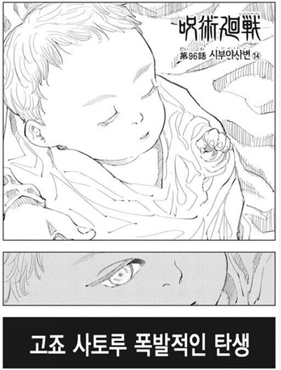
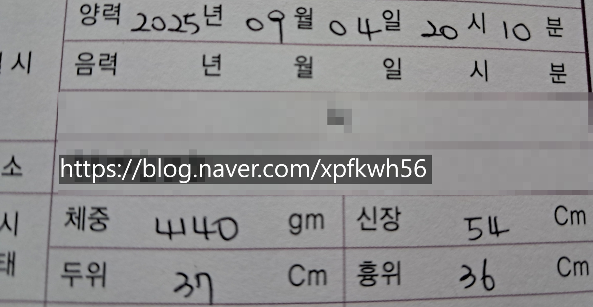
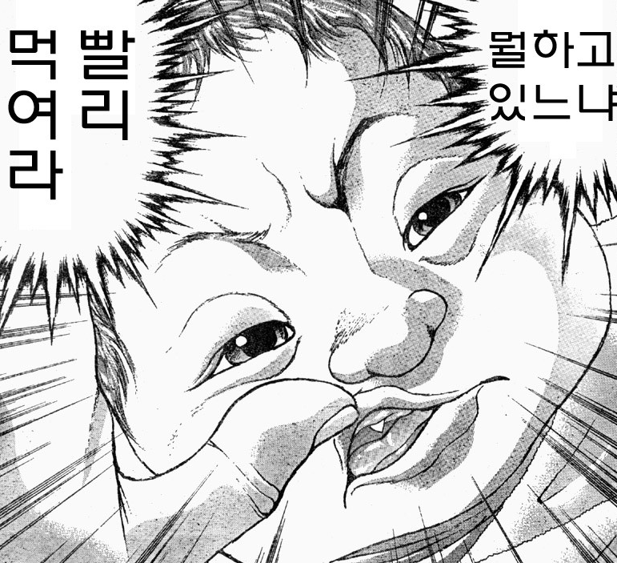
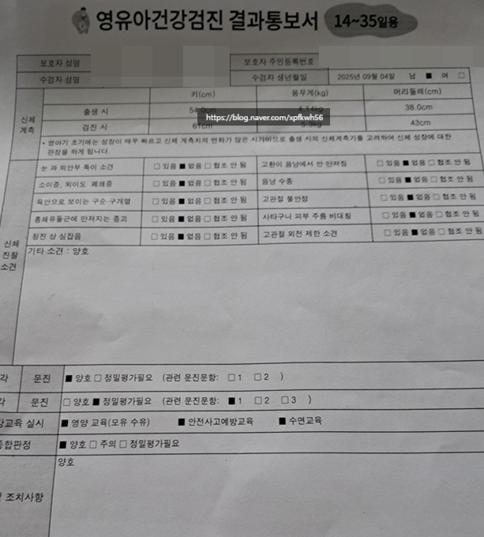
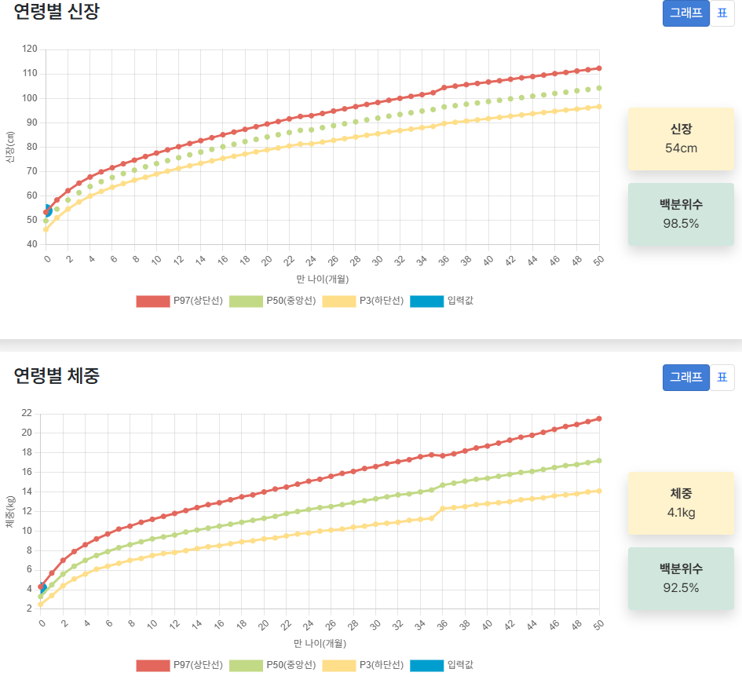
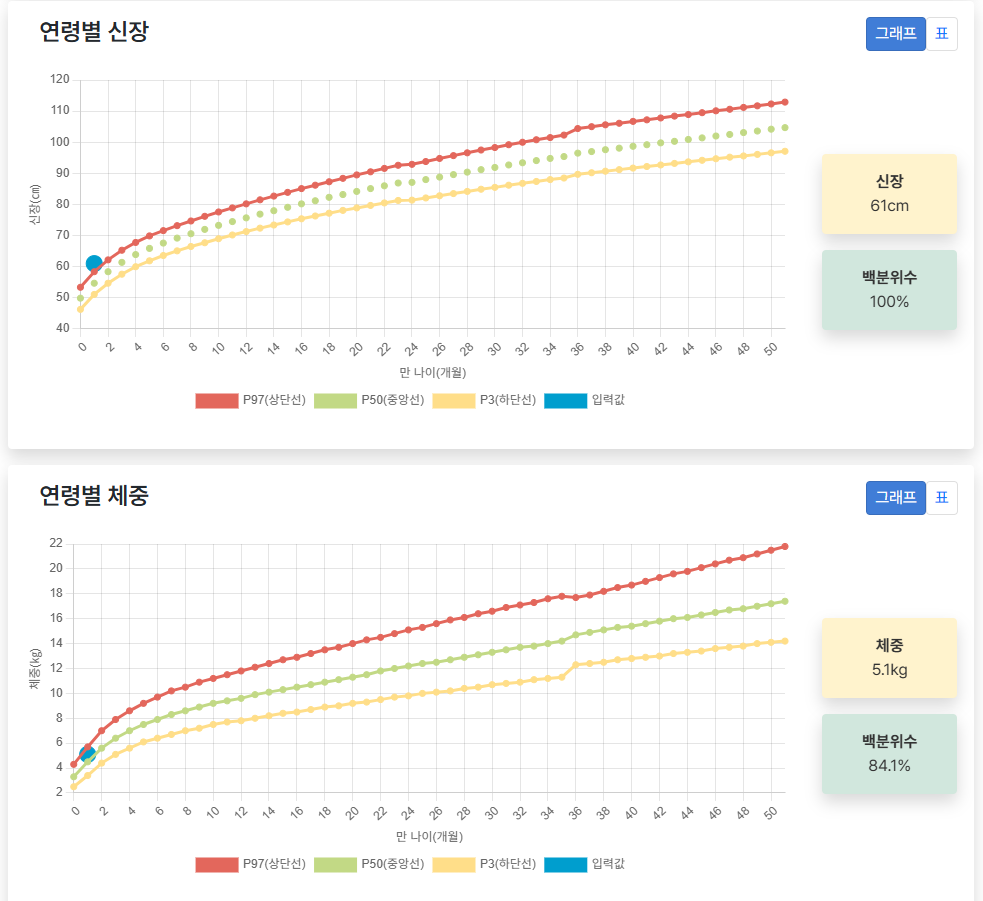
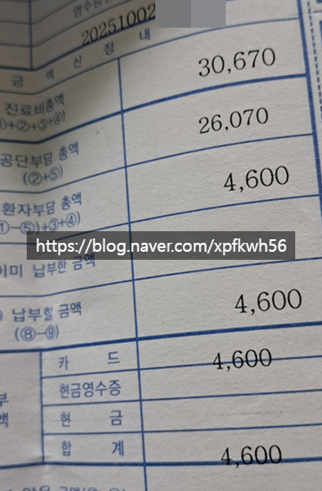
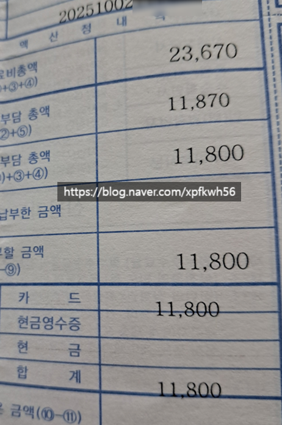
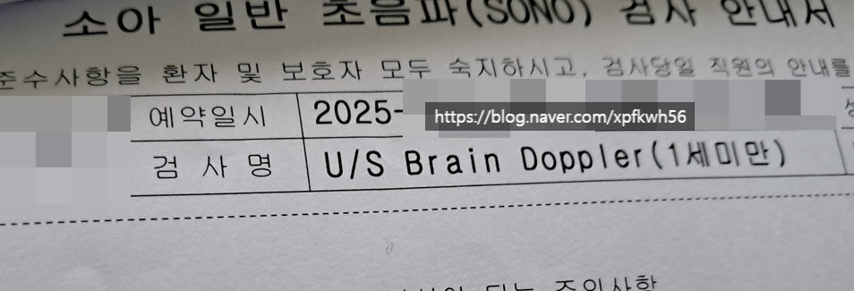
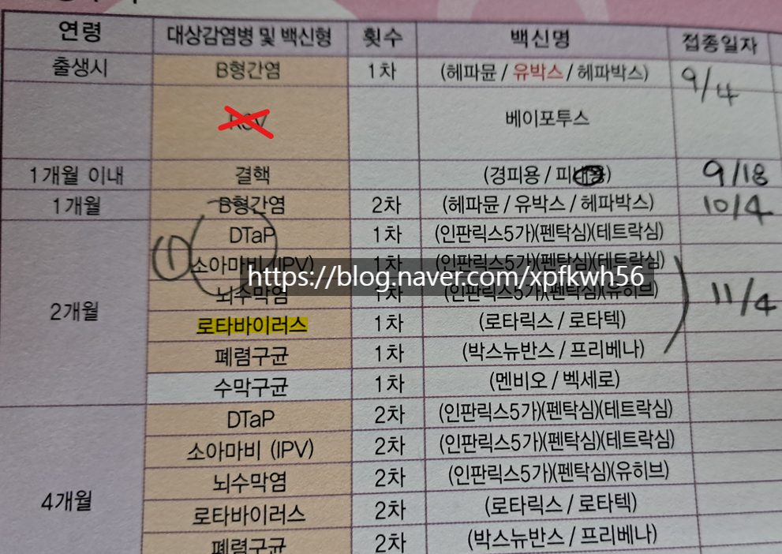

# 1호기, 생후 1개월/영유아 1차 검진
**Date:** 2025. 10. 2. 16:08
**Category:** 1호기
**Original URL:** https://blog.naver.com/xpfkwh56/224029769154
---

**​**

**1.** **Previously**

​

​

체중 4.140kg

신장 54cm

두위 37cm

흉위 36cm

​

​

모유량이 따라갈 수 없었고

혼합 수유했고, 많이 먹었음

​

먹고, 놀고, 자고를 **열심히** 함

​

​

두위는 **'머리'** 에 괜히 압력 줘서,

측정하다가 안 좋을 것 같아서 포기

​

키는 줄자 통해서 쟀을 때,

아무튼 55cm는 **확실히** 넘는다

​

체중은 약 5kg 전후 추정했었음

​

**2. 1차 영검 결과**

**​**

​

1) 체중 4.1kg → 5.1kg (+1kg)

​

**\* 기저귀 200g 제외시**

​

2) 신장 54cm → 61cm (+7)

3) 두위 38cm → 43cm (+5)

​

영검 특성상, 계측 오차 있을 수 있고

경향을 봐야하고 특정 시기에 제한해서

​

수치에 따로 의미부여할 필요는 없지만

일단 **양호하게** 잘 성장하고 있는 것 같음

​

​

보수적으로 책정하면, 아무튼 60cm 근처

체중은 5kg 전후 맞는 것 같고, 두위는

40cm 근방에 형성된 것으로 추정하는 중

​

**\* 머리는 물론, 체위 계속 변경하면서 키움**

**​**

3. 영검 이후, **2차 병원 진료의뢰** 요청했고

​

​

2차 병원 진료 후,

​

진료협력센터 협진 통해서

진료 의뢰서 하나 더 받고,

​

**\* 걱정의 상당 부분을 해소함**

**​**

3차 병원 당일 예약 잡았고

​

​

3차 병원 소아 초음파 예약함

​

**무럭무럭 잘 컸는데 왜 굳이?**

​

잘 큰다고 마냥 좋은 것은 아니기 때문

물론 100%는 아니지만 할 수 있다면

가능한 꼼꼼하게 챙겨서 나쁠 것 없을 듯

​

**4. 발달 현황**

​

소아과 전문의

발달 클리닉 → 하나도 문제없다

​

소아 물리치료사

→ 하나도 문제없다

​

나 : 소리 반응이 없다고 느껴진다

전문가 소견 : 개별차로 봐도 무관하다

​

**5. 접종 의견 궁금해요**

**​**

**​**

1) 소아과 = RSV 필수다

2) 다른 진료과 = 글쎄요?

​

→ 개인적으로도 알아봤을 때

내 생각은, **'굳이'** 필요 있을까?

​

1) 소아과 = 로타는 맞아라

2) 다른 진료과 = 로타는 맞아라

​

**→ 개인적으로도 알아봤을 때**

**이건 맞아야 될 것 같다 싶었음**

**​**

6. 신생아 성장은 피차 유전이라지만

그래도 무언가 집에서 한 것이 있나요?

​

1) 배경 포함, 생활 소음

최대한 45 db 이하 추구

​

2) 눈 뜨기 전까지, 최대한

150 lux 이하로 환경 유지

​

생활적으로 필요한 조명은

간접 조명으로만 쓰고 살았음

​

3) 눈 뜬 다음부턴 자연광 사용,

해 떨어지면 마찬가지로 어둡게

​

4) 앱솔루트 액상 리뉴얼 1단계

기저귀는 하기스 네이처메이드

​

젖병은 누크 퍼펙트 매치,

필립스 아벤트 함께 사용함

​

5) 수유시 체온 맞춰서,

​

입 더 이상 안 뻐끔거릴 때까지

충분히 먹을 수 있도록 먹였음

​

6) 습도 50-60도 유지,

온도 22-24도 유지

​

7) 호흡기 이슈 발생한 시점 후,

​

습도 55-60도 유지

온도 22도에 가깝게 유지

​

8) 씻고 나왔을 때,

체온 변화 적게 신경

​

**\* 씻길 때도 마찬가지로, 36.5도 체크**

**​**

9) 집에서 요리 포함, 후각 자극 최소화

​

10) 3-4주 무렵부터 일상에서 발생하는

기본적인 수준의 후각 자극은 노출했음

​

11) 스트레칭, 마사지는 안 했고

할 수 있는 한, 최대한 **'직접'** 움직여서

무언가 행동할 수 있도록 촉진했었음

​

12) 운다고 큰일 나는 것은 아니지만

그렇다고 마냥 운다고 좋을 것도 없음

​

13) 아기랑 무언가 할 때마다,

혼잣말 하고 말 걸어주고 최대한

할 수 있는 만큼 상호작용 열심히

​

**\* 깨어서 혼자 노는 시간 거의 없었음**

**반드시 어른 하나가 붙은 채로 케어함**

​

14) 기저귀 갈아주기 포함해서,

굉장히 **민감하게** 대응했다고 생각

​

제법 길어도 5분? 10분? 이상

눈에서 뗀 적이 없던 것 같은데,

​

소변 마크 조금이라도 찍히면

잠 깨지 않게 살살 바로 갈아줬음

​

**\* 대변 보면, 깨도 그냥 갈아줌**

**​**

15) 행동 바꿀 때마다, 세정제 사용

​

분유 만들거나, 어른이 활동한 공간,

기저귀 다이, 화장실, 아기 비데욕조 등

상식적인 범위 내에서 알콜 스프레이

​

**\* 충분히 알콜 환기 잘 해야 됨**

**락스는 괜히 무서워서 안 썼음**

​

16) 자외선, 온도, 미세먼지 체크하고

환기+산책해서 빛 노출될 수 있도록 함

​

**\* 산책이 찜찜한 경우,**

**특정 창문은 자외선 막으니**

**활짝하는 것이 낫긴 낫다함**

​

17) 유산균, 비타민D 영양제 안 먹임

대신, 체중/칼로리/활동량/신체 계측 등

​

아기에 대한 단서 습득에 많이 신경 썼음

​

18) 트림 루틴은 다음과 같음

​

**\* 꺼억 소리 안 나도 상관 없고,**

**조금 게워내도 귀에 들어가거나**

**추가적인 문제 안 생기면 노상관**

**​**

3분 등 손 오목하게 해서 두드리기,

1분 엎드린 상태로 ㄱ/ㅡ 자세 잠깐

**​**

**\* 갑자기 수유량 늘거나 하는 경우,**

**좀 더 두드리는 시간 많을 때도 있음**

​

위에 있는 시간 포함해서, 수유 직후

짧게는 15분, 길게는 30분 전후 정도

바로 눕히지 않고 약간 세운 채로 안음

​

4주 까지는 거의 내가 개입할 수 있는

요소가 많이 없어서 여유가 넘쳤는데,

​

2개월령 부터는 콘텐츠가 더 열리니

그거도 이제 열심히 해보려는 생각임