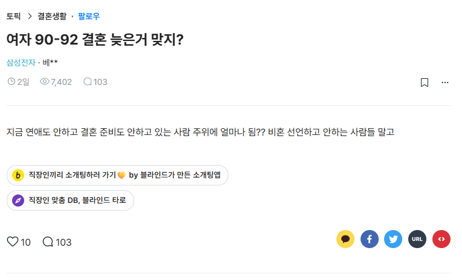

# 30대 대기업 싱글녀 김리아와 요망한 연하남
**Date:** 2025. 11. 1. 23:31
**Category:** 다이어리
**Original URL:** https://blog.naver.com/xpfkwh56/224061486192
---

​

1. 김리아는 근래, 웃을 일이 없었다

​

회의는 길었고, 결과는 예상대로였다

​

상사는 고개를 한 번 끄덕였고,

그건 위로도, 질책도 아니었다

​

무의미한 중간쯤의 제스처였다

김리아는 그게 더 싫었다

​

확실하게 맞으면 맞다고 정해지고,

아니면 아니라고 정해지는 것이 낫지

​

애매한 가능성으로 기대하고, 희망하고

낙담하는 일은 이제 지겨울 지경이었다

​

퇴근길 엘리베이터 안,

​

김리아는 거울에 비친

얼굴을 보며 생각했다

​

아직 괜찮아, 나쁜 생각 하지 말자

​

사람들은 종종 피로를 성실로 오해하지만,

그녀는 그 둘이 전혀 다르다는 걸 안다

​

김리아는 여태껏 살아왔던 것처럼

성실하게 거울을 보고 미소를 지었다

​

2. 10년 뒤에도 둘 다 싱글로 남는다면

같이 손잡고 실버타운에 들어가자던

​

마지막 친구의 청첩장을 받은 김리아는

차마, 그걸 진심으로 기뻐하기 어려웠다

​

오늘 나 우울증 걸려보라는 날인가?

​

남들은 아무렇지도 않게 하는 것 같은

평범한 연애와 평범한 결혼이라는 것이

​

내게는 처음부터 주어지지도 않았던

기회처럼 느껴지는 것이 마음 아팠다

​

좋은 인연이 있을 것이라는

친구의 말에 김리아는 마음에도 없는,

​

나는 이제 혼자가 익숙하다는

거짓말로 애써 자길 위로 할 뿐이었다

​

3. 그러던 어느 날이다,

​

[ 96년생? 걔가 날 왜? ㅋㅋ ]

​

김리아는 베프의 말에 기겁했다

​

[ 저번에 우리 다낭 놀러 갔을 때,

같이 찍었던 사진 있잖아? 그거 보더니

나한테 소개 시켜달라고 엄청 졸랐어

​

나도 괜히 소개 시켜줬다가 솔직히

중간에서 난처한 일 생기지 않을까

걱정도 되고, 너가 워낙 눈이 높잖아

​

그래서 잘 안될 수도 있다고 했는데

​

한사코 계속 부탁을 해서 물어본다고

허락해주면 번호 주겠다고 한거야 ]

​

흠,

​

김리아는 생각이 복잡해졌다

​

아니다, 아니다 스스로 부정하지만

사회에서 객관적으로 비추어지는

자신이 놓인 상황을 모르진 않았고

​

있으면 좋지만, 구태어 지금 내 일상에

요동을 만들고 싶지도 않았기 때문이다

​

무엇보다 정말 잘 된다면,

좋은 사람이라면 상관없지만

​

혹여라도 내가 지금에서

더 상처 입는 일이 생긴다면

​

간신히 붙들고 있는 내 완연한 일상도

견딜 수 없을지 모른다는 불안도 들었다

​

5살만 어렸어도, 그냥 뭐 어때?

라는 생각이 들었을 것 같다

​

그러나, 혹여 잘 된다고 해도 문제다

​

내 1년의 가치와 너의 1년의 가치는

다를 것이고, 그렇게 2년, 3년 보내다

흐지부지 연애가 끝나버리고 만다면

​

나는 오늘의 지금 내 결정을

내 선택이었노라 여길 수 있을까

​

내가 누군가를 어떻게 좋아했었는지,

어떻게 시작했었는지도 기억이 흐릿하다

​

확연한 것은, 그 끝이 아팠다는 것 정도다

​

그 흉터는 김리아를 더 신중하게 만들었고,

어느덧 점점 마음을 굳게 닫게만 하고 있었다

​

그녀는 카톡창을 보던 두 눈을 질끈 감았다

​

대답 대신 휴대폰을 내려놓았다

​

이 나이에 소개 라는 단어는 조금 피곤했다

​

그건 일종의 절차처럼 느껴졌다

안 하면 이상하고, 해도 이상한 일

​

잠시 후, 그녀는 다시 화면을 켰다

​

[ 번호 알려주면 내가 연락할게!

그리고 얘기해줘서 고마워~

​

혹시 잘 안 되두 원망하지

않을테니 걱정마~ ]

​

그 말은 결심이라기보다, 대책에 가까웠다

​

마치 사람들이 김리아를

선택받을 날만 기다리며,

​

쇼케이스에 올려진 존재로

여기는 것도 달갑지 않았다

​

연하남의 번호를 받은 김리아는,

​

카톡 프로필에 있는 자신의 사진을

면밀하게 검토하는 시간을 가졌다

​

비공개로 돌려놨던 수영복 사진을

공개로 돌릴까 말까 한참 고민하다,

​

저 당시 몸무게보다 지금은

4kg 정도 쪘음을 자각하고,

​

피차 뽀록 날 포장은

하지 않기로 했다

​

4. 뭐라고 먼저 보내지?

​

사실 간단하다, 내가 마음에 든다?

근데 다른 애들도 많을 텐데 굳이 왜?

​

하지만 내 궁금증을 먼저 묻는 것이

썩 좋은 접근은 아닐 것이 자명했다

​

자기소개를 먼저 해야 되나?

​

너무 오랜만이라서 남자랑 어떻게

예전에 대화 했는 줄 기억도 안 난다

​

안녕하세요, 라는 상투적인 말로

내가 너 번호를 받았다 정도를 알렸다

​

연하남은 꽤 나를 반기는 눈치였다

​

[ 누나한테 제 번호는 줬다고 들었는데,

연락이 안 오길래 잘 안된 줄 알았어요 ]

​

전여친인지, 여사친인지 모를,

남자가 찍어줬을 리는 없는 사진

​

키우는 강아지인지, 남의 강아지인지

동물을 안고 있는 사진이나, 여행 사진

​

훤칠한 뒷모습이 있는 사진이 있었는데,

딱히 비호감으로 느껴질 법한 건 없었다

​

이윽고, 우린 간단한 일상 대화를 했고

​

연하남은 주변에 예쁜 여자들 보일 때마다,

​

자기가 전부 이렇게 소개해달라고 했다면

굉장히 소름 끼치는 남자일테지만

​

누군가한테 이렇게 적극적으로

소개를 해달라는 것 자체가 처음이라고

뻔하지만, 듣기 나쁘지 않은 말을 했다

​

자기는 카톡보다는 통화가 더 나은데,

시간이 늦어 무작정 요구하기는 민망하고

​

초면에 어려운 소원 하나 빌 수 있다면

전화로 이야기를 했으면 한다고 했다

​

사실 톡으로는 티키타카가 잘 되더라도,

막상 실제로 대화를 했을 때

어버버 하는 남자가 적진 않을 건데

​

자신은 나중에 할 말이 떨어질까 싶어,

즐거울 일을 미루는 성격이 아니며

​

내가 결코 그런 스타일이 아니라는 것을

알 수 있는 기회가 될 것이라는 말과 함께,

​

나만 괜찮다면, 이 소원의 대가를

맨 입으로 닦지는 않겠다고도 했다

​

김리아는 적적해서 틀어놨던 TV 를 끄고,

남자의 전화 요청에 응하기로 했다

​

5. 연하남의 목소리는 듣기 좋았다

​

이래서, 통화를 하자고 했구나 싶기도 했고

사뭇 그 어필이 귀엽게 느껴지기도 했다

​

그리고 그녀는 그런 정직함이 싫지 않았다

​

둘은 얼마 더, 연락을 주고받았고

연하남의 메시지는 일정했다

​

아침엔 안부, 점심엔 확인, 저녁엔 복귀

​

패턴은 예측 가능했고,

예측 가능하다는 건 안정감이기도 했다

​

그는 언제나 선택권을 그녀에게 주는 척했다

​

김리아는 그게 더 교묘하다는 걸 알고 있었다

그건 선택이 아니라, 허락을 강요하는 방식이었다

​

그녀는 그 길들여짐이 묘하게도 달게 느껴졌다

​

적어도 내 의지에 관계없이,

상대가 나를 놓을 것 같지는 않았다

​

연하남은 늘 담담하게 나를 조여왔다

그게 위협이 아니라는 걸 아는 사람처럼

​

그는 어린 남자였지만

선택적으로 입이 무거운 남자였다

​

내가 말하고 싶지 않은 것에

대해서는 묻지도 않았고,

​

내가 묻고 싶은 것에 대해서만 입이 가벼웠다

그 선을 지킬 줄 아는 매력이 좋았다

​

6. 일주일의 짧은 시간,

​

약속에 조금 늦었던 나를 본

연하남은 환하게 웃었다

​

눈이 아주 예쁘게 접혔다

​

가까운 주점에 들어가,

안주를 주문하고

​

코트를 벗어 내려놓는 연하남의

넓고 깊은 쇄골에 눈길이 갔다

​

순간 나도 모르게 그를 남자로 느꼈다

가슴이 두근댔다

바보 같다고 스스로를 질책했다

​

처음 느껴보는 감정

이성의 몸에 대한 시각적 흥분

​

민망했다, 얼굴이 뜨거웠다

미친, 내가 몇 살인데

​

무해한 얼굴로 아무렇지도 않게

그녀를 격동시키는 연하남에게

김리아는 자신을 들키지 않으려 애썼다

​

반차가 몇 개 남았었지?

​

얼마의 대화가 있고,

​

취한 탓인지, 분위기 탓인지

가볍게 입을 맞춰왔다

​

그의 입술은, 입에서 볼로

볼에서 목으로 향했고

​

연하남의 얕은 호흡이

김리아의 귓볼 밑을 스쳐

턱 밑으로 가볍게 떨어졌다

​

새액새액 숨이 가빠온다

​

심장이 파열할 듯 죄어와,

들뜬 호흡을 참지 못하고

​

그의 목을 감아 안고

목덜미에 얼굴을 파묻었다