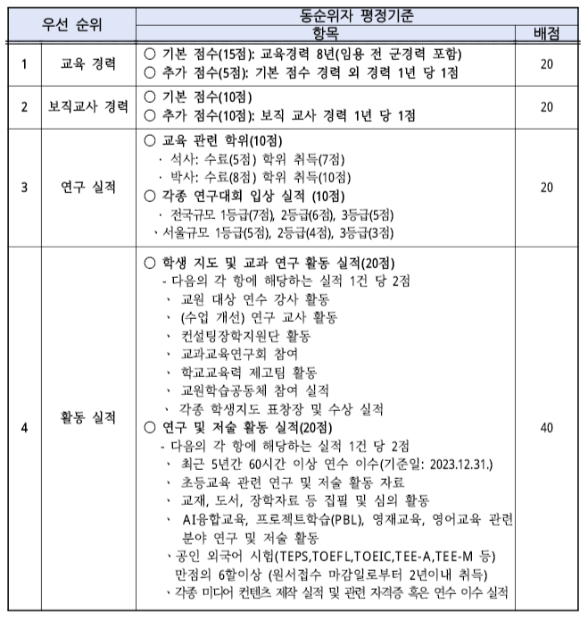
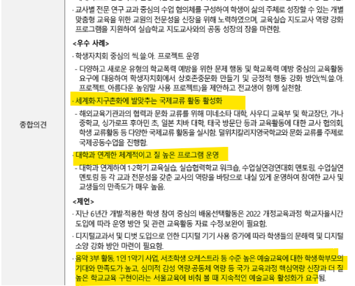

# 지방으로 갈 이유는 교육 말곤 없음
**Date:** 2025. 11. 1. 4:56
**Category:** 다이어리
**Original URL:** https://blog.naver.com/xpfkwh56/224060771674
---

1. 자식 교육이라면 멀쩡한 남편 놔두고,

미국까지 날아가는 것이 남조선 문화인데

​

기업을 유치하네, 인프라를 깔아놓네 같은

죽은 자식 부랄 만지는 것은 이제 고만하고

​

**아줌마들**을 꺼내올 궁리하는 쪽이 더 빠름

​

2. 최근에 농어촌 기본 소득 이라고 해서,

​

낙후지역에 적게는 10만 얼마, 많으면

30만 언저리 정도 준다는 내용도 있고,

​

특정 지역은 뭐 아닌 말로 가서 낳기만 하면

타 지역보다 1-2.5배 가량 더 돈을 주기도 함

​

근데 이걸 **'받는 입장'** 에서 생각할 필요 있음

​

현실적으로, 월 50만원을 준다고 쳐도

그거 받겠다고 멀쩡한 자기 터전 다 버리고

시골까지 내려가는 사람이 **어떤** 경우일까

​

서울, 또는 기타 대도시에서

베이스를 잃은 사람일 확률 높음

​

자식을 몇이나 낳을 줄 모르겠고,

가서 적응을 어찌할 줄은 모르나

​

서울, 특히 그 정점에 있는

학군지에 왜 사람이 몰리는가

​

생각을 해볼 필요가 있단 점임

​

​

3. 전국에 단 17개 밖에 없는 **'국립초'** 는

추첨으로 들어갈 수 있는 뺑뺑이 학교인데,

​

​

부모님 입장에서 구미가 당길 얘기가 많고,

**엣지 냄새나는** 프로그램들이 많이 있는 편임

​

**\* 최신연구, 교육경향이 잘 담긴다는 뜻**

​

같은 돈이면 1년에 1-2천 쯤은 들여야

얼추 비슷하게 따라갈 수 있는 사립과 달리,

​

국립은 공립적 속성이 있어서 학비도 없음

​

주말부부 6년 하면, **얼추 1억 아낀다** 칠 때

싸이즈만 나오면 안 할 이유가 없어지게 됨

​

**\* 국립초 경쟁률은 보통 30~40 :1**

​

서울 인기 국립초가 만약에,

**'다자녀 전형'** 을 **아주 크게** 풀면

​

둘 있는 집은 셋 낳을까? 하는

고민을 안 할래야 안 할 수 없음

​

**4. 학교가 있으면 뭐 함? 인프라가 없는데**

​

**오히려 좋아** 임

​

학군지의 장점은,

**'아빠가 심심하다'** 임

​

흔히 비교육적이라고 여겨지는

여러 상업 시설들도 없거니와,

​

아이가 **'딴 길'** 로 샐 가능성이

낮아진다는 이유 때문에 그런데,

​

아예 노답 시골로 내려가버리면

적어도 내 경험상, **뭘 할 수가 없음**

​

**\* 내 고향은 현재 인구 5만 이하,**

**대전 갔을 때 해외이민 온 줄 알음**

​

나는 어렸을 때, 맨날 산이고 들이고

다니면서 그림만 그리고 가끔 어쩌다

동네 친구들이랑 나무로 칼싸움 했구,

​

오라비들은 집에서 콤퓨타 붙들고

초등학생 나이에 슈팅 게임 만들고

​

게임 잡지에서 나온 게임을

**'못 사고 못 누리니까'**,

​

집에서 머리 박으면서 만들곤 했는데

​

덕분에 나는 미대 실기를 예고 테크도

아니었으면서 어렵지 않게 뚫었구,

​

**\* 꽤 오랜 시간을 진짜 밥 먹고**

**집에서 그림만 그렸으니 기본기나**

**이런 측면에서 좀 먹고 들어갔었음**

​

오빠들은 코로나 메타 때, IT 기술자

찾는 시장에서 어렵지 않게 취직했음

​

**\* 개발 역량 있는 실무자 공급 부족**

**​**

5. 아파트에 살고 싶은 사람은,

내 생각에 **'애초에'** 내려가질 않음

​

**\* 경쟁력 비교 불가**

​

근데 나처럼 단독주택 로망도 있고,

마당 넓은 집에서 **'대놓고'** 내 집 이다

하고 살고 싶은 사람들 입장에서는

​

치안이랑, 교통, 허가만 얼추 잘 내주면

이게 제법 구미가 당길 법한 일이란 말임

​

**\* 단독은 타산이 안 나와서,**

**대기업이 들어갈 견적도 없음**

**​**

**자연스럽게 중소 건설사,**

**지방 경기 부양까지 가능함**

**​**

심지어 강남에서도 유기농 먹인다고,

외식 아예 안 하는 엄마 한 둘이 아닌데

​

애들 집밥 먹여가면서, 유럽/미국 스럽게

라이프스타일 제안하면 뽐뿌 좀 올 것임

​

사람도 없는데 아파트만 죽어라 올리지 말고,

차라리 길이랑 동네 예쁘게 잘 닦아가지고

​

서래마을틱, 삼청동틱, 한옥단지틱 하게

테마 잡아서 애들 교육 특구로 잘 짜놓으면

​

그 맛에 돈 좀 있고 교육에 신경 쓰는

아지매들이 넘어와서 살 가능성 있음

​

6. 지방에서 인구 유입으로 착각하는게,

**'살기 좋으면'** 사람들이 내려온다는 것임

​

서울은 살기 좋아서 사람들이 많이 있나?

**'살고 싶으니까'**, 서울에 들어가는 것임

​

그리고 어린 시절은 **'연어'** 개념이 있어서,

​

나이 먹고 어디가 좋다, 좋다 해도

자기가 어렸을 때 느낀 인식값이 **큼**

​

부산에서 나고 자란 사람한테는

압청대삼반보다 해운대구가 때때로

더 뽐뿌가 오는 지역일 수 있고,

​

**\* 나이 먹고 배운 명품보다,**

**자기가 어렸을 때 선망하게 된**

**브랜드 이미지에 충성하듯이**

​

특히 나처럼 단독 오래 살았던 사람은

아파트에 그렇게 큰 매력을 잘 못 느낌

​

**\* 그냥 남들이 좋다니까 좋은갑다**

​

7. 지금만 해도 먹고살려고 타향 갔다가

여유만 되면 고향 내려오고 싶은 사람이

사실 적지는 않을 것으로 보이는데,

​

낙향하거나 돌아온 애들을 데려다가

​

**'지역 유지'** 로 키울 생각

하는 것이 더 빠를 것 같음

​

예전에야 입신양명 하라고 떠밀었지

​

창업이나 생계에 바로 맞닿는

밥벌이에 관심 많은 사람도 많아서,

​

**\* 무신 어디 영화 유튜버가 77억 전세**

**들어갔네 같은 뉴스가 낯선 얘기가 아님**

​

미취학, 초등부터 경제, 금융, 창업교육

특화해서 돌리구 중학교 무렵 즈음에는

​

피차 여기저기 다 흩어져 없어지는 돈,

애들한테 얼추 500 씩이라도 밀어줘서

​

뭐라도 하나 해보게 시켜준다고 하면

​

우리 애도 워렌버핏,

짐로저스 되는 것 아닌가

​

혹시 엔비디아 차리는 것 아닌가 하는

아지매들한테 니즈가 있을 걸로 보임

​

**'차고 창업'** 을 할래도, **'차고'** 가 없으니

​

이게 맞나? 싶어도 사람들이

길이 없어서 시험만 찾는 것임

​

지역 사회에서 자급자족할 수 있게,

시장 파이가 매우 크지는 않더라도

​

그 안에서 **'공급자'** 가 될 수 있게 하면

​

시골에서 받을 것만 다 챙겨 먹고

결국 서울로 떠나는 일을 막을 수 있음

​

초등학교 끝나면요?

**국제중**을 뿌리면 돼죸ㅋ

​

**\* 전국 4갠가, 5갠가 있음**

**​**

고등학교야 알아서들 가는 것이고요

​

국립초, 국제중만 **대놓고** 보장해주면

그거만 보고도 이사할 사람 많을 것임