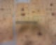
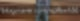
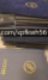
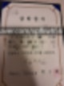
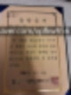
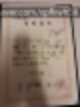
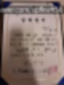
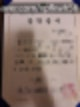
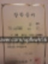

# 교육비에 대한 생각
**Date:** 2025. 11. 8. 20:51
**Category:** 갓생추구
**Original URL:** https://blog.naver.com/xpfkwh56/224069304078
---

​

1. 교내 상장 약 3cm 정도

​

​

2. 교외 상장 많음

​

​

3. 돈 받고 학교 다녔고

돈 받고 공부 했었음

​

직업 = 돈을 버는 것

​

학생이 직업인 사람

= 공부로 돈을 벌 수 있어야 프로

​

**\* 장학금을 받았다면?**

**​**

**1) 내가 다른 사람의 기회를 빌린 것**

**​**

**이 돈이 쟤한테 있었을 때 보다**

**나한테 있었을 때 더 가치있음을**

**나 스스로 입증할 수 있어야 됨**

**​**

**2) 타인의 기대에 부응해야만 하는 것**

**​**

**주는 사람이라고 꽁돈 퍼준 것 아니니,**

**내가 더 훌륭한 사람이 되기 위해서**

**부단히 노력하려는 자세를 잃음 안 됨**

**​**

4. 지방 + 비학군지 + 노 사교육

+ 부모님이 교육에 크게 열정 없음

​

같은 상황에도 **노-오력** 하면 가능함

​

**\* 안 할 때보단 무조건 좋은 삶이 됨**

**​**

타인이 감동할 만큼, 열심히 살면

주변에서 도와주는 사람 생기게 됨

​

내 수저가 애매하고, 환경이 애매하면

좌절할 시간에 **뭐라도 하나 더** 해야 함