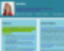

# (독학) 명문대 고등 지식 강의 무료로 듣는 법
**Date:** 2025. 12. 26. 15:23
**Category:** 다이어리
**Original URL:** https://blog.naver.com/xpfkwh56/224123377984
---

<https://www.youtube.com/@mitocw/playlists>

[**MIT OpenCourseWare**

A free and open online publication of educational material from thousands of MIT courses, covering the entire MIT curriculum, ranging from introductory to the most advanced graduate courses. On the OCW website, each course includes a syllabus, instructional material like notes and reading lists, and...

www.youtube.com](https://www.youtube.com/@mitocw/playlists)

​

**1. 저는 영어가 안 되는데요ㅜ**

​

<https://www.languagereactor.com/>

[**Language Reactor**

Learn From What You Love Language Reactor helps you find content for your level and interests Netflix The browser extension turns your favorite shows into language lessons. Pro mode enables speech recognition and machine translation for seamless comprehension. 🌍 ➜ YouTube & Podcasts Thousands of Yo...

www.languagereactor.com](https://www.languagereactor.com/)

​

크롬 확장프로그램 설치

​

​

짜자잔

​

신분 + 전문성 확실한 선생님

​

영어가 안 되면, 조금 불편하겠지만

아마 **'곧'**잘하게 될 겁니다

​

<https://oyc.yale.edu/>

[**Welcome | Open Yale Courses**

Image Philosophy and the Science of Human Nature with Tamar Gendler "To understand the structure of the human soul we must understand the structure of society; to understand the structure of society we must understand the structure of the human soul." Image Roman Architecture with Diana E. E. Kleine...

oyc.yale.edu](https://oyc.yale.edu/)

​

2. 이거는, 예일 대학교

​

<https://pll.harvard.edu/catalog?price%5B1%5D=1&max_price=&start_date=&keywords=>

[**Catalog of Courses**

Browse the latest courses from Harvard University

pll.harvard.edu](https://pll.harvard.edu/catalog?price%5B1%5D=1&max_price=&start_date=&keywords=)

​

이거는 하버드 대학교 에서 제공합니다