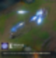
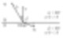

# 게임에 미친 아들이 생산적이길 원함
**Date:** 2025. 12. 26. 16:48
**Category:** 다이어리
**Original URL:** https://blog.naver.com/xpfkwh56/224123487442
---

1. **'모딩'** 을 같이 하세요

​

요즘 남자애들이 뭔 게임하는 줄 모르겠지만

모드 추가해서 옷 바꿔입고, 기능 추가하고

치트성 플레이 가능하도록 하는 일들의 경우,

​

**'대부분'** 남아들이 관심을 보일 확률이 높음

​

**\* 브롤 같은 게임이라고 가정한다면,**

**최강 종결 스펙 캐릭터 만들기 같은 것**

**​**

2. 코딩 학원 보내서, 배우라고 한다?

아마 제 생각에는 그거 **승률** 이 높진 않음

​

차라리 프리서버 구축해서, 운영자 노릇하기

게임에 없는 서비스 추가하기 이런 쪽으로 가면

​

**'고작'** 게임이 아니게 될 가능성이 높을 듯함

​

Rave it = 구독자 7만

​

3. 위 유튜브는 롤 팬메이드 영상인데요

​

​

솔직히 수학 공부랑 아예 똑같은 말인데도,

​

Collider, Raycast 충돌 처리 분석 개념,

​

**\* 유니티 3D 기초**

**​**

​

재미 붙이면, 이런 것 그냥 본인이

**'알아서'** 배우지 않을까 싶음

​

**\* 원형 모양 스킬, 별 모양 스킬을**

**구현하고 싶으면 수학 알아야 됨요**

**​**

4. 남아들 푸슝파슝 같은

이런 말 많이 한다고 들음

​

<https://youtube.com/shorts/YSY25p04xUM?si=TFuYgioSsFWZRL36>

​

아마,

​

<https://youtu.be/TUyGGI5NNiM?si=g8wM0wwiJl4iSwsm>

<https://youtu.be/xFrqO853yhk?si=cB_oGdJ0uwDn2Ue4>

​

이런 기술은 눈 돌아가서

배우고 싶어하지 않을까 싶음