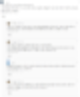

# 준비하는 것부터가 시작 임
**Date:** 2025. 12. 26. 18:38
**Category:** 다이어리
**Original URL:** https://blog.naver.com/xpfkwh56/224123610306
---

​

**1. 오답 예시**

​

1) 아~ 3090 은 안 됩니다,

브이렘이 어쩌고 저쩌고 (x)

​

내가 어디에, 어떻게

쓸 것인지에 따라 다름 (o)

​

그냥 GPT 만 사용할 거면

당연히 글카도 필요 없음

​

2) 여기서 이렇게 사면 싸고,

저기서 저렇게 사면 싸고 등등 (x)

​

**'뭐를 사야 될 것인지'** 도 안 정해짐

​

모래는 사막에서 사오고,

얼음은 북극에서 사오면 싸죠

​

카탈로그 쭉 있고, 그 안에서

내 입맛대로 고르는데 저렴하다

​

보통 이런 곳이 저렴할 **리가** 없음

​

제품 하나씩 전부

발품 팔아서 사야 됨

**​**

**2. 입문용 장비 논리에 대해서**

​

물론 아닐 수도 있는데, 제 생각에는

파이썬 설치, 라이브러리 다운로드

여기에서 **80%** 는 멈추실 것으로 봄

​

어렵진 않은데, 하나하나 찾기 귀찮고

​

**\* 솔직히**

​

뭐 설정도 많이 하라고 하고,

무턱대고 하면 오류만 나오고

​

버전도 엄청 많고, 내 컴퓨터가

그래서 뭐 어떤 상태인지 등등

​

알아야 될 내용이 **너무 많기** 때문

​

좋은 장비가 있으면 물론 좋은데,

​

내 검에 보석이 몇 개 달려있고,

날이 얼마나 고급이고 이거보단

​

첫 시작은 일단 **'잘 휘두를 수 있냐'**

라는 질문을 푸는 것이 제일 좋은 듯

​

3. 예전에도 비슷한 이야기 했는데,

**'독학'** 하려는데 **'교재'** 추천해 주세요

​

라는 질문에, 독학은 교재 선별도

포함되는 것이라고 대답한 적 있음

​

저는 조립도 본인이 해볼 것을 권하는데,

그래야 나중에 바꿀래도 바꿀 수 있고

​

결국 조립이 **바이오스 접근** 의 시작이라

내가 **내 기계에 대한 이해** 를 올릴 수 있음

​

**\* 트러블 슈팅 대비 안 되면,**

**​**

**개발 모르는 사람이 숨고 같은 곳에서**

**프로그램 만들어 달라고 한 상황처럼 됨**

**​**

요 앞에 있는 포스팅 보시면,

​

20만원 주고 산 아수스 프로아트가

델타값 **'1미만'** 찍힌 것이 보이실건데,

​

**'제가'** 안 알아봤다면 어땠을까요?

​

1) 믿고 가는 삼델엘

2) 울샤 사세요

3) 돈 많아? 애플 ㄱ

​

이런 소리나 듣고 샀을 것이구요,

​

또는 뻥스펙, 뻥사양 상품 산 다음에

**해골물** 먹고 있었을 가능성이 높아요

​

**\* 수율 낮은 중국산 패널 사는 케이스**

​

뭐든 남에게 맡겨서 될 일은 **하나도** 없다

기본적으로 이 시작이 제일 안전합니다