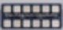
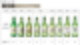

# 컴퓨터 살 때, 알면 좋은 노하우 2개
**Date:** 2025. 12. 26. 20:59
**Category:** 다이어리
**Original URL:** https://blog.naver.com/xpfkwh56/224123730608
---

1. **'인터넷 최저가는 최저가가 아니다'**

​

**\* 온라인 알고리즘 로직을 이해하고 있다면**

**최저가 결정 논리의 헛점을 알 가능성이 높음**

**​**

제일 먼저 봐야 하는 가격은,

출고사에서 고시한 **'1차 가격'** 임

​

이거 상식적으로 해석하면 되는데,

​

공장에서 물건을 직접 자기들이

손님한테 파는 가격이 100원이다

​

그럼 그 물건을 **'업자'** 한테 팔 때는,

걔네 마진을 어느 정도 잡아주게 됨

​

업자한테 파는 이유는

소비자는 1개씩만 사가지만

​

업자는 100개, 1000개씩 사니까

단숨에 현금흐름을 확보할 수 있음

​

각자의 이해관계를 추적해 보면,

​

1) 소비자는 무조건 싸게 사면 이득

2) 업자는 출고가보다 최대한 싸게

​

**\* 유통**

​

3) 공장은 최대한 현금흐름 많이 확보

​

**\* 금융**

​

이렇게 3개의 도식이 존재하는 것임

​

약간 이해가 어렵다면, 그냥 아싸리

**'주식 시장'** 이라고 생각을 하면 빠름

​

시중에 있는 주식을 **얼마에** 사고 싶음?

​

그건 잘 모르겠지만, 보호예수 걸려도

아무튼 시가보다 싸면 기분 좋을 것임

​

그 가격이 **'사는, 파는'** 시장이

우리가 타깃하면 좋은 채널인 셈

​

주식과 달리, IT 기계 부품의 경우

명백한 공산품이라 시장 파악이 쉽고

​

가격만 잔뜩 추적하고 다니면

앉은 자리에서 1원은 더 싸게 삼

​

그렇게 더 **'찾아 다니면서'** 찾는 것임

​

**\* 핫딜, 카드사 직권 할인, 포인트 등**

​

토탈 가격비교 사이트 들어가서,

딱딱 누르고 제일 싼 것만 찍으면

​

그건 **'최저가'** 로 사는 것이 아님

​

CPU 같은 경우만 해도,

멀티팩과 그냥 정품이 있음

​

**차이가 뭐냐?**

​

같은 제품인데 정품은,

일일이 포장된 출하 상품이고

​

멀티팩은, 여러 CPU 를 담고 있는

제품을 사서 도소매 업체가

패키징 박스에 재포장한 것임

​

**\* 동일한 제품**

​

두 가격 차이가 난다면,

정품을 사는 것이 이익일까?

​

아니면 멀티팩을

사는 것이 이익일까?

​

각자 판단에 따를 문제지만,

​

나는 멀티팩이나 정품이나

무슨 차이가 있나 **모르겠음**

​

유통은 뭐다? **'금융'** 이다

​

그냥 멀티팩이나, 정품이나

가격 차이 있으면 멀티팩이 낫네

​

이건 **'생각을 게으르게 하는 것'** 임

​

​

멀티팩 CPU 는 위와 같이 유통되는데,

​

저런 번들을 **'통째로'** 사면 1개 살 때보다

**'무조건'** 당연히 더 저렴할 수밖에 없어짐

​

즉, **내가 12개 트레이로 사서**

**11개는 판매하고 1개 내가 쓰면**

​

나는 1 트레이에 한해서,

**도매가** 로 쓰는 것이 가능함

​

**\* 멀티팩 업자의 마진을 안 주고,**

**그 마진을 내가 먹는 것이 된단 것**

​

그리고 11개를 팔아서 얻은 마진을

내 이익으로 환원하는 것 또한 가능함

​

**\* 싸게 사는 법 = 리스크 테이킹**

**​**

2. **'양품'** 을 고르는 방법

​

모든 기계는 **'수율'** 이라는 것이 있음

​

사업에서 아주 어려운 일이

**표준화, 양산화** 인데,

​

물건 100개를 팔았는데, 그 물건들이

다 손으로 불량 찾고 고쳐 써야 된다면,

​

장사를 오래 하는 것은 **불가능** 함

​

그래서 **'판매자'** 들은 이거에 민감함

​

모두가 가능하면 스트레스 덜 받고 싶고

​

솔직한 말로 손님이 일단 결제 끝났으면

다신 불편한 연락할 일 없길 바라기 때문

​

국내에는 **'묘한'** 제도가 하나 있는데,

그게 바로 **'묻지마 반품'** 제도 임

​

서로 합의가 끝났어도 최저임금을 어기는 등,

​

기본적인 법률에 반하는 규칙 같은 것은

결국 **객관적으로** 통용되지 않는 만큼이나

​

규정에 적용되는 경우, 인터넷으로 구입한

물건은 **'묻지마'** 로 청약을 철회할 수 있음

​

RAM을 보는 법은 다음과 같음

​

**1) RAM 용량**

8, 16, 32, 64, 128 등등

​

**2) 클럭**

4800, 5000, 6000 등등

​

**3) CL (Cas Latency)**

16, 18, 30, 40

​

RAM 용량은 **부엌 크기** 라고 보면 됨

​

부엌이 넓으면 넓을수록

덜 정리하고 사용해도 되고,

​

대체로 쾌적하게 일 볼 수 있음

​

**\* 8GB = 원룸**

**16GB = 일반 가정집**

**32GB = 레스토랑 주방**

**64GB = 급식소 주방**

​

RAM 클럭은 조리 라인 수임,

화구가 2구냐, 6구냐로 이해하면 됨

​

**\* 클럭이 높다 = 동시에 많은 데이터를 처리**

​

CL은 부엌에 있는 사람의 **'속도'** 를 의미함

​

소금 갖다줘 했을 때, 느리면 어리버리 타고

빠르면 째깍째깍 바로 찾아서 갖다 줄 수 있음

​

부엌은 넓은데, 불이 적고, 반응이 느림

​

**\* 고용량 RAM, 저 클럭, 높은 CL**

​

공간이 많아도, 정작 일을 하기 어렵듯

이 밸런스를 **'잘'** 잡아서 하는 것이 중요

​

​

처음처럼 을 샀다면,

도수 몇 짜리 술을 산 것임?

​

**16도** 임

​

그럴 사람은 아마 없겠지만,

​

만약 내가 산 술이 **15.8 도**

또는 **16.3 도** 라면 어떨까?

​

오차 범위 내라면 그냥 마시겠지만,

11도, 25도 이런 경우라면 대부분은

그 소비에 만족할 확률은 낮을 것임

​

저사양은 사실 별 상관이 없는데,

고사양 RAM 들은 벤치마크 딸딸이나

​

제조사에서 자기들한테 최대한

유리하게 표기하는 경우 많아서,

​

마치 **'자동차 연비'** 처럼 될 때 많음

​

그래서 컴퓨터 조립한 다음에,

바이오스 세팅 들어가서 **돌려보고**

​

**\* 스트레스 테스트, 메모리 튜닝**

**​**

**발열, 안정성, 퍼포먼스 등**, 체크한 다음

내가 받은 부품이 양품인지, 아닌지 를

스스로 판단해서 결정할 수 있으면 좋음

​

> 업자한테 맡기면 알아서 해주지 않나요?

​

**'해줄 수도 있고, 안 해줄 수도 있는데'**,

​

입장 바꿔서 생각하면 그걸 어떤 조건,

어떤 환경에서 해줄 수 있느냐 는 궁금함

​

**\* 사업주 기준, 업종 불문하고**

**불량에 대한 기준이 여유로운 편**

**​**

보통은 그냥 조립한 다음에, 딱 1번 켜보고

**문제 없으** 하고 당장 탈 안 나면 보내주겠죠

​

본인이 볼 수 있다면 차이가 **당연히** 있읍니다

​

**3. 결론**

​

소비는 귀찮은 일이고, 언제나

많은 정보와 노하우를 요구한다