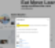
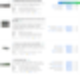
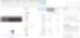

# (튜토리얼) 님아, 저도 그거 쓰고 싶어요
**Date:** 2025. 12. 27. 13:21
**Category:** 다이어리
**Original URL:** https://blog.naver.com/xpfkwh56/224124340224
---

​

1. 선문답 부처님

도 닦는 소리 같은데,

​

**진짜** 임

​

**'인공지능을 활용합니다'**

​

→ 저는 요즘 한국어를

활용하고 있습니다 급이라서

​

문제 설정을 어떻게 하느냐?

내가 어떤 문제를 해결하고 싶냐?

​

지금 내 상황과 상태가 어떻고,

나는 어떻게 개선할 수 있는가?

​

같은 것들을 전부 스스로 해야 됨

​

​

이렇게만 나와도, **'일단'** 더 나아짐

​

제일 먼저 할 줄 알아야 되는 것은 **'RAG'**,

​

<https://aws.amazon.com/ko/what-is/retrieval-augmented-generation/>

[**RAG란? - 검색 증강 생성 AI 설명 - AWS**

검색 증강 생성(RAG)이란 무엇이며, 기업에서 RAG AI를 사용하는 방법과 이유, AWS에서 RAG를 사용하는 방법에 대한 내용입니다.

aws.amazon.com](https://aws.amazon.com/ko/what-is/retrieval-augmented-generation/)

​

RAG 에 대한 개념과 정의는 위와 같고,

​

<https://www.youtube.com/watch?si=Z7HeaMrEL5gRbxr4&v=qN_2fnOPY-M&feature=youtu.be>

**​**

로컬로 구축하는 튜토리얼은

위에 있는 영상을 보면 됨

​

​

남조선 학부모님들이

그렇게 키우고 싶은,

​

**ML** 이 저런 사람 입니다

​

**\* 전 세계에서 찾는 인적 자원이자,**

**컴퓨터 1대만 갖고 있으면 공간적인**

**구애 받지 않고, 어디서든 사는 인간**

**​**

​

2. 저게 뭐에요? 저도

GPU 빌려서 쓰고 싶어요

​

**1) GPU 를 빌린다? 그게 돼요?**

**​**

<https://www.samsungsds.com/kr/gpuaas/gpuaas.html?utm_source=paid_goolge&utm_medium=sa-pc&utm_campaign=sdsk2025_gpuaas&utm_term=gpu%ED%81%B4%EB%9D%BC%EC%9A%B0%EB%93%9C&gad_source=1&gad_campaignid=22397859728&gbraid=0AAAAAqs18hRKRZzA3ccRZJ27pS5bGOQgH&gclid=Cj0KCQiAgbnKBhDgARIsAGCDdlen8UGBeRKyWgCvk9zdu-CFoM4TyQQtLRO3IK6_Qo8bfm91Y6pCR6UaAo51EALw_wcB>

[**삼성 클라우드 플랫폼 GPUaaS | 즉시 사용 가능한 고성능 GPU 도입 | 삼성SDS**

초기 투자 없이 즉시 시작하는 고성능 GPU 서비스. 삼성 클라우드 플랫폼 GPUaaS로 AI·ML 워크로드를 지금 시작하세요. 국내 최대 물량의 고성능 GPU와 24/7 전문 기술 지원을 제공합니다.

www.samsungsds.com](https://www.samsungsds.com/kr/gpuaas/gpuaas.html?utm_source=paid_goolge&utm_medium=sa-pc&utm_campaign=sdsk2025_gpuaas&utm_term=gpu%ED%81%B4%EB%9D%BC%EC%9A%B0%EB%93%9C&gad_source=1&gad_campaignid=22397859728&gbraid=0AAAAAqs18hRKRZzA3ccRZJ27pS5bGOQgH&gclid=Cj0KCQiAgbnKBhDgARIsAGCDdlen8UGBeRKyWgCvk9zdu-CFoM4TyQQtLRO3IK6_Qo8bfm91Y6pCR6UaAo51EALw_wcB)

**​**

저 링크에 있는 내용 읽고, **배경지식** 습득

​

<https://idc.gabia.com/gpu?utm_source=naver&utm_medium=social&utm_campaign=%EC%84%9C%EB%B2%84%ED%98%B8%EC%8A%A4%ED%8C%85&utm_term=GPU%EC%84%9C%EB%B2%84%ED%98%B8%EC%8A%A4%ED%8C%85_%EC%82%B4%ED%8E%B4%EB%B3%B4%EA%B8%B0>

[**가비아 IDC: GPU 서버**

고성능 GPU 서버, 믿을 수 있는 곳에서 구입하세요. 업계 20년 노하우의 가비아에서 딥러닝과 고성능 컴퓨팅 효율을 극대화하세요

idc.gabia.com](https://idc.gabia.com/gpu?utm_source=naver&utm_medium=social&utm_campaign=%EC%84%9C%EB%B2%84%ED%98%B8%EC%8A%A4%ED%8C%85&utm_term=GPU%EC%84%9C%EB%B2%84%ED%98%B8%EC%8A%A4%ED%8C%85_%EC%82%B4%ED%8E%B4%EB%B3%B4%EA%B8%B0)

​

남조선에서 판매하는 **GPU 대여 시세** 확인

​

아주 쉽게 비유하면, 집에 컴퓨터 없으니까

PC방 가서 빌려 쓰는 것으로 이해하시면 됨요

​

네이버, 구글에 GPU 대여, GPU 클라우드 렌탈,

GPU 대여 사이트 검색해서 찾아서 쓰면 빠르고,

​

**'빠르고 확실한 대기업을 쓰겠다'**

→ google colab = 대기업 피시방

​

**'발품 팔아서 좋소에서 찾아보겠다'**

→ 출처를 알 수 없는 외국 회사 찾기

​

2) 장점과 단점이 있나요?

​

PC방 가는 것과 **똑같습니다**

​

내가 매일 PC방에 5만원씩 주는데,

한달 쓰면 150만원이다, 그럴 바에야

그냥 컴퓨터 하나 사는 것이 낫지 않냐

​

라는 분들은 구입해서 사용하면 됩니다

​

근데 로컬을 권장하는 이유가 뭐냐면요,

​

저거 빌려서 쓰다보면,

**'세입자의 설움'** 을 겪게 됨

​

**\* 저는 남의 집 월세 사는 것에 대해서**

**불편이 1도 없는 사람인데, 저거 쓰면서**

**진짜 더럽고 치사해서 사야겠단 생각함**

**​**

**그리고 최근 10년 사이에,**

**이거보다 더 만족스러운**

**소비를 해본 적이 없습니다**

**​**

**→ 내 집 샀을 때 보다 더 뿌듯했고,**

**여태 샀던 그 어떤 것보다 애착이 큼**

​

3. 저도 컴퓨터 제가 직접 견적내고,

직접 조립해서 사용하고 싶어요

​

1) **'각오'** 필요

​

100-200만원 내외 정도 되는,

보급형 컴퓨터 조립이랑

​

시가 **1천만원 근방 컴퓨터** 는

조립의 난이도 자체가 다릅니다

​

**\* 문제 생기면 기본 100만원 시작,**

**최악의 경우, 500 이상 날릴 수 있음**

**​**

**2) 완본체 구입 vs 드래곤볼 조립**

​

완본체는 그냥 완성된 것 사는 것이고,

​

드래곤볼 조립은 각 부품을 내가 찾아서

최소한의 가격으로 구입해서 쓰는 것임

​

하드웨어 호환성 여부, 변수 대응,

여러가지 부문을 체크할 수 있음 되고

​

부품을 다 완벽하게 구입했다는 전제 하에,

워크스테이션 기준, **'조립비 25만원'** 정도면

시세에 부당하게 지불하는 것은 아닙니다

​

**\* 저는 컴퓨터 조립 잘 하는 편 이에요**

**보통 어지간한 남자도 이렇게 못 합니다**

**​**

**→ 무작정 휘황찬란한 것은**

**제 미감이 아니라 안 하는 것 뿐**

**​**

**동네 수리점 같은 곳에 해달라고 하면,**

**다들 부담스러워서 안 하려고 할 것임**

​

3) 그냥 용산가서 견적 내달라고 하고,

알아서 조립 해달라고 하면 안 될까요?

​

고사양 워크스테이션 기준으로,

인터넷에 있는 업체만 찾아본다 치면

​

**\* 그렇게 할 때**

​

**'최소'** 200 정도 더 비싸게 사야 됩니다

​

돈은 더 쓰고, 사양은

**무조건** 더 내려갑니다

​

**\* 컴퓨터는 주식이나, 부동산과 달라서**

**50만원만 더 써도 체감 차이가 무척 커요**

**​**

무엇보다 큰 문제는, 대부분의

용산에 계신 분들이 ai 활용에 관한

실무적인 지식이 거의 없기 때문에

​

**\* 게이밍 역량은 매우매우 탁월함**

​

권하는 내용을 **'믿을 수가'** 없어요

​

다만, ​**'견적을 내는 시점'** 부터

인공지능에 대한 이해가 굉장히

넓어질 수 밖에 없기 때문에

​

**\* 이 부품이 왜 필요한가**

​

할 수만 있으면 하는 것이 낫습니다

​

4. 저는 선형식이 좋아요,

​

일단 대학원 가면 될까요? 아니면

정말 기초부터 다 배우고 싶은데

어떤 것부터 배워놓으면 좋을까요?

​

**1) 수학**

​

심화 원리로 가면 **'다'** 수학 입니다

​

제가 대학교 1-2학년 정도 되는

교양 수학은 찍먹 하고 들어갔는데,

​

**\* 인공지능 하기 전에, 취미 삼아서**

​

알고, 모르고 차이가 **'매우'** 클 겁니다

​

그게 무엇이든 상관없지만,

알 수 있는 만큼 최대한 많은

**고등지식** 이 있으면 유리함

​

**\* 예전에는 원래 교대, 유아교육과**

**이런 것이 많이 아쉬웠는데 최근은**

**공대를 다녀볼 걸, 하는 생각을 자주**

**​**

**저는 라즈베리만 쓸 줄 알아도,**

**이렇게 인생이 다를 줄 몰랐어요**

**​**

**전자, 기계를 배우면 안 굶는단 말이**

**무슨 말인지 철저하게 체감하는 중임**

**​**

**제가 저걸 이미 알고 있었더라면,**

**AI 워크스테이션 보다 3D 프린터를**

**먼저 사용해서 쓰지 않았을까 싶음**

**​**

**2) 컴퓨터 과학**

​

소프트웨어를 잘 다루고 싶으면,

하드웨어 이해가 있어야 하고

​

하드웨어를 제대로 쓰기 위해서는

소프트웨어를 **당연히** 또 알아야 됨

​

코딩, 개발, 이런 문제가 아니고

컴퓨터 자체를 **알면 알수록** 좋아요

**​**

**3) 도메인 데이터**

​

​

최근 **RAM 가격 동향** 입니다

​

​

다나와 에 있는 인기상품 1-4위 인데,

​

​

작년에 3만원 하던 렘이 16만원 이고,

​

제가 저번 주에 구입한 렘이

​

오늘 기준으로 수십 만원

정도 올라간 상태 입니다

​

**\* 이럴 바에는 주식 사는 것보다**

**렘 사는 것이 낫다는 말 나오는 이유**

**​**

이런 일이 발생하는 이유는,

​

인공지능 시장이

**'최근'** 급격히 핫해졌고,

​

**\* 원래는 엄청 엄청 많은 돈을 쓰고,**

**매우매우 많은 공부를 해야 가능했음**

**지금은 그거보단 더 만만한 접근 가능**

**​**

**→ 원래는 아랍어를 할 줄 알아야**

**쓸 수 있었는데, 이제 영어 정도 또는**

**중국어, 일본어 정도 할 줄 안다면**

**가능한 정도까지 내려온 상태 입니다**

**​**

**저는 제가 지금 짧게는 3년 정도,**

**멀리는 5년 정도 미래를 당겨와서**

**살고 있는 상태라고 생각하는 중임**

​

갈아타기 이사 시즌에 맞물려서,

​

집을 구하기 어려워진 것 같은 원리가

동일하게 시장에 적용되었기 때문인데

​

**'사실'** 인공지능 활용에 있어서도,

​

단순한 **'기술'** 이 문제가 아니고,

**'무엇을 어떻게 구현할 것인가'** 같은

​

개인의 경험과 탐구, 사고력이

훨씬 더 지대한 영향을 미칩니다

​

​

저는 **'미디어 아트'** 라고 하는

무대 전시 미술을 좋아합니다

​

미디어 아트를 구현하는 작은 방

하나 꾸미는 값은 얼마일까요?

​

**'최소 5천'** 입니다

​

<https://derivative.ca/download>

[**Download**

Installations. 3D projections. Live music visuals. VR worlds. Come play with the ultimate tool for creating dynamic digital art.

derivative.ca](https://derivative.ca/download)

​

근데 이런 프로그램을 활용하면요,

​

**\* 미디어 아츠 관심 없었으면,**

**이런 생각 자체가 날 이유 없음**

**​**

**'이론상'**, 중고 빔프로젝터랑

비교적 간단한 설치 작업을 통해,

​

**\* 스크린 골프장 알바 경험**

**​**

**'집 안에서 미디어 아트'** 를

구현하는 것이 불가능하지 않음

​

**그럼 어떻게 되는데 씹덕아**

​

​

**아기 방을 이렇게 만들 수 있단 소립니다**

​

외주 맡겨서 인테리어 돌린다?

보통 저런 퀄리티를 **'낼 수가'** 없고,

​

낸다고 해도 **'몇 푼'** 으로

해봤자 해결도 안 나는데

​

인공지능을 **'활용'** 하면,

​

본인이 갖고 있는 기술과 기획,

발상을 통해 저런 것도 가능함

​

이런 도메인 데이터는 선형이든,

비선형이든 **'배울 수가'** 없음요

​

**\* 가만히 책 읽고, 강의 듣고, 숙제하는**

**그런 접근은 분명 한계를 금방 느낄 것임**

**​**

인공지능은 내 능력을 **'증폭'** 시키는

도구 라는 점에서 시작해야 유리함

​

RAG 로 뭘 할 수 있다던데? (x)

​

RAG 라는 것이 **'이런 것이구나'**,

그렇다면 **'이거도 할 수 있겠다'** (o)

​

개인 수준에서 **'불가능'** 했던 일들을,

​

**\* 자본과 기술, 정보 차이로**

​

**'진짜'** 가능하게 만드는 시대가 온 것임

​

5. 이게 어느 정도의 **차이** 냐?

​

90년대 중반에 **'인터넷을 쓰는 사람'** 과

인터넷을 **'쓰지 않는'** 사람 정도의 차이 쯤,

​

또는 주판 쓰는 사람과 엑셀 쓰는 사람의

차이 정도, **어쩌면 그 이상** 이라고 봅니다

​

2025년에 누구는, 온라인 웹서핑

자유롭게 하고 싶은 만큼 전부 다 하고

​

디지털 리터러시 능력 좋아서,

필요한 정보를 다 찾아 먹고 있다면

​

이 차이도 사실**'엄청난'**격차 인데요

​

**\* 제 구글링/검색 역량 처럼**

**​**

그게 근 미래에 **필시**, 반복될 겁니다