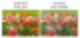
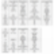

# 나에게 맞는 모니터 고르는 방법
**Date:** 2025. 12. 27. 1:29
**Category:** 다이어리
**Original URL:** https://blog.naver.com/xpfkwh56/224123953733
---

1. 가격비교 사이트 들어간다

​

**\* 다나와, 네이버, 쿠팡 등등**

​

2. 들어가서, 내 조건 찾아내고

낮은 가격 순서로 확인한 다음

​

기본적으로 찾아볼 모델 선별한다

​

3. 단, 이 과정에서

**'공식 사이트 없는 곳'**

은 배제하는 것이 안전

**​**

**왜 why?**

​

전자 제품은 사양이 무척 중요해서,

스펙이 시작이자 끝이나 다름없는데

​

제조사 공식 스펙이 표기 안 된 상태면

유통사에서 **'알빠노'** 하고 책임 전가함

​

**\* 나는 알려준 대로 적었을 뿐이다 st**

​

4. 2차 가공 정보나, 전달된 정보 말고

**공식 홈페이지 raw data** 위주로 선별

​

자료는 모두 공식 홈페이지 내용 기반으로 기재함

​

5. 그럼 다음과 같은 표가 나오게 됨

​

**1) 화면 크기와 해상도에 관하여**

​

해상도, 화면크기, 시청거리

​

3개를 고려해서 **'나한테 맞는'** 것을

찾아낼 수 있어야 합리적 소비 가능

​

PPI = { 루트 (가로 픽셀 수)² + (세로 픽셀 수)² }

/ 대각선 길이 (inch)

​

계산하기 어려우면 아래 계산기 쓰면 됨

​

<https://www.sven.de/dpi/>

[**DPI Calculator / PPI Calculator**

DPI Calculator / PPI Calculator for displays with square pixels . Monitor data Horizontal resolution: pixels Vertical resolution: pixels Diagonal: inches ( xx cm) Megapixels: ?.? Aspect ratio: ?:? Loading... Noteworthy and common display sizes of monitors, PCs, notebooks, tablets, phablets, smartpho...

www.sven.de](https://www.sven.de/dpi/)

​

통상, 딱 정해져 있는 것은 아닌데

120 PPI 이상을 **'쾌적'** 하다고 하고,

​

이건 **'개인차'** 가 아주 큰 영역이라서

​

본인이 썼던 원래 환경을 잘 기억해서

그거에 맞게 똑같이 쓰는 것이 무난함

​

제 경우, 27인치 모니터에

QHD (2560\*1440) 화질인데

이러면 **PPI 108** 나옴

​

저는 글자를 많이 읽는 편이고,

**'한 눈에'** 많은 정보가 있길 좋아함

​

시청거리 또한, 개인차가 매우 큼

​

그러나 **아유 나는 모르겠다** 한다면,

​

내 한 팔을 쭉 뻗어서

모니터로 향하게 하고

​

그걸 기준으로 내 기준에서

**가깝다, 멀다** 판단하면 됨

​

더 표준적인 기준을 원한다면,

​

<https://toolstud.io/video/screensize.php>

[**Screen size calculator**

Screen size calculator Screen diagonal Resolution Calculate screen size ! Screen size  Aspect ratio: 1.777778 (landscape orientation) Screen dimensions mm inch foot meter  Screen diagonal 48 " 4 ft 1.22 m  Screen width 41.8 " 3.49 ft 1.06 m  Screen height 598 mm 23.5 " 1.96 ft 0.6 m  Screen sur...

toolstud.io](https://toolstud.io/video/screensize.php)

​

위에 있는 계산기를 사용할 수 있음

​

​

직각 삼각형에서 탄젠트의 정의는

​

​

위에 있는 그림과 같음

​

시청거리 문제의 본질은,

​

눈에서 볼 때 화면이

어떤 각도로 보이느냐

​

그리고 화면의 물리적 크기가

얼마나 떨어져 있냐 푸는 문제와 **동일**

​

그러므로 퍼즐을 풀어보고 싶다면 직접,

그거 귀찮으면 계산기 넣고 돌리면 간단

​

**2) 주사율**

**​**

[](#)

​

**1초에 모니터 몇 번 깜빡이냐** 와 같음

​

만약 내가 수술할 때 쓰는

의료용 모니터를 보고 있다,

​

아니면 **'초단타 주식'** 을 한다

​

저주사율로 하면 난리가 나겠죠?

​

반면에, 여유롭게 그냥 웹서핑만 한다

그럼 낮은 주사율도 문제가 안 될 것임

​

**'인간'** 이 읽을 수 있는 체감 한계는

통상 144 Hz 로 알려져 있는 편이나,

​

​

높으면 높을수록 사실 **'나쁠 건'** 없음

​

물론 고주사율 모니터로 가면 갈수록,

**가격이 천정부지로 뛴다는** 문제가 생김

​

게임을 일단, **'하긴 한다면'**

최대한 144 이상 맞출 것을 권함

​

자료는 모두 공식 홈페이지 내용 기반으로 기재함

​

주사율은 **'반응속도'** 와 관계되는 변수임

​

모니터가 1초에 x번 깜빡 거린다고 할 때,

정작 정보의 속도가 낮으면 의미가 없음

​

1 Hz 의 정의는 **1s ^-1** 임

​

이론적으로 120 Hz 면 ≤ 8ms

144 Hz 면 ≤ 6ms 정도는 나와야 됨

​

**\* 무던한 사람**

​

권장 기준값으로 가면,

전자는 4ms, 후자는 3ms 쯤은

찍어야 안정적으로 출력하는데

​

**\* 조금 예민한 사람**

​

OLED 패널이라면 응답이 즉각적이므로,

더 여유있게 짜도 괜찮고 IPS 패널의 경우,

​

화면 전이 속도가 느리기 때문에,

0.5 정도는 **여유** 를 잡고 하면 좋음

​

표에 있는 시판 모델들은 5ms 정도

공시하고 있는데,

​

GTG (패널 물리성능) 만 보면 되고,

**5ms 아래로는 큰 차이 없다** 보면 됨

​

**3) 색재현율**

​

가장 좋은 모니터는, 존재하고 있는

**현실을 100% 온전히 담는 모니터** 임

​

**\* 단 이런 모니터는 꿈의 모니터 라서,**

**현실 세계에 존재할 수 없단 문제가 있고**

**결국 제한된 요구 조건 안에서만 유효함**

**​**

​

색 볼륨과 커버 범위를 구분해서

해석하면 표의 내용과 같이 나올 것

​

**\* 마케팅 수식어구를 덜어낸 것**

​

DCI-P3 95% 가 **'지각'** 한계치라고 보면 되고,

​

**\* 실용 표준 언저리,**

**영상으로 비유하면 1080p**

**​**

이 수치가 높아도 ΔE (색오차) 가 높으면

실제 내가 보는 색이 다른 색감으로 나오게 됨

​

ΔE 가 2, 혹은 3 이상으로 넘어가면

온전하게 색을 담는다고 볼 수 없고,

​

2 이하면, **'일반인 수준에서 문제 X'**

1 이하면, **'전문가 수준에서도 문제 X'**

​

**\* 인쇄물 작업을 하지 않는 한,**

**캘리 맞춘다고 고생할 필요 없음**

​

색심도는, RGB 값의 단계를 의미하는데

​

8비트면 2^8, 약 1,500만 색깔

10비트면 2^10, 총 10억 색깔 반영함

​

**\* 일반 사용에는 8비트면 충분**

**​**

HDR 옵션 들어가면 10비트가 필수고,

​

그거 아니면 들어있으나, 마나가 되는데

디자이너 모니터 만드는 회사 아닌 이상,

이걸 반영해서 하는 경우는 거의 없는 편임

​

다만, 이런 것이 문제가 뭐냐면

​

**'아예 모르고 있으면 전혀 상관이 없는데**

**눈에 거슬리기 시작하면 돌아갈 수 없어짐'**

​

사실 표준 명암비 1000: 1 만 넘으면

체감하는 수준에선 큰 차이가 없는데,

​

1500, 2000 보다가 1000 보려고 하면

뭔가 눈이 망가진 것 같은 기분을 느끼게 됨

​

특히, 모니터에서 표현하기

힘든 것이 **'블랙'** 인데,

​

이 **맛** 을 본 사람들은 올레드만 사용함

​

자료는 모두 공식 홈페이지 내용 기반으로 기재함

​

**6. 다시 표를 봅시다**

​

저는, 너무 큰 화면은 취향껏 싫어서

24 or 27인치 중에 선택하고 싶으며,

​

4K 보단, QHD 화질 모니터를 쓰고 싶고

패널은 IPS 패널로 사용하기를 원했음

​

인테리어를 포함한, 상업 디자인 목적으로

작업물을 만들 일이 많은 편이고,

​

간단한 영상/사진 편집도 할 생각인데,

​

레데리/림월드/발더스 같은 게임도 하고

평소 게임 취향이 시뮬레이션 장르 게임임

​

**\* 피지컬 요구하는 빠른 게임은 잘 안 함**

​

심즈나, 시티즈 같은 게임도 즐겨 하는 편임

​

집에 좋은 TV 가 있기 때문에,

​

굳이 컴퓨터로 영상이나 영화를

볼 생각이 있는 상황은 아니고,

​

화면을 보통 밝게 보는 편에다가,

​

**'공장 캘리 보정'** 을

상수로 가져가길 원함

​

**\* 제조사에서 보장하는 델타 오차**

​

7. 그럼 남은 선택지가,

​

1) 28만원짜리 아수스

2) 43만원짜리 아수스

3) 47만원짜리 델 밖에 없지요?

​

HD 영끌로 쓰지 말고,

여유롭게 넣은 기능에다가

​

화면 주사율 보정 옵션 넣고

10만원 쯤 더 낼래? → **'No'**

​

블랙 더 잘 읽는 IPS 패널에,

명암비 500 더 주고,

DCI-P3 3% 더 얹어줄게

​

거기에 VRR 옵션 들어가면

20만원 비싸지는데 살래? **'No'**

**​**

그래서 **저거 산 것** 임

​

제품 결정된 상태라면, 이제 다음은

**'1원이라도 싸게만 사면 되기 때문'** 에

발품만 열심히 팔면 **소비** 를 할 수 있음

​

이게 보통 제가 **돈을 쓰는 방식** 입니다