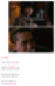

# 돈 잘 벌고, 유능한 여자 꼬시는 법
**Date:** 2025. 12. 27. 14:04
**Category:** 다이어리
**Original URL:** https://blog.naver.com/xpfkwh56/224124373763
---

1. 블라인드 같은 곳 보면, 죄다

먼 알파남 꼬시기 밖에 없길래 씀

​

2. 나 연애할 때, 기준으로

경제적인 것은 **'졸업급'** 이었고

​

난 능력에 대한 **자부심** 도 꽤 있음

​

3. 이런 여자들이 겪는 문제는,

남자들이 대부분 **'쫀다는 것'** 임

​

내가 고스펙 직장인인데,

좋소 면접 보러오면 사장이

​

**'스읍, 아 쫌'** 하는 느낌과 비슷

​

댓글로도 고스펙 언냐, 동생, 친구들

이야기 들어보면 비슷한 경우 많은데,

​

여자가 가방끈이 길거나, 돈이 많거나,

독립적이거나, 퍼포먼스가 특출난 경우

​

남자가 할 얘기가 그거 밖에 없는지,

대화 화제들이 이상하게 자주 가는 듯

​

**\* 대표적인 오답 케이스 뽑자면,**

**​**

**나중에 애 잘 키우겠다 같은 것들이나**

**여자의 성취 기반으로 들어가는 칭찬들**

**​**

**이런 이야기 들으면**

**있던 감정이 식을 수도**

**​**

연애 하러 왔지, 일 하러 왔냐고요 ,,

​

드문드문 남자들이랑 접점 생겼을 때,

저런 **'일'** 이야기 화제가 많아지는 경우,

​

저는 **빨리 집에 가고 싶다** 는 생각만 했음

​

**'꽤 많은 남자분들이'**,

​

너 잘났어? 나도 잘났어

하면서 증명하려고 하거나,

​

**\* 짜침, 물어보면 솔직하게 말하고**

**안 물어봤으면 말 안 하는 것이 나음**

**​**

대뜸 가만히 잘 사는 나를

내려치는 경험도 몇 번 있었는데

​

**\* 취직할 생각도 없는데**

**면접 보러 끌려온 듯한 느낌**

​

이런 것들도 별로 도움 잘 안 될 것임

​

4. 사실 이거 답은 간단한데,

**'걍 보통의 녀자처럼 대하면 됨'**

​

예를 들어보겠음,

​

1) 신랑의 경우, 첫인상 자체가

딱 내 취향이라 **매우** 호감이 컸는데

​

**\* 80% 먹고 들어감**

​

데이트 할 때, 초기에 뭔가 자기가

해내야 된다는 안절부절하는 느낌이

​

갱장히 **매력적이지 않게** 느껴졌었음

​

아, 이 여자는 이런 이런 스타일 일텐데

내가 ~ 모습을 보여야 하지 않을까? 같은

​

**'분위기'** 가 느껴지면, 이게

아무리 숨기려고 해도 **보여짐**

​

연애에서 80점 이상 먹고 들어간단 것은,

실상 다 끝났다고 봐도 **무관할 정도** 인데요

​

그 상태에서도 저기에서, 이게 맞나?

라는 **'헷갈리는 느낌'** 을 받은 적 있음

​

**\* 결국 이러다간, 내가 이 사람을**

**안 좋아하게 될 것 같아서 피드백 줌**

**​**

2) 대충 보니까, 이거 무수리 타입이다

알아서 혼자 잘 하네, 그냥 다 맡기자 (x)

​

이러면, **'있던 무수리'** 도 도망감

​

**\* 무수리는 아무 기대도, 족쇄도 없이**

**가만히 놔둘 때, 제일 아웃풋이 잘 나옴**

**피차, 혼자 하는 것이 익숙한 부류라서**

**​**

지금에야 애 놓고 사니까

전보다는 **당연히** 시들하지만

​

연애 초기, 다른 녀자들이 그랬던 것 처럼

신랑이 **'고작'** 무수리인 저를 겅쥬 취급함

​

남자어로 아주 쉽게 표현하면,

​

**\* 부적절할 수 있겠지만**

​

얘는 뭐 하나도 제대로

할 수 없는 인간이다

​

내가 다 챙겨줘야 된다, 같은 접근을

하는 것이 **'압도적으로'** 유리하단 것임

​

적어도 내가 가진 상식 내에서는,

​

**'저 과정'** 이 배제되면 결혼에 대해서

여자가 확신을 가질 가능성 **극히** 낮음

​

**\* 제가 추후 아들래미들 더 낳아도,**

**연애 비용은 무조건 지원하려는 이유**

**​**

**학원비는 내가 납득해야 내줄 수 있는데,**

**연애 한다고 쓴다면 달러빚도 내줄 수 있음**

**​**

**남의 집 귀한 딸 모시는 자리다,**

**라고 생각을 하는 것이 맞다고 생각**

**​**

**1) 만약, 엄마 나 공부해야 돼, or**

**엄마 나 사업하게, 주식하게 도와줘**

**​**

**→ 나를 설득할 수 없으면 절대 불가**

**​**

**공부? 나도 해봤어,**

**사업? 투자? 나도 해봄**

**​**

**2) 썸녀/여친 생겼는데, 돈이 필요해**

**​**

**→ 현찰? 카드? 계좌 이체?**

**​**

이런 것을 싫어하는 여자가 몇이나 될까

**​**

5. 아닌 말로 제가 신랑한테 시집 가겠다,

라고 강하게 확신 가진 것도 다른 것 없음

​

존예까진 아니겠지만, 온라인에 흔히 있는

다른 글들이 그렇듯 저도 걍 저 스스로가

​

적당히 이쁜 편이라고 생각하고,

딱히 외모로 불이익 겪은 적 없는데요

​

참 챙피한 소리지만, 제가 인생 살면서

​

신랑 말고는 저를 **'여자처럼'**

대해준 사람이 단 하나가 없었음

​

**\* 뭔가 의지하게 만들고, 도와주고,**

**나를 지켜주는 것 같고, 보호자 같고**

**​**

6. 맨날 나오는 데이트 비용

얘기만 해도 그런 맥락 같은데,

​

뭐 경우에 차이는 있을 수 있겠지만,

제 경우, 돈이 없다고 안 냈겠읍니까

​

**\* 저는 보통, 호의 잘 받지도 않음**

**​**

**'그냥'** 사주는 것이 좋은 거에요

**​**

**\* 대접 받는 느낌과 더불어,**

**지금 이 지위를 놓치고 싶지 않다**

​

뭐 아닌 여자분들도 있을 수 있지만,

이 사람이 나 챙겨주고, 대접 해주고

​

내가 약간 **'특별하다는'** 느낌이 들면,

이게 남자들은 아마 모르는 것 같은데

​

**중독성** 도 엄청나고, **매우** 의식하게 됨

​

**7. 결론**

​

여성의 자립성 ≠ 연애에서

보호와 케어가 필요 없음

​

뭐 취향이 아니라면 상관 없는데,

혹시 저런 쪽 여자들한테 관심이 있다

​

1) 막 **'우리 정도의 아비투스'** 라면,

이런 수준 있는 어떤 대화를 해야지

​

이런 것 말고, 그냥 시덥잖은 얘기든

뭐든 괜찮으니까 **'일'** 스럽지 않은 것

​

**\* 사업남, 투자남 기준으로는**

**이걸 환장하는 경향이 좀 있는 듯**

**​**

**근데 여자랑 그렇게 말이 통한다면**

**그거 참아주고 있을 확률이 더 높음**

**​**

2) **'보통'**, 그냥 어찌저찌 살다 보니

그렇게 풀린 여자들일 가능성 높으니까,

​

**이상한 상상력 발휘**해서, 선입견 잡기 X

​

**\* 부담스럽거나, 현타 느낄 수 있음**

**​**

3) 대체로 남자들이 생각할 때,

​

**'그냥 일반적인 평범한 연애'** 에서

벗어나지 않으려는 시도를 해볼 것

​

상식 수준을 지키고 있다는 전제하에,

​

대우받고, 남자가 잘 해주고 있다면

그거 마다할 여자는 거의 없다 보면 됨

​

특히, **'자급자족 가능한 여자'** 들은

이런 기회에 노출될 가능성 많이 **'낮음'**