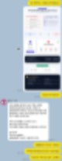
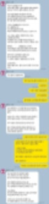
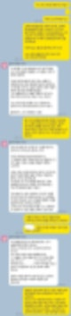
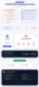
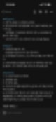
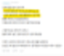

# 부부 돈 관리 이슈
**Date:** 2025. 12. 27. 2:53
**Category:** 다이어리
**Original URL:** https://blog.naver.com/xpfkwh56/224123994435
---

​

1. 복지 포인트로, 상의 없이 금액 지출

​

**\* 300 후반이면 보통 직장인 기준으로,**

**1개월 원리금 이자 정도는 될 것 같은데**

**​**

​

2. 여자 잘 만난 줄 지금이라도

본인이 깨닫는 것이 낫지 않을까 ,,

​

아이곸ㅋㅋㅋ

​

와잎이 투명하게 공개하고 있다는데,

거기에 별 문제가 있는 것 같지도 않음

​

투자 계좌를 아내 명의로 해도 문제다,

그거로 미쳐가지고 **신용** 땡기면 어쩔?

​

3. 부부 공동자산 증식이라는 개념이 없구,

​

내가 번 돈 내가 못 쓰는 상황이니까

**'동기부여'** 안 된다는 사람한텐 저게 맞음

​

금액 신뢰 이런 문제가 아니고,

남자가 너무 **'애'** 처럼 느껴지는 듯