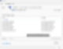
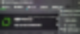
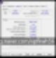

# 성능 안정성
**Date:** 2025. 12. 27. 19:25
**Category:** 다이어리
**Original URL:** https://blog.naver.com/xpfkwh56/224124628533
---

​

**1. 모니터**

**​**

아무 이슈 없고, 내가 보는 색감을

다양한 휴대폰, 태블릿, 모니터에서도

동일하게 볼 수 있음을 확실히 확인

​

​

2. 며칠 동안, 일반 사용 조건에서

벤치 쭉 돌리면서 테스트 해봤는데

​

​

최대 성능은 조금 부족하고,

평균 성능은 약간 높은 걸로 판정

​

**\* 체감적으론 의미 X**

**​**

여기서 커스텀은 **굳이?** 라는 결론

온도도 마음에 들고, 딱 괜찮은 듯함

​

**​**

3. **3000\*2, CL 34-44-44-96**

**​**

딱 이 상태로 맞춰서 쓰면 될 것 같다

**​**

**4. 그래픽 카드**

​

기본 성능 검사에서는 문제 없었고,

​

​

순정

​

​

언더볼팅

​

**\* 응~ 괜찮아~ 슈프림이야**

**글카 터지면 아스트랄 사면 돼~**

​

성능은 체감상 +6%

정도 오른 것 같고,

​

**\* 벤치 말고 작업에 있어서**

​

발열은 4도 이상 잡았는데

이제 쓰면서 고쳐봐야 알 듯

​

5. 하드웨어 조립 → 가능

기본 드라이버 설치 → 가능

바이오스 작업 → 가능

​

오버클럭 → 가능

커스텀 튜닝 → 가능