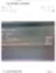
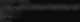

# 의심과 확신
**Date:** 2025. 12. 28. 20:12
**Category:** 다이어리
**Original URL:** https://blog.naver.com/xpfkwh56/224125605262
---

​

1. **Previously,**

​

달러가 폭등할 것이다, 서울 부동산이

300억이 될 것이다 같은 말은 **안 믿음**

​

근데 GPU, RAM, SSD 는

**'당연히'** 올라간다고 생각함

​

**\* 다만 엔비디아가 100년 뒤에도,**

**똑같은 지위로 만들 줄 모르겠기 때문에**

**투자로 가면 조금 다른 이야기가 될 듯함**

**​**

**그럼에도 불구하고, 먼 미래에 살아 남는**

**기업은 분명 저걸 팔고 있을 것이라 생각**

**​**

옛날에야 386, 586 컴퓨터들도 썼지만

​

요즘 사람들한테 그거 쓰라고 하면

아무도 안 쓸 것이 자명하기 때문이다

​

고 VRAM 컴퓨터는

저 VRAM 컴퓨터랑 **'아예 다르고'**,

​

**'기계'** 이기 때문에,

​

퍼포먼스가 예측 가능하고

생각하는 범위에서 나오게 됨

​

2. 다만, 여기서 중요한 것이 있다

​

소비는 뭐다? **귀찮은** 일 이다

​

3만원 짜리 핸드백을 사용할 때는

휘뚜루마뚜루 마음대로 써도 되지만,

​

3천만원 짜리 가방을 들고 다니려면

**'그에 맞는 지식과 기술'** 이 요구 된다

​

​

고주사율 모니터를 구매했는데도,

정작 본인이 설정을 하고 있지 않으면

​

**\* 144hz 모니터를 사서, 50hz 로 사용**

​

그 돈을 쓴 의미는 **'하나도'** 없게 된다

​

5090 은, 폭발적 퍼포먼스를 갖고 있지만

치명적인 **호환성 이슈** 또한 의외로 많이 있다

​

​

그 어떤 것도 믿지 말라, 라는 것은

인간 뿐만 아니라 기계에게도 적용된다

​

Nightly build 가 정답

​

나한테 이걸 알려준 사람은

엔비디아 엔지니어 매니저인데,

​

위 방법대로 하면 SM\_120

문제를 해결할 수 있음

​

**3. 저게 무슨 소린데요?**

​

5090 을 껴도, **'작동 안 할 수 있음'**

근데 cu128 찾아서 쓰면 해결이 됨

**​**

영어를 할 줄 안다는 것과,

영어를 **'써서'** 코딩한다는 것

​

**\* 영어가 안 되면 내 언어의 한계가**

**변수의 한계가 되기 때문에 문제 생김**

​

한국어를 할 줄 안다는 것과,

한글 리터러시를 갖추는 것이 다르듯

​

돈만 있다고 문제가 해결되는 일은 **'없음'**

**​**

비싼 학원만 보내고, 좋은 학용품 준다고

아이가 알아서 학업, 공부가 될 리가 없다

​

비용을 지불할 여력이 없을 때는,

​

**'있으면'** 끝일 것 같지만 막상 있으면

**'있다고'** 끝이 아님을 금방 깨닫게 됨