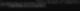

# 극한의 튜닝
**Date:** 2025. 12. 29. 15:07
**Category:** 갓생추구
**Original URL:** https://blog.naver.com/xpfkwh56/224126524437
---

​

8192 \* 8192 (FP16)

행렬을 50번 연산해서,

답을 낸 속도 **'0.21초'**

​

동급 GPU 속도보다

약 30% 정도 더 빠름

​

고수율 양품 + 언더볼팅

+ 작업환경 조성 등등

​

잘 깎으면 이런 것도 가능함