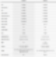
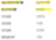
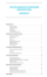

# 컴퓨터 질문 몰아서 답변
**Date:** 2025. 12. 30. 15:06
**Category:** 다이어리
**Original URL:** https://blog.naver.com/xpfkwh56/224127876524
---

**1. 모니터 똑같은 것 사면 되는 것 맞나요?**

​

1) 눈이 버릇 없어져서, 색감에 예민하다

2) 4k 를 쓸 정도로 **'고급'** 은 아니다

​

**\* 나름이지만, 보통 4k 가 당연히 좋음**

**​**

3) 주사율 120 짜리 모니터 봐도,

화면에 있는 사람들이 각기춤 안 춘다

​

4) 시야가 좁아서 30인치는 부담스럽고,

24인치는 선택폭이 아쉬운 마음이 있다

​

5) 최대한 저렴한 가격에 적당히

레데리, 림월드, 발더스, 정도 게임하고,

​

웹서핑 ppi 살짝 작게 봐도,

별로 눈이 아프지 않으며, 등등

​

본인 **'목적'** 과 **'상황'** 에 맞게 사야 됩니다

​

**2. 컴맹이고, 컴퓨터 사야 되는데 뭐 사요?**

**진짜 하나도 모릅니다, 그냥 쓸 만한 것 필요**

​

1) 노트북 → 한성 보스몬스터

​

2) 데탑 → 공부 필요

​

**\* 사기 나름이라서**

**​**

**3. AI 하려는데, 컴퓨터 뭐 사죠?**

**​**

1) 솔루션/클라우드로 시작

​

**\* 가격만 놓고 보면,**

**빌리는 것이 쌉니다**

**​**

**4000 번대, 그래픽 카드는**

**공짜로도 빌려서 쓸 수 있어요**

**​**

2) 월세 살고 있는데, 아쉽읍니다

​

**→ 공부 필요**

​

**4. 조립 컴퓨터에 대한 이해**

​

1) 람보르기니, 페라리, 포르쉐 엔진은 좋다

2) 근데 그 엔진을 자전거에 달면 어떻게 될까?

​

타다가, 죽을 수도 있음

​

**5. 님이랑 똑같은 워크스테이션 사면 되나요?**

​

**'어디에'** 쓸 것인지 답이 나와야 가능

​

집에서 인터넷 하고, 대항해시대 4,

디아블로 2 이런 것 할 생각이라면

​

병렬형 연결해서 연산 맡길 이유도 없고,

시중에 있는 것을 얼마나 싸게 사냐 문제지

​

첨단 사양에 대한 욕심을 가질 필요 X

​

**\* 취미 레벨일 땐, 3시리즈면 떡을 칩니다**

**​**

**6. 그래도 사양 알려주세요**

**​**

AMD 라이젠 9-6세대

9950X3D (그래니트 릿지) (멀티팩)

​

[NZXT] KRAKEN ELITE

420 RGB V2

​

MSI MAG X870 토마호크

WIFI AMD 메인보드

​

MSI 지포스 RTX 5090 슈프림

SOC D7 32GB 하이퍼프로져

​

G.SKILL G.SKILL DDR5-6000

CL34 TRIDENT Z5 RGB J 패키지 128GB

​

WD BLACK SN850X M.2 NVMe

1TB (WDS100T2X0E)

​

삼성전자 SSD 990 PRO M.2 NVMe

4TB PCle4.0 MZ-V9P4T0BW

​

[Antec] FLUX PRO MESH [빅타워]

​

[SuperFlower] SF-1300F14XG LEADEX VII

GOLD ATX3.1 (ATX/1300W)

​

→ 사양만 봐도, **'용도'** 가 추측이 된다

구입해도 괜찮은 지식을 갖고 있는 상태

​

와! 비싼 컴퓨터다!

아마, 사면 **안 되는** 상태

​

**\* 비싼 난방기 밖에 안 됨**

**전기세도 많이 먹습니다**

**​**

**왜 이렇게 비싼 컴퓨터를 사셨어요?**

**​**

**'소비자 기준'** 으로는 비싸지만,

**'산업용'** 기준으로는 헐 값 입니다

​

**\* 저는 지금 저거 1개만 쓰는 것도 아님**

**​**

**1억 언더로, 공장을 차릴 수 있다?**

**보통 공장은 최소 20억 스타트 입니다**

**​**

공장만 있다고 돌아가는 것도 아니죸ㅋㅋ

**​**

<https://www.nvidia.com/ko-kr/data-center/h100/>

[**NVIDIA H100 GPU**

가속화된 컴퓨팅의 엄청난 도약

www.nvidia.com](https://www.nvidia.com/ko-kr/data-center/h100/)

**​**

지금 제가 고려중인, H100 GPU의 경우

난이도가 있지만 사양을 감안하면

​

저 물건을 **'개인'** 이 가진다는 것은

제 상식 내에서 **정상** 이 아닙니다

​

하나만 잡으면 3-4천만원이니 비싼데,

​

​

**'주식쟁이, 사업쟁이, 투자자'** 한테는

돈만 준다고 이걸 갖는다는 것 자체가

신기하게 느껴질 수도 있는 일이에요

​

롤렉스, 에르메스 가방 정도 살 돈으로,

H100 을 구입해서 가질 수 있다?

​

**'비교'** 가 불가능 하죠

**​**

**7. 오버클럭, 언더볼팅이 뭐임요?**

**​**

https://www.amd.com/en/products/processors/desktops/ryzen/9000-series/amd-ryzen-9-9950x3d.html

​

암드 공식 홈페이지 접속 (raw data)

​

**\* 뭐랑 쓰라고 다 써있음**

**​**

​

성능의 바닥은 클럭이 결정,

성능의 천장은, **'설계'** 가 결정

​

포터로 비유하면, 원래 포터는

​

일정 시속 이상 올라가면

엑셀 버튼이 자동으로 꺼지는데,

​

시속 제한 장치를 소프트웨어로

풀어버려서 더 밟는 것이 **오버클럭**

​

I × V = W

​

제조사 고시 사항은, **'광고'** 에 불과

​

그래픽 카드 제조사는

**'최대 성능'** 을 자랑하지

​

그걸 **'어떻게 쓰나'** 는 관심이 없음

​

GPU 전압이 x 일 때, y 정도 성능이

나온다가 중요한데 제조사들은

여기에 **'여유'** 를 둬서 세팅해서 판매함

​

열이 덜 나면, 성능을 더 낼 수 있고

아주 간단히 말하면

​

전기를 덜 쓰고, 효율을

더 올리는 것이 **언더볼팅**

​

단, 여기서 주의할 점이 있음

​

**1) 그래픽 카드 고장날 수 있음**

​

400만원, 500만원 되는 그래픽 카드가

고장 나도, 내 **'덕질'** 의 **'경험'** 으로

​

만족할 수 있으면 해봐도 상관없지만

그거 아닌 사람은, 관심 가질 필요 X

​

2) **'본인이 아무리 잘 해도 운빨'**

​

5090 GPU 에서 지금

제일 좋은 것이 **아스트랄** 인데,

​

**\* 내가 쓰는 슈프림보다 훨씬 비쌈**

**중간에 사무용 컴퓨터**

**하나 들어갈 정도로 비쌈**

​

5090 GPU 에, VRAM 32gb 만

보장되면 상급기, 하급기 차이 미미함

​

**\* 일반적으로 쓸 때**

​

극단적으로는 설계 될 때,

**'실리콘 수율 운빨'** 따라서

​

**하급기가 상급기보다**

**성능 더 좋을 수도 있음**