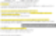

# 문제풀이
**Date:** 2026. 1. 2. 10:51
**Category:** 다이어리
**Original URL:** https://blog.naver.com/xpfkwh56/224131333185
---

​

**1. 결제를 해봤다가 (x)**

​

돈 쓰기 전에, 정말 많이

찾아봤으면 더 좋았을 것

​

사실 공부할 때, 돈 쓰지 말라는 것은

어떤 의미로는 제 학습 철학이기도 한데,

자세한 얘기는 계속 나오니 후술하겠음

​

**2. 온라인 피시방 써보고,**

**각 나오면 투자한다 (o)**

​

훌륭한 접근 이라고 생각

​

**\* 전기세 괴담은 보통**

**무시하셔도 됩니다**

**계산하면 그리 늘지도 않음**

**​**

**3. Qwen3-30B 어쩌고 저쩌고 (x)**

​

1) 양자화가 무엇인가?

2) instruct 모델을 왜 쓰는가?

​

둘을 선행 학습할 것을 권합니다

​

**\* vram 만땅 다 채워서 굴리기 = 장난감**

**여유 한계 두고, 안정성 중시 = 워크스테이션**

**​**

**4. RTX 5090 을 빌려서 (x)**

​

도로주행을 벤츠로 할 필요는 없습니다

​

**5. GPT, 제미나이 도움을 받으며 (x)**

​

이렇게 하면 내가 무엇을 틀렸는지, 맞췄는지,

아는 것인지, 모르는 것인지 분간이 안 갑니다

​

검색을 하시고, 유튜브를 찾으시고,

필요하면 PDF 를 찾아보세요

​

아직 익숙하지 않아서 그럴 수 있는데

믿기 어렵겠지만 사실 대부분의 것들은

개발자들이 설명서를 보통 공개해둡니다

​

raw data 에 집착하면 집착할수록

더 양질의 정보를 얻을 확률이 높아요

​

지피티 접근은 한계가 **'매우'** 빠를 겁니다

​

**\* 본인이 갖고 계신 전문성, 도메인 지식을**

**AI 에 돌려보면 금방 한계를 확인할 수 있음**

**​**

**6. 파이썬 이나 개발 지식도 전무합니다**

​

개발자가 **'나는 어떤 언어에 정통하다'**

라고 말하면 기본적으로 사기꾼 입니다

​

전혀 걱정하실 일이 아님

​

**7. 반나절 걸렸습니다 (o)**

​

당연한 일,

​

다만 물리적인 시간과

내 사고의 시간을 구분하시는 것이

합리적 계산입니다

​

순공 시간은 의자에 앉아있는 시간이 아니고,

​

내가 모르던 것을 알고,

활용할 수 있게 된 시간 이듯이요

​

**\* 즉, 물리적 시간은 아무 의미가 없음**

​

**8. 원래 이렇게 대가리 박으면서**

**하는 것이 맞는 건가요?**

​

제 아는 개발자 이야기를 드리자면,

​

아무리 생각해도 자신이 아는 선에서

그리고 그 어떤 지식을 찾고 찾고 찾아도

절대 나오지 않던 문제를 겪은 적 있는데

​

그 문제의 답은, **wifi 연결을 안 했으니까**

**그걸 연결하면 해결이 된다** 였습니다

​

**\* 이런 실수도 굉장히 비일비재 합니다**

​

이 사람이 알고자 했던 것은 결국

wifi 연결 하기 였는데요

​

이걸 **'몰라서'** 찾아보진 않았을 것이고,

​

한편 이걸 **'몰랐기 때문에'**

더 유능해졌을 확률이 높아요